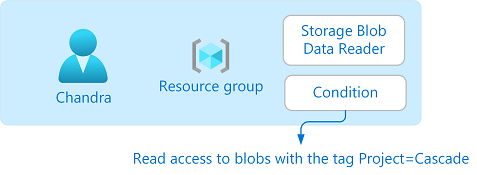
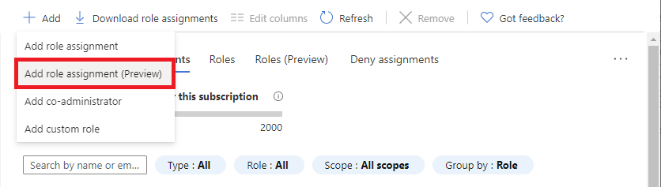
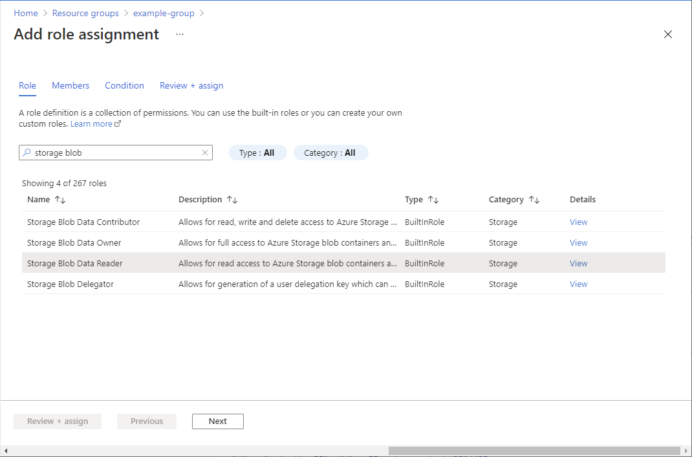
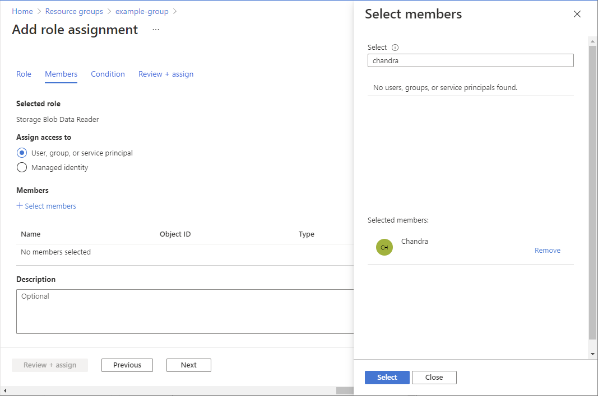
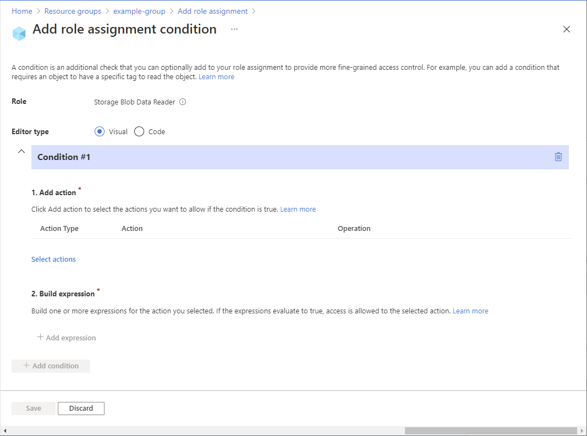
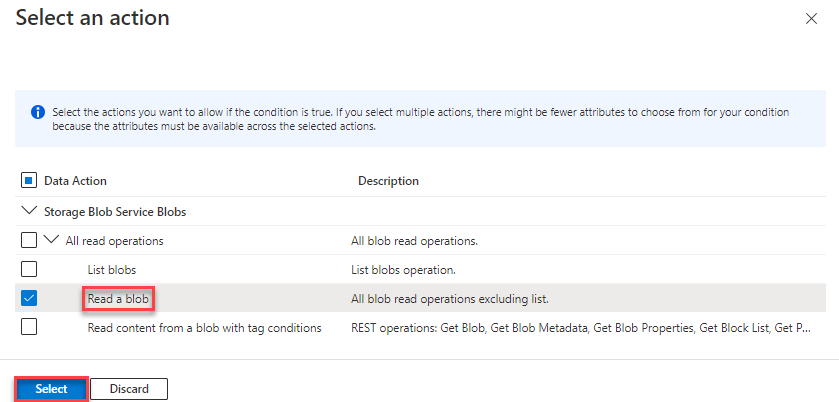
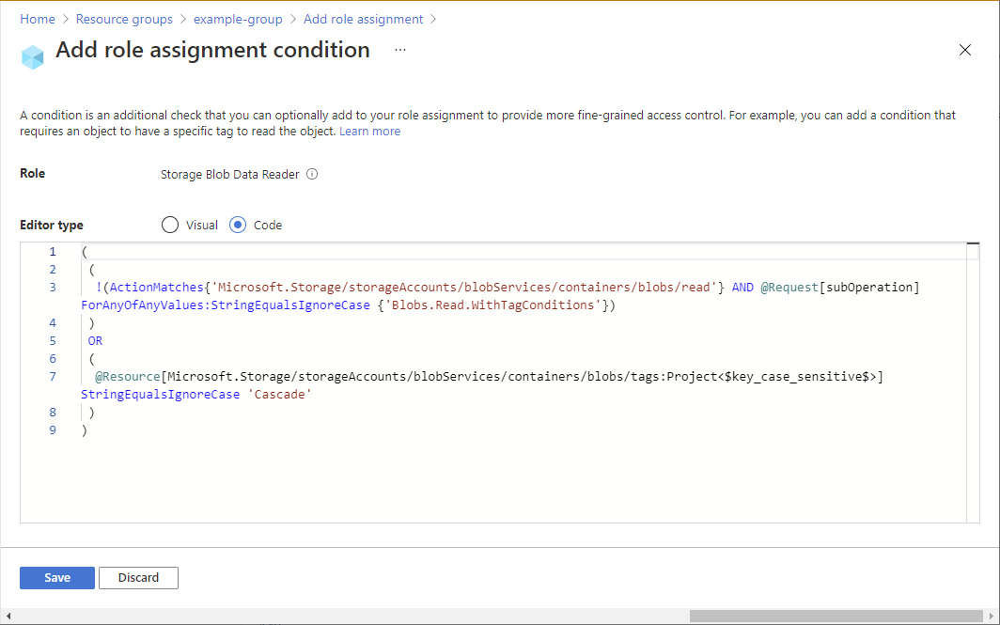
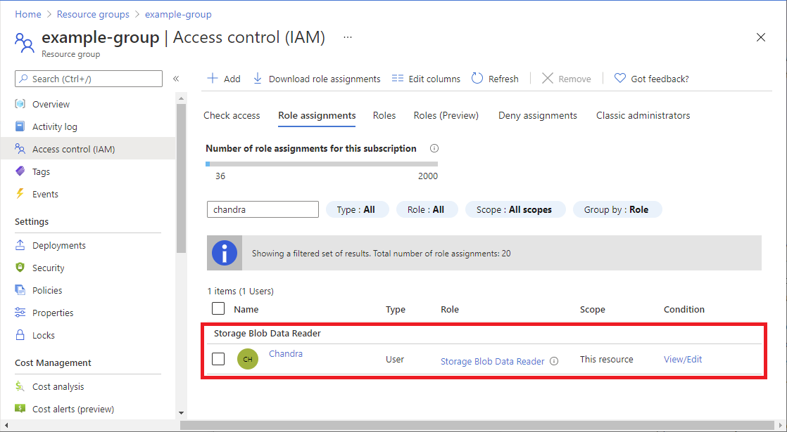

# Tutorial: Add a role assignment condition to restrict access to blobs using the Azure portal (preview)

> [!IMPORTANT]
> Azure ABAC and Azure role assignment conditions are currently in preview.
> This preview version is provided without a service level agreement, and it's not recommended for production workloads. Certain features might not be supported or might have constrained capabilities.
> For more information, see [Supplemental Terms of Use for Microsoft Azure Previews](https://azure.microsoft.com/support/legal/preview-supplemental-terms/).

In most cases, a role assignment will grant the permissions you need to Azure resources. However, in some cases you might want to provide more fine-grained access control by adding a role assignment condition.

In this tutorial, you learn how to:

> [!div class="checklist"]
> * Add a condition to a role assignment
> * Restrict access to blobs based on a blob index tag

## Prerequisites

For information about the prerequisites to add or edit role assignment conditions, see [Conditions prerequisites](../../role-based-access-control/conditions-prerequisites.md).

## Condition

In this tutorial, you restrict access to blobs with a specific tag. For example, you add a condition to a role assignment so that Chandra can only read files with the tag Project=Cascade.



If Chandra tries to read a blob without the tag Project=Cascade, access is not allowed.


Here is what the condition looks like in code:

```
(
    (
        !(ActionMatches{'Microsoft.Storage/storageAccounts/blobServices/containers/blobs/read'}
        AND
        @Request[subOperation] ForAnyOfAnyValues:StringEqualsIgnoreCase {'Blob.Read.WithTagConditions'})
    )
    OR
    (
        @Resource[Microsoft.Storage/storageAccounts/blobServices/containers/blobs/tags:Project<$key_case_sensitive$>] StringEqualsIgnoreCase 'Cascade'
    )
)
```

## Step 1: Create a user

1. Sign in to the Azure portal as an Owner of a subscription.

1. Click **Azure Active Directory**.
    
1. Create a user or find an existing user. This tutorial uses Chandra as the example.

## Step 2: Set up storage

1. Create a storage account that is compatible with the blob index tags feature, which is currently in public preview. For more information, see [Manage and find Azure Blob data with blob index tags (preview)](../blobs/storage-manage-find-blobs.md#regional-availability-and-storage-account-support).

1. Create a new container within the storage account and set the Public access level to **Private (no anonymous access)**.

1. In the container, click **Upload** to open the Upload blob pane.

1. Find a text file to upload.

1. Click **Advanced** to expand the pane.

1. In the **Blob index tags** section, add the following blob index tag to the text file.

    If you don't see the Blob index tags section and you just registered your subscription, you might need to wait a few minutes for changes to propagate. For more information, see [Use blob index tags (preview) to manage and find data on Azure Blob Storage](../blobs/storage-blob-index-how-to.md).

    > [!NOTE]
    > Blobs also support the ability to store arbitrary user-defined key-value metadata. Although metadata is similar to blob index tags, you must use blob index tags with conditions. 

    | Key | Value |
    | --- | --- |
    | Project  | Cascade |

   

1. Click the **Upload** button to upload the file.

1. Upload a second text file.

1. Add the following blob index tag to the second text file.

    | Key | Value |
    | --- | --- |
    | Project  | Baker |

## Step 3: Assign a storage blob data role

1. Open the resource group.

1. Click **Access control (IAM)**.

1. Click the **Role assignments** tab to view the role assignments at this scope.

1. Click **Add** > **Add role assignment (Preview)**.

   

    The Add role assignment page opens.

1. On the **Roles** tab, select the [Storage Blob Data Reader](../../role-based-access-control/built-in-roles.md#storage-blob-data-reader) role.

    

1. On the **Members** tab, select the user you created earlier.

   

1. (Optional) In the **Description** box, enter **Read access to blobs with the tag Project=Cascade**.

1. Click **Next**.

## Step 4: Add a condition

1. On the **Condition** tab, click **Add condition**.

    

    The Add role assignment condition page appears.

1. In the Add action section, click **Select actions**.

    The Select an action pane appears. This pane is a filtered list of data actions based on the role assignment that will be the target of your condition. 

    

1. Under Read a blog, click **Read content from a blob with tag conditions** and then click **Select**.

1. In the Build expression section, click **Add expression**.

    The Expression section expands.

1. Specify the following expression settings:

    | Setting | Value |
    | --- | --- |
    | Attribute source | Resource |
    | Attribute | Blob index tags [Values in key] |
    | Key | Project |
    | Operator | StringEqualsIgnoreCase |
    | Value | Cascade |

    

1. Scroll up to **Editor type** and click **Code**.

    The condition is displayed as code. You can make changes to the condition in this code editor. To go back to the visual editor, click **Visual**.

    

1. Click **Save** to add the condition and return the Add role assignment page.

1. Click **Next**.

1. On the **Review + assign** tab, click **Review + assign** to assign the role with a condition.

    After a few moments, the security principal is assigned the role at the selected scope.

    

## Step 5: Test the condition

To test the condition, you'll need to use Azure PowerShell.

1. Open a PowerShell window.

1. Use [Connect-AzAccount](/powershell/module/az.accounts/connect-azaccount) to sign in as Chandra.

    ```azurepowershell
    Connect-AzAccount
    ```

1. Initialize the following variables with the names you used.

    ```azurepowershell
    $storageAccountName = "<storageAccountName>"
    $containerName = "<containerName>"
    $blobNameBaker = "<blobNameBaker>"
    $blobNameCascade = "<blobNameCascade>"
    ```

1. Use [New-AzStorageContext](/powershell/module/az.storage/new-azstoragecontext) to create a specific context to access your storage account more easily.

    ```azurepowershell
    $bearerCtx = New-AzStorageContext -StorageAccountName $storageAccountName
    ```

1. Use [Get-AzStorageBlob](/powershell/module/az.storage/get-azstorageblob) to try to read the file for the Baker project.

    ```azurepowershell
    Get-AzStorageBlob -Container $containerName -Blob $blobNameBaker -Context $bearerCtx 
    ```

    Here's an example of the output. Notice that you **can't** read the file because of the condition you added.
    
    ```azurepowershell
    Get-AzStorageBlob: This request is not authorized to perform this operation using this permission. HTTP Status Code: 403 - HTTP Error Message: This request is not authorized to perform this operation using this permission.
    ErrorCode: AuthorizationPermissionMismatch
    ErrorMessage: This request is not authorized to perform this operation using this permission.
    RequestId: <requestId>
    Time: Sun, 13 Sep 2020 12:33:42 GMT
    ```
    
1. Read the file for the Cascade project.

    ```azurepowershell
    Get-AzStorageBlob -Container $containerName -Blob $blobNameCascade -Context $bearerCtx 
    ```

    Here's an example of the output. Notice that you can read the file because it has the tag Project=Cascade.
    
    ```azurepowershell
       AccountName: <storageAccountName>, ContainerName: <containerName>
    
    Name                 BlobType  Length          ContentType                    LastModified         AccessTier SnapshotT
                                                                                                                  ime
    ----                 --------  ------          -----------                    ------------         ---------- ---------
    CascadeFile.txt      BlockBlob 7               text/plain                     2021-04-24 05:35:24Z Hot
    ```

## Step 6: Clean up resources

1. Remove the role assignment you added.

1. Delete the test storage account you created.

1. Delete the user you created.

## Next steps

- [Example Azure role assignment conditions](storage-auth-abac-examples.md)
- [Actions and attributes for Azure role assignment conditions in Azure Storage (preview)](storage-auth-abac-attributes.md)
- [Azure role assignment condition format and syntax](../../role-based-access-control/conditions-format.md)
