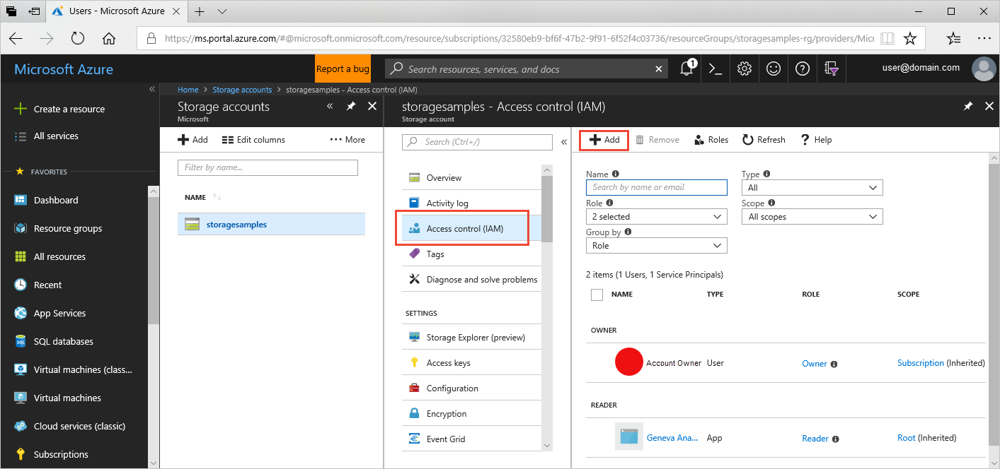
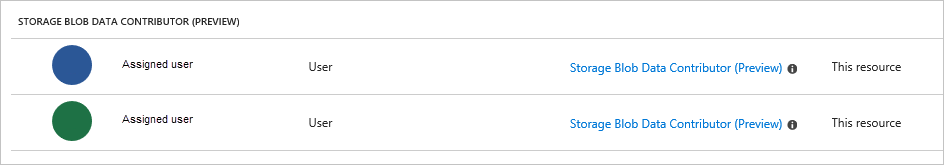

# Authenticating requests to Azure Storage using Azure Active Directory (Preview)

Azure Storage supports authentication with Azure Active Directory (AD). Azure AD integration is available in preview for Azure Blobs and Queues. With Azure AD, you can use role-based access control (RBAC) to grant access to your Azure Storage resources to users, groups, or applications. The preview enables you to grant permissions that are scoped to the level of an individual container or queue. 

Authenticating from your Azure Storage applications with Azure AD provides superior security and ease of use over existing authentication options. While you can continue to use Shared Key authentication with your applications, using Azure AD instead circumvents the need to store your account access key with your code. Similarly, you can continue to use shared access signatures (SAS) to grant fine-grained access to resources in your storage account, but Azure AD offers similar capabilities without the need to manage SAS tokens or worry about revoking a compromised SAS.    

## About the preview

Keep in mind the following points about the preview:

- Azure AD integration is available for blobs and queues only in the preview.
- Azure AD integration is available for GPv1 and GPv2 storage accounts created with the Resource Manager deployment model only. Both standard and premium storage accounts are supported.
- Azure Storage supports both built-in and custom RBAC roles.
- You can define permissions at the container or queue level only during the preview.
- Microsoft recommends using non-production workloads with this preview technology. 

If Azure AD integration is not yet supported for your scenario, continue to use Shared Key authentication or SAS tokens in your applications. 

## RBAC roles for Azure Storage

Azure Storage offers four built-in roles for use with Azure AD:

- Storage Blob Data Contributor (Preview)
- Storage Blob Data Reader (Preview)
- Storage Queue Data Contributor (Preview)
- Storage Queue Data Reader (Preview)

For more information on built-in roles, see [Built-in roles for Azure role-based access control](../../role-based-access-control/built-in-roles).

You can also define custom roles for use with Blob storage and Azure Queues. For more information, see [Create custom roles for Azure Role-Based Access Control](../../role-based-access-control/custom-roles). 

## Assign a role to an Azure AD user, group, or application

You can assign an RBAC role to a user, group, or application.

To assign a built-in role to a user in the Azure portal:

1. In the [Azure portal](https://azure.portal.com/), navigate to your storage account. If you don't already have a storage account created with the Azure Resource Manager model, then create a new storage account. For guidance on creating an Azure Resource Manager storage account, see [Create a storage account](storage-quickstart-create-account.md).
2. Select your storage account, then select **Access Control (IAM)** to display access control settings for the account. Click the **Add** button to add a new role.

    

3. In the **Add permissions** window, select the role that you want to assign to a user or users. Then locate the names of the users to whom you want to assign that role. For example, the following image shows the **Storage Blob Data Reader (Preview)** role assigned to a user.

    

4. Click **Save**. The users that you added appear listed under the role that you selected. These users or groups can now read data in Blob storage, according to how their permissions are scoped. 

    

To learn more about RBAC, see [Get started with Role-Based Access Control in the Azure portal](../../role-based-access-control/overview.md).

