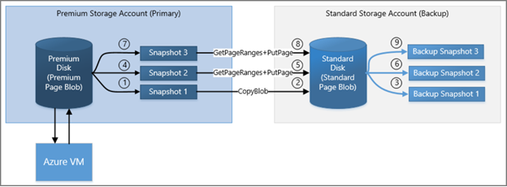

# Backup and disaster recovery for Azure IaaS disks

In this article, we will explain how to plan for Backup and Disaster Recovery (DR) of IaaS virtual machines (VMs) and Disks in Azure. This document covers both Managed and Unmanaged Disks.

We’ll first talk about the built-in fault tolerance capabilities in the Azure platform which help guard against local failures. We’ll then discuss the disaster scenarios not fully covered by the built-in capabilities, which is the main topic addressed by this document. We’ll also show several examples of workload scenarios where different Backup and DR considerations may apply. We’ll then review possible solutions for DR of IaaS Disks. 

## Introduction

The Azure platform uses various methods for redundancy and fault tolerance to help protect customers from localized hardware failures that can occur. Local failures may include problems with an Azure storage server machine that stores part of the data for a virtual disk or failures of an SSD or HDD on that server. Such isolated hardware component failures can happen during normal operations and the platform is designed to be resilient to these failures. Major disasters can result in failures or inaccessibility of a large numbers of storage servers or a whole datacenter. While your VMs and disks are normally protected from localized failures, additional steps are necessary to protect your workload from region-wide catastrophic failures (such as a major disaster) that can affect your VM and disks.

In addition to the possibility of platform failures, problems with the customer application or data can occur. For example, a new version of your application may inadvertently make a breaking change to the data. In that case, you may want to revert the application and the data to a prior version containing the last known good state. This requires maintaining regular backups.

For regional disaster recovery, you must backup your IaaS VM disks to a different region. 

Before we look at Backup and DR options, let’s recap a few methods available for handling localized failures.

### Azure IaaS Resiliency

*Resiliency* refers to the tolerance for normal failures that occur in hardware components. Resiliency is the ability to recover from failures and continue to function. It's not about avoiding failures, but responding to failures in a way that avoids downtime or data loss. The goal of resiliency is to return the application to a fully functioning state following a failure. Azure Virtual Machines and Disks are designed to be resilient to common hardware faults. Let us look at how the Azure IaaS platform provides this resiliency.

A virtual machine consists mainly of two parts: (1) A compute server, and (2) the persistent disks. Both affect the fault tolerance of a virtual machine.

If the Azure compute host server that houses your VM experiences a hardware failure (which is rare), Azure is designed to automatically restore the VM on another server. If this happens, you will experience a reboot, and the VM will be back up after some time. Azure automatically detects such hardware failures and executes recoveries to help ensure the customer VM will be available as soon as possible.

Regarding IaaS disks, durability of data is critical for the persistent storage platform. Azure customers have important business applications running on IaaS and they depend on the persistence of the data. Azure designs protection for these IaaS disks with three redundant copies of data stored locally, providing high durability against local failures. If one of the hardware components that holds your disk fails, your VM is not impacted because there are two additional copies to support disk requests. It works fine even if two different hardware components supporting a disk fail at the same time (which would be very rare). To help ensure we always maintain three replicas, the Azure Storage service automatically spawns a new copy of data in the background if one of the three copies becomes unavailable. Therefore, it should not be necessary to use RAID with Azure disks for fault tolerance. A simple RAID 0 configuration should be sufficient for striping the disks if necessary to create larger volumes.

Because of this architecture, **Azure has consistently delivered enterprise-grade durability for IaaS disks, with an industry-leading ZERO % [Annualized Failure Rate](https://en.wikipedia.org/wiki/Annualized_failure_rate).**

Localized hardware faults on the compute host or in the storage platform can sometimes result in temporary unavailability for the VM which is covered by the [Azure SLA](https://azure.microsoft.com/support/legal/sla/virtual-machines/) for VM Availability. Azure also provides an industry-leading SLA for single VM instances that use Premium Storage disks.

To safeguard application workloads from downtime due to the temporary unavailability of a disk or VM, customers can leverage [Availability Sets](../../virtual-machines/windows/manage-availability.md). Two or more virtual machines in an availability set provides redundancy for the application. Azure then creates these VMs and disks in separate fault domains with different power, network, and server components. Thus, localized hardware failures typically do not affect multiple VMs in the set at the same time, providing high availability for your application. It is considered a good practice to use availability sets when high availability is required. For more information, see the Disaster Recovery aspects detailed below.

### Backup and Disaster Recovery

Disaster recovery (DR) is the ability to recover from rare but major incidents: non-transient, wide-scale failures, such as service disruption that affects an entire region. Disaster recovery includes data backup and archiving, and may include manual intervention, such as restoring a database from backup.

The Azure platform’s built-in protection against localized failures may not fully protect the VMs/disks in the case of major disasters which can cause large-scale outages. This includes catastrophic events such as a data center being hit by a hurricane, earthquake, fire, or large scale hardware unit failures. In addition, you may encounter failures due to application or data issues.

To help protect your IaaS workloads from outages, you should plan for redundancy and backups to enable recovery. For disaster recovery, you should plan redundancy and backup in a different geographic location away from the primary site. This helps ensure your backup is not affected by the same event that originally impacted the VM or disks. For more information, see [Disaster Recovery for Applications built on Azure](https://docs.microsoft.com/azure/architecture/resiliency/disaster-recovery-azure-applications).

Your DR considerations may include the following aspects:

1. High Availability (HA) is the ability of the application to continue running in a healthy state, without significant downtime. By "healthy state," we mean the application is responsive, and users can connect to the application and interact with it. Certain mission-critical applications and databases may be required to be available always, even when there are failures in the platform. For these workloads, you may need to plan redundancy for the application as well as the data.

2. Data Durability: In some cases, the main consideration is ensuring the data is preserved in the case of a disaster. Therefore, you may need a backup of your data in a different site. For such workloads, you may not need full redundancy for the application, but a regular backup of the disks.

## Backup and DR Scenarios

Let’s look at a few typical examples of application workload scenarios and the considerations for planning Disaster Recovery.

### Scenario 1: Major Database Solutions

Consider a production database server like SQL Server or Oracle that can support High Availability. Critical production applications and users depend on this database. The Disaster Recovery plan for this system may need to support the following requirements:

1. Data must be protected and recoverable.
2.	Server must be available for use.

This may require maintaining a replica of the database in a different region as a backup. Depending on the requirements for server availability and data recovery, the solution could range from an Active-Active or Active-Passive replica site to periodic offline backups of the data. Relational databases such as SQL Server and Oracle provide various options for replication. For SQL Server, [SQL Server Always On Availability Groups](https://msdn.microsoft.com/library/hh510230.aspx) can be used for high availability.

NoSQL databases like MongoDB also support [replicas](https://docs.mongodb.com/manual/replication/) for redundancy. The replicas for high availability can be used.

### Scenario 2: A cluster of redundant VMs

Consider a workload handled by a cluster of VMs that provide redundancy and load balancing. One example would be a Cassandra cluster deployed in a region. This type of architecture already provides a high level of redundancy within that region. However, to protect the workload from a regional level failure, you should consider spreading the cluster across two regions or making periodic backups to another region.

### Scenario 3: IaaS Application Workload

This could be a typical production workload running on an Azure VM. For example, it could be a web server or file server holding the content and other resources of a site. It could also be a custom-built business application running on a VM that stored its data, resources, and application state on the VM disks. In this case, it is important to make sure you take backups on a regular basis. Backup frequency should be based on the nature of the VM workload. For example, if the application runs every day and modifies data, then the backup should be taken every hour.

Another example is a reporting server that pull data from other sources and generates aggregated reports. Loss of this VM or disks will lead to the loss of the reports. However, it may be possible to rerun the reporting process and regenerate the output. In that case, you don’t really have a loss of data even if the reporting server is hit with a disaster, so you could have a higher level of tolerance for losing part of the data on the reporting server. In that case, less frequent backups is an option to reduce the cost.

### Scenario 4: IaaS Application data issues

You have an application that computes, maintains, and serves critical commercial data such as pricing information. A new version of your application had a software bug which incorrectly computed the pricing and corrupted the existing commerce data served by the platform. Here, the best course of action would be to revert to the earlier version of the application and the data first. To enable this, take periodic backups of your system.

## Disaster Recovery Solution: Azure Backup Service

[Azure Backup Service](https://azure.microsoft.com/services/backup/) is can be used for Backup and DR, and it works with [Managed Disks](../../virtual-machines/windows/managed-disks-overview.md) as well as [Unmanaged Disks](../../virtual-machines/windows/about-disks-and-vhds.md#unmanaged-disks). You can create a backup job with time-based backups, easy VM restoration and backup retention policies. 

If you use [Premium Storage disks](storage-premium-storage.md), [Managed Disks](../../virtual-machines/windows/managed-disks-overview.md), or other disk types with the [locally redundant storage (LRS)](storage-redundancy.md#locally-redundant-storage) option, it is especially important to leverage periodic DR backups. Azure Backup stores the data in your Recovery Services vault for long term retention. Choose the [Geo-redundant storage (GRS)](storage-redundancy.md#geo-redundant-storage) option for the Backup Recovery Services vault. That will ensure backups are replicated to a different Azure region for safeguarding from regional disasters.

For [Unmanaged Disks](../../virtual-machines/windows/about-disks-and-vhds.md#unmanaged-disks), you can use the LRS storage type for IaaS disks, but ensure that Azure Backup is enabled with the GRS option for the Recovery Services Vault.

**If you use the [GRS](storage-redundancy.md#geo-redundant-storage)/[RA-GRS](storage-redundancy.md#read-access-geo-redundant-storage) option for your Unmanaged Disks, you still need consistent snapshots for Backup and DR.** You must use either [Azure Backup Service](https://azure.microsoft.com/services/backup/) or [consistent snapshots](#alternative-solution-consistent-snapshots).

The following is a summary of solutions for DR.

| Scenario | Automatic Replication | DR Solution |
| --- | --- | --- |
| *Premium Storage Disks* | Local ([LRS](storage-redundancy.md#locally-redundant-storage)) | [Azure Backup](https://azure.microsoft.com/services/backup/) |
| *Managed Disks* | Local ([LRS](storage-redundancy.md#locally-redundant-storage)) | [Azure Backup](https://azure.microsoft.com/services/backup/) |
| *Unmanaged LRS Disks* | Local ([LRS](storage-redundancy.md#locally-redundant-storage)) | [Azure Backup](https://azure.microsoft.com/services/backup/) |
| *Unmanaged GRS Disks* | Cross region ([GRS](storage-redundancy.md#geo-redundant-storage)) | [Azure Backup](https://azure.microsoft.com/services/backup/) [Consistent snapshots](#alternative-solution-consistent-snapshots) |
| *Unmanaged RA-GRS Disks* | Cross region ([RA-GRS](storage-redundancy.md#read-access-geo-redundant-storage)) | [Azure Backup](https://azure.microsoft.com/services/backup/) [Consistent snapshots](#alternative-solution-consistent-snapshots) |

High availability can best by met through the use of Managed Disks in an Availability Set along with Azure Backup. If you are using Unmanaged Disks, you can still  use Azure Backup for DR. If you are unable to use Azure Backup, then taking [consistent snapshots](#alternative-solution-consistent-snapshots) as described in a later section is an alternative solution for Backup and DR.

Your choices for high availability, backup and DR at Application or Infrastructure levels can be represented as below:

| *Level* |	High Availability	| Backup / DR |
| --- | --- | --- |
| *Application* | SQL Always On	| Azure Backup |
| *Infrastructure*	| Availability Set	| GRS with consistent snapshots |

### Using the Azure Backup Service

[Azure Backup](../../backup/backup-azure-vms-introduction.md) can backup your VMs running Windows or Linux to the Azure Recovery Services Vault. Backing up and restoring business-critical data is complicated by the fact that business-critical data must be backed up while the applications that produce the data are running. To address this, Azure Backup provides application-consistent backups for Microsoft workloads by using the Volume Shadow Service (VSS) to ensure that data is written correctly to storage. For Linux VMs, only file-consistent backups are possible, since Linux does not have functionality equivalent to VSS.

   

When Azure Backup initiates a backup job at the scheduled time, it triggers the backup extension installed in the VM to take a point-in-time snapshot. A snapshot is taken in coordination with VSS to get a consistent snapshot of the disks in the virtual machine without having to shut it down. The backup extension in the VM flushes all writes before taking the consistent snapshot of all the disks. After the snapshot is taken, the data is transferred by Azure Backup to the backup vault. To make the backup process more efficient, the service identifies and transfers only the blocks of data that have changed since the last backup.

To restore, you can view the available backups through Azure Backup and then initiate a restore. You can create and restore Azure backups through the [Azure portal](https://portal.azure.com/), [using PowerShell](../../backup/backup-azure-vms-automation.md ), or using the [Azure CLI](https://docs.microsoft.com/azure/xplat-cli-install). For more information, see Azure Backup.

### Steps to Enable Backup

The following steps are typically used to enable backups of your VMs using the [Azure Portal](https://portal.azure.com/). There will be some variations depending on your exact scenario. Refer to the [Azure Backup](../../backup/backup-azure-vms-introduction.md) documentation for full details. Azure Backup also [supports VMs with Managed Disks](https://azure.microsoft.com/blog/azure-managed-disk-backup/).

1.	Create a recovery services vault for a VM using the following steps:

    a.	Using the [Azure portal](https://portal.azure.com/), browse all resources and find “Recovery Services vaults”.

    b.	On the Recovery Services vaults menu, click Add and follow the steps to create a new vault in the same region as the VM. For example, if your VM is in West US region, pick West US for the vault.

2.	Verify the Storage replication for the newly created vault. To do this, access the vault from the Recovery Services vaults blade and go to the settings/Backup Configuration. Ensure the GRS option is selected by default. This will ensure that your vault is automatically replicated to a secondary data center. For example, your vault in West US will be automatically replicated to East US.

3.	Configure the backup policy and select the VM from the same UI.

4.	Make sure the Backup Agent is installed on the VM. If your VM is created using an Azure gallery image, then the Backup agent is already installed. Otherwise (that is, if you are using a custom image), use instructions to [Install the VM Agent on the virtual machine](../../backup/backup-azure-arm-vms-prepare.md#install-the-vm-agent-on-the-virtual-machine).

5.	Make sure that the VM allows network connectivity for the backup service to function. Follow these instructions for [Network connectivity](../../backup/backup-azure-arm-vms-prepare.md#network-connectivity).

6.	Once the above steps are completed, the backup will run at regular intervals as specified in the backup policy. If necessary, you can trigger the first backup manually from the vault dashboard on the Azure portal.

For automating Azure Backup using scripts, please refer to [PowerShell cmdlets for VM backup](../../backup/backup-azure-vms-automation.md).

### Steps for Recovery

If you need to repair or rebuild a VM, you can restore the VM from any of the backup recovery points in the vault. There are a couple of different options for performing the recovery:

1.	You can create a new VM as a point-in-time representation of your backed-up VM.

2.	You can restore the disks and then use the template for the VM to customize and rebuild the restored VM. 

See instructions to [Use Azure portal to restore virtual machines](../../backup/backup-azure-arm-restore-vms.md#restoring-a-vm-during-azure-datacenter-disaster). The document also explains the specific steps for restoring backed-up VMs to the paired data center using your geo-redundant backup vault in the case of a disaster at the primary data center. In that case, Azure Backup uses the Compute service from the secondary region to create the restored virtual machine.

You can also use PowerShell for [restoring a VM](../../backup/backup-azure-vms-automation.md#restore-an-azure-vm) or for [creating a new VM from restored disks](../../backup/backup-azure-vms-automation.md#create-a-vm-from-restored-disks).

## Alternative Solution: Consistent Snapshots

If you are unable to use the Azure Backup Service, you can implement your own backup mechanism using snapshots. It is complicated to create consistent snapshots for all disks used by a VM and then replicate those snapshots to another region. For this reason, Azure considers leveraging the Backup Service a better option than building a custom solution. If you use RA-GRS/GRS storage for disks, snapshots are automatically replicated to a secondary data center. If you use LRS storage for disks, you will need to replicate the data yourself. For more information, see [Back up Azure unmanaged VM disks with incremental snapshots](../../virtual-machines/windows/incremental-snapshots.md).

A snapshot is a representation of an object at a specific point in time. A snapshot will incur billing for the incremental size of the data it holds. For more information, see [Create a blob snapshot](../blobs/storage-blob-snapshots.md).

### Creating snapshots while the VM is running

While you can take a snapshot at any time, if the VM is running, there is still data being streamed to the disks, and the snapshots may contain partial operations that were in flight. Also, if there are several disks involved, the snapshots of different disks may have occurred at different times, which means these snapshots may not be coordinated. This is especially problematic for striped volumes whose files can be corrupted if changes were being made during backup.

To avoid this situation, the backup process must implement the following steps:

1.	Freeze all the disks

2.	Flush all the pending writes

3.	Then, [create a blob snapshot](../blobs/storage-blob-snapshots.md) for all the disks

Some Windows applications like SQL Server provide a coordinated backup mechanism via VSS to create application-consistent backups. On Linux, you can use a tool like fsfreeze for coordinating the disks, which will provide file-consistent backups, but not application-consistent snapshots. This process is complicated, so and you should consider using [Azure Backup](../../backup/backup-azure-vms-introduction.md) or a third-party backup solution which already implement this.

The above process will result in a collection of coordinated snapshots for all the VM disks, representing a specific point-in-time view of the VM. This is a backup restore point for the VM. You can repeat the process at scheduled intervals to create periodic backups. See below for the steps to [copy the backups to another region](#copy-the-snapshots-to-another-region) for DR.

### Creating snapshots while the VM is offline

Another option to create consistent backups is shutting down the VM and taking blob snapshots of each disk. This is easier than coordinating snapshots of a running VM, but it requires a few minutes of downtime. For this process, follow these steps:

1. Shut down the VM.

2. Create a snapshot of each VHD blob, which only takes a few seconds.

    To create a snapshot, you can use [PowerShell](storage-powershell-guide-full.md#how-to-manage-azure-blob-snapshots), the [Azure Storage Rest API](https://msdn.microsoft.com/library/azure/ee691971.aspx), [Azure CLI](https://docs.microsoft.com/azure/xplat-cli-install), or one of the Azure Storage Client Libraries such as [the Storage client library for .NET](https://msdn.microsoft.com/library/azure/hh488361.aspx).

3. Start the VM, which ends the downtime. Typically the entire process completes within a few minutes.

This process yields a collection of consistent snapshots for all the disks, providing a backup restore point for the VM. See below for the steps to copy the snapshots to another region for DR.

### Copy the snapshots to another region

Creation of the snapshots alone may not be sufficient for DR. You must also replicate the snapshot backups to another region.

If you are using GRS or RA-GRS for your disks, then the snapshots are replicated to the secondary region automatically. There can be a few minutes of lag before the replication, and if the primary data center goes down before the snapshots finish replicating, you will not be able to access the snapshots from the secondary data center. The likelihood of this is small.

> [!Note] 
> Only having the disks in a GRS or RA-GRS account does not protect the VM from disasters. You must also create coordinated snapshots or use Azure Backup. This is required to recover a VM to a consistent state.

If you are using LRS, you must copy the snapshots to a different storage account immediately after creating the snapshot. The copy target could be an LRS storage account in a different region, resulting in the copy being in a remote region. You can also copy the snapshot to an RA-GRS storage account in the same region. In this case, the snapshot will be lazily replicated to the remote secondary region. Your backup is protected from disasters at the primary site once the copying and replication is complete.

To copy your incremental snapshots for DR efficiently, review the instructions in [Back up Azure unmanaged VM disks with incremental snapshots](../../virtual-machines/windows/incremental-snapshots.md).

   

### Recovery from Snapshots

To retrieve a snapshot, copy it to make a new blob. If you are copying the snapshot from the primary account, you can copy the snapshot over to the base blob of the snapshot, thus reverting the disk to the snapshot; this is known as promoting the snapshot. If you are copying the snapshot backup from a secondary account (in the case of RA-GRS), it must be copied to a primary account. You can copy a snapshot [using PowerShell](storage-powershell-guide-full.md#how-to-copy-a-snapshot-of-a-blob) or using the AzCopy utility. For more information, see [Transfer data with the AzCopy Command-Line Utility](storage-use-azcopy.md).

In the case of VMs with multiple disks, you must copy all the snapshots that are part of the same coordinated restore point. Once you copy the snapshots to writable VHD blobs, you can use the blobs to recreate your VM using the template for the VM.

## Other options

### SQL Server

SQL Server running in a VM has its own built-in capabilities to backup your SQL Server database to Azure Blob storage or a file share. If the storage account is GRS or RA-GRS, you can access those backups in the storage account’s secondary data center in the event of a disaster, with the same restrictions as discussed previously. For more information, see [Backup and Restore for SQL Server in Azure Virtual Machines](../../virtual-machines/windows/sql/virtual-machines-windows-sql-backup-recovery.md). In addition to backup and restore, [SQL Server Always On Availability Groups](../../virtual-machines/windows/sql/virtual-machines-windows-sql-high-availability-dr.md) can maintain secondary replicas of databases to greatly reduce the disaster recovery time.

## Other considerations

This article has discussed how to backup or take snapshots of your VMs and their disks to support disaster recovery, and how to use those to recover. With the Azure Resource Manager model, many people use templates to create their VMs and other infrastructure in Azure. You can use a template to create a VM that has the same configuration every time. If you use custom images for creating your VMs, you must also make sure your images are protected by using an RA-GRS account to store them.

Consequently, your backup process may be a combination of two things:

1. Backup the data (disks)
2. Backup the configuration (templates, custom images)

Depending on the backup option you choose, you may have to handle the backup of both the data and the configuration, or the backup service may handle all of that for you.

## Appendix - Understanding the impact of LRS, GRS, and RA-GRS

For storage accounts in Azure, there are three types of data redundancy that you should consider regarding disaster recovery – locally redundant (LRS), geo-redundant (GRS), or geo-redundant with read access (RA-GRS). 

Locally Redundant Storage (LRS) retains three copies of the data in the same data center. When writing the data, all three copies are updated before success is returned to the caller, so you know they are identical. Your disk is protected from local failures, since it is extremely unlikely that all three copies would be impacted at the same time. In the case of LRS, there is no geo-redundancy, so the disk is not protected from catastrophic failures that can impact an entire data center or storage unit.

With GRS and RA-GRS, three copies of your data are retained in the primary region (selected by you), and three more copies of your data are retained in a corresponding secondary region (set by Azure). For example, if you store data in West US, the data will be replicated to East US. This is done asynchronously, and there is a small delay between updates to the primary and secondary. Replicas of the disks on the secondary site are consistent on a per-disk basis (with the delay), but replicas of multiple active disks may not be in sync **with each other**. To have consistent replicas across multiple disks, consistent snapshots are needed.

The main difference between GRS and RA-GRS is that with RA-GRS, you can read the secondary copy at any time. If there is a problem that renders the data in the primary region inaccessible, the Azure team will make every effort to restore access. While the primary is down, if you have RA-GRS enabled, you can access the data in the secondary data center. Therefore, if you plan to read from the replica while the primary is inaccessible, then RA-GRS should be considered.

If it turns out to be a significant outage, the Azure team may trigger a geo-failover and change the primary DNS entries to point to secondary storage. At this point, if you have either GRS or RA-GRS enabled, you can access the data in the region that used to be the secondary. In other words, if your storage account is GRS and there is a problem, you can access the secondary storage only if there is a geo-failover.

For more information, see [What to do if an Azure Storage outage occurs](storage-disaster-recovery-guidance.md). 

Note that Microsoft controls whether a failover occurs. Failover is not controlled per storage account, therefore it is not decided by individual customers. To implement Disaster Recovery for specific storage accounts or virtual machine disks, you must use the techniques described previously in this article.
