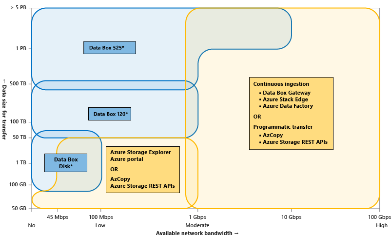

# Choose an Azure solution for data transfer

This article provides an overview of some of the common Azure data transfer solutions. The article also links out to recommended options depending on the network bandwidth in your environment and the size of the data you intend to transfer.

## Types of data movement

Data transfer can be offline or over the network connection. Choose your solution depending on your:

- **Data size** - Size of the data intended for transfer,
- **Transfer frequency** - One-time or periodic data ingestion, and
- **Network** – Bandwidth available for data transfer in your environment.

The data movement can be of the following types:

- **Offline transfer using shippable devices** - Use physical shippable devices when you want to do offline one-time bulk data transfer. Microsoft sends you a disk, or a secure specialized device. Alternatively, you can purchase and ship your own disks. You copy data to the device and then ship it to Azure where the data is uploaded.  The available options for this case are Data Box Disk, Data Box, Data Box Heavy, and Import/Export (use your own disks).

- **Network Transfer** - You transfer your data to Azure over your network connection. This can be done in many ways.

    - **Graphical interface** - If you occasionally transfer just a few files and do not need to automate the data transfer, you can choose a graphical interface tool such as Azure Storage Explorer or a web-based exploration tool in Azure portal.
    - **Scripted or programmatic transfer** - You can use optimized software tools that we provide or call our REST APIs/SDKs directly. The available scriptable tools are AzCopy, Azure PowerShell, and Azure CLI. For programmatic interface, use one of the SDKs for .NET, Java, Python, Node/JS, C++, Go, PHP or Ruby.
    - **On-premises devices** - We supply you a physical or virtual device that resides in your datacenter and optimizes data transfer over the network. These devices also provide a local cache of frequently used files. The physical device is the Data Box Edge and the virtual device is the Data Box Gateway. Both run permanently in your premises and connect to Azure over the network.
    - **Managed data pipeline** - You can set up a cloud pipeline to regularly transfer files between several Azure services, on-premises or a combination of two. Use Azure Data Factory to set up and manage data pipelines, and move and transform data for analysis.

The following visual illustrates the guidelines to choose the various Azure data transfer tools depending upon the network bandwidth available for transfer, data size intended for transfer, and frequency of the transfer.

**The upper limits of the offline transfer devices - Data Box Disk, Data Box, and Data Box Heavy can be extended by placing multiple orders of a device type.*

## Selecting a data transfer solution

Answer the following questions to help select a data transfer solution:

- Is your available network bandwidth limited or non-existent, and you want to transfer large datasets?
  
    If yes, see: [Scenario 1: Transfer large datasets with no or low network bandwidth](storage-solution-large-dataset-low-network.md).
- Do you want to transfer large datasets over network and you have a moderate to high network bandwidth?

    If yes, see: [Scenario 2: Transfer large datasets with moderate to high network bandwidth](storage-solution-large-dataset-moderate-high-network.md).
- Do you want to occasionally transfer just a few files over the network?

    If yes, see [Scenario 3: Transfer small datasets with limited to moderate network bandwidth](storage-solution-small-dataset-low-moderate-network.md).
- Are you looking for point-in-time data transfer at regular intervals?

    If yes, use the scripted/programmatic options outlined in [Scenario 4: Periodic data transfers](storage-solution-periodic-data-transfer.md).
- Are you looking for on-going, continuous data transfer?

    If yes, use the options in [Scenario 4: Periodic data transfers](storage-solution-periodic-data-transfer.md).
 

## Data transfer feature in Azure portal

You can also go to your Azure Storage account in Azure portal and select the **Data transfer** feature. Provide the network bandwidth in your environment, the size of the data you want to transfer, and the frequency of data transfer. You will see the optimum data transfer solutions corresponding to the information that you have provided. 

## Next steps

- [Get an introduction to Azure Storage Explorer](https://azure.microsoft.com/resources/videos/introduction-to-microsoft-azure-storage-explorer/).
- [Read an overview of AzCopy](https://docs.microsoft.com/azure/storage/common/storage-use-azcopy-v10).
- [Use Azure PowerShell with Azure Storage](https://docs.microsoft.com/azure/storage/common/storage-powershell-guide-full)
- [Use Azure CLI with Azure Storage](https://docs.microsoft.com/azure/storage/common/storage-azure-cli)
- Learn about:

    - [Azure Data Box, Azure Data Box Disk, and Azure Data Box Heavy for offline transfers](https://docs.microsoft.com/azure/databox/).
    - [Azure Data Box Gateway and Azure Data Box Edge for online transfers](https://docs.microsoft.com/azure/databox-online/).
- [Learn what is Azure Data Factory](https://docs.microsoft.com/azure/data-factory/copy-activity-overview).
- Use the REST APIs to transfer data

    - [In .NET](https://docs.microsoft.com/dotnet/api/overview/azure/storage)
    - [In Java](https://docs.microsoft.com/java/api/overview/azure/storage/client)
