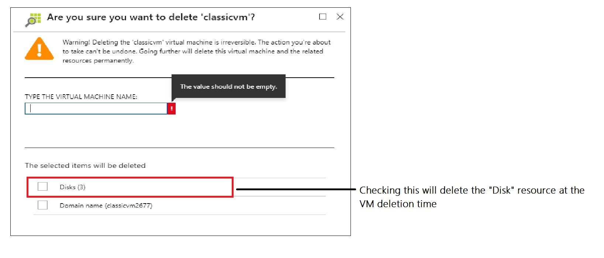
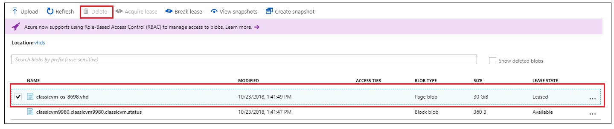
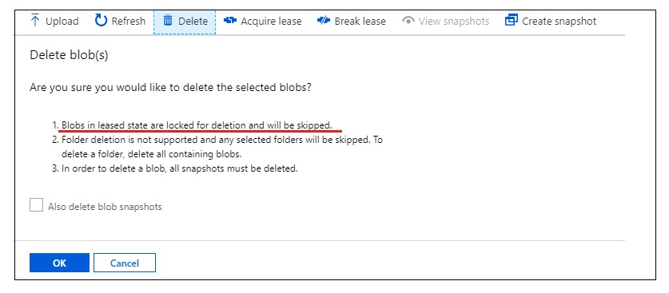

# Troubleshoot delete errors with classic storage resource 
This article provides troubleshooting guidance when one of the following errors occur trying to delete Azure classic storage account, container, or blob. 
 

## Background
This article only covers issues with classic storage resources. If a user deletes a classic virtual machine using the Azure Portal or other means, such as PowerShell, the Disk and VHD are not automatically deleted. The user gets the option to delete those artifacts. In case the user doesn’t choose the option to delete the “Disk” resource, it will prevent  deletion of the storage resources like storage account, container, the actual *.vhd page blob file.

More information about Azure disks can be found [here](../../virtual-machines/windows/about-disks-and-vhds.md). Azure prevents deletion of a disk that is attached to a VM to prevent corruption. It also prevents deletion of containers and storage accounts which have a page blob that is attached to a VM. 

## What is a "Disk"?
The "Disk" resource is responsible for mounting the page blob *.vhd file, so it can be attached to virtual machines as an OS Disk or Data Disk. The "Disk" resource will continue to hold a lease on the page blob *.vhd file for as long as the disk exists. Any storage resource in the path enumerated above can’t be deleted if a “Disk” resource points to it.

 

## Steps while deleting a classic virtual machine 
1. Delete the classic virtual machine which is not required anymore.
2. If the “Disks” checkbox is selected, the **disk lease** (shown in image above) associated with the page blob *.vhd is broken. The actual page blob *.vhd file will still exist in the storage account.
 

3. Once the disk(s) lease is broken, the page blob(s) itself can be deleted. A storage account or container can be deleted once all "Disk" resource present in them are deleted.

>**Note:** If user deletes the VM but not the VHD, storage charges will continue to accrue on the page blob *.vhd  file. The charges will be in line with the type of storage account, check the [pricing page](https://azure.microsoft.com/en-us/pricing/details/storage/) for more details. If user no longer intends to use the VHD(s), delete it/them to avoid future charges. 

## Common unable to delete storage resource scenarios

### Unable to delete storage account 

When user tries to delete a classic storage account that is no longer needed, user may see the following behavior.

#### Azure Portal 
User navigates to the classic storage account on the [Azure portal](https://portal.azure.com) and clicks **Delete**, user will see the following message: 

With disk(s) “attached” to a virtual machine

 

With disks(s) "unattached" to a virtual machine

#### Azure PowerShell
User tries to delete a storage account that is no longer being used, by using classic PowerShell cmdlets, user will see the following message:

>**Remove-AzureStorageAccount -StorageAccountName myclassicaccount**

>Remove-AzureStorageAccount : BadRequest: Storage account myclassicaccount has some active image(s) and/or disk(s), e.g.  
myclassicaccount. Ensure these image(s) and/or disk(s) are removed before deleting this storage account.

### Unable to delete storage container

When user tries to delete a classic storage blob container that is no longer needed, user may see the following behavior.

#### Azure Portal 
If there is a "Disk(s)" lease on a vhd page blob file inside the container, Azure Portal will not allow the user to delete the particular container. This is by design to prevent accidental deletion of a vhd(s) file with Disk(s) lease on it. 

#### Azure PowerShell
If the user chooses to delete using PowerShell it will result in the following error. 

>**Remove-AzureStorageContainer -Context $context -Name vhds**

>Remove-AzureStorageContainer : The remote server returned an error: (412) There is currently a lease on the container and no lease ID was specified in the request.. HTTP Status Code: 412 - HTTP Error Message: There is currently a lease on the container and no lease ID was specified in the request.

### Unable to delete a vhd 

After deleting the Azure virtual machine, user tries to delete the vhd file (page blob) and receive the message below:

#### Azure Portal 
On the portal, there could be two experiences depending on the list of blobs selected for deletion.

1. If only “Leased” blobs are selected, then the Delete button doesn’t show up.

2. If a mix of “Leased” and “Available” blobs are selected the “Delete” button shows up. But the “Delete” operation will leave behind the page blobs which have a Disk lease on them. 

#### Azure PowerShell 
If the user chooses to delete using PowerShell it will result in the following error. 

>**Remove-AzureStorageBlob -Context $context -Container vhds -Blob "classicvm-os-8698.vhd"**

>Remove-AzureStorageBlob : The remote server returned an error: (412) There is currently a lease on the blob and no lease ID was specified in the request.. HTTP Status Code: 412 - HTTP Error Message: There is currently a lease on the blob and no lease ID was specified in the request.

## Resolution steps

### To remove classic Disks
Follow these steps on the Azure Portal:
1.	Navigate to the [Azure portal](https://portal.azure.com).
2.	Navigate to the Disks(classic). 
3.	Click the Disks tab.
 
 
4.	Select your data disk, then click Delete Disk.
 
 
5.	Retry the Delete operation that previously failed.
6.	A storage account or container can't be deleted as long as it has a single Disk.

### To remove classic Images   
Follow these steps on the Azure Portal:
1.	Navigate to the [Azure portal](https://portal.azure.com).
2.	Navigate to OS images (classic).
3.	Delete the image.
4.	Retry the Delete operation that previously failed.
5.	A storage account or container can’t be deleted as long as it has a single Image.
