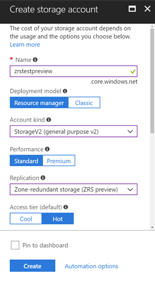

# Geo-zone-redundant storage for highly availability and maximum durability

Geo-zone-redundant storage (GZRS) marries the high availability of zone-redundant storage (ZRS) with protection from regional outages as provided by geo-redundant storage (GRS). Data written to a GZRS storage account is replicated synchronously to three Azure Availability Zones in the primary region. Data is then replicated asynchronously to a second region hundreds of miles away. You can optionally enable read access to data in the secondary region (read-access geo-zone-redundant storage or RA-GZRS) if your scenario requires that your applications are able to read data in the event of a disaster in the primary region. Microsoft recommends using GZRS or RA-GZRS for applications requiring high availability, excellent performance, and resilience for diaster recovery.

GZRS helps achieve higher data resiliency within a region by synchronously writing three replicas of your data across multiple Availability Zones (like [zone redundant storage (ZRS)](https://docs.microsoft.com/azure/storage/common/storage-redundancy-zrs) today) while providing inter-regional redundancy protecting from a regional outage by asynchronously replicating the data to another region within the same geo within a single zone (like [locally redundant storage (LRS)](https://docs.microsoft.com/azure/storage/common/storage-redundancy-lrs) today). When using GZRS, you can continue to read and write the data even if one of the Availability Zones is unavailable or unrecoverable and your data is also durable in the case of a complete regional outage or a disaster in which the primary region isn’t recoverable. GZRS is designed to provide at least 99.99999999999999% (16 9's) durability of objects over a given year. GZRS provides a great balance among competing objectives of high performance, high availability and disaster recovery and is beneficial when building highly available applications/services in Azure.

When you store your data in a storage account using GZRS replication, you can continue to access and manage your data if an Availability Zone becomes unavailable. GZRS offers the same [scalability targets](https://docs.microsoft.com/azure/storage/common/storage-scalability-targets) as LRS, ZRS, GRS or RA-GRS. Consider GZRS for scenarios that require consistency, durability, intra-regional high availability and inter-regional disaster recovery. For more information about availability zones, see [Availability Zones overview](https://docs.microsoft.com/azure/availability-zones/az-overview).

If you opt for GZRS, you have two related options to choose from:

- GZRS replicates your data to another data center in a secondary region, but that data is available to be read only if Microsoft initiates a failover from the primary to secondary region.
- Read-access geo and zone redundant storage (RA-GZRS) is based on GZRS. RA-GZRS replicates your data to another data center in a secondary region, and also provides you with the option to read from the secondary region. With RA-GZRS, you can read from the secondary region regardless of whether Microsoft initiates a failover from the primary to secondary region.

For a storage account with GZRS or RA-GZRS enabled, all data is first replicated with zone redundant storage. An update is first committed to the primary location and replicated using ZRS. The update is then replicated asynchronously to the secondary region using GZRS. When data is written to the secondary location, it's replicated within that location using LRS.

The primary region manages replicas across separate fault domains and upgrade domains within a storage scale unit. The storage scale unit is the basic replication unit within the Availability Zone. Replication at this level is provided by ZRS; for more information, see [Zone-redundant storage (ZRS): Highly available Azure Storage applications](https://docs.microsoft.com/azure/storage/common/storage-redundancy-zrs?toc=%2fazure%2fstorage%2fblobs%2ftoc.json).

The secondary region manages replicas across separate fault domains and upgrade domains within a storage scale unit. The storage scale unit is the basic replication unit within the datacenter. Replication at this level is provided by ZRS; for more information, see [Locally redundant storage (LRS): Low-cost data redundancy for Azure Storage](https://docs.microsoft.com/azure/storage/common/storage-redundancy-lrs).

Keep these points in mind when deciding which replication option to use:

- Asynchronous replication involves a delay from the time that data is written to the primary region, to when it is replicated to the secondary region. In the event of a regional disaster, changes that haven't yet been replicated to the secondary region may be lost if that data can't be recovered from the primary region.
- With GZRS, the replica isn't available for read or write access unless Microsoft initiates a failover to the secondary region. In the case of a failover, you'll have read and write access to that data after the failover has completed. For more information, please see Disaster recovery guidance.
- If your application needs to read from the secondary region, enable RA-GZRS.

## Read-access geo and zone redundant storage

Read-access geo and zone redundant storage (RA-GZRS) maximizes availability for your storage account. RA-GZRS provides read-only access to the data in the secondary location, in addition to geo-replication across two regions.

When you enable read-only access to your data in the secondary region, your data is available on a secondary endpoint as well as on the primary endpoint for your storage account. The secondary endpoint is similar to the primary endpoint but appends the suffix –secondary to the account name. For example, if your primary endpoint for the Blob service is myaccount.blob.core.windows.net, then your secondary endpoint is myaccount-secondary.blob.core.windows.net. The access keys for your storage account are the same for both the primary and secondary endpoints.

Some considerations to keep in mind when using RA-GZRS:

- Your application has to manage which endpoint it is interacting with when using RA-GZRS.

- Since asynchronous replication involves a delay, changes that haven't yet been replicated to the secondary region may be lost if the primary region is unavailable and data can't be recovered from the primary region.

- You can check the Last Sync Time of your storage account. Last Sync Time is a GMT date/time value. All primary writes before the Last Sync Time have been successfully written to the secondary location, meaning that they are available to be read from the secondary location. Primary writes after the Last Sync Time may or may not be available for reads yet. You can query this value using the [Azure portal](https://portal.azure.com/), [Azure PowerShell](https://docs.microsoft.com/azure/storage/common/storage-powershell-guide-full), or from one of the Azure Storage client libraries.

- If you initiate an account failover (preview) of a GZRS or RA-GZRS account to the secondary region, write access to that account is restored after the failover has completed. For more information, see [Disaster recovery and storage account failover (preview)](https://docs.microsoft.com/en-us/azure/storage/common/storage-disaster-recovery-guidance).

- RA-GZRS is intended for high-availability purposes. For scalability guidance, review the [performance checklist](https://docs.microsoft.com/azure/storage/common/storage-performance-checklist).

- For suggestions on how to design for high availability with RA-GZRS, see [Designing Highly Available Applications using RA-GRS storage](https://docs.microsoft.com/en-us/azure/storage/common/storage-designing-ha-apps-with-ragrs).

## What is the RPO and RTO with GZRS?

Recovery Point Objective (RPO): In GZRS and RA-GZRS, the storage service asynchronously geo-replicates the data from the primary to the secondary location. If the primary region becomes unavailable, you can perform an account failover (preview) to the secondary region. When you initiate a failover, recent changes that haven't yet been geo-replicated may be lost. The number of minutes of potential data that's lost is known as the RPO. The RPO indicates the point in time to which data can be recovered. Azure Storage typically has an RPO of less than 15 minutes, although there's currently no SLA on how long geo-replication takes.

Recovery Time Objective (RTO): The RTO is a measure of how long it takes to perform the failover and get the storage account back online. The time to perform the failover includes the following actions:

- The time until the customer initiates the failover of the storage account from the primary to the secondary region.
- The time required by Azure to perform the failover by changing the primary DNS entries to point to the secondary location.

## Paired regions

When you create a storage account, you select the primary region for the account. The paired secondary region is determined based on the primary region and can't be changed. For up-to-date information about regions supported by Azure, see [Business continuity and disaster recovery (BCDR): Azure paired regions](https://docs.microsoft.com/azure/best-practices-availability-paired-regions).

## Support coverage and regional availability

(RA-)GZRS currently supports standard general-purpose v2 account types. For more information about storage account types, see [Azure storage account overview](https://docs.microsoft.com/azure/storage/common/storage-account-overview). (RA-)GZRS is available for block blobs, non-disk page blobs, files, tables, and queues.

(RA-)GZRS is available for preview in the following regions:

- US East 2

Microsoft continues to enable (RA-)GZRS in additional Azure regions. Check the [Azure Service Updates](https://azure.microsoft.com/updates/) page regularly
for information about new regions.

## What happens when a zone becomes unavailable in the primary region?

Your data is still accessible for both read and write operations even if a zone becomes unavailable in the primary region. Microsoft recommends that you continue to follow practices for transient fault handling. These practices include implementing retry policies with exponential back-off.

When a zone is unavailable, Azure undertakes networking updates, such as DNS repointing. These updates may affect your application if you are accessing your
data before the updates have completed.

GZRS also protects your data against a regional disaster where multiple zones in the primary region are permanently affected.

## Getting started

You can create a GZRS or RA-GZRS storage account using various methods including Azure CLI, Azure PowerShell, Azure Portal, Azure Resource Manager, and the Azure Storage Management SDK.

To create an (RA-)GZRS account in the Azure Portal, set the following properties. Please note that (RA-)GZRS requires a [general purpose v2 account](https://docs.microsoft.com/azure/storage/common/storage-account-options#general-purpose-v2) kind.

To create an (RA-)GZRS account with the Azure CLI, install the [Azure CLI](https://docs.microsoft.com/cli/azure/install-azure-cli?view=azure-cli-latest) (version 2.0.76 or above), then run the following command in your console:

az storage account create -n \<accountname\> -g \<resourcegroup\> -l \<region\> --sku Standard_GZRS --kind StorageV2

Similarly, to create an RA-GZRS account use Standard_RAGZRS as the sku value.

To create a GZRS account with Azure PowerShell, first install the latest Azure PowerShellGet module using the following command:

Install-Module PowerShellGet -Repository PSGallery -Force

Close and open the PowerShell console again and install the Azure PowerShell preview module 1.3.2-preview using the following command:

Install-Module Az.Storage -Repository PSGallery -RequiredVersion 1.3.2-preview -AllowPrerelease -AllowClobber -Force

Once you have successfully completed the above steps, run the following cmdlet in the PowerShell console:

New-AzStorageAccount -Name \<accountname\> -Location \<region\> -ResourceGroupName \<resourcegroup\> -SkuName Standard_GZRS -Kind StorageV2

Similarly, to create an RA-GZRS account use Standard_RAGZRS as the SkuName value.

There is no change to existing API for reading and writing data in a storage account, so existing code and tools will just continue to work when pointed to an (RA-)GZRS account. Please refer to the [GZRS documentation](https://docs.microsoft.com/azure/storage/common/storage-redundancy?toc=%2fazure%2fstorage%2fblobs%2ftoc.json#zone-redundant-storage) for more details on getting started.

For information on preview pricing, please refer to the pricing pages for [Blobs](https://azure.microsoft.com/pricing/details/storage/blobs), [Files](https://azure.microsoft.com/pricing/details/storage/files/), [Queues](https://azure.microsoft.com/pricing/details/storage/queues/), and [Tables](https://azure.microsoft.com/pricing/details/storage/tables/) under GZRS (preview) pricing.

## Converting from other redundancy types to (RA-)GZRS

Converting from LRS/ GRS/ RA-GRS/ ZRS to (RA-)GZRS is supported. To convert from ZRS to (RA-)GZRS you can use Azure CLI, Azure PowerShell, Azure Portal, Azure Resource Manager, and the Azure Storage Management SDK. To convert an existing ZRS account to RA-GZRS use the following PowerShell cmdlet:

Set-AzStorageAccount -ResourceGroupName "resourcegroup" -AccountName "accountname" -SkuName "Standard_RAGZRS"

There are two options for migration to (RA-)GZRS from non-ZRS accounts:

- Manually copy or move data to a new (RA-)GZRS account from an existing account.

- Request a live migration.

Microsoft strongly recommends that you perform a manual migration. A manual migration provides more flexibility than a live migration. With a manual migration, you're in control of the timing.

To perform a manual migration, you have options:

- Use existing tooling like AzCopyV10, one of the Azure Storage client libraries, or reliable third-party tools.

- If you're familiar with Hadoop or HDInsight, attach both source and destination ((RA-)GZRS) account to your cluster. Then, parallelize the data copy process with a tool like DistCp.

- Build your own tooling using one of the Azure Storage client libraries.

A manual migration can result in application downtime. If your application requires high availability, Microsoft also provides a live migration option. A
live migration is an in-place migration.

During a live migration, you can use your storage account while your data is migrated between source and destination storage stamps. During the migration process, you have the same level of durability and availability SLA as you normally do.

Keep in mind the following restrictions on live migration:

- While Microsoft handles your request for live migration promptly, there's no guarantee as to when a live migration will complete. If you need your data migrated to (RA-)GZRS by a certain date, then Microsoft recommends that you perform a manual migration instead. Generally, the more data you have in your account, the longer it takes to migrate that data.

- Your account must contain data.

- You can only migrate data within the same region. If you want to migrate your data into an (RA-)GZRS account located in a region different than the source account, then you must perform a manual migration.

- Only standard storage account types support live migration. Premium storage accounts must be migrated manually.

- Live migration from (RA-)GZRS to LRS, GRS or RA-GRS is not supported. You will need to manually move the data to a new or an existing storage account.

- Managed disks are only available for LRS and cannot be migrated to (RA-)GZRS. For integration with availability sets see [Introduction to Azure managed disks](https://docs.microsoft.com/azure/virtual-machines/windows/managed-disks-overview#integration-with-availability-sets).

- You can store snapshots and images for Standard SSD Managed Disks on Standard HDD storage and [choose between LRS and ZRS options](https://azure.microsoft.com/pricing/details/managed-disks/).

You can request live migration through the [Azure Support portal](https://ms.portal.azure.com/#blade/Microsoft_Azure_Support/HelpAndSupportBlade/overview). From the portal, select the storage account you want to convert to (RA-)GZRS.

1.  Select **New Support Request**

2.  Complete the **Basics** based on your account information. In the **Service** section, select **Storage Account Management** and the resource you want to convert to (RA-)GZRS.

3.  Select **Next**.

4.  Specify the following values the **Problem** section:

    - **Severity**: Leave the default value as-is.

    - **Problem Type**: Select **Data Migration**.

    - **Category**: Select **Migrate to (RA-)GZRS within a region**.

    - **Title**: Type a descriptive title, for example, **(RA-)GZRS account migration**.

    - **Details**: Type additional details in the **Details** box, for example, “I would like to migrate to GZRS from [LRS, GRS] in the \_\_ region.” or “I would like to migrate to RA-GZRS from [LRS, RA-GRS] in the \_\_ region.”

5.  Select **Next**.

6.  Verify that the contact information is correct on the **Contact information** blade.

7.  Select **Create**.

A support person will contact you and provide any assistance you need.

## Live migration to (RA-)GZRS FAQ

**Should I plan for any downtime during the migration?**

There is no downtime caused by the migration. During a live migration, you can continue using your storage account while your data is migrated between source and destination storage stamps. During the migration process, you have the same level of durability and availability SLA as you normally do.

**Is there any data loss associated with the migration?**

There is no data loss associated with the migration. During the migration process, you have the same level of durability and availability SLA as you normally do.

**Are any updates required to the application(s) once the migration is complete?**

Once the migration is complete the replication type of the account(s) will change to "Geo-zone-redundant storage (GZRS)" or “Read access Geo-zone-redundant storage (RA-GZRS)”. Service endpoints, access keys, SAS and any other account configuration options remain unchanged and intact.

**Can I request a live migration of my general-purpose v1 account(s) to (RA-)GZRS?**

(RA-)GZRS only supports general-purpose v2 accounts so before submitting a request for a live migration to (RA-)GZRS make sure to upgrade your account(s) to general-purpose v2. See [Azure storage account overview](https://docs.microsoft.com/azure/storage/common/storage-account-overview) and [Upgrade to a general-purpose v2 storage account](https://docs.microsoft.com/azure/storage/common/storage-account-upgrade) for more details.

**Can I request a live migration of my read-access geo-redundant storage (RA-GRS) account(s) to (RA-)GZRS?**

Yes, you can. Migrating from RA-GRS to GZRS is not supported, you must request live migration to RA-GZRS and then manually convert to GZRS if necessary.

**Can I request a live migration of my storage account(s) to (RA-)GZRS to another region?**

If you want to migrate your data into an (RA-)GZRS account located in a region different from the region of the source account, then you must perform a manual migration.

## See also

- [Azure Storage replication](https://docs.microsoft.com/azure/storage/common/storage-redundancy)
- [Locally redundant storage (LRS): Low-cost data redundancy for Azure Storage](https://docs.microsoft.com/azure/storage/common/storage-redundancy-lrs)
- [Zone-redundant storage (ZRS): Highly available Azure Storage applications](https://docs.microsoft.com/azure/storage/common/storage-redundancy-zrs) 