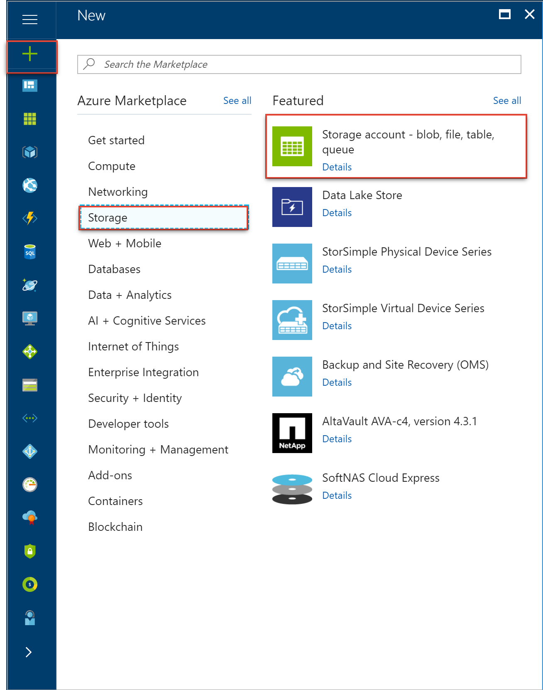

# Create a free storage account with the Azure portal

Azure free account gives you a free storage account with locally redundant storage (LRS) and a variety of flexible options for your storage needs. This tutorial covers the steps necessary to create a storage account for free.

## Log in to Azure ## 

Log in to the Azure portal at http://portal.azure.com.

## Create Storage Account ##

1. Sign in to the [Azure portal](https://portal.azure.com).

2. On the top left, select **New** -> **Storage** -> **Storage account**.

  

3. Enter a name for your storage account. See [Storage account endpoints](#storage-account-endpoints) for details about how the storage account name will be used to address your objects in Azure Storage.
   
   > [!NOTE]
   > Storage account names must be between 3 and 24 characters in length and may contain numbers and lowercase letters only.
   > 
   > Your storage account name must be unique within Azure. The Azure portal will indicate if the storage account name you select is already in use.
   > 
   > 
4. Specify the deployment model to be used: **Resource Manager**  
   

5. Select the type of storage account: **General purpose** or **Blob storage**. **General purpose** is the default.
   
    If **General purpose** was selected, then specify the performance tier: **Standard** or **Premium**. The default is **Standard**. For more details on standard and premium storage accounts, see [Introduction to Microsoft Azure Storage](storage-introduction.md) and [Premium Storage: High-Performance Storage for Azure Virtual Machine Workloads](storage-premium-storage.md).
   
    If **Blob Storage** was selected, then specify the access tier: **Hot** or **Cool**. The default is **Hot**. See [Azure Blob Storage: Cool and Hot tiers](../blobs/storage-blob-storage-tiers.md) for more details.
6. Select the replication option for the storage account: **LRS**. For more details on Azure Storage replication options, see [Azure Storage replication](storage-redundancy.md).

  

7. Select the subscription that you created 
when you signed up for free account.

8. Specify a new resource group or select an existing resource group. For more information on resource groups, see [Azure Resource Manager overview](../../azure-resource-manager/resource-group-overview.md).

9. Select the geographic location for your storage account. See [Azure Regions](https://azure.microsoft.com/regions/#services) for more information about what services are available in which region.

10. Click **Create** to create the storage account.
