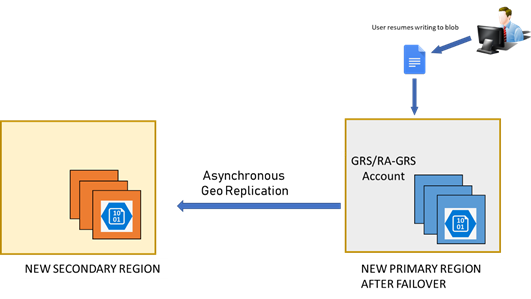

# Disaster recovery and failover in Azure Storage

Microsoft strives to ensure that Azure services are always available. However, unplanned service outages may occur from time to time in one or more regions. If your application requires resiliency, Microsoft recommends using geo-redundant storage, so that your data is replicated in a second region. Additionally, customers should have a disaster recovery plan in place for handling a regional service outage. A key part of a disaster recovery plan is preparing to fail over to the secondary region in the event that the primary region becomes unavailable. 

Azure Storage supports customer-managed forced failover (preview) for geo-redundant storage accounts. With forced failover, you can initiate the failover process for your storage account if the primary region becomes unavailable. The failover updates the secondary region to become the primary region for your storage account. Once the failover is complete, clients can begin writing to the new primary region.

This article describes to use geo-redundancy to how you can fail over to the secondary region in the event that the primary region becomes unavailable. and how to prepare your storage account for recovery with the least amount of customer impact.

## Choose the right redundancy option

All storage accounts are replicated for redundancy. Which redundancy option you choose for your account depends on the level of resiliency you need. For  protection against regional outages, choose geo-redundant storage, with or without the option of read access from the secondary region:  

**Geo-redundant storage (GRS)** replicates your data asynchronously in two geographic regions that are at least hundreds of miles apart. If the primary region suffers an outage, then the secondary region serves as a redundant source for your data. You can initiate a failover to transform the secondary region into the primary region.

**Read-access geo-redundant storage (RA-GRS)** provides geo-redundant storage with the additional benefit of read access to the secondary region. If an outage occurs in the primary region, applications configured for RA-GRS and designed for high availability can continue to read from the secondary region. Microsoft recommends RA-GRS for maximum resiliency for your applications.

Other Azure Storage redundancy options include zone-redundant storage (ZRS), which replicates your data across availability zones in a single region, and locally redundant storage (LRS), which replicates your data in a single data center in a single region. If your storage account is configured for ZRS or LRS, you can convert that account to use GRS or RA-GRS. Configuring your account for geo-redundant storage incurs additional costs. For more information, see [Azure Storage replication](storage-redundancy.md).

> [!WARNING]
> Cross-region data replication is an asynchronous process that involves a delay, so writes to the primary region that have not yet been replicated to the secondary region will be lost in the event of an outage. The **Last Sync Time** property indicates the last time that data from the primary region is guaranteed to be written to the secondary region. All writes prior to the **Last Sync Time** are also available on the secondary, while writes happening after the **Last Sync Time** may not yet have been written to the secondary. Use this property in the event of an outage to determine which writes have been replicated to the secondary region.

## Design for high availability

It's important to design your application for high availability from the start. Refer to these Azure resources for guidance in designing your application and planning for disaster recovery:

* [Designing resilient applications for Azure](https://docs.microsoft.com/azure/architecture/resiliency/): An overview of the key concepts for architecting highly available applications in Azure.
* [Availability checklist](https://docs.microsoft.com/azure/architecture/checklist/availability): A checklist for verifying that your application implements the best design practices for high availability.
* [Designing highly available applications using RA-GRS](storage-designing-ha-apps-with-ragrs.md): Design guidance for building applications to take advantage of RA-GRS.
* [Tutorial: Build a highly available application with Blob storage](../blobs/storage-create-geo-redundant-storage.md): A tutorial that shows how to build a highly available application that automatically switches between endpoints as failures and recoveries are simulated. 

## Track outages

Customers may subscribe to the [Azure Service Health Dashboard](https://azure.microsoft.com/status/) to track the health and status of Azure Storage and other Azure services.

Microsoft also recommends that you design your application to prepare for the possibility of write failures, and to expose these in a way that alerts you to the possibility of an outage in the primary region.

## Understand the failover process

Azure Storage supports customer-managed forced failover (preview) for geo-redundant storage accounts. With forced failover, you can initiate the failover process for your storage account if the primary region becomes unavailable.

If an outage or regional disaster renders the primary region unavailable, then a failover to the secondary region restores write access to your storage account.  

## Prepare for failover

### Failover options

In the event of an outage in the primary region, you have two options for failing over to the secondary region. These options are described in greater detail later in this article: 

- **Customer-managed forced failover (preview)**: Forced failover enables you to control when you fail over to the secondary region, rather than waiting for Microsoft to initiate the failover. When you force a failover to the secondary region, clients can immediately begin writing data to the secondary endpoint. Forced failover helps you to maintain high availability for your customers.

    Forced failover can result in data loss. Use forced failover only when the primary region becomes unavailable and your application requires high availability. Because you decide when to initiate a forced failover, you can force a failure to improve your RTO.   

- **Microsoft-managed failover**: By default, Microsoft attempts to restore service to the primary region in the event of an outage. If the primary region cannot be restored in a timely fashion, then a failover is initiated. In this case, no action on your part is required, but you must wait for the failover to complete.

    If your application does not require high availability, then for optimal RPO, allow Microsoft to manage the failover. 

### How a failover works

Under normal circumstances, a client writes data to an Azure Storage account in the primary region, and that data is replicated asynchronously to the secondary region. The following image shows the scenario when the primary region is available:

If the primary region becomes unavailable for any reason, the client is no longer able to write to the storage account, and data in the account is no longer replicated to the secondary region. The following image shows the scenario where the primary has become unavailable, but no recovery has happened yet:

The primary region fails over to the secondary region. Whether initiated by the customer or by Microsoft, the failover process involves updating the DNS entry provided by Azure Storage to swap the primary and secondary regions. The storage endpoint that was previously your secondary endpoint then becomes your primary endpoint, as shown in the following image:

 

While DNS changes are propagating, read access to the secondary region remains available for accounts configured with RA-GRS. Write access is restored for GRS and RA-GRS accounts once the DNS changes are complete and requests are being directed to the new primary region. 

> [!IMPORTANT]
> After the failover is complete, the storage account is configured to use LRS in the new primary region. To resume replication to the new secondary, configure the account to use RA-GRS or GRS again. Existing storage service endpoints for blobs, tables, queues, and files remain the same after the failover.
>
> Keep in mind that converting an LRS account to RA-GRS or GRS incurs a cost. This cost applies to updating the storage account in the new primary region to use RA-GRS or GRS after a failover.  

## Customer-managed forced failover (preview)

Forced failover gives customers the option to fail over their entire storage account to the secondary region if the primary region becomes unavailable for any reason. All data in the storage account, including blob, file, queue, and table data, is failed over to secondary region. 

If your application requires high availability, forced failover helps you maintain that availability in the event that the primary region becomes unavailable. You can quickly force a failover to the secondary to get your application up and running again.

### About the preview

Forced failover is available in preview for all customers using GRS or RA-GRS with Azure Resource Manager deployments. General-purpose v1, General-purpose v2, and Blob storage account types are supported. Forced failover is currently available in these regions:

- US-West 2
- US West Central

The preview is intended for non-production use only. Production service-level agreements (SLAs) are not currently available.

### Risk of data loss

Forced failover comes at the cost of possible data loss. It's important to understand the implications of initiating a forced failover.  

Because data is written asynchronously from the primary region to the secondary region, there is always a delay before the secondary region is fully up-to-date with write operations made to the primary region. If the primary region becomes unavailable, the most recent writes may not have been replicated to the secondary region.

When you force a failover, data in the primary region is lost as the secondary region becomes the new primary region. All data already replicated to the secondary is maintained. However, any data that has not yet been written to the secondary will be lost permanently. 

Proceed with a forced failover only if it's more important that your data be highly available than durable. If you cannot risk data loss, then do not perform a forced failover. Instead, wait for Microsoft to perform a managed failover to maximize your data recovery.

Use the **Last Sync Time** property to determine when your data was last synced to the secondary region. This value provides a timestamp for the last guaranteed replication of the primary data. You can use it to estimate the amount of data loss you may incur by initiating a forced failover.

### Microsoft-managed failover

If you choose not to force a failover, then Microsoft will trigger a failover if the primary region cannot be recovered in timely fashion. In deciding to fail over, Microsoft evaluates the trade-offs between recovery time objective (RTO) and recovery point objective (RPO) and attempts to maximize each based on the situation. For more information about RTO and RPO, see [Designing resilient applications for Azure](https://docs.microsoft.com/azure/architecture/resiliency/).

Before and during a Microsoft-managed failover, you won't have write access to your storage account. You can read from the secondary during the failover if your storage account is configured for RA-GRS. 

<TODO> After the failover happens - ??? why copy the data to another storage account? hasn't the secondary become the primary???

If you chose [Read-access geo-redundant storage (RA-GRS)](storage-redundancy-grs.md#read-access-geo-redundant-storage) (recommended) for your storage accounts, you will have read access to your data from the secondary region. You can use tools such as [AzCopy](storage-use-azcopy.md), [Azure PowerShell](storage-powershell-guide-full.md), and the [Azure Data Movement library](https://azure.microsoft.com/blog/introducing-azure-storage-data-movement-library-preview-2/) to copy data from the secondary region into another storage account in an unimpacted region, and then point your applications to that storage account for both read and write availability.

Microsoft-managed failovers are supported for all storage accounts configured for GRS or RA-GRS. Both Azure Resource Manager and Classic deployments are supported. General-purpose v1, General-purpose v2, and Blob storage account types are supported. Forced failover is currently available for storage accounts in all regions.

## Supported services and features 

<TODO>

These scenarios support forced failover of an Azure storage account

VM Scenarios

1.  Shutdown the VM

2.  Conduct failover

3.  After failover is completed, vhds are only copied so you will need to reattach the vhds and restart the VMs in the new primary region

4.  Any data in the temp disk will be lost

5.  Check on how user can query LST for page blobs

VNET – supported. No action required 
 
ADLS gen 2 – supported

Data used by the following features or services does not is not failed over. 

Azure Files Sync - not blocked, but need to reconfigure all settings after failover.
Large File Shares - blocked - keep LFS data in separate accounts - use a different account - maintain their own DR - whole account cannot be failed over (for preview)
Managed Disks – is not a supported scenario because Microsoft manages the storage account
Archive scenarios - use different account for archive 
Premium Block Blobs - GRS is not supported

## Additional best practices for resiliency
There are some recommended approaches to back up your storage data on a regular basis.

* VM Disks – Use the [Azure Backup service](https://azure.microsoft.com/services/backup/) to back up the VM disks used by your Azure virtual machines.
* Block blobs – Turn on [soft delete](../blobs/storage-blob-soft-delete.md) to protect against object-level deletions and overwrites, or copy the blobs to another storage account in another region using [AzCopy](storage-use-azcopy.md), [Azure PowerShell](storage-powershell-guide-full.md), or the [Azure Data Movement library](https://azure.microsoft.com/blog/introducing-azure-storage-data-movement-library-preview-2/).
* Tables – use [AzCopy](storage-use-azcopy.md) to export the table data into another storage account in another region.
* Files – use [AzCopy](storage-use-azcopy.md) or [Azure PowerShell](storage-powershell-guide-full.md) to copy your files to another storage account in another region.

For information about creating applications that take full advantage of the RA-GRS feature, please check out [Designing Highly Available Applications using RA-GRS Storage](../storage-designing-ha-apps-with-ragrs.md)

## See also

* [Azure Site Recovery service](https://azure.microsoft.com/services/site-recovery/)
* [Azure Backup service](https://azure.microsoft.com/services/backup/)
