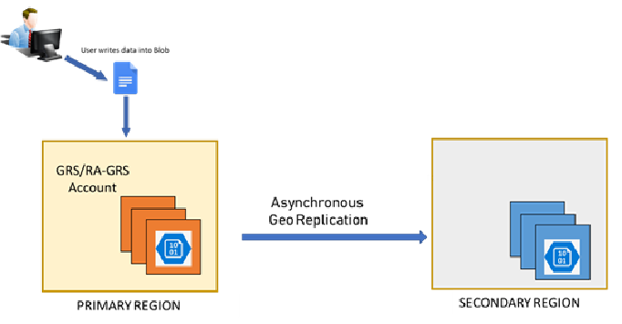
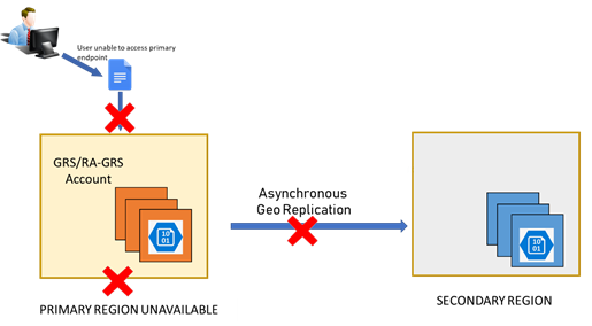
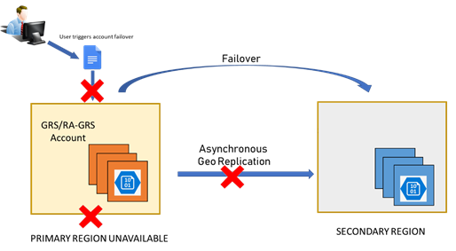

# Disaster recovery and storage account failover

Microsoft strives to ensure that Azure services are always available. However, unplanned service outages may occur. If your application requires resiliency, Microsoft recommends using geo-redundant storage, so that your data is copied to a second region. Additionally, customers should have a disaster recovery plan in place for handling a regional service outage. An important part of a disaster recovery plan is preparing to fail over to the secondary endpoint in the event that the primary endpoint becomes unavailable.

Azure Storage supports account failover for geo-redundant storage accounts. With account failover, you can initiate the failover process for your storage account if the primary endpoint becomes unavailable. The failover updates the secondary endpoint to become the primary endpoint for your storage account. Once the failover is complete, clients can begin writing to the new primary endpoint.

This article describes the concepts and process involved with an account failover and discusses how to prepare your storage account for recovery with the least amount of customer impact. To learn how to initiate an account failover in the Azure portal or PowerShell, see [Initiate an account failover](storage-initiate-account-failover.md).

## Choose the right redundancy option

Azure Storage maintains multiple copies of your storage account to ensure durability and high availability. Which redundancy option you choose for your account depends on the degree of resiliency you need. For protection against regional outages, configure your account for geo-redundant storage, with or without the option of read access from the secondary region:

**Geo-redundant storage (GRS) or geo-zone-redundant storage (GZRS)** copies your data asynchronously in two geographic regions that are at least hundreds of miles apart. If the primary region suffers an outage, then the secondary region serves as a redundant source for your data. You can initiate a failover to transform the secondary endpoint into the primary endpoint.

**Read-access geo-redundant storage (RA-GRS) or read-access geo-zone-redundant storage (RA-GZRS)** provides geo-redundant storage with the additional benefit of read access to the secondary endpoint. If an outage occurs in the primary endpoint, applications configured for read access to the secondary and designed for high availability can continue to read from the secondary endpoint. Microsoft recommends RA-GZRS for maximum availability and durability for your applications.

For more information about redundancy in Azure Storage, see [Azure Storage redundancy](storage-redundancy.md).

> [!WARNING]
> Geo-redundant storage carries a risk of data loss. Data is copied to the secondary region asynchronously, meaning there is a delay between when data  written to the primary region is written to the secondary region. In the event of an outage, write operations to the primary endpoint that have not yet been copied to the secondary endpoint will be lost.

## Design for high availability

It's important to design your application for high availability from the start. Refer to these Azure resources for guidance in designing your application and planning for disaster recovery:

- [Designing resilient applications for Azure](/azure/architecture/framework/resiliency/app-design): An overview of the key concepts for architecting highly available applications in Azure.
- [Resiliency checklist](/azure/architecture/checklist/resiliency-per-service): A checklist for verifying that your application implements the best design practices for high availability.
- [Use geo-redundancy to design highly available applications](geo-redundant-design.md): Design guidance for building applications to take advantage of geo-redundant storage.
- [Tutorial: Build a highly available application with Blob storage](../blobs/storage-create-geo-redundant-storage.md): A tutorial that shows how to build a highly available application that automatically switches between endpoints as failures and recoveries are simulated.

Additionally, keep in mind these best practices for maintaining high availability for your Azure Storage data:

- **Disks:** Use [Azure Backup](https://azure.microsoft.com/services/backup/) to back up the VM disks used by your Azure virtual machines. Also consider using [Azure Site Recovery](https://azure.microsoft.com/services/site-recovery/) to protect your VMs in the event of a regional disaster.
- **Block blobs:** Turn on [soft delete](../blobs/soft-delete-blob-overview.md) to protect against object-level deletions and overwrites, or copy block blobs to another storage account in a different region using [AzCopy](./storage-use-azcopy-v10.md), [Azure PowerShell](/powershell/module/az.storage/), or the [Azure Data Movement library](storage-use-data-movement-library.md).
- **Files:** Use [Azure Backup](../../backup/azure-file-share-backup-overview.md) to back up your file shares. Also enable [soft delete](../files/storage-files-prevent-file-share-deletion.md) to protect against accidental file share deletions. For geo-redundancy when GRS is not available, use [AzCopy](./storage-use-azcopy-v10.md) or [Azure PowerShell](/powershell/module/az.storage/) to copy your files to another storage account in a different region.
- **Tables:** use [AzCopy](./storage-use-azcopy-v10.md) to export table data to another storage account in a different region.

## Track outages

Customers may subscribe to the [Azure Service Health Dashboard](https://azure.microsoft.com/status/) to track the health and status of Azure Storage and other Azure services.

Microsoft also recommends that you design your application to prepare for the possibility of write failures. Your application should expose write failures in a way that alerts you to the possibility of an outage in the primary region.

## Understand the account failover process

Customer-managed account failover enables you to fail your entire storage account over to the secondary region if the primary becomes unavailable for any reason. When you force a failover to the secondary region, clients can begin writing data to the secondary endpoint after the failover is complete. The failover typically takes about an hour.

### How an account failover works

Under normal circumstances, a client writes data to an Azure Storage account in the primary region, and that data is copied asynchronously to the secondary region. The following image shows the scenario when the primary region is available:

If the primary endpoint becomes unavailable for any reason, the client is no longer able to write to the storage account. The following image shows the scenario where the primary has become unavailable, but no recovery has happened yet:

The customer initiates the account failover to the secondary endpoint. The failover process updates the DNS entry provided by Azure Storage so that the secondary endpoint becomes the new primary endpoint for your storage account, as shown in the following image:

Write access is restored for geo-redundant accounts once the DNS entry has been updated and requests are being directed to the new primary endpoint. Existing storage service endpoints for blobs, tables, queues, and files remain the same after the failover.

> [!IMPORTANT]
> After the failover is complete, the storage account is configured to be locally redundant in the new primary endpoint. To resume replication to the new secondary, configure the account for geo-redundancy again.
>
> Keep in mind that converting a locally redundant storage account to use geo-redundancy incurs both cost and time. For more information, see [Important implications of account failover](storage-initiate-account-failover.md#important-implications-of-account-failover).

### Anticipate data loss

> [!CAUTION]
> An account failover usually involves some data loss. It's important to understand the implications of account failover before initiating one.

Because data is written asynchronously from the primary region to the secondary region, there is always a delay before a write to the primary region is copied to the secondary region. If the primary region becomes unavailable, the most recent writes may not yet have been copied to the secondary region.

When you force a failover, all data in the primary region is lost as the secondary region becomes the new primary region. The new primary region is configured to be locally redundant after the failover.

All data already copied to the secondary is maintained when the failover happens. However, any data written to the primary that has not also been copied to the secondary is lost permanently.

#### Last sync time

The **Last Sync Time** property indicates the most recent time that data from the primary region is guaranteed to have been written to the secondary region. For accounts that have a hierarchical namespace, the same **Last Sync Time** property also applies to the metadata managed by the hierarchical namespace, including ACLs. All data and metadata written prior to the last sync time is available on the secondary, while data and metadata written after the last sync time may not have been written to the secondary, and may be lost. Use this property in the event of an outage to estimate the amount of data loss you may incur by initiating an account failover.

As a best practice, design your application so that you can use the last sync time to evaluate expected data loss. For example, if you are logging all write operations, then you can compare the time of your last write operations to the last sync time to determine which writes have not been synced to the secondary.

For more information about checking the **Last Sync Time** property, see [Check the Last Sync Time property for a storage account](last-sync-time-get.md).

#### File consistency for Azure Data Lake Storage Gen2

Replication for storage accounts with a hierarchical namespace enabled (Azure Data Lake Storage Gen2) occurs at the file level. This means that if an outage in the primary region occurs, it is possible that only some of the files in a container or directory might have successfully replicated to the secondary region. Consistency for all files in a container or directory is not guaranteed. Take this into account when creating your disaster recovery plan.

### Use caution when failing back to the original primary

After you fail over from the primary to the secondary region, your storage account is configured to be locally redundant in the new primary region. You can then configure the account in the new primary region for geo-redundancy. When the account is configured for geo-redundancy after a failover, the new primary region immediately begins copying data to the new secondary region, which was the primary before the original failover. However, it may take some time before existing data in the new primary is fully copied to the new secondary.

After the storage account is reconfigured for geo-redundancy, it's possible to initiate a failback from the new primary to the new secondary. In this case, the original primary region prior to the failover becomes the primary region again, and is configured to be either locally redundant or zone-redundant, depending on whether the original primary configuration was GRS/RA-GRS or GZRS/RA-GZRS. All data in the post-failover primary region (the original secondary) is lost during the failback. If most of the data in the storage account has not been copied to the new secondary before you fail back, you could suffer a major data loss.

To avoid a major data loss, check the value of the **Last Sync Time** property before failing back. Compare the last sync time to the last times that data was written to the new primary to evaluate expected data loss.

After a failback operation, you can configure the new primary region to be geo-redundant again. If the original primary was configured for LRS, you can configure it to be GRS or RA-GRS. If the original primary was configured for ZRS, you can configure it to be GZRS or RA-GZRS. For additional options, see [Change how a storage account is replicated](redundancy-migration.md).

## Initiate an account failover

You can initiate an account failover from the Azure portal, PowerShell, Azure CLI, or the Azure Storage resource provider API. For more information on how to initiate a failover, see [Initiate an account failover](storage-initiate-account-failover.md).

[!INCLUDE [updated-for-az](../../../includes/updated-for-az.md)]

## Supported storage account types

All geo-redundant offerings support [Microsoft-managed failover](#microsoft-managed-failover) in the event of a disaster in the primary region. In addition, some account types support customer-managed account failover, as shown in the following table:

| Type of failover | GRS/RA-GRS | GZRS/RA-GZRS |
|---|---|---|
| **Customer-managed failover** | General-purpose v2 accounts  General-purpose v1 accounts  Legacy Blob Storage accounts | General-purpose v2 accounts |
| **Microsoft-managed failover** | All account types | General-purpose v2 accounts |

> [!IMPORTANT]
>
> **Classic storage accounts**
>
> Customer-managed account failover is only supported for storage accounts deployed using the Azure Resource Manager (ARM) deployment model. The Azure Service Manager (ASM) deployment model, also known as *classic*, is not supported. To make classic storage accounts eligible for customer-managed account failover, they must first be [migrated to the ARM model](classic-account-migration-overview.md). Your storage account must be accessible to perform the upgrade, so the primary region cannot currently be in a failed state.
>
> In the event of a disaster that affects the primary region, Microsoft will manage the failover for classic storage accounts. For more information, see [Microsoft-managed failover](storage-disaster-recovery-guidance.md#microsoft-managed-failover).
>
> **Azure Data Lake Storage Gen2**
>
> Customer-managed account failover for accounts that have a hierarchical namespace (Azure Data Lake Storage Gen2) is currently in PREVIEW and only supported in the following regions:
>
> - (Asia Pacific) Central India
> - (Europe) Switzerland North
> - (Europe) Switzerland West
> - (North America) Canada Central
>
> To opt in to the preview, see [Set up preview features in Azure subscription](../../azure-resource-manager/management/preview-features.md) and specify `AllowHNSAccountFailover` as the feature name.
>
> See the [Supplemental Terms of Use for Microsoft Azure Previews](https://azure.microsoft.com/support/legal/preview-supplemental-terms/) for legal terms that apply to Azure features that are in beta, preview, or otherwise not yet released into general availability.

## Additional considerations

Review the additional considerations described in this section to understand how your applications and services may be affected when you force a failover.

### Storage account containing archived blobs

Storage accounts containing archived blobs support account failover. After failover is complete, all archived blobs need to be rehydrated to an online tier before the account can be configured for geo-redundancy.

### Storage resource provider

Microsoft provides two REST APIs for working with Azure Storage resources. These APIs form the basis of all actions you can perform against Azure Storage. The Azure Storage REST API enables you to work with data in your storage account, including blob, queue, file, and table data. The Azure Storage resource provider REST API enables you to manage the storage account and related resources.

After a failover is complete, clients can again read and write Azure Storage data in the new primary region. However, the Azure Storage resource provider does not fail over, so resource management operations must still take place in the primary region. If the primary region is unavailable, you will not be able to perform management operations on the storage account.

Because the Azure Storage resource provider does not fail over, the [Location](/dotnet/api/microsoft.azure.management.storage.models.trackedresource.location) property will return the original primary location after the failover is complete.

### Azure virtual machines

Azure virtual machines (VMs) do not fail over as part of an account failover. If the primary region becomes unavailable, and you fail over to the secondary region, then you will need to recreate any VMs after the failover. Also, there is a potential data loss associated with the account failover. Microsoft recommends the following [high availability](../../virtual-machines/availability.md) and [disaster recovery](../../virtual-machines/backup-recovery.md) guidance specific to virtual machines in Azure.

### Azure unmanaged disks

As a best practice, Microsoft recommends converting unmanaged disks to managed disks. However, if you need to fail over an account that contains unmanaged disks attached to Azure VMs, you will need to shut down the VM before initiating the failover.

Unmanaged disks are stored as page blobs in Azure Storage. When a VM is running in Azure, any unmanaged disks attached to the VM are leased. An account failover cannot proceed when there is a lease on a blob. To perform the failover, follow these steps:

1. Before you begin, note the names of any unmanaged disks, their logical unit numbers (LUN), and the VM to which they are attached. Doing so will make it easier to reattach the disks after the failover.
2. Shut down the VM.
3. Delete the VM, but retain the VHD files for the unmanaged disks. Note the time at which you deleted the VM.
4. Wait until the **Last Sync Time** has updated, and is later than the time at which you deleted the VM. This step is important, because if the secondary endpoint has not been fully updated with the VHD files when the failover occurs, then the VM may not function properly in the new primary region.
5. Initiate the account failover.
6. Wait until the account failover is complete and the secondary region has become the new primary region.
7. Create a VM in the new primary region and reattach the VHDs.
8. Start the new VM.

Keep in mind that any data stored in a temporary disk is lost when the VM is shut down.

### Change feed and blob data inconsistencies

Storage account failover of geo-redundant storage accounts with [the change feed](../blobs/storage-blob-change-feed.md) enabled may result in inconsistencies between the change feed logs and the blob data and/or metadata. Such inconsistencies can result from the asynchronous nature of both updates to the change logs and the replication of blob data from the primary to the secondary region. The only situation in which inconsistencies would not be expected is when all of the current log records have been successfully flushed to the log files and all of the storage data has been successfully replicated from the primary to the secondary region.

For more information about how to determine potential data loss during storage account failover due to asynchronous replication, see [Anticipate data loss](#anticipate-data-loss). For information about how change feed works see [How the change feed works](../blobs/storage-blob-change-feed.md#how-the-change-feed-works).

Keep in mind that other storage account features require the change feed to be enabled such as [operational backup of Azure Blob Storage](../../backup/blob-backup-support-matrix.md#limitations), [Object replication](../blobs/object-replication-overview.md) and [Point-in-time restore for block blobs](../blobs/point-in-time-restore-overview.md).

### Point-in-time restore

Customer-managed failover is supported for general-purpose v2 standard tier storage accounts that include block blobs. However, performing a customer-managed failover on a storage account resets the earliest possible restore point for the account. Data for [Point-in-time restore for block blobs](../blobs/point-in-time-restore-overview.md) is only consistent up to the failover completion time. As a result, you can only restore block blobs to a point in time no earlier than the failover completion time. You can check the failover completion time in the redundancy tab of your storage account in the Azure Portal.

For example, suppose you have set the retention period to 30 days. If more than 30 days have elapsed since the failover, then you can restore to any point within that 30 days. However, if fewer than 30 days have elapsed since the failover, then you can't restore to a point prior to the failover, regardless of the retention period. For example, if it's been 10 days since the failover, then the earliest possible restore point is 10 days in the past, not 30 days in the past.

## Unsupported features and services

The following features and services are not supported for account failover:

- Azure File Sync does not support storage account failover. Storage accounts containing Azure file shares being used as cloud endpoints in Azure File Sync should not be failed over. Doing so will cause sync to stop working and may also cause unexpected data loss in the case of newly tiered files.
- A storage account containing premium block blobs cannot be failed over. Storage accounts that support premium block blobs do not currently support geo-redundancy.
- A storage account containing any [WORM immutability policy](../blobs/immutable-storage-overview.md) enabled containers cannot be failed over. Unlocked/locked time-based retention or legal hold policies prevent failover in order to maintain compliance.
- Customer-managed failover isn't supported for either the source or the destination account in an [object replication policy](../blobs/object-replication-overview.md).
- To failover an account with SSH File Transfer Protocol (SFTP) enabled, you must first [disable SFTP for the account](../blobs/secure-file-transfer-protocol-support-how-to.md#disable-sftp-support). If you want to resume using SFTP after the failover is complete, simply [re-enable it](../blobs/secure-file-transfer-protocol-support-how-to.md#enable-sftp-support).
- Network File System (NFS) 3.0 (NFSv3) is not supported for storage account failover. You cannot create a storage account configured for global-redundancy with NFSv3 enabled.

## Copying data as an alternative to failover

If your storage account is configured for read access to the secondary, then you can design your application to read from the secondary endpoint. If you prefer not to fail over in the event of an outage in the primary region, you can use tools such as [AzCopy](./storage-use-azcopy-v10.md), [Azure PowerShell](/powershell/module/az.storage/), or the [Azure Data Movement library](../common/storage-use-data-movement-library.md) to copy data from your storage account in the secondary region to another storage account in an unaffected region. You can then point your applications to that storage account for both read and write availability.

> [!CAUTION]
> An account failover should not be used as part of your data migration strategy.

## Microsoft-managed failover

In extreme circumstances where the original primary region is deemed unrecoverable within a reasonable amount of time due to a major disaster, Microsoft may initiate a regional failover. In this case, no action on your part is required. Until the Microsoft-managed failover has completed, you won't have write access to your storage account. Your applications can read from the secondary region if your storage account is configured for RA-GRS or RA-GZRS.

> [!NOTE]
> A Microsoft-managed failover would be initiated for an entire physical unit, such as a region, datacenter or scale unit. It cannot be initiated for individual storage accounts, subscriptions, or tenants. For the ability to selectively failover your individual storage accounts, use customer-managed account failover described previously in this article.

## See also

- [Use geo-redundancy to design highly available applications](geo-redundant-design.md)
- [Initiate an account failover](storage-initiate-account-failover.md)
- [Check the Last Sync Time property for a storage account](last-sync-time-get.md)
- [Tutorial: Build a highly available application with Blob storage](../blobs/storage-create-geo-redundant-storage.md)
