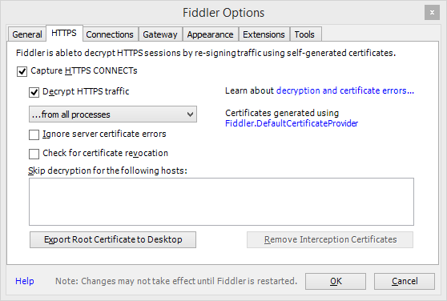
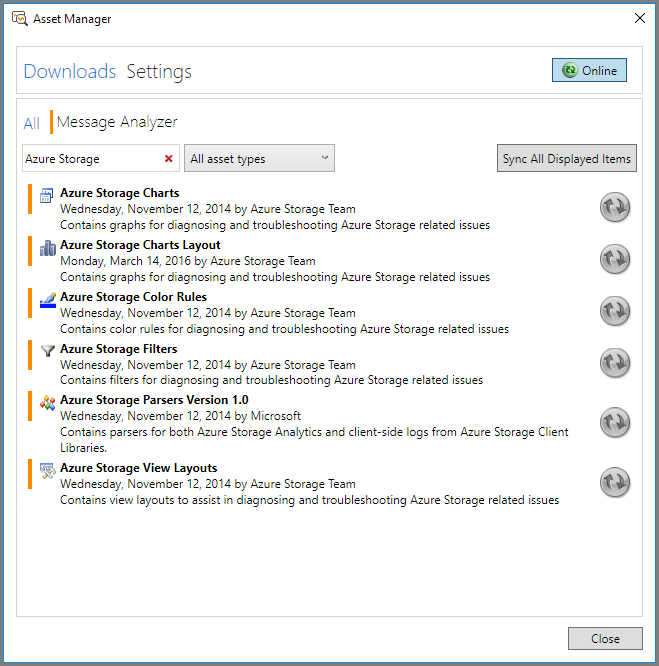
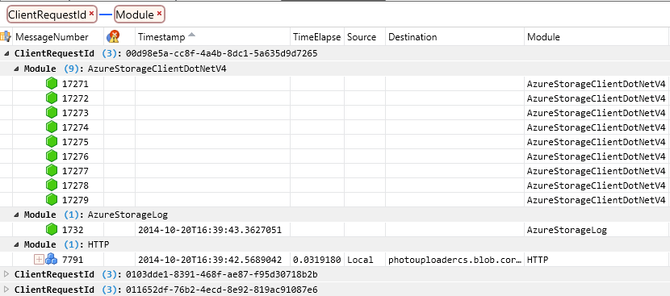
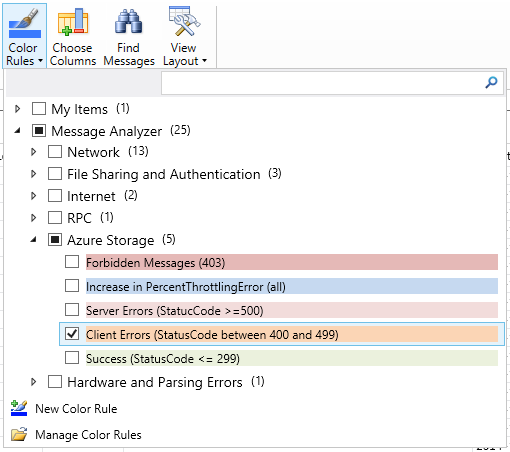
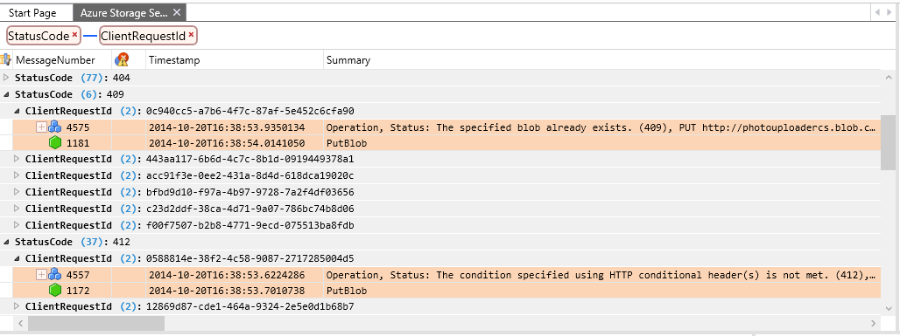
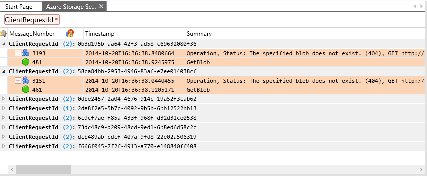
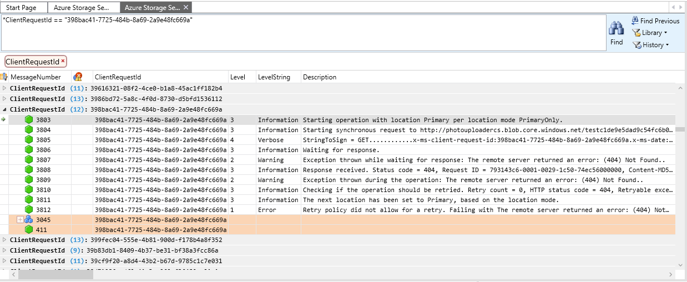

# End-to-end troubleshooting using Azure Storage metrics and logging, AzCopy, and Message Analyzer

[!INCLUDE [storage-selector-portal-e2e-troubleshooting](../../../includes/storage-selector-portal-e2e-troubleshooting.md)]

Diagnosing and troubleshooting is a key skill for building and supporting client applications with Microsoft Azure Storage. Due to the distributed nature of an Azure application, diagnosing and troubleshooting errors and performance issues may be more complex than in traditional environments.

In this tutorial, we demonstrate how to identify certain errors that may affect performance, and troubleshoot those errors from end-to-end using tools provided by Microsoft and Azure Storage, in order to optimize the client application.

This tutorial provides a hands-on exploration of an end-to-end troubleshooting scenario. For an in-depth conceptual guide to troubleshooting Azure storage applications, see [Monitor, diagnose, and troubleshoot Microsoft Azure Storage](storage-monitoring-diagnosing-troubleshooting.md).

## Tools for troubleshooting Azure Storage applications

To troubleshoot client applications using Microsoft Azure Storage, you can use a combination of tools to determine when an issue has occurred and what the cause of the problem may be. These tools include:

* **Azure Storage Analytics**. [Azure Storage Analytics](/rest/api/storageservices/Storage-Analytics) provides metrics and logging for Azure Storage.

  * **Storage metrics** tracks transaction metrics and capacity metrics for your storage account. Using metrics, you can determine how your application is performing according to a variety of different measures. See [Storage Analytics Metrics Table Schema](/rest/api/storageservices/Storage-Analytics-Metrics-Table-Schema) for more information about the types of metrics tracked by Storage Analytics.
  * **Storage logging** logs each request to the Azure Storage services to a server-side log. The log tracks detailed data for each request, including the operation performed, the status of the operation, and latency information. See [Storage Analytics Log Format](/rest/api/storageservices/Storage-Analytics-Log-Format) for more information about the request and response data that is written to the logs by Storage Analytics.

* **Azure portal**. You can configure metrics and logging for your storage account in the [Azure portal](https://portal.azure.com). You can also view charts and graphs that show how your application is performing over time, and configure alerts to notify you if your application performs differently than expected for a specified metric.

    See [Monitor a storage account in the Azure portal](storage-monitor-storage-account.md) for information about configuring monitoring in the Azure portal.
* **AzCopy**. Server logs for Azure Storage are stored as blobs, so you can use AzCopy to copy the log blobs to a local directory for analysis using Microsoft Message Analyzer. See [Transfer data with the AzCopy Command-Line Utility](storage-use-azcopy.md) for more information about AzCopy.
* **Microsoft Message Analyzer**. Message Analyzer is a tool that consumes log files and displays log data in a visual format that makes it easy to filter, search, and group log data into useful sets that you can use to analyze errors and performance issues. See [Microsoft Message Analyzer Operating Guide](https://technet.microsoft.com/library/jj649776.aspx) for more information about Message Analyzer.

## About the sample scenario

For this tutorial, we'll examine a scenario where Azure Storage metrics indicates a low percent success rate for an application that calls Azure storage. The low percent success rate metric (shown as **PercentSuccess** in the [Azure portal](https://portal.azure.com) and in the metrics tables) tracks operations that succeed, but that return an HTTP status code that is greater than 299. In the server-side storage log files, these operations are recorded with a transaction status of **ClientOtherErrors**. For more details about the low percent success metric, see [Metrics show low PercentSuccess or analytics log entries have operations with transaction status of ClientOtherErrors](storage-monitoring-diagnosing-troubleshooting.md#metrics-show-low-percent-success).

Azure Storage operations may return HTTP status codes greater than 299 as part of their normal functionality. But these errors in some cases indicate that you may be able to optimize your client application for improved performance.

In this scenario, we'll consider a low percent success rate to be anything below 100%. You can choose a different metric level, however, according to your needs. We recommend that during testing of your application, you establish a baseline tolerance for your key performance metrics. For example, you might determine, based on testing, that your application should have a consistent percent success rate of 90%, or 85%. If your metrics data shows that the application is deviating from that number, then you can investigate what may be causing the increase.

For our sample scenario, once we've established that the percent success rate metric is below 100%, we will examine the logs to find the errors that correlate to the metrics, and use them to figure out what is causing the lower percent success rate. We'll look specifically at errors in the 400 range. Then we'll more closely investigate 404 (Not Found) errors.

### Some causes of 400-range errors

The examples below shows a sampling of some 400-range errors for requests against Azure Blob Storage, and their possible causes. Any of these errors, as well as errors in the 300 range and the 500 range, can contribute to a low percent success rate.

Note that the lists below are far from complete. See [Status and Error Codes](https://msdn.microsoft.com/library/azure/dd179382.aspx) on MSDN for details about general Azure Storage errors and about errors specific to each of the storage services.

#### Status Code 404 (Not Found) Examples

Occurs when a read operation against a container or blob fails because the blob or container is not found.

* Occurs if a container or blob has been deleted by another client before this request.
* Occurs if you are using an API call that creates the container or blob after checking whether it exists. The CreateIfNotExists APIs make a HEAD call first to check for the existence of the container or blob; if it does not exist, a 404 error is returned, and then a second PUT call is made to write the container or blob.

#### Status Code 409 (Conflict) Examples

* Occurs if you use a Create API to create a new container or blob, without checking for existence first, and a container or blob with that name already exists.
* Occurs if a container is being deleted, and you attempt to create a new container with the same name before the deletion operation is complete.
* Occurs if you specify a lease on a container or blob, and there is already a lease present.

#### Status Code 412 (Precondition Failed) Examples

* Occurs when the condition specified by a conditional header has not been met.
* Occurs when the lease ID specified does not match the lease ID on the container or blob.

## Generate log files for analysis

In this tutorial, we'll use Message Analyzer to work with three different types of log files, although you could choose to work with any one of these:

* The **server log**, which is created when you enable Azure Storage logging. The server log contains data about each operation called against one of the Azure Storage services - blob, queue, table, and file. The server log indicates which operation was called and what status code was returned, as well as other details about the request and response.
* The **.NET client log**, which is created when you enable client-side logging from within your .NET application. The client log includes detailed information about how the client prepares the request and receives and processes the response.
* The **HTTP network trace log**, which collects data on HTTP/HTTPS request and response data, including for operations against Azure Storage. In this tutorial, we'll generate the network trace via Message Analyzer.

### Configure server-side logging and metrics

First, we'll need to configure Azure Storage logging and metrics, so that we have data from the service side to analyze. You can configure logging and metrics in a variety of ways - via the [Azure portal](https://portal.azure.com), by using PowerShell, or programmatically. See [Enable metrics](storage-analytics-metrics.md#enable-metrics-using-the-azure-portal) and [Enable logging](storage-analytics-logging.md#enable-storage-logging) for details about configuring logging and metrics.

### Configure .NET client-side logging

To configure client-side logging for a .NET application, enable .NET diagnostics in the application's configuration file (web.config or app.config). See [Client-side Logging with the .NET Storage Client Library](https://msdn.microsoft.com/library/azure/dn782839.aspx) and [Client-side Logging with the Microsoft Azure Storage SDK for Java](https://msdn.microsoft.com/library/azure/dn782844.aspx) on MSDN for details.

The client-side log includes detailed information about how the client prepares the request and receives and processes the response.

The Storage Client Library stores client-side log data in the location specified in the application's configuration file (web.config or app.config).

### Collect a network trace

You can use Message Analyzer to collect an HTTP/HTTPS network trace while your client application is running. Message Analyzer uses [Fiddler](https://www.telerik.com/fiddler) on the back end. Before you collect the network trace, we recommend that you configure Fiddler to record unencrypted HTTPS traffic:

1. Install [Fiddler](https://www.telerik.com/download/fiddler).
2. Launch Fiddler.
3. Select **Tools | Fiddler Options**.
4. In the Options dialog, ensure that **Capture HTTPS CONNECTs** and **Decrypt HTTPS Traffic** are both selected, as shown below.



For the tutorial, collect and save a network trace first in Message Analyzer, then create an analysis session to analyze the trace and the logs. To collect a network trace in Message Analyzer:

1. In Message Analyzer, select **File | Quick Trace | Unencrypted HTTPS**.
2. The trace will begin immediately. Select **Stop** to stop the trace so that we can configure it to trace storage traffic only.
3. Select **Edit** to edit the tracing session.
4. Select the **Configure** link to the right of the **Microsoft-Pef-WebProxy** ETW provider.
5. In the **Advanced Settings** dialog, click the **Provider** tab.
6. In the **Hostname Filter** field, specify your storage endpoints, separated by spaces. For example, you can specify your endpoints as follows; change `storagesample` to the name of your storage account:

    `storagesample.blob.core.windows.net storagesample.queue.core.windows.net storagesample.table.core.windows.net`

7. Exit the dialog, and click **Restart** to begin collecting the trace with the hostname filter in place, so that only Azure Storage network traffic is included in the trace.

> [!NOTE]
> After you have finished collecting your network trace, we strongly recommend that you revert the settings that you may have changed in Fiddler to decrypt HTTPS traffic. In the Fiddler Options dialog, deselect the **Capture HTTPS CONNECTs** and **Decrypt HTTPS Traffic** checkboxes.

See [Using the Network Tracing Features](https://technet.microsoft.com/library/jj674819.aspx) on Technet for more details.

## Review metrics data in the Azure portal

Once your application has been running for a period of time, you can review the metrics charts that appear in the [Azure portal](https://portal.azure.com) to observe how your service has been performing.

First, navigate to your storage account in the Azure portal. By default, a monitoring chart with the **Success percentage** metric is displayed on the account blade. If you've previously modified the chart to display different metrics, add the **Success percentage** metric.

You'll now see **Success percentage** in the monitoring chart, along with any other metrics you may have added. In the scenario we'll investigate next by analyzing the logs in Message Analyzer, the percent success rate is somewhat below 100%.

For more details on adding and customizing metrics charts, see [Customize metrics charts](storage-monitor-storage-account.md#customize-metrics-charts).

> [!NOTE]
> It may take some time for your metrics data to appear in the Azure portal after you enable storage metrics. This is because hourly metrics for the previous hour are not displayed in the Azure portal until the current hour has elapsed. Also, minute metrics are not currently displayed in the Azure portal. So depending on when you enable metrics, it may take up to two hours to see metrics data.
>
>

## Use AzCopy to copy server logs to a local directory

Azure Storage writes server log data to blobs, while metrics are written to tables. Log blobs are available in the well-known `$logs` container for your storage account. Log blobs are named hierarchically by year, month, day, and hour, so that you can easily locate the range of time you wish to investigate. For example, in the `storagesample` account, the container for the log blobs for 01/02/2015, from 8-9 am, is `https://storagesample.blob.core.windows.net/$logs/blob/2015/01/08/0800`. The individual blobs in this container are named sequentially, beginning with `000000.log`.

You can use the AzCopy command-line tool to download these server-side log files to a location of your choice on your local machine. For example, you can use the following command to download the log files for blob operations that took place on January 2, 2015 to the folder `C:\Temp\Logs\Server`; replace `<storageaccountname>` with the name of your storage account:

```azcopy
azcopy copy 'http://<storageaccountname>.blob.core.windows.net/$logs/blob/2015/01/02' 'C:\Temp\Logs\Server'  --recursive
```

AzCopy is available for download on the [Azure Downloads](https://azure.microsoft.com/downloads/) page. For details about using AzCopy, see [Transfer data with the AzCopy Command-Line Utility](storage-use-azcopy.md).

For additional information about downloading server-side logs, see [Download Storage Logging log data](https://msdn.microsoft.com/library/azure/dn782840.aspx#DownloadingStorageLogginglogdata).

## Use Microsoft Message Analyzer to analyze log data

Microsoft Message Analyzer is a tool for capturing, displaying, and analyzing protocol messaging traffic, events, and other system or application messages in troubleshooting and diagnostic scenarios. Message Analyzer also enables you to load, aggregate, and analyze data from log and saved trace files. For more information about Message Analyzer, see [Microsoft Message Analyzer Operating Guide](https://technet.microsoft.com/library/jj649776.aspx).

Message Analyzer includes assets for Azure Storage that help you to analyze server, client, and network logs. In this section, we'll discuss how to use those tools to address the issue of low percent success in the storage logs.

### Download and install Message Analyzer and the Azure Storage Assets

1. Download [Message Analyzer](https://www.microsoft.com/download/details.aspx?id=44226) from the Microsoft Download Center, and run the installer.
2. Launch Message Analyzer.
3. From the **Tools** menu, select **Asset Manager**. In the **Asset Manager** dialog, select **Downloads**, then filter on **Azure Storage**. You will see the Azure Storage Assets, as shown in the picture below.
4. Click **Sync All Displayed Items** to install the Azure Storage Assets. The available assets include:
   * **Azure Storage Color Rules:** Azure Storage color rules enable you to define special filters that use color, text, and font styles to highlight messages that contain specific information in a trace.
   * **Azure Storage Charts:** Azure Storage charts are predefined charts that graph server log data. Note that to use Azure Storage charts at this time, you may only load the server log into the Analysis Grid.
   * **Azure Storage Parsers:** The Azure Storage parsers parse the Azure Storage client, server, and HTTP logs in order to display them in the Analysis Grid.
   * **Azure Storage Filters:** Azure Storage filters are predefined criteria that you can use to query your data in the Analysis Grid.
   * **Azure Storage View Layouts:** Azure Storage view layouts are predefined column layouts and groupings in the Analysis Grid.
5. Restart Message Analyzer after you've installed the assets.



> [!NOTE]
> Install all of the Azure Storage assets shown for the purposes of this tutorial.
>
>

### Import your log files into Message Analyzer

You can import all of your saved log files (server-side, client-side, and network) into a single session in Microsoft Message Analyzer for analysis.

1. On the **File** menu in Microsoft Message Analyzer, click **New Session**, and then click **Blank Session**. In the **New Session** dialog, enter a name for your analysis session. In the **Session Details** panel, click on the **Files** button.
2. To load the network trace data generated by Message Analyzer, click on **Add Files**, browse to the location where you saved your .matp file from your web tracing session, select the .matp file, and click **Open**.
3. To load the server-side log data, click on **Add Files**, browse to the location where you downloaded your server-side logs, select the log files for the time range you want to analyze, and click **Open**. Then, in the **Session Details** panel, set the **Text Log Configuration** drop-down for each server-side log file to **AzureStorageLog** to ensure that Microsoft Message Analyzer can parse the log file correctly.
4. To load the client-side log data, click on **Add Files**, browse to the location where you saved your client-side logs, select the log files you want to analyze, and click **Open**. Then, in the **Session Details** panel, set the **Text Log Configuration** drop-down for each client-side log file to **AzureStorageClientDotNetV4** to ensure that Microsoft Message Analyzer can parse the log file correctly.
5. Click **Start** in the **New Session** dialog to load and parse the log data. The log data displays in the Message Analyzer Analysis Grid.

The picture below shows an example session configured with server, client, and network trace log files.


Note that Message Analyzer loads log files into memory. If you have a large set of log data, you will want to filter it in order to get the best performance from Message Analyzer.

First, determine the time frame that you are interested in reviewing, and keep this time frame as small as possible. In many cases you will want to review a period of minutes or hours at most. Import the smallest set of logs that can meet your needs.

If you still have a large amount of log data, then you may want to specify a session filter to filter your log data before you load it. In the **Session Filter** box, select the **Library** button to choose a predefined filter; for example, choose **Global Time Filter I** from the Azure Storage filters to filter on a time interval. You can then edit the filter criteria to specify the starting and ending timestamp for the interval you want to see. You can also filter on a particular status code; for example, you can choose to load only log entries where the status code is 404.

For more information about importing log data into Microsoft Message Analyzer, see [Retrieving Message Data](https://technet.microsoft.com/library/dn772437.aspx) on TechNet.

### Use the client request ID to correlate log file data

The Azure Storage Client Library automatically generates a unique client request ID for every request. This value is written to the client log, the server log, and the network trace, so you can use it to correlate data across all three logs within Message Analyzer. See [Client request ID](storage-monitoring-diagnosing-troubleshooting.md#client-request-id) for additional information about the client request ID.

The sections below describe how to use pre-configured and custom layout views to correlate and group data based on the client request ID.

### Select a view layout to display in the Analysis Grid

The Storage Assets for Message Analyzer include Azure Storage View Layouts, which are pre-configured views that you can use to display your data with useful groupings and columns for different scenarios. You can also create custom view layouts and save them for reuse.

The picture below shows the **View Layout** menu, available by selecting **View Layout** from the toolbar ribbon. The view layouts for Azure Storage are grouped under the **Azure Storage** node in the menu. You can search for `Azure Storage` in the search box to filter on Azure Storage view layouts only. You can also select the star next to a view layout to make it a favorite and display it at the top of the menu.


To begin with, select **Grouped by ClientRequestID and Module**. This view layout groups log data from all three logs first by client request ID, then by source log file (or **Module** in Message Analyzer). With this view, you can drill down into a particular client request ID, and see data from all three log files for that client request ID.

The picture below shows this layout view applied to the sample log data, with a subset of columns displayed. You can see that for a particular client request ID, the Analysis Grid displays data from the client log, server log, and network trace.



> [!NOTE]
> Different log files have different columns, so when data from multiple log files is displayed in the Analysis Grid, some columns may not contain any data for a given row. For example, in the picture above, the
> client log rows do not show any data for the **Timestamp**, **TimeElapsed**, **Source**, and **Destination** columns, because these columns do not exist in the client log, but do exist in the network trace. Similarly, the **Timestamp** column displays timestamp data from the server log, but no data is displayed for the **TimeElapsed**, **Source**, and **Destination** columns, which are not part of the server log.
>
>

In addition to using the Azure Storage view layouts, you can also define and save your own view layouts. You can select other desired fields for grouping data and save the grouping as part of your custom layout as well.

### Apply color rules to the Analysis Grid

The Storage Assets also include color rules, which offer a visual means to identify different types of errors in the Analysis Grid. The predefined color rules apply to HTTP errors, so they appear only for the server log and network trace.

To apply color rules, select **Color Rules** from the toolbar ribbon. You'll see the Azure Storage color rules in the menu. For the tutorial, select **Client Errors (StatusCode between 400 and 499)**, as shown in the picture below.



In addition to using the Azure Storage color rules, you can also define and save your own color rules.

### Group and filter log data to find 400-range errors

Next, we'll group and filter the log data to find all errors in the 400 range.

1. Locate the **StatusCode** column in the Analysis Grid, right-click the column heading, and select **Group**.
2. Next, group on the **ClientRequestId** column. You'll see that the data in the Analysis Grid is now organized by status code and by client request ID.
3. Display the View Filter tool window if it is not already displayed. On the toolbar ribbon, select **Tool Windows**, then **View Filter**.
4. To filter the log data to display only 400-range errors, add the following filter criteria to the **View Filter** window, and click **Apply**:

    `(AzureStorageLog.StatusCode >= 400 && AzureStorageLog.StatusCode <=499) || (HTTP.StatusCode >= 400 && HTTP.StatusCode <= 499)`

The picture below shows the results of this grouping and filter. Expanding the **ClientRequestID** field beneath the grouping for status code 409, for example, shows an operation that resulted in that status code.



After applying this filter, you'll see that rows from the client log are excluded, as the client log does not include a **StatusCode** column. To begin with, we'll review the server and network trace logs to locate 404 errors, and then we'll return to the client log to examine the client operations that led to them.

> [!NOTE]
> You can filter on the **StatusCode** column and still display data from all three logs, including the client log, if you add an expression to the filter that includes log entries where the status code is null. To construct this filter expression, use:
>
> <code>&#42;StatusCode >= 400 or !&#42;StatusCode</code>
>
> This filter returns all rows from the client log and only rows from the server log and HTTP log where the status code is greater than 400. If you apply it to the view layout grouped by client request ID and module, you can search or scroll through the log entries to find ones where all three logs are represented.

### Filter log data to find 404 errors

The Storage Assets include predefined filters that you can use to narrow log data to find the errors or trends you are looking for. Next, we'll apply two predefined filters: one that filters the server and network trace logs for 404 errors, and one that filters the data on a specified time range.

1. Display the View Filter tool window if it is not already displayed. On the toolbar ribbon, select **Tool Windows**, then **View Filter**.
2. In the View Filter window, select **Library**, and search on `Azure Storage` to find the Azure Storage filters. Select the filter for **404 (Not Found) messages in all logs**.
3. Display the **Library** menu again, and locate and select the **Global Time Filter**.
4. Edit the timestamps shown in the filter to the range you wish to view. This will help to narrow the range of data to analyze.
5. Your filter should appear similar to the example below. Click **Apply** to apply the filter to the Analysis Grid.

    `((AzureStorageLog.StatusCode == 404 || HTTP.StatusCode == 404)) And
    (#Timestamp >= 2014-10-20T16:36:38 and #Timestamp <= 2014-10-20T16:36:39)`

    

### Analyze your log data

Now that you have grouped and filtered your data, you can examine the details of individual requests that generated 404 errors. In the current view layout, the data is grouped by client request ID, then by log source. Since we are filtering on requests where the StatusCode field contains 404, we'll see only the server and network trace data, not the client log data.

The picture below shows a specific request where a Get Blob operation yielded a 404 because the blob did not exist. Note that some columns have been removed from the standard view in order to display the relevant data.


Next, we'll correlate this client request ID with the client log data to see what actions the client was taking when the error happened. You can display a new Analysis Grid view for this session to view the client log data, which opens in a second tab:

1. First, copy the value of the **ClientRequestId** field to the clipboard. You can do this by selecting either row, locating the **ClientRequestId** field, right-clicking on the data value, and choosing **Copy 'ClientRequestId'**.
2. On the toolbar ribbon, select **New Viewer**, then select **Analysis Grid** to open a new tab. The new tab shows all data in your log files, without grouping, filtering, or color rules.
3. On the toolbar ribbon, select **View Layout**, then select **All .NET Client Columns** under the **Azure Storage** section. This view layout shows data from the client log as well as the server and network trace logs. By default it is sorted on the **MessageNumber** column.
4. Next, search the client log for the client request ID. On the toolbar ribbon, select **Find Messages**, then specify a custom filter on the client request ID in the **Find** field. Use this syntax for the filter, specifying your own client request ID:

    `*ClientRequestId == "398bac41-7725-484b-8a69-2a9e48fc669a"`

Message Analyzer locates and selects the first log entry where the search criteria matches the client request ID. In the client log, there are several entries for each client request ID, so you may want to group them on the **ClientRequestId** field to make it easier to see them all together. The picture below shows all of the messages in the client log for the specified client request ID.



Using the data shown in the view layouts in these two tabs, you can analyze the request data to determine what may have caused the error. You can also look at requests that preceded this one to see if a previous event may have led to the 404 error. For example, you can review the client log entries preceding this client request ID to determine whether the blob may have been deleted, or if the error was due to the client application calling a CreateIfNotExists API on a container or blob. In the client log, you can find the blob's address in the **Description** field; in the server and network trace logs, this information appears in the **Summary** field.

Once you know the address of the blob that yielded the 404 error, you can investigate further. If you search the log entries for other messages associated with operations on the same blob, you can check whether the client previously deleted the entity.

## Analyze other types of storage errors

Now that you are familiar with using Message Analyzer to analyze your log data, you can analyze other types of errors using view layouts, color rules, and searching/filtering. The tables below lists some issues you may encounter and the filter criteria you can use to locate them. For more information on constructing filters and the Message Analyzer filtering language, see [Filtering Message Data](https://technet.microsoft.com/library/jj819365.aspx).

| To Investigate… | Use Filter Expression… | Expression Applies to Log (Client, Server,   Network, All) |
| --- | --- | --- |
| Unexpected delays in message delivery on a queue |AzureStorageClientDotNetV4.Description   contains "Retrying failed operation." |Client |
| HTTP Increase in PercentThrottlingError |HTTP.Response.StatusCode   == 500 &#124;&#124; HTTP.Response.StatusCode == 503 |Network |
| Increase in PercentTimeoutError |HTTP.Response.StatusCode   == 500 |Network |
| Increase in PercentTimeoutError (all) |*StatusCode   == 500 |All |
| Increase in PercentNetworkError |AzureStorageClientDotNetV4.EventLogEntry.Level   < 2 |Client |
| HTTP 403 (Forbidden) messages |HTTP.Response.StatusCode   == 403 |Network |
| HTTP 404 (Not found) messages |HTTP.Response.StatusCode   == 404 |Network |
| 404 (all) |*StatusCode   == 404 |All |
| Shared Access Signature (SAS) authorization issue |AzureStorageLog.RequestStatus ==  "SASAuthorizationError" |Network |
| HTTP 409 (Conflict) messages |HTTP.Response.StatusCode   == 409 |Network |
| 409 (all) |*StatusCode   == 409 |All |
| Low PercentSuccess or analytics log entries have   operations with transaction status of ClientOtherErrors |AzureStorageLog.RequestStatus ==   "ClientOtherError" |Server |
| Nagle   Warning |((AzureStorageLog.EndToEndLatencyMS   - AzureStorageLog.ServerLatencyMS) > (AzureStorageLog.ServerLatencyMS *   1.5)) and (AzureStorageLog.RequestPacketSize <1460) and (AzureStorageLog.EndToEndLatencyMS -   AzureStorageLog.ServerLatencyMS >= 200) |Server |
| Range of   time in Server and Network logs |#Timestamp   >= 2014-10-20T16:36:38 and #Timestamp <= 2014-10-20T16:36:39 |Server, Network |
| Range of   time in Server logs |AzureStorageLog.Timestamp   >= 2014-10-20T16:36:38 and AzureStorageLog.Timestamp <=   2014-10-20T16:36:39 |Server |

## Next steps

For more information about troubleshooting end-to-end scenarios in Azure Storage, see these resources:

* [Monitor, diagnose, and troubleshoot Microsoft Azure Storage](storage-monitoring-diagnosing-troubleshooting.md)
* [Storage Analytics](https://msdn.microsoft.com/library/azure/hh343270.aspx)
* [Monitor a storage account in the Azure portal](storage-monitor-storage-account.md)
* [Transfer data with the AzCopy Command-Line Utility](storage-use-azcopy.md)
* [Microsoft Message Analyzer Operating Guide](https://technet.microsoft.com/library/jj649776.aspx)
