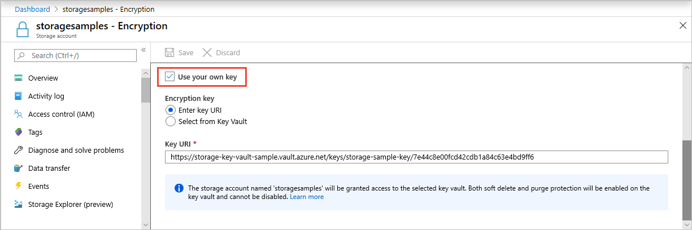

# Determine which Azure Storage encryption key model is in use for the storage account

Data in your storage account is automatically encrypted by Azure Storage. Azure Storage encryption offers two options for managing encryption keys at the level of the storage account:

- **Microsoft-managed keys.** By default, Microsoft manages the keys used to encrypt your storage account.
- **Customer-managed keys.** You can optionally choose to manage encryption keys for your storage account. Customer-managed keys must be stored in Azure Key Vault.

Additionally, you can provide an encryption key at the level of an individual request for some Blob storage operations. When an encryption key is specified on the request, that key overrides the encryption key that is active on the storage account. For more information, see [Specify a customer-provided key on a request to Blob storage](../blobs/storage-blob-customer-provided-key.md).

For more information about encryption keys, see [Azure Storage encryption for data at rest](storage-service-encryption.md).

## Check the encryption key model for the storage account

To determine whether a storage account is using Microsoft-managed keys or customer-managed keys for encryption, use one of the following approaches.

# [Azure portal](#tab/portal)

To check the encryption model for the storage account by using the Azure portal, follow these steps:

1. In the Azure portal, navigate to your storage account.
1. Select the **Encryption** setting and note the setting.

The following image shows a storage account that is encrypted with Microsoft-managed keys:


And the following image shows a storage account that is encrypted with customer-managed keys:



# [PowerShell](#tab/powershell)

To check the encryption model for the storage account by using PowerShell, call the [Get-AzStorageAccount](/powershell/module/az.storage/get-azstorageaccount) command, then check the **KeySource** property for the account.

```powershell
$account = Get-AzStorageAccount -ResourceGroupName <resource-group> `
    -Name <storage-account>
$account.Encryption.KeySource
```

If the value of the **KeySource** property is `Microsoft.Storage`, then the account is encrypted with Microsoft-managed keys. If the value of the **KeySource** property is `Microsoft.Keyvault`, then the account is encrypted with customer-managed keys.

# [Azure CLI](#tab/cli)

To check the encryption model for the storage account by using Azure CLI, call the [az storage account show](/cli/azure/storage/account#az-storage-account-show) command, then check the **keySource** property for the account.

```azurecli-interactive
key_source=$(az storage account show \
    --name <storage-account> \
    --resource-group <resource-group> \
    --query encryption.keySource \
    --output tsv)
```

If the value of the **keySource** property is `Microsoft.Storage`, then the account is encrypted with Microsoft-managed keys. If the value of the **keySource** property is `Microsoft.Keyvault`, then the account is encrypted with customer-managed keys.

---

## Next steps

- [Azure Storage encryption for data at rest](storage-service-encryption.md)
- [Customer-managed keys for Azure Storage encryption](customer-managed-keys-overview.md)
