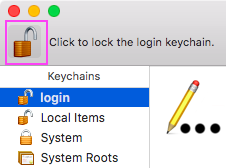
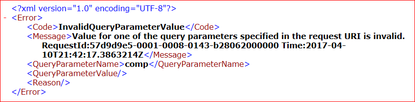

# Azure Storage Explorer troubleshooting guide

Microsoft Azure Storage Explorer is a standalone app that makes it easy to work with Azure Storage data on Windows, macOS, and Linux. The app can connect to storage accounts hosted on Azure, national clouds, and Azure Stack.

This guide summarizes solutions for issues that are commonly seen in Storage Explorer.

## RBAC permissions issues

Role-based access control [RBAC](https://docs.microsoft.com/azure/role-based-access-control/overview) enables highly granular access management of Azure resources by combining sets of permissions into _roles_. Here are some strategies to get RBAC working optimally in Storage Explorer.

### How do I access my resources in Storage Explorer?

If you're having problems accessing storage resources through RBAC, you might not have been assigned the appropriate roles. The following sections describe the permissions Storage Explorer currently requires for access to your storage resources. Contact your Azure account administrator if you're not sure you have the appropriate roles or permissions.

#### "Read: List/Get Storage Account(s)" permissions issue

You must have permission to list storage accounts. To get this permission, you must be assigned the _Reader_ role.

#### List storage account keys

Storage Explorer can also use account keys to authenticate requests. You can get access to account keys through more powerful roles, such as the _Contributor_ role.

> [!NOTE]
> Access keys grant unrestricted permissions to anyone who holds them. Therefore, we don't recommend that you hand out these keys to account users. If you need to revoke access keys, you can regenerate them from the [Azure portal](https://portal.azure.com/).

#### Data roles

You must be assigned at least one role that grants access to read data from resources. For example, if you want to list or download blobs, you'll need at least the _Storage Blob Data Reader_ role.

### Why do I need a management layer role to see my resources in Storage Explorer?

Azure Storage has two layers of access: _management_ and _data_. Subscriptions and storage accounts are accessed through the management layer. Containers, blobs, and other data resources are accessed through the data layer. For example, if you want to get a list of your storage accounts from Azure, you send a request to the management endpoint. If you want a list of blob containers in an account, you send a request to the appropriate service endpoint.

RBAC roles can contain permissions for management or data layer access. The Reader role, for example, grants read-only access to management layer resources.

Strictly speaking, the Reader role provides no data layer permissions and isn't necessary for accessing the data layer.

Storage Explorer makes it easy to access your resources by gathering the necessary information to connect to your Azure resources. For example, to display your blob containers, Storage Explorer sends a "list containers" request to the blob service endpoint. To get that endpoint, Storage Explorer searches the list of subscriptions and storage accounts you have access to. To find your subscriptions and storage accounts, Storage Explorer also needs access to the management layer.

If you don’t have a role that grants any management layer permissions, Storage Explorer can’t get the information it needs to connect to the data layer.

### What if I can't get the management layer permissions I need from my administrator?

We don't currently have an RBAC-related solution for this issue. As a workaround, you can request a SAS URI to [attach to your resource](https://docs.microsoft.com/azure/vs-azure-tools-storage-manage-with-storage-explorer?tabs=linux#use-a-shared-access-signature-uri).

### Recommended built-in RBAC roles

There are several built-in RBAC roles which can provide the permissions needed to use Storage Explorer. Some of those roles are:
- [Owner](/azure/role-based-access-control/built-in-roles#owner): Manage everything, including access to resources. **Note**: this role will give you key access.
- [Contributor](/azure/role-based-access-control/built-in-roles#contributor): Manage everything, excluding access to resources. **Note**: this role will give you key access.
- [Reader](/azure/role-based-access-control/built-in-roles#reader): Read and list resources.
- [Storage Account Contributor](/azure/role-based-access-control/built-in-roles#storage-account-contributor): Full management of storage accounts. **Note**: this role will give you key access.
- [Storage Blob Data Owner](/azure/role-based-access-control/built-in-roles#storage-blob-data-owner): Full access to Azure Storage blob containers and data.
- [Storage Blob Data Contributor](/azure/role-based-access-control/built-in-roles#storage-blob-data-contributor): Read, write, and delete Azure Storage containers and blobs.
- [Storage Blob Data Reader](/azure/role-based-access-control/built-in-roles#storage-blob-data-reader): Read and list Azure Storage containers and blobs.

## Error: Self-signed certificate in certificate chain (and similar errors)

Certificate errors typically occur in one of the following situations:

- The app is connected through a _transparent proxy_, which means a server (such as your company server) is intercepting HTTPS traffic, decrypting it, and then encrypting it by using a self-signed certificate.
- You're running an application that's injecting a self-signed TLS/SSL certificate into the HTTPS messages that you receive. Examples of applications that inject certificates include antivirus and network traffic inspection software.

When Storage Explorer sees a self-signed or untrusted certificate, it no longer knows whether the received HTTPS message has been altered. If you have a copy of the self-signed certificate, you can instruct Storage Explorer to trust it by following these steps:

1. Obtain a Base-64 encoded X.509 (.cer) copy of the certificate.
2. Go to **Edit** > **SSL Certificates** > **Import Certificates**, and then use the file picker to find, select, and open the .cer file.

This issue may also occur if there are multiple certificates (root and intermediate). To fix this error, both certificates must be added.

If you're unsure of where the certificate is coming from, follow these steps to find it:

1. Install OpenSSL.
    * [Windows](https://slproweb.com/products/Win32OpenSSL.html): Any of the light versions should be sufficient.
    * Mac and Linux: Should be included with your operating system.
2. Run OpenSSL.
    * Windows: Open the installation directory, select **/bin/**, and then double-click **openssl.exe**.
    * Mac and Linux: Run `openssl` from a terminal.
3. Run `s_client -showcerts -connect microsoft.com:443`.
4. Look for self-signed certificates. If you're unsure of which certificates are self-signed, make note of anywhere the subject `("s:")` and issuer `("i:")` are the same.
5. When you find self-signed certificates, for each one, copy and paste everything from (and including) `-----BEGIN CERTIFICATE-----` through `-----END CERTIFICATE-----` into a new .cer file.
6. Open Storage Explorer and go to **Edit** > **SSL Certificates** > **Import Certificates**. Then use the file picker to find, select, and open the .cer files that you created.

If you can't find any self-signed certificates by following these steps, contact us through the feedback tool. You can also open Storage Explorer from the command line by using the `--ignore-certificate-errors` flag. When opened with this flag, Storage Explorer ignores certificate errors.

## Sign-in issues

### Blank sign-in dialog box

Blank sign-in dialog boxes most often occur when Active Directory Federation Services (AD FS) prompts Storage Explorer to perform a redirect, which is unsupported by Electron. To work around this issue, you can try to use Device Code Flow for sign-in. To do so, follow these steps:

1. On the left vertical tool bar, open **Settings**. In the Settings Panel, go to **Application** > **Sign in**. Enable **Use device code flow sign-in**.
2. Open the **Connect** dialog box (either through the plug icon on the left-side vertical bar or by selecting **Add Account** on the account panel).
3. Choose the environment you want to sign in to.
4. Select **Sign In**.
5. Follow the instructions on the next panel.

If you can't sign in to the account you want to use because your default browser is already signed in to a different account, do one of the following:

- Manually copy the link and code into a private session of your browser.
- Manually copy the link and code into a different browser.

### Reauthentication loop or UPN change

If you're in a reauthentication loop or have changed the UPN of one of your accounts, follow these steps:

1. Remove all accounts and then close Storage Explorer.
2. Delete the .IdentityService folder from your machine. On Windows, the folder is located at `C:\users\<username>\AppData\Local`. For Mac and Linux, you can find the folder at the root of your user directory.
3. If you're running Mac or Linux, you'll also need to delete the Microsoft.Developer.IdentityService entry from your operating system's keystore. On the Mac, the keystore is the *Gnome Keychain* application. In Linux, the application is typically called _Keyring_, but the name might differ depending on your distribution.

### Conditional Access

Because of a limitation in the Azure AD Library used by Storage Explorer, Conditional Access isn't supported when Storage Explorer is being used on Windows 10, Linux, or macOS.

## Mac Keychain errors

The macOS Keychain can sometimes enter a state that causes issues for the Storage Explorer authentication library. To get the Keychain out of this state, follow these steps:

1. Close Storage Explorer.
2. Open Keychain (press Command+Spacebar, type **keychain**, and press Enter).
3. Select the "login" Keychain.
4. Select the padlock icon to lock the Keychain. (The padlock will appear locked when the process is complete. It might take a few seconds, depending on what apps you have open).

    

5. Open Storage Explorer.
6. You're prompted with a message like "Service hub wants to access the Keychain." Enter your Mac admin account password and select **Always Allow** (or **Allow** if **Always Allow** isn't available).
7. Try to sign in.

### General sign-in troubleshooting steps

* If you're on macOS, and the sign-in window never appears over the **Waiting for authentication** dialog box, try [these steps](#mac-keychain-errors).
* Restart Storage Explorer.
* If the authentication window is blank, wait at least one minute before closing the authentication dialog box.
* Make sure that your proxy and certificate settings are properly configured for both your machine and Storage Explorer.
* If you're running Windows and have access to Visual Studio 2019 on the same machine and to the sign-in credentials, try signing in to Visual Studio 2019. After a successful sign-in to Visual Studio 2019, you can open Storage Explorer and see your account in the account panel.

If none of these methods work, [open an issue in GitHub](https://github.com/Microsoft/AzureStorageExplorer/issues).

### Missing subscriptions and broken tenants

If you can't retrieve your subscriptions after you successfully sign in, try the following troubleshooting methods:

* Verify that your account has access to the subscriptions you expect. You can verify your access by signing in to the portal for the Azure environment you're trying to use.
* Make sure you've signed in through the correct Azure environment (Azure, Azure China 21Vianet, Azure Germany, Azure US Government, or Custom Environment).
* If you're behind a proxy server, make sure you've configured the Storage Explorer proxy correctly.
* Try removing and re-adding the account.
* If there's a "More information" link, check which error messages are being reported for the tenants that are failing. If you aren't sure how to respond to the error messages, feel free to [open an issue in GitHub](https://github.com/Microsoft/AzureStorageExplorer/issues).

## Can't remove an attached account or storage resource

If you can't remove an attached account or storage resource through the UI, you can manually delete all attached resources by deleting the following folders:

* Windows: `%AppData%/StorageExplorer`
* macOS: `/Users/<your_name>/Library/Application Support/StorageExplorer`
* Linux: `~/.config/StorageExplorer`

> [!NOTE]
> Close Storage Explorer before you delete these folders.

> [!NOTE]
> If you have ever imported any SSL certificates, back up the contents of the `certs` directory. Later, you can use the backup to reimport your SSL certificates.

## Proxy issues

First, make sure that the following information you entered is correct:

* The proxy URL and port number
* Username and password if the proxy requires them

> [!NOTE]
> Storage Explorer doesn't support proxy auto-config files for configuring proxy settings.

### Common solutions

If you're still experiencing issues, try the following troubleshooting methods:

* If you can connect to the internet without using your proxy, verify that Storage Explorer works without proxy settings enabled. If this is the case, there may be an issue with your proxy settings. Work with your administrator to identify the problems.
* Verify that other applications that use the proxy server work as expected.
* Verify that you can connect to the portal for the Azure environment you're trying to use.
* Verify that you can receive responses from your service endpoints. Enter one of your endpoint URLs into your browser. If you can connect, you should receive InvalidQueryParameterValue or a similar XML response.
* If someone else is also using Storage Explorer with your proxy server, verify that they can connect. If they can, you may have to contact your proxy server admin.

### Tools for diagnosing issues

If you have networking tools, such as Fiddler for Windows, you can diagnose the problems as follows:

* If you have to work through your proxy, you may have to configure your networking tool to connect through the proxy.
* Check the port number used by your networking tool.
* Enter the local host URL and the networking tool's port number as proxy settings in Storage Explorer. When you do this correctly, your networking tool starts logging network requests made by Storage Explorer to management and service endpoints. For example, enter `https://cawablobgrs.blob.core.windows.net/` for your blob endpoint in a browser, and you'll receive a response that resembles the following:

  

  This response suggests the resource exists, even though you can't access it.

### Contact proxy server admin

If your proxy settings are correct, you may have to contact your proxy server admin to:

* Make sure your proxy doesn't block traffic to Azure management or resource endpoints.
* Verify the authentication protocol used by your proxy server. Storage Explorer doesn't currently support NTLM proxies.

## "Unable to Retrieve Children" error message

If you're connected to Azure through a proxy, verify that your proxy settings are correct. If you're granted access to a resource from the owner of the subscription or account, verify that you have read or list permissions for that resource.

## Connection string doesn't have complete configuration settings

If you receive this error message, it's possible that you don't have the necessary permissions to obtain the keys for your storage account. To confirm that this is the case, go to the portal and locate your storage account. You can do this by right-clicking the node for your storage account and selecting **Open in Portal**. Then, go to the **Access Keys** blade. If you don't have permissions to view keys, you'll see a "You don't have access" message. To work around this issue, you can either obtain the account key from someone else and attach through the name and key, or you can ask someone for a SAS to the storage account and use it to attach the storage account.

If you do see the account keys, file an issue in GitHub so that we can help you resolve the issue.

## Error occurred while adding new connection: TypeError: Cannot read property 'version' of undefined

If you receive this error message when you try to add a custom connection, the connection data that's stored in the local credential manager might be corrupted. To work around this issue, try deleting your corrupted local connections, and then re-add them:

1. Start Storage Explorer. From the menu, go to **Help** > **Toggle Developer Tools**.
2. In the opened window, on the **Application** tab, go to **Local Storage** (left side) > **file://**.
3. Depending on the type of connection you're having an issue with, look for its key and then copy its value into a text editor. The value is an array of your custom connection names, like the following:
    * Storage accounts
        * `StorageExplorer_CustomConnections_Accounts_v1`
    * Blob containers
        * `StorageExplorer_CustomConnections_Blobs_v1`
        * `StorageExplorer_CustomConnections_Blobs_v2`
    * File shares
        * `StorageExplorer_CustomConnections_Files_v1`
    * Queues
        * `StorageExplorer_CustomConnections_Queues_v1`
    * Tables
        * `StorageExplorer_CustomConnections_Tables_v1`
4. After you save your current connection names, set the value in Developer Tools to `[]`.

If you want to preserve the connections that aren't corrupted, you can use the following steps to locate the corrupted connections. If you don't mind losing all existing connections, you can skip these steps and follow the platform-specific instructions to clear your connection data.

1. From a text editor, re-add each connection name to Developer Tools, and then check whether the connection is still working.
2. If a connection is working correctly, it's not corrupted and you can safely leave it there. If a connection isn't working, remove its value from Developer Tools, and record it so that you can add it back later.
3. Repeat until you have examined all your connections.

After going through all your connections, for all connections names that aren't added back, you must clear their corrupted data (if there is any) and add them back by using the standard steps in Storage Explorer:

# [Windows](#tab/Windows)

1. On the **Start** menu, search for **Credential Manager** and open it.
2. Go to **Windows Credentials**.
3. Under **Generic Credentials**, look for entries that have the `<connection_type_key>/<corrupted_connection_name>` key (for example, `StorageExplorer_CustomConnections_Accounts_v1/account1`).
4. Delete these entries and re-add the connections.

# [macOS](#tab/macOS)

1. Open Spotlight (Command+Spacebar) and search for **Keychain access**.
2. Look for entries that have the `<connection_type_key>/<corrupted_connection_name>` key (for example, `StorageExplorer_CustomConnections_Accounts_v1/account1`).
3. Delete these entries and re-add the connections.

# [Linux](#tab/Linux)

Local credential management varies depending on the Linux distribution. If your Linux distribution doesn't provide a built-in GUI tool for local credential management, you can install a third-party tool to manage your local credentials. For example, you can use [Seahorse](https://wiki.gnome.org/Apps/Seahorse/), an open-source GUI tool for managing Linux local credentials.

1. Open your local credential management tool, and find your saved credentials.
2. Look for entries that have the `<connection_type_key>/<corrupted_connection_name>` key (for example, `StorageExplorer_CustomConnections_Accounts_v1/account1`).
3. Delete these entries and re-add the connections.
---

If you still encounter this error after running these steps, or if you want to share what you suspect has corrupted the connections, [open an issue](https://github.com/microsoft/AzureStorageExplorer/issues) on our GitHub page.

## Issues with SAS URL

If you're connecting to a service through a SAS URL and experiencing an error:

* Verify that the URL provides the necessary permissions to read or list resources.
* Verify that the URL has not expired.
* If the SAS URL is based on an access policy, verify that the access policy has not been revoked.

If you accidentally attached by using an invalid SAS URL and now cannot detach, follow these steps:

1. When you're running Storage Explorer, press F12 to open the Developer Tools window.
2. On the **Application** tab, select **Local Storage** > **file://** in the tree on the left.
3. Find the key associated with the service type of the problematic SAS URI. For example, if the bad SAS URI is for a blob container, look for the key named `StorageExplorer_AddStorageServiceSAS_v1_blob`.
4. The value of the key should be a JSON array. Find the object associated with the bad URI, and then delete it.
5. Press Ctrl+R to reload Storage Explorer.

## Linux dependencies

Storage Explorer 1.10.0 and later is available as a snap from the Snap Store. The Storage Explorer snap installs all its dependencies automatically, and it's updated when a new version of the snap is available. Installing the Storage Explorer snap is the recommended method of installation.

Storage Explorer requires the use of a password manager, which you might need to connect manually before Storage Explorer will work correctly. You can connect Storage Explorer to your system's password manager by running the following command:

```bash
snap connect storage-explorer:password-manager-service :password-manager-service
```

You can also download the application as a .tar.gz file, but you'll have to install dependencies manually.

> [!IMPORTANT]
> Storage Explorer as provided in the .tar.gz download is supported only for Ubuntu distributions. Other distributions haven't been verified and may require alternative or additional packages.

These packages are the most common requirements for Storage Explorer on Linux:

* [.NET Core 2.2 Runtime](/dotnet/core/install/dependencies?tabs=netcore22&pivots=os-linux)
* `libgconf-2-4`
* `libgnome-keyring0` or `libgnome-keyring-dev`
* `libgnome-keyring-common`

> [!NOTE]
> Storage Explorer version 1.7.0 and earlier require .NET Core 2.0. If you have a newer version of .NET Core installed, you'll have to [patch Storage Explorer](#patching-storage-explorer-for-newer-versions-of-net-core). If you're running Storage Explorer 1.8.0 or later, you should be able to use up to .NET Core 2.2. Versions beyond 2.2 have not been verified to work at this time.

# [Ubuntu 19.04](#tab/1904)

1. Download Storage Explorer.
2. Install the [.NET Core Runtime](https://dotnet.microsoft.com/download/linux-package-manager/ubuntu19-04/runtime-current).
3. Run the following command:
   ```bash
   sudo apt-get install libgconf-2-4 libgnome-keyring0
   ```

# [Ubuntu 18.04](#tab/1804)

1. Download Storage Explorer.
2. Install the [.NET Core Runtime](https://dotnet.microsoft.com/download/linux-package-manager/ubuntu18-04/runtime-current).
3. Run the following command:
   ```bash
   sudo apt-get install libgconf-2-4 libgnome-keyring-common libgnome-keyring0
   ```

# [Ubuntu 16.04](#tab/1604)

1. Download Storage Explorer.
2. Install the [.NET Core Runtime](https://dotnet.microsoft.com/download/linux-package-manager/ubuntu16-04/runtime-current).
3. Run the following command:
   ```bash
   sudo apt install libgnome-keyring-dev
   ```

# [Ubuntu 14.04](#tab/1404)

1. Download Storage Explorer.
2. Install the [.NET Core Runtime](https://dotnet.microsoft.com/download/linux-package-manager/ubuntu14-04/runtime-current).
3. Run the following command:
   ```bash
   sudo apt install libgnome-keyring-dev
   ```
---

### Patching Storage Explorer for newer versions of .NET Core

For Storage Explorer 1.7.0 or earlier, you might have to patch the version of .NET Core used by Storage Explorer:

1. Download version 1.5.43 of StreamJsonRpc [from NuGet](https://www.nuget.org/packages/StreamJsonRpc/1.5.43). Look for the "Download package" link on the right side of the page.
2. After you download the package, change its file extension from `.nupkg` to `.zip`.
3. Unzip the package.
4. Open the `streamjsonrpc.1.5.43/lib/netstandard1.1/` folder.
5. Copy `StreamJsonRpc.dll` to the following locations in the Storage Explorer folder:
   * `StorageExplorer/resources/app/ServiceHub/Services/Microsoft.Developer.IdentityService/`
   * `StorageExplorer/resources/app/ServiceHub/Hosts/ServiceHub.Host.Core.CLR.x64/`

## "Open In Explorer" from the Azure portal doesn't work

If the **Open In Explorer** button on the Azure portal doesn't work, make sure you're using a compatible browser. The following browsers have been tested for compatibility:
* Microsoft Edge
* Mozilla Firefox
* Google Chrome
* Microsoft Internet Explorer

## Next steps

If none of these solutions work for you, [open an issue in GitHub](https://github.com/Microsoft/AzureStorageExplorer/issues). You can also do this by selecting the **Report issue to GitHub** button in the lower-left corner.


