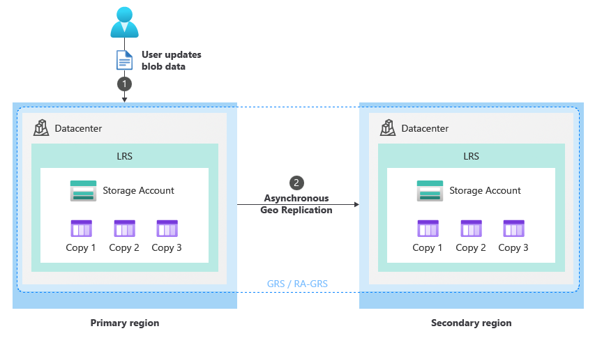

# How customer-managed planned failover works (preview)

Customer-managed storage account planned failover enables you to fail over your entire geo-redundant storage account to the secondary region to do disaster recovery testing. During failover, the original secondary region becomes the new primary and all storage service endpoints for blobs, tables, queues and files are redirected to the new primary region. After testing is complete, you can perform another failover operation to *fail back* to the original primary region. A *failback* is an operation restores a storage account to its original regional configuration.

This article describes what happens during a customer-managed planned storage account failover and failback at every stage of the process. To understand how a failover due to an unexpected storage endpoint outage works, see [How customer-managed storage account failover to recover from an outage works](storage-failover-customer-managed-unplanned.md).

> [!IMPORTANT]
> Customer-managed planned failover is currently in PREVIEW.
>
> See the [Supplemental Terms of Use for Microsoft Azure Previews](https://azure.microsoft.com/support/legal/preview-supplemental-terms/) for legal terms that apply to Azure features that are in beta, preview, or otherwise not yet released into general availability.
>
> To opt in to the preview, see [Set up preview features in Azure subscription](../../azure-resource-manager/management/preview-features.md) and specify `AllowSoftFailover` as the feature name.

## Redundancy management during failover and failback

> [!TIP]
> To understand the varying redundancy states during the storage account failover and failback process in detail, see [Azure Storage redundancy](storage-redundancy.md) for definitions of each.

<!--When a storage account is configured for GRS or RA-GRS redundancy, data is replicated three times locally within both the primary and secondary regions (LRS). When a storage account is configured for GZRS or RA-GZRS replication, data is zone-redundant within the primary region (ZRS) and replicated three times locally within the secondary region (LRS). If the account is configured for read access (RA), you will be able to read data from the secondary region as long as the storage service endpoints to that region are available.-->

Azure storage provides a wide variety of redundancy options to help protect your data.

Locally redundant storage (LRS) automatically maintains three copies of your storage account within a single datacenter. LRS is the least expensive replication option, but isn't recommended for applications requiring high availability or durability. Zone-redundant storage (ZRS) replicates your storage account synchronously across three Azure availability zones in the primary region. Each availability zone is a separate physical location, and your data is still accessible for both read and write operations if a zone becomes unavailable.

Geo-redundant storage (GRS) or read-access geo-redundant storage (RA-GRS) redundancy options can be used to ensure that your data is highly durable. GRS and RA-GRS use LRS to replicate your data three times locally within both the primary and secondary regions. Configuring your account for read access (RA) allows your data to be read from the secondary region, as long as the region's storage service endpoints are available.

Geo-zone-redundant storage (GZRS) and read-access geo-zone-redundant storage (GZRS) use ZRS replication within the primary region, and LRS within the secondary. As with RA-GRS, configuring RA allows you to read data from the secondary region as long as the storage service endpoints to that region are available.

During the planned failover process, the storage service endpoints to the primary region become read-only and any remaining updates are allowed to finish replicating to the secondary region. Afterward, storage service endpoint DNS entries are switched. Your storage account's secondary endpoints become the new primary endpoints, and the original primary endpoints become the new secondary. Data replication within each region remains unchanged even though the primary and secondary regions are switched. Replication within the new primary is always configured to use LRS, and replication within the original primary remains the same, whether LRS or ZRS.

Azure stores the original redundancy configuration of your storage account in the account's metadata, allowing you eventually fail back when ready.

After failover, the new redundancy configuration of your storage account temporarily becomes GRS. The way in which data is replicated within the primary region at a given point in time determines the zone-redundancy configuration of the storage account. Replication within the new primary is always configured to use LRS, so the account is temporarily nonzonal. Azure immediately begins copying data from the new primary region to the new secondary. If your storage account's original secondary region was configured for RA, access is configured for the new secondary region during failover and failback.

The failback process is essentially the same as the failover process except Azure stores the original redundancy configuration of your storage account and restores it to its original state upon failback. So, if your storage account was originally configured as GZRS, the storage account will be GZRS after failback.

> [!NOTE]
> Unlike [customer-managed failover](storage-failover-customer-managed-unplanned.md), during planned failover, replication from the primary to secondary region is allowed to finish before the DNS entries for the endpoints are changed to the new secondary. Because of this, data loss is not expected during failover or failback as long as both the primary and secondary regions are available throughout the process.

## How to initiate a failover

To learn how to initiate a failover, see [Initiate a storage account failover](storage-initiate-account-failover.md).

## The failover and failback process

The following diagrams show what happens during a customer-managed planned failover and failback of a storage account.

## [GRS/RA-GRS](#tab/grs-ra-grs)

Under normal circumstances, a client writes data to a storage account in the primary region via storage service endpoints (1). The data is then copied asynchronously from the primary region to the secondary region (2). The following image shows the normal state of a storage account configured as GRS:

:::image type="content" source="media/storage-failover-customer-managed-common/pre-failover-geo-redundant.png" alt-text="Diagram that shows how clients write data to the storage account in the primary region." lightbox="media/storage-failover-customer-managed-common/pre-failover-geo-redundant.png":::

### The failover process (GRS/RA-GRS)

To begin disaster recovery testing, initiate a failover of the storage account to the secondary region. During the failover process, the following occurs, as shown in the image that follows:

1. The original primary region becomes read only.
1. All data finishes replicating from the primary region to the secondary region.
1. The DNS entries for the storage service endpoints are changed such that those for the secondary region become the new primary endpoints for your storage account.

The failover typically takes about an hour.

:::image type="content" source="media/storage-failover-customer-managed-planned/failover-to-secondary-geo-redundant.png" alt-text="Diagram that shows how the customer initiates account failover to secondary endpoint." lightbox="media/storage-failover-customer-managed-planned/failover-to-secondary-geo-redundant.png":::

After the failover is complete, the original primary region becomes the new secondary (1) and the original secondary region becomes the new primary (2). The URIs for the storage service endpoints for blobs, tables, queues, and files remain the same but their DNS entries are changed to point to the new primary region (3). Users can resume writing data to the storage account in the new primary region and the data is then copied asynchronously to the new secondary (4) as shown in the following image:

:::image type="content" source="media/storage-failover-customer-managed-common/post-failover-geo-redundant.png" alt-text="Diagram that shows the storage account status post-failover to secondary region." lightbox="media/storage-failover-customer-managed-common/post-failover-geo-redundant.png":::

While in the failover state, perform your disaster recovery testing.

### The failback process (GRS/RA-GRS)

After testing is complete, perform another failover to failback to the original primary region. During the failover process, as shown in the following image:

1. The current primary region becomes read only.
1. All data finishes replicating from the current primary region to the current secondary region.
1. The DNS entries for the storage service endpoints are changed to point back to the region that was the primary before the initial failover was performed.

The failback typically takes about an hour.

:::image type="content" source="media/storage-failover-customer-managed-planned/failback-to-primary-geo-redundant.png" alt-text="Diagram that shows how the customer initiates account failback to original primary region." lightbox="media/storage-failover-customer-managed-planned/failback-to-primary-geo-redundant.png":::

After the failback is complete, the storage account is restored to its original redundancy configuration. Users can resume writing data to the storage account in the original primary region (1) while replication to the original secondary (2) continues as before the failover:

.

## [GZRS/RA-GZRS](#tab/gzrs-ra-gzrs)

Under normal circumstances, a client writes data to a storage account in the primary region via storage service endpoints (1). The data is then copied asynchronously from the primary region to the secondary region (2). The following image shows the normal state of a storage account configured as GZRS:

:::image type="content" source="media/storage-failover-customer-managed-common/pre-failover-geo-zone-redundant.png" alt-text="Diagram that shows how the clients write data to the storage account in the primary region." lightbox="media/storage-failover-customer-managed-common/pre-failover-geo-zone-redundant.png":::

### The failover process (GZRS/RA-GZRS)

To begin disaster recovery testing, initiate a failover of the storage account to the secondary region. During the failover process, the following occurs, as shown in the image that follows:

1. The original primary region becomes read only.
1. All data finishes replicating from the primary region to the secondary region.
1. Storage service endpoint DNS entries are switched. Your storage account's endpoints in the secondary region become your new primary endpoints.

The failover typically takes about an hour.

:::image type="content" source="media/storage-failover-customer-managed-planned/failover-to-secondary-geo-zone-redundant.png" alt-text="Diagram that shows how the customer initiates account failover to the secondary endpoint." lightbox="media/storage-failover-customer-managed-planned/failover-to-secondary-geo-zone-redundant.png":::

After the failover is complete, the original primary region becomes the new secondary (1) and the original secondary region becomes the new primary (2). The URIs for the storage service endpoints for blobs, tables, queues, and files remain the same but are pointing to the new primary region (3). Users can resume writing data to the storage account in the new primary region and the data is then copied asynchronously to the new secondary (4) as shown in the following image:

:::image type="content" source="media/storage-failover-customer-managed-common/post-failover-geo-zone-redundant.png" alt-text="Diagram that shows the storage account status post-failover to secondary region." lightbox="media/storage-failover-customer-managed-common/post-failover-geo-zone-redundant.png":::

While in the failover state, perform your disaster recovery testing.

### The failback process (GZRS/RA-GZRS)

When testing is complete, perform another failover to fail back to the original primary region. The following image illustrates the steps involved in the failover process.

1. The current primary region becomes read only.
1. All data finishes replicating from the current primary region to the current secondary region.
1. The DNS entries for the storage service endpoints are changed to point back to the region that was the primary before the initial failover was performed.

The failback typically takes about an hour.

:::image type="content" source="media/storage-failover-customer-managed-planned/failback-to-primary-geo-zone-redundant.png" alt-text="Diagram that shows the customer initiating account failback to the original primary region." lightbox="media/storage-failover-customer-managed-planned/failback-to-primary-geo-zone-redundant.png":::

After the failback is complete, the storage account is restored to its original redundancy configuration. Users can resume writing data to the storage account in the original primary region (1) while replication to the original secondary (2) continues as before the failover:

:::image type="content" source="media/storage-failover-customer-managed-common/pre-failover-geo-zone-redundant.png" alt-text="Diagram that shows the redundancy configuration returns to its original state." lightbox="media/storage-failover-customer-managed-common/pre-failover-geo-zone-redundant.png":::

---

## See also

- [Disaster recovery and storage account failover](storage-disaster-recovery-guidance.md)
- [Initiate an account failover](storage-initiate-account-failover.md)
- [How customer-managed failover works](storage-failover-customer-managed-unplanned.md)
