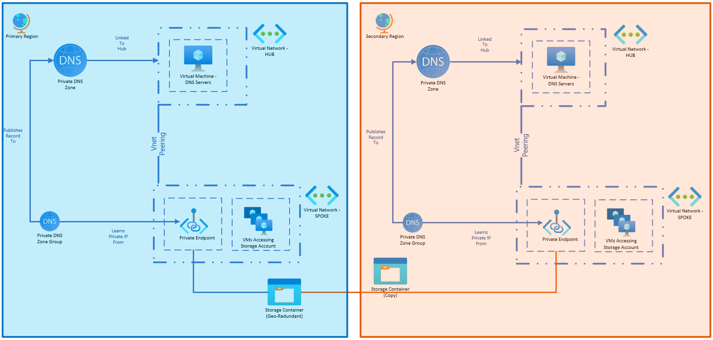

# Failover Considerations for Storage Accounts with Private Endpoints

**NOTES**
*  We need to test failover
*  Datalake is not supported

Storage accounts work different than many other Azure services when it comes to high availability configurations.  Instead of having a secondary instance that is deployed by the customer to a region of their selection, storage accounts configured to be [geo-redundant](./storage-account-overview#types-of-storage-accounts.md) use a specific secondary region based on the main region, to align with [regional pairs](azure/reliability/cross-region-replication-azure).  Customers can fail over to the secondary region, or the storage account will automatically fail over when a regional outage occurs.

This means that customers don't need to plan to have a second storage account already running in their second region; the SKU used in the primary region will address this.  You could have multiple storage accounts and use customer managed operations to move data between them, but this is an uncommon parent.

When a storage account is failed over, the name of the service itself doesn't change.  If you are using the public endpoint for ingress, then systems can use the same DNS resolution to access the service regardless of its fail over state.

This is true when both the storage account and the systems accessing it are failed over to a secondary region, as well as when just the storage account is failed over.  This resilience limits the amount of BCDR tasks needed for the storage account.

However, there are additional considerations needed if you are using [private endpoints](../../private-link/private-endpoint-dns.md).  This article provides an example architecture of a geo-replicated storage account using private endpoints for secure networking, and what is needed for each BCDR scenario.

> [!NOTE]
> Not all storage account types support geo-redundant storage (GRS) or read-access geo-redundant storage (RA-GRS).  For example, data lakes deployed with premium block blob can only be locally redundant or zone redundant in a single region.  Review [Azure Storage redundancy](./storage-redundancy.md) to make sure your scenario is supported.

## Example Architecture

You need a secondary set of PrivateLink DNS Zones for Storage Services in your secondary region so that the resources in your secondary region can resolve to the PE in your secondary region, for the storage account that has been failed over.
If doing active/active, have PEs in both prestaged and able to handle traffic.  PEs do not need to be in the same region as the Storage Account.  If DR only, you still want them there, but you have less to consider.

If you have a very high Recovery Time Objective (6 hours) - You can make changes to the environment to help with the failover and not have the zone.  But do you want to be messing with DNS during an outage - no way.

To be safe you need:

1. Two Privatelink DNS zones for the storage services - one in primary one in secondary
2. Have two Private Endpoints - one primary, one in secondary - for each storage service
3. Enable DNS Zone Group for Primary-to-Primary and Secondary-to-Secondary

## Failover Scenarios

### Scenario 1 - Storage Account Failover 

The Storage Account fails over to the paired region, but the network routing stays the same.

The Private Endpoint should not be impacted, and the service continues to run in the primary region unchanged.

No DNS consideration appears to be needed.

### Scenario 2 - Other Services Failover

Due to an environmental issue, the primary region is unable to support the resources that connect to the Storage Account.  VMs, Function Apps, or whatever.  But networking and the storage account are still possible.

Resources redeployed in the secondary region can route through Hub to Hub to access the Private Endpoint in the Secondary Region.  They can use the same DNS in both Primary and Secondary Regions

This is probably very uncommon.

### Scenario 3 - Whole Region Outage

The primary region is unavailable.  The storage account fails over to the secondary region, and then the customer redeploys/fails over their resources to the secondary region.

In this event, the 

### Scenario 4 - Running in HA

### Scenario 5 - Connecting from On-Prem

On-Prem:

If the on-prem DNS service has a conditional forwarder to Azure Primary Zone, part of the DR Failover to the secondary Zone must involve changing the forwarder to the Secondary Zone, IF IT IS NEEDED IN A DR SCENARIO

Alternatively, Jump Boxes can be used to access the secondary environment as a degraded service in line with their RLO.
