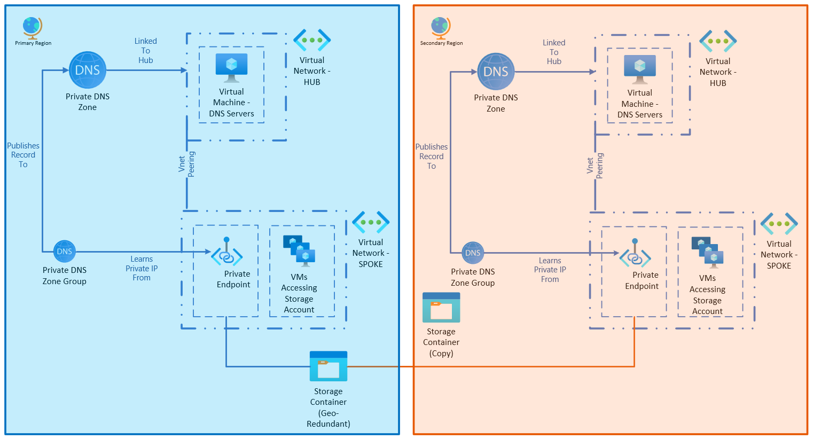
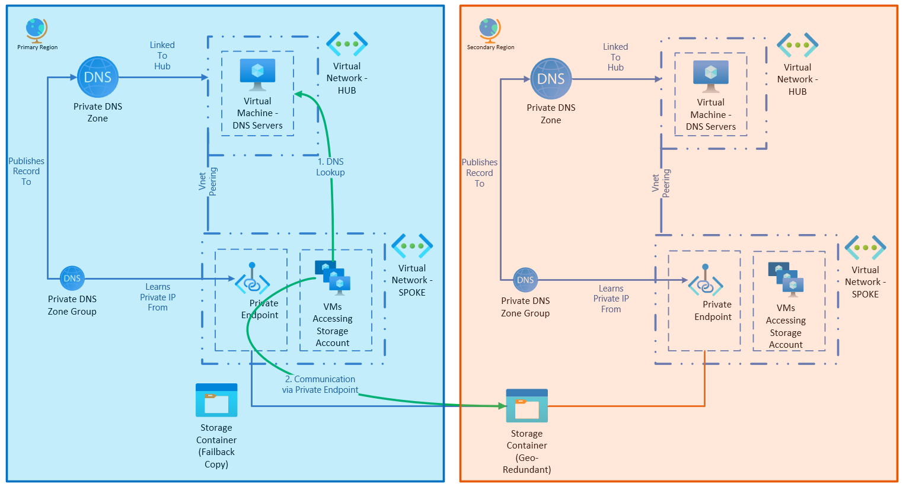
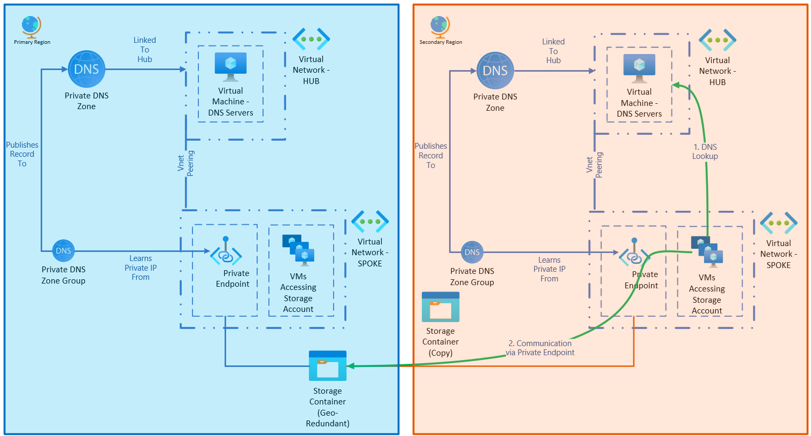
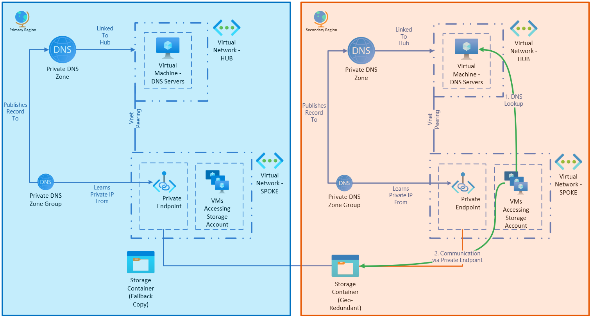

# Failover considerations for storage accounts with private endpoints

Storage accounts work differently than many other Azure services when it comes to high availability configurations.  They don't often use a secondary instance deployed by the customer for resiliency.  Instead, storage accounts configured to be [geo-redundant](./storage-account-overview.md#types-of-storage-accounts) replicate to another region, based on [regional pairs](/azure/reliability/cross-region-replication-azure).  When necessary, the storage account can fail over to this replicated copy, and operate in the secondary region.

This feature means that customers don't need to plan to have a second storage account already running in their second region. You could have multiple storage accounts and use customer managed operations to move data between them, but that is an uncommon pattern.

When a storage account is failed over, the name of the service itself doesn't change.  If you're using the public endpoint for ingress, then systems can use the same DNS resolution to access the service regardless of its fail over state.

DNS resolution works when the storage account and the systems accessing it are failed over.  It also works when just one set of services has been failed over.  This resilience reduces the number of BCDR tasks needed for the storage account.

If you're using [private endpoints](../../private-link/private-endpoint-dns.md), more configuration is needed to support this feature.  This article provides an example architecture of a geo-replicated storage account using private endpoints for secure networking, and what is needed for each BCDR scenario.

> [!NOTE]
> Not all storage account types support geo-redundant storage (GRS) or read-access geo-redundant storage (RA-GRS).  For example, data lakes deployed with premium block blob can only be locally redundant or zone redundant in a single region.  Review [Azure Storage redundancy](./storage-redundancy.md) to make sure your scenario is supported.

## Example architecture

This architecture uses a primary and secondary region that can be used to handle active/active or failover scenarios.  Each region has a hub network for shared network infrastructure.  Each region also has a spoke where the storage account and other workload solutions are deployed.

The geo-redundant storage account is deployed in the primary region, but has private endpoints for its blob endpoint in both regions.  

The two private endpoints can't use the same Private DNS Zone for the same endpoint.  As a result, each region uses its own Private DNS Zone.  Each regional zone is attached to the hub network for the region. This design uses the [DNS forwarder scenario](../../private-link/private-endpoint-dns-integration.md#virtual-network-and-on-premises-workloads-using-a-dns-forwarder) to provide resolution.

As a result, regardless of the region of the VM trying to access the private endpoint, there's a local endpoint available that can access the storage blob, regardless of the region the storage account is currently operating in.

For connections from a data center, a VPN connection would be made to the hub network in the region.  However, for DNS resolution, each data center would have its conditional forwarding set up to only one of the two DNS resolver server sets, to ensure that it resolves to the closest network location.

### Architecture concepts

This architecture uses functionality of private endpoints that may not be commonly encountered when doing single region deployments.

First, an individual service can have multiple private endpoints attached to it.  For example, a storage account could have a private endpoint for its blob containers located in multiple different virtual networks, and each one functions independently.

However, this pattern isn't used often in hub and spoke scenarios because a Private DNS Zone can only have one record for a private endpoint.  If you register your first private endpoint to your Private DNS Zone, other private endpoints would need to use other zones.

In addition, the private endpoints aren't required to be in the same region as the resource they're connecting to.  A storage account in East US 2 can have a private endpoint deployed in Central US, to give one example.

So long as there's an alternate Private DNS Zone for that region, resources in the second can resolve and interact with the storage account.

It's common to use private endpoints located in the same region to reduce costs.  But when considering failover, this functionality can allow regional private networking to work despite failures in one region.

### Cross-region traffic costs

There are costs associated with having private endpoints in multiple regions.  First, there's a cost per private endpoint.  The above design would have two endpoints, and so would be charged twice.  In addition, there's a cost for sending the traffic between regions.  For more information about private endpoint costs, see [Azure Private Link pricing](https://azure.microsoft.com/pricing/details/private-link/).  

Global virtual network peering is a service that connects virtual networks in multiple regions.  It also has a data transfer cost between regions.  This cost depends on the zone your networks are in.  For more information about network costs, see [Virtual Network pricing](https://azure.microsoft.com/pricing/details/virtual-network).

Global peering can be used to enable services to communicate to each other during a service failure in a region.  However, it supports fewer scenarios and may have more manual activities involved in activating a failover.  An organization should review the costs of operating in a highly available or resilient architecture, and compare that to the risks of longer durations to restore service.

## Failover scenarios

This topology supports the following scenarios, and each scenario has its own considerations for DNS failover.

| Scenario | Description | DNS Considerations |
|---|---|---|
| [Scenario 1 - Storage Account Failover](#scenario-1---storage-account-failover) | A service interruption to the storage account hosted in the primary region requires it to be failed over to a secondary region. | No changes required. |
| [Scenario 2 - Other Services Failover](#scenario-2---other-services-failover) | A service interruption to services in the primary region requires them to be failed over to a secondary region.  The storage account doesn't need to be failed over.  | If the outage impacts the DNS servers hosted in the primary region, then the conditional forwarders from on-premises need to be updated to the secondary region. |
| [Scenario 3 - Whole Region Outage](#scenario-3---whole-region-outage) | A service interruption to multiple services in a region requires both the storage account and other services to be failed over. | Conditional forwarders from on-premises DNS need to be updated to the secondary region. |
| [Scenario 4 - Running in High-Availability](#scenario-4---running-in-high-availability) | The services and storage accounts are working in Azure in an active/active configuration. | If a region's DNS or storage account is impacted, conditional forwarders on-premises need to be updated to operational regions. |

### Scenario 1 - storage account failover

In this scenario, an issue with the storage account requires it to be failed over to the secondary regions.  With storage accounts that are zone redundant and geo-redundant, these outages are uncommon, but should still be planned for.

When the storage account is failed over to the paired secondary region, network routing stays the same.  No changes to DNS are needed - each region can continue to use its local endpoint to communicate with the storage account.

Connections from an on-premises data center connected by VPN would continue to operate as well.  Each endpoint can respond to connections routed to it, and both hub networks are able to resolve to a valid endpoint.

After failover, the service will operate as illustrated:

When the service is restored in the primary region, the storage account can be failed back.

### Scenario 2 - other services failover

In this scenario, there's an issue with the services that connect to the storage account.  In our environment, these are virtual machines, but they could be application services or other services.

These resources need to be failed over to the secondary region following their own process.  VMs might use Azure Site Recovery to replicate VMs prior to the outage, or you might deploy a new instance of your web app in the secondary region.

Once the services are active in the secondary region, they can begin to connect to the storage account through its regional endpoint.  No changes are needed for it to support connections.

Connections from an on-premises data center connected by VPN would continue to operate as long as the service outage doesn't impact the DNS resolution services in the hub.  If the hub is disabled, such as due to a VM service outage, then the conditional forwarders in the data center would need to be adjusted to point to the secondary region until the service is restored.

After failover, the service will operate as illustrated:

When the service is restored in the primary region, the services can be failed back and on-premises DNS reset.

> [!NOTE]
> If you only need to connect to the storage account from on-premises for administrative tasks, a jump box in the secondary region could be used instead of updating DNS in the primary region.  on-premises DNS only needs to be updated if you need direct connection to the storage account from systems on-premises.

### Scenario 3 - whole region outage

In this scenario, there's a regional outage of sufficient scope as both the storage account and other services need to be failed over.

This failover operates like a combination of Scenario 1 and Scenario 2.  The storage account is failed over, as are the Azure services.  The primary region is effectively unable to operate, but the services can continue to operate in the secondary region until the service is restored.

Similar to Scenario 2, if the primary hub is unable to handle DNS responses to its endpoint, or there are other networking outages, then the conditional forwarders on-premises should be updated to the secondary region.

After failover, the service will operate as illustrated:

When the services are restored, resources can be failed back, and on-premises DNS can be reset back to its normal configuration.

### Scenario 4 - running in high availability

In this scenario, you have your workload running in an active/active mode.  There are compute resources running in both the primary and secondary region, and clients are connecting to either region based off of load balancing rules.

In it, both services can communicate to the storage account through their regional private endpoints.  See [Azure network round-trip latency statistics](../../networking/azure-network-latency.md) to review latency between regions.

If there's a regional outage, the load balancing front end should redirect all application traffic to the active region.

For connectivity from on-premises data center locations, if the outage impacts a region's DNS or storage account, then conditional forwarders from the data center need to be set to regions that are still available.  This change doesn't impact Azure services.

While both regions are healthy, the service operates as illustrated:

## Next steps

As part of planning for your storage account resiliency, you can review the following articles for more information:

- [Well-Architected Framework Reliability Pillar](/azure/well-architected/resiliency/overview)
- [Storage Account Overview](./storage-account-overview.md)
- [Azure Storage redundancy](./storage-redundancy.md)
- [Initiate Account Failover](./storage-initiate-account-failover.md)
- [Cross region replication](/azure/reliability/cross-region-replication-azure)
- [Private endpoint DNS](../../private-link/private-endpoint-dns.md)

