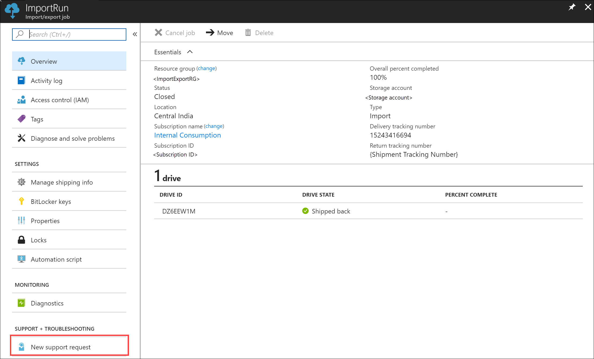
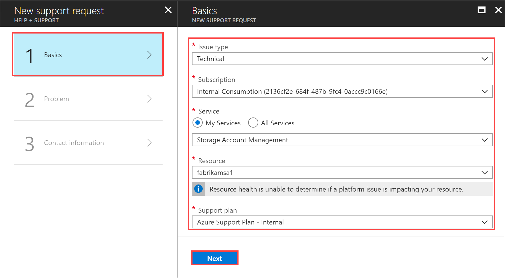
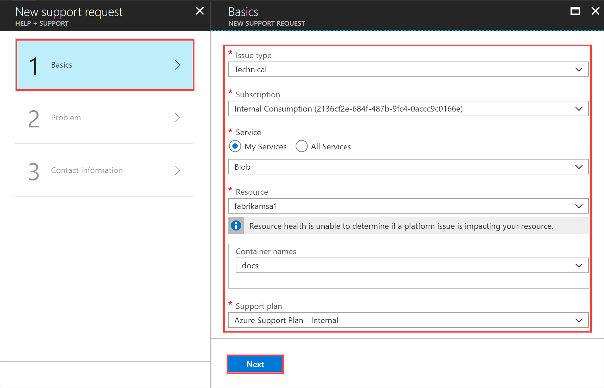
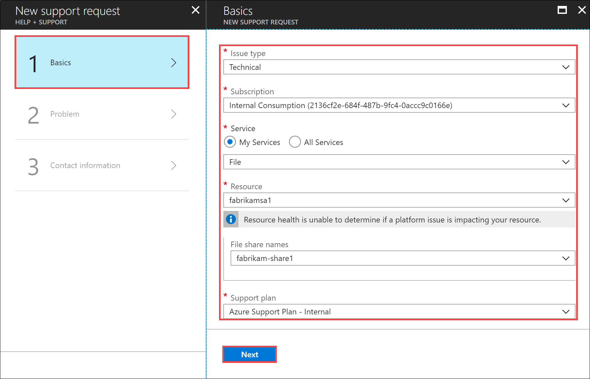
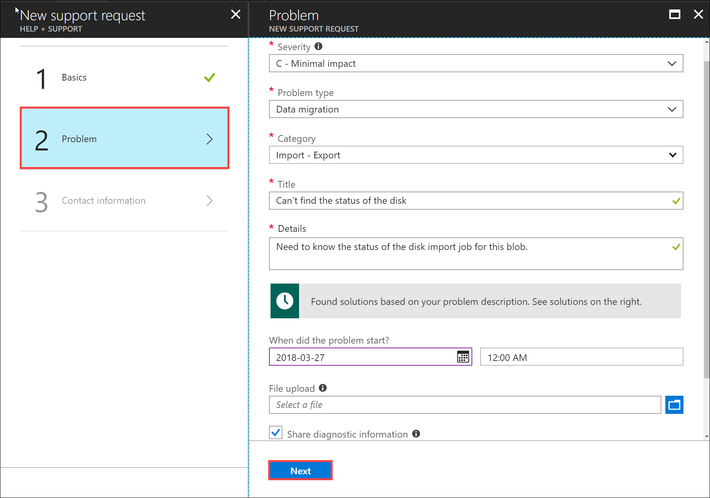
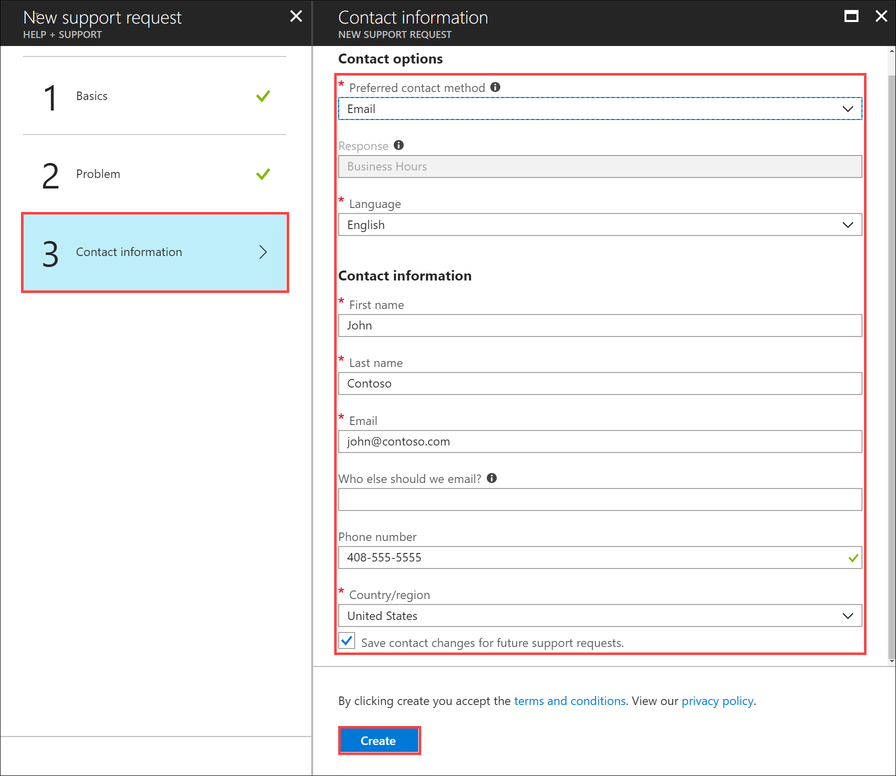
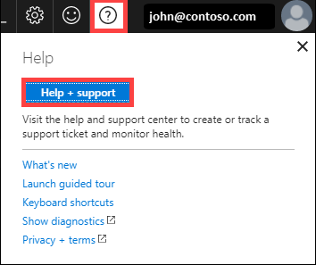
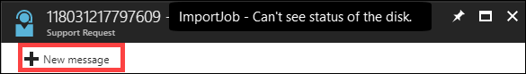

# Open a support ticket for an Import/Export job

If you encounter any issues with your Import/Export service, you can create a service request for technical support. This article walks you through:

* How to create a support request.
* How to manage a support request lifecycle from within the portal.

## Create a support request

Perform the following steps to create a support request:

1. Go to your import/export job. Navigate to **SUPPORT + TROUBLESHOOTING** section and then click **New support request**.
     
    
   
2. In **New support request**, select **Basics**. In **Basics**, do the following steps:
    
    1. From the **Issue type** dropdown list, select **Technical**.
    2. Choose your **Subscription**.
    3. Under **Service**, check **My Services**. From the dropdown list, you can select one of the options - **Storage Account Management**, **Blob**, or **File**. 
        - If you choose **Storage Account Management**, select **Resource**, and **Support plan**.
            
        - If you choose **Blob**, select **Resource**, **Container names** (optional), and **Support plan**.
            
        - If you choose **File**, select **Resource**, **File share names** (optional), and **Support plan**
            
    4. Click **Next**.

3. In **New support request**, select **Step 2 Problem**. In **Problem**, do the following steps:
    
    1. Choose the **Severity** as **C - Minimal impact**. Support will update it if needed.
    2. Select the **Problem type** as **Data Migration**.
    3. Choose the **Category** as **Import - Export**.
    4. Provide a **Title** for the issue and more **Details**.
    5. Provide the start date and time for the problem.
    6. In the **File upload**, click the folder icon to browse any other files you want to upload.
    7. Check **Share diagnostic information**.
    8. Click **Next**.

       

4. In **New support request**, click **Step 3 Contact information**. In **Contact information**, do the following steps:

   1. In the **Contact options**, provide your preferred contact method (phone or email) and the language. The response time is automatically selected based on your subscription plan.
   2. In the Contact information, provide your name, email, optional contact, country/region. Select the **Save contact changes for future support requests** checkbox.
   3. Click **Create**.
   
          

      Microsoft Support will use this information to reach out to you for further information, diagnosis, and resolution.
      After you have submitted your request, a Support engineer will contact you as soon as possible to proceed with your request.

## Manage a support request

After creating a support ticket, you can manage the lifecycle of the ticket from within the portal.

#### To manage your support requests

1. To get to the help and support page, navigate to **Browse > Help + support**.

       

2. A tabular listing of **Recent support requests** is displayed in **Help + support**.

     

3. Select and click a support request. You can view the status and the details for this request. Click **+ New message** if you want to follow up on this request.

     

## Next steps

Learn how to [Troubleshoot issues related to Import/Export service](storage-import-export-tool-troubleshooting-v1.md).
