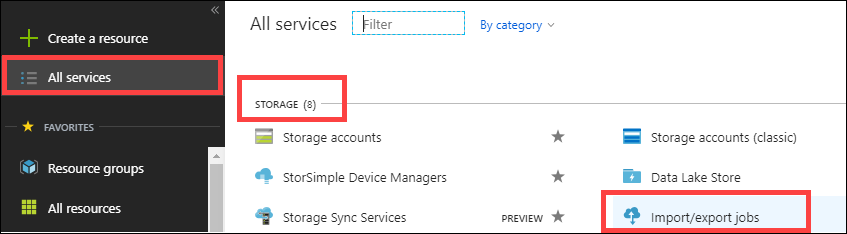
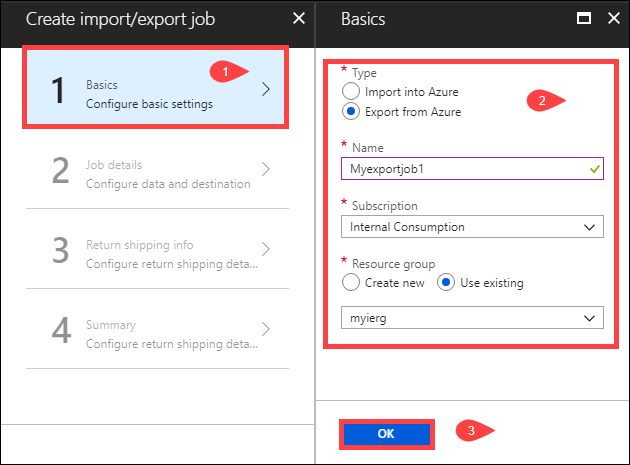
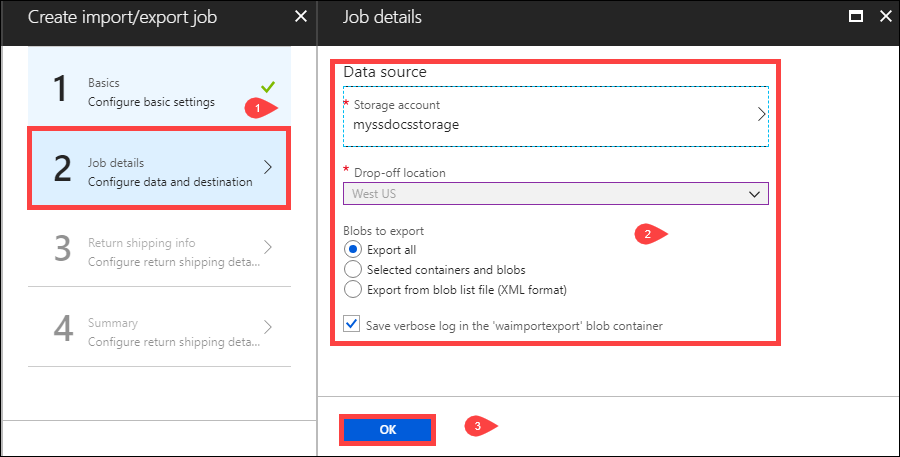
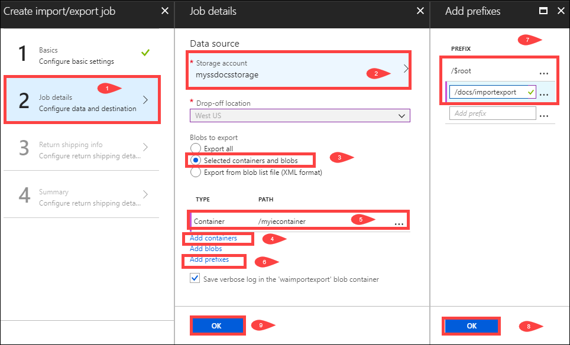
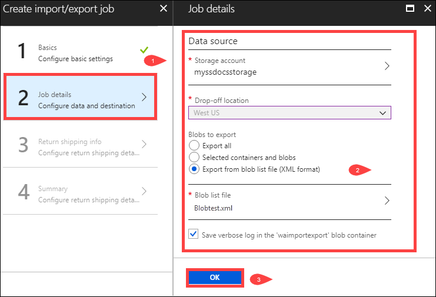
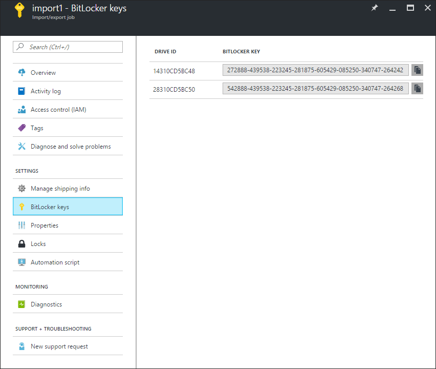

# Use the Azure Import/Export service to export data from Azure Blob storage
This article provides step-by-step instructions on how to use the Azure Import/Export service to securely export large amounts of data from Azure Blob storage. The service requires you to ship empty drives to the Azure datacenter. The service exports data from your storage account to the drives and then ships the drives back.

## Prerequisites

Before you create an export job to transfer data out of Azure Blob Storage, carefully review and complete the following list of prerequisites for this service. 
You must:

- Have an active Azure subscription that can be used for the Import/Export service.
- Have at least one Azure Storage account. See the list of [Supported storage accounts and storage types for Import/Export service](storage-import-export-requirements.md). For information on creating a new storage account, see [How to Create a Storage Account](storage-quickstart-create-account.md).
- Have adequate number of disks of [Supported types](storage-import-export-requirements.md#supported-disks).
- Have a FedEx/DHL account.  
    - The account must be valid, should have balance, and must have return shipping capabilities.
    - Generate a tracking number for the export job.
    - Every job should have a separate tracking number. Multiple jobs with the same tracking number are not supported. 
    - If you do not have a carrier account, go to:
        - [Create a FedEX account](https://www.fedex.com/en-us/create-account.html), or 
        - [Create a DHL account](http://www.dhl-usa.com/en/express/shipping/open_account.html).

## Step 1: Create an export job

Perform the following steps to create an export job in the Azure portal.

1. Log on to https://portal.azure.com/.
2. Go to **All services > Storage > Import/export jobs**. 

    

3. Click **Create Import/export Job**.

    

4. In **Basics**:
    
    - Select **Export from Azure**. 
    - Enter a descriptive name for the export job. Use the name you choose to track the progress of your jobs. 
        - The name may contain only lowercase letters, numbers, hyphens, and underscores.
        - The name must start with a letter, and may not contain spaces. 
    - Select a subscription.
    - Enter or select a resource group.

         
    
3. In **Job details**:

    - Select the storage account where the data to be exported resides. Use a storage account close to where you are located.
    - The dropoff location is automatically populated based on the region of the storage account selected. 
    - Specify the blob data you wish to export from your storage account to your blank drive or drives. 
    - Choose to **Export all** blob data in the storage account.
    
          

    - You can specify which containers and blobs to export.
        - **To specify a blob to export**: Use the **Equal To** selector. Specify the relative path to the blob, beginning with the container name. Use *$root* to specify the root container.
        - **To specify all blobs starting with a prefix**: Use the **Starts With** selector. Specify the prefix, beginning with a forward slash '/'. The prefix may be the prefix of the container name, the complete container name, or the complete container name followed by the prefix of the blob name. You must provide the blob paths in valid format to avoid errors during processing, as shown in this screenshot. For more information, see [Examples of valid blob paths](#examples-of-valid-blob-paths). 
   
            

    - You can export from  the blob list file.

          
   
   > [!NOTE]
   > If the blob to be exported is in use during data copy, Azure Import/Export service takes a snapshot of the blob and copies the snapshot.
 

4. In **Return shipping info**:

    - Select the carrier from the dropdown list.
    - Enter a valid carrier account number that you have created with that carrier. Microsoft uses this account to ship the drives back to you once your import job is complete. 
    - Provide a complete and valid contact name, phone, email, street address, city, zip, state/province and country/region.

        > [!TIP] 
        > Instead of specifying an email address for a single user, provide a group email. This ensures that you recieve notifications even if an admin leaves.
   
5. In **Summary**:

    - Review the details of the job.
    - Make a note of the job name and provided Azure datacenter shipping address for shipping disks to Azure. 

        > [!NOTE] 
        > Always send the disks to the datacenter noted in the Azure portal. If the disks are shipped to the wrong datacenter, the job will not be processed.

    - Click **OK** to complete export job creation.

## Step 2: Ship the drives

If you do not know the number of drives you need, go to the [Check the number of drives](#check-the-number-of-drives). If you know the number of drives, proceed to ship the drives.

[!INCLUDE [storage-import-export-ship-drives](../../../includes/storage-import-export-ship-drives.md)]

## Step 3: Update the job with tracking information

[!INCLUDE [storage-import-export-update-job-tracking](../../../includes/storage-import-export-update-job-tracking.md)]


## Step 4: Receive the disks
When the dashboard reports the job is complete, the disks are shipped to you and the tracking number for the shipment is available on the portal.

1. After you receive the drives with exported data, you need to get the BitLocker keys to unlock the drives. Go to the export job in the Azure portal. Click **Import/Export** tab. 
2. Select and cick your export job from the list. Go to **BitLocker keys** and copy the keys.
   
   

3. Use the BitLocker keys to unlock the disks.

The export is complete. At this time, you can delete the job or it automatically gets deleted after 90 days.


## Check the number of drives

This *optional* step helps you determines the number of drives required for the export job. Perform this step on a Windows system running a [Supported OS version](storage-import-export-requirements.md#supported-operating-systems).

1. [Download the WAImportExport version 1](https://www.microsoft.com/en-us/download/details.aspx?id=42659) on the Windows system. 
2. Unzip to the default folder `waimportexportv1`. For example, `C:\WaImportExportV1`.
3. Open a PowerShell or command line window with administrative privileges. To change directory to the unzipped folder, run the following command:
    
    `cd C:\WaImportExportV1`

4. To check the number of disks required for the selected blobs, run the following command:

    `WAImportExport.exe PreviewExport /sn:<Storage account name> /sk:<Storage account key> /ExportBlobListFile:<Path to XML blob list file> /DriveSize:<Size of drives used>`

    The parameters are described in the following table:
    
    |Command-line parameter|Description|  
    |--------------------------|-----------------|  
    |**/logdir:**|Optional. The log directory. Verbose log files are written to this directory. If not specified, the current directory is used as the log directory.|  
    |**/sn:**|Required. The name of the storage account for the export job.|  
    |**/sk:**|Required only if a container SAS is not specified. The account key for the storage account for the export job.|  
    |**/csas:**|Required only if a storage account key is not specified. The container SAS for listing the blobs to be exported in the export job.|  
    |**/ExportBlobListFile:**|Required. Path to the XML file containing list of blob paths or blob path prefixes for the blobs to be exported. The file format used in the `BlobListBlobPath` element in the [Put Job](/rest/api/storageimportexport/jobs#Jobs_CreateOrUpdate) operation of the Import/Export service REST API.|  
    |**/DriveSize:**|Required. The size of drives to use for an export job, *e.g.*, 500 GB, 1.5 TB.|  

    See an [Example of the PreviewExport command](#example-of-previewexport-command).
 
5. Check that you can read/write to the drives that will be shipped for the export job.

### Example of PreviewExport command

The following example demonstrates the `PreviewExport` command:  
  
```  
WAImportExport.exe PreviewExport /sn:bobmediaaccount /sk:VkGbrUqBWLYJ6zg1m29VOTrxpBgdNOlp+kp0C9MEdx3GELxmBw4hK94f7KysbbeKLDksg7VoN1W/a5UuM2zNgQ== /ExportBlobListFile:C:\WAImportExport\mybloblist.xml /DriveSize:500GB    
```  
  
The export blob list file may contain blob names and blob prefixes, as shown here:  
  
```xml 
<?xml version="1.0" encoding="utf-8"?>  
<BlobList>  
<BlobPath>pictures/animals/koala.jpg</BlobPath>  
<BlobPathPrefix>/vhds/</BlobPathPrefix>  
<BlobPathPrefix>/movies/</BlobPathPrefix>  
</BlobList>  
```

The Azure Import/Export Tool lists all blobs to be exported and calculates how to pack them into drives of the specified size, taking into account any necessary overhead, then estimates the number of drives needed to hold the blobs and drive usage information.  
  
Here is an example of the output, with informational logs omitted:  
  
```  
Number of unique blob paths/prefixes:   3  
Number of duplicate blob paths/prefixes:        0  
Number of nonexistent blob paths/prefixes:      1  
  
Drive size:     500.00 GB  
Number of blobs that can be exported:   6  
Number of blobs that cannot be exported:        2  
Number of drives needed:        3  
        Drive #1:       blobs = 1, occupied space = 454.74 GB  
        Drive #2:       blobs = 3, occupied space = 441.37 GB  
        Drive #3:       blobs = 2, occupied space = 131.28 GB    
```

## Examples of valid blob paths

The following table shows examples of valid blob paths:
   
   | Selector | Blob Path | Description |
   | --- | --- | --- |
   | Starts With |/ |Exports all blobs in the storage account |
   | Starts With |/$root/ |Exports all blobs in the root container |
   | Starts With |/book |Exports all blobs in any container that begins with prefix **book** |
   | Starts With |/music/ |Exports all blobs in container **music** |
   | Starts With |/music/love |Exports all blobs in container **music** that begin with prefix **love** |
   | Equal To |$root/logo.bmp |Exports blob **logo.bmp** in the root container |
   | Equal To |videos/story.mp4 |Exports blob **story.mp4** in container **videos** |

## Next steps

* [View the job and drive status](storage-import-export-view-drive-status.md)
* [Review Import/Export requirements](storage-import-export-requirements.md)


