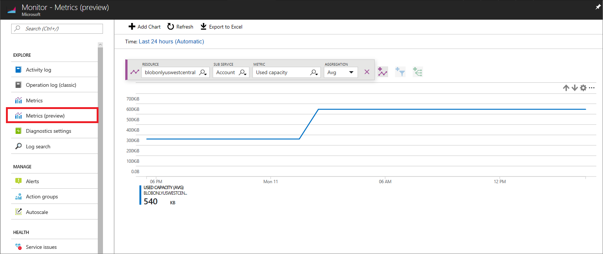
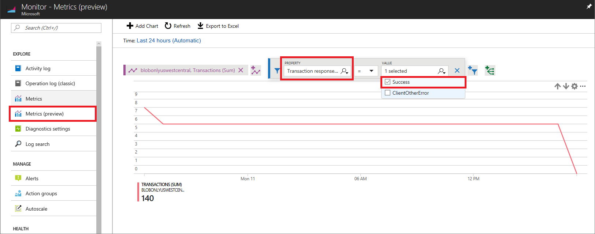

# Azure Storage metrics in Azure Monitor

With metrics on Azure Storage, you can analyze usage trends, trace requests, and diagnose issues with your storage account.

Azure Monitor provides unified user interfaces for monitoring across different Azure services. For more information, see [Azure Monitor](../../monitoring-and-diagnostics/monitoring-overview.md). Azure Storage integrates Azure Monitor by sending metric data to the Azure Monitor platform.

## Access metrics

Azure Monitor provides multiple ways to access metrics. You can access them from the [Azure portal](https://portal.azure.com), the Azure Monitor APIs (REST, and .Net) and analysis solutions such as the Operation Management Suite and Event Hubs. For more information, see  [Azure Monitor Metrics](../../monitoring-and-diagnostics/monitoring-overview-metrics.md).

Metrics are enabled by default, and you can access the past 93 days of data. If you need to retain data for a longer period of time, you can archive metrics data to an Azure Storage account. This is configured in [diagnostic settings](../../monitoring-and-diagnostics/monitoring-overview-of-diagnostic-logs.md) in Azure Monitor.

### Access metrics in the Azure portal

You can monitor metrics over time in the Azure portal. The following example shows how to view **UsedCapacity** at account level.



For metrics supporting dimensions, you can filter metric with the desired dimension value. The following example shows how to view **Transactions** at account level on a specific operation by selecting values for  **API Name** dimension.



### Access metrics with the REST API

Azure Monitor provides [REST APIs](/rest/api/monitor/) to read metric definition and values. This section shows you how to read the storage metrics. Resource ID is used in all REST APIS. For more information, please read [Understanding resource ID for services in Storage](#understanding-resource-id-for-services-in-storage).

The following example shows how to use [ArmClient](https://github.com/projectkudu/ARMClient)  at the command line to simplify testing with the REST API.

#### List account level metric definition with the REST API

The following example shows how to list metric definition at account level:

```
# Login to Azure and enter your credentials when prompted.
> armclient login

> armclient GET /subscriptions/{subscriptionId}/resourceGroups/{resourceGroupName}/providers/Microsoft.Storage/storageAccounts/{storageAccountName}/providers/microsoft.insights/metricdefinitions?api-version=2018-01-01

```

If you want to list the metric definitions for blob, table, file, or queue, you must specify different resource IDs for each service with the API.

The response contains the metric definition in JSON format:

```Json
{
  "value": [
    {
      "id": "/subscriptions/{subscriptionId}/resourceGroups/{resourceGroupName}/providers/Microsoft.Storage/storageAccounts/{storageAccountName}/providers/microsoft.insights/metricdefinitions/UsedCapacity",
      "resourceId": "/subscriptions/{subscriptionId}/resourceGroups/{resourceGroupName}/providers/Microsoft.Storage/storageAccounts/{storageAccountName}",
      "category": "Capacity",
      "name": {
        "value": "UsedCapacity",
        "localizedValue": "Used capacity"
      },
      "isDimensionRequired": false,
      "unit": "Bytes",
      "primaryAggregationType": "Average",
      "metricAvailabilities": [
        {
          "timeGrain": "PT1M",
          "retention": "P30D"
        },
        {
          "timeGrain": "PT1H",
          "retention": "P30D"
        }
      ]
    },
    ... next metric definition
  ]
}

```

#### Read account-level metric values with the REST API

The following example shows how to read metric data at account level:

```
> armclient GET "/subscriptions/{subscriptionId}/resourceGroups/{resourceGroupName}/providers/Microsoft.Storage/storageAccounts/{storageAccountName}/providers/microsoft.insights/metrics?metricnames=Availability&api-version=2018-01-01&aggregation=Average&interval=PT1H"

```

In above example, if you want to read metric values for blob, table, file, or queue, you must specify different resource IDs for each service with the API.

The following response contains metric values in JSON format:

```Json
{
  "cost": 0,
  "timespan": "2017-09-07T17:27:41Z/2017-09-07T18:27:41Z",
  "interval": "PT1H",
  "value": [
    {
      "id": "/subscriptions/{subscriptionId}/resourceGroups/{resourceGroupName}/providers/Microsoft.Storage/storageAccounts/{storageAccountName}/providers/Microsoft.Insights/metrics/Availability",
      "type": "Microsoft.Insights/metrics",
      "name": {
        "value": "Availability",
        "localizedValue": "Availability"
      },
      "unit": "Percent",
      "timeseries": [
        {
          "metadatavalues": [],
          "data": [
            {
              "timeStamp": "2017-09-07T17:27:00Z",
              "average": 100.0
            }
          ]
        }
      ]
    }
  ]
}

```

### Access metrics with the .Net SDK

Azure Monitor provides [.Net SDK](https://www.nuget.org/packages/Microsoft.Azure.Management.Monitor/) to read metric definition and values. The [sample code](https://azure.microsoft.com/resources/samples/monitor-dotnet-metrics-api/) shows how to use the SDK with different parameters. You need to use `0.18.0-preview` or later version for storage metrics. Resource ID is used in .Net SDK. For more information, please read [Understanding resource ID for services in Storage](#understanding-resource-id-for-services-in-storage).

The following example shows how to use Azure Monitor .Net SDK to read storage metrics.

#### List account level metric definition with the .Net SDK

The following example shows how to list metric definition at account level:

```csharp
    public static async Task ListStorageMetricDefinition()
    {
        // Resource ID for storage account
        var resourceId = "/subscriptions/{subscriptionId}/resourceGroups/{resourceGroupName}/providers/Microsoft.Storage/storageAccounts/{storageAccountName}";
        var subscriptionId = "{SubscriptionID}";
        // How to identify Tenant ID, Application ID and Access Key: https://azure.microsoft.com/documentation/articles/resource-group-create-service-principal-portal/
        var tenantId = "{TenantID}";
        var applicationId = "{ApplicationID}";
        var accessKey = "{AccessKey}";

        // Using metrics in Azure Monitor is currently free. However, if you use additional solutions ingesting metrics data, you may be billed by these solutions. For example, you are billed by Azure Storage if you archive metrics data to an Azure Storage account. Or you are billed by Operation Management Suite (OMS) if you stream metrics data to OMS for advanced analysis.
        MonitorClient readOnlyClient = AuthenticateWithReadOnlyClient(tenantId, applicationId, accessKey, subscriptionId).Result;
        IEnumerable<MetricDefinition> metricDefinitions = await readOnlyClient.MetricDefinitions.ListAsync(resourceUri: resourceId, cancellationToken: new CancellationToken());

        foreach (var metricDefinition in metricDefinitions)
        {
            //Enumrate metric definition:
            //    Id
            //    ResourceId
            //    Name
            //    Unit
            //    MetricAvailabilities
            //    PrimaryAggregationType
            //    Dimensions
            //    IsDimensionRequired
        }
    }

```

If you want to list the metric definitions for blob, table, file, or queue, you must specify different resource IDs for each service with the API.

#### Read metric values with the .Net SDK

The following example shows how to read `UsedCapacity` data at account level:

```csharp
    public static async Task ReadStorageMetricValue()
    {
        // Resource ID for storage account
        var resourceId = "/subscriptions/{subscriptionId}/resourceGroups/{resourceGroupName}/providers/Microsoft.Storage/storageAccounts/{storageAccountName}";
        var subscriptionId = "{SubscriptionID}";
        // How to identify Tenant ID, Application ID and Access Key: https://azure.microsoft.com/documentation/articles/resource-group-create-service-principal-portal/
        var tenantId = "{TenantID}";
        var applicationId = "{ApplicationID}";
        var accessKey = "{AccessKey}";

        MonitorClient readOnlyClient = AuthenticateWithReadOnlyClient(tenantId, applicationId, accessKey, subscriptionId).Result;

        Microsoft.Azure.Management.Monitor.Models.Response Response;

        string startDate = DateTime.Now.AddHours(-3).ToString("o");
        string endDate = DateTime.Now.ToString("o");
        string timeSpan = startDate + "/" + endDate;

        Response = await readOnlyClient.Metrics.ListAsync(
            resourceUri: resourceId,
            timespan: timeSpan,
            interval: System.TimeSpan.FromHours(1),
            metric: "UsedCapacity",

            aggregation: "Average",
            resultType: ResultType.Data,
            cancellationToken: CancellationToken.None);

        foreach (var metric in Response.Value)
        {
            //Enumrate metric value
            //    Id
            //    Name
            //    Type
            //    Unit
            //    Timeseries
            //        - Data
            //        - Metadatavalues
        }
    }

```

In above example, if you want to read metric values for blob, table, file, or queue, you must specify different resource IDs for each service with the API.

#### Read multi-dimensional metric values with the .Net SDK

For multi-dimensional metrics, you need to define meta data filter if you want to read metric data on specific dimension value.

The following example shows how to read metric data on the metric supporting multi-dimension:

```csharp
    public static async Task ReadStorageMetricValueTest()
    {
        // Resource ID for blob storage
        var resourceId = "/subscriptions/{subscriptionId}/resourceGroups/{resourceGroupName}/providers/Microsoft.Storage/storageAccounts/{storageAccountName}/blobServices/default";
        var subscriptionId = "{SubscriptionID}";
        // How to identify Tenant ID, Application ID and Access Key: https://azure.microsoft.com/documentation/articles/resource-group-create-service-principal-portal/
        var tenantId = "{TenantID}";
        var applicationId = "{ApplicationID}";
        var accessKey = "{AccessKey}";

        MonitorClient readOnlyClient = AuthenticateWithReadOnlyClient(tenantId, applicationId, accessKey, subscriptionId).Result;

        Microsoft.Azure.Management.Monitor.Models.Response Response;

        string startDate = DateTime.Now.AddHours(-3).ToString("o");
        string endDate = DateTime.Now.ToString("o");
        string timeSpan = startDate + "/" + endDate;
        // It's applicable to define meta data filter when a metric support dimension
        // More conditions can be added with the 'or' and 'and' operators, example: BlobType eq 'BlockBlob' or BlobType eq 'PageBlob'
        ODataQuery<MetadataValue> odataFilterMetrics = new ODataQuery<MetadataValue>(
            string.Format("BlobType eq '{0}'", "BlockBlob"));

        Response = readOnlyClient.Metrics.List(
                        resourceUri: resourceId,
                        timespan: timeSpan,
                        interval: System.TimeSpan.FromHours(1),
                        metric: "BlobCapacity",
                        odataQuery: odataFilterMetrics,
                        aggregation: "Average",
                        resultType: ResultType.Data);

        foreach (var metric in Response.Value)
        {
            //Enumrate metric value
            //    Id
            //    Name
            //    Type
            //    Unit
            //    Timeseries
            //        - Data
            //        - Metadatavalues
        }
    }

```

## Understanding resource ID for services in Azure Storage

Resource ID is a unique identifier of a resource in Azure. When you use the Azure Monitor REST API to read metrics definitions or values, you must use resource ID for the resource on which you intend to operate. The resource ID template follows this format:

`
/subscriptions/{subscriptionId}/resourceGroups/{resourceGroupName}/providers/{resourceProviderNamespace}/{resourceType}/{resourceName}
`

Storage provides metrics at both the storage account level and the service level with Azure Monitor. For example, you can retrieve metrics for just Blob storage. Each level has its own resource ID, which is used to retrieve the metrics for just that level.

### Resource ID for a storage account

The following shows the format for specifying the Resource ID for a storage account.

`
/subscriptions/{subscriptionId}/resourceGroups/{resourceGroupName}/providers/Microsoft.Storage/storageAccounts/{storageAccountName}
`

### Resource ID for the storage services

The following shows the format for specifying the Resource ID for each of the storage services.

* Blob service resource ID
`
/subscriptions/{subscriptionId}/resourceGroups/{resourceGroupName}/providers/Microsoft.Storage/storageAccounts/{storageAccountName}/blobServices/default
`
* Table service resource ID
`
/subscriptions/{subscriptionId}/resourceGroups/{resourceGroupName}/providers/Microsoft.Storage/storageAccounts/{storageAccountName}/tableServices/default
`
* Queue service resource ID
`
/subscriptions/{subscriptionId}/resourceGroups/{resourceGroupName}/providers/Microsoft.Storage/storageAccounts/{storageAccountName}/queueServices/default
`
* File service resource ID
`
/subscriptions/{subscriptionId}/resourceGroups/{resourceGroupName}/providers/Microsoft.Storage/storageAccounts/{storageAccountName}/fileServices/default
`

### Resource ID in Azure Monitor REST API

The following shows the pattern used when calling the Azure Monitor REST API.

`
GET {resourceId}/providers/microsoft.insights/metrics?{parameters}
`

## Capacity metrics
Capacity metrics values are sent to Azure Monitor every hour. The values are refreshed daily. The time grain defines the time interval for which metrics values are presented. The supported time grain for all capacity metrics is one hour (PT1H).

Azure Storage provides the following capacity metrics in Azure Monitor.

### Account Level

| Metric Name | Description |
| ------------------- | ----------------- |
| UsedCapacity | The amount of storage used by the storage account. For standard storage accounts, it's the sum of capacity used by blob, table, file, and queue. For premium storage accounts and Blob storage accounts, it is the same as BlobCapacity. <br/><br/> Unit: Bytes <br/> Aggregation Type: Total <br/> Value example: 1024 |

### Blob storage

| Metric Name | Description |
| ------------------- | ----------------- |
| BlobCapacity | The total of Blob storage used in the storage account. <br/><br/> Unit: Bytes <br/> Aggregation Type: Total <br/> Value example: 1024 <br/> Dimension: BlobType ([Definition](#metrics-dimensions)) |
| BlobCount    | The number of blob objects stored in the storage account. <br/><br/> Unit: Count <br/> Aggregation Type: Total <br/> Value example: 1024 <br/> Dimension: BlobType ([Definition](#metrics-dimensions)) |
| ContainerCount    | The number of containers in the storage account. <br/><br/> Unit: Count <br/> Aggregation Type: Average <br/> Value example: 1024 |

### Table storage

| Metric Name | Description |
| ------------------- | ----------------- |
| TableCapacity | The amount of Table storage used by the storage account. <br/><br/> Unit: Bytes <br/> Aggregation Type: Average <br/> Value example: 1024 |
| TableCount   | The number of tables in the storage account. <br/><br/> Unit: Count <br/> Aggregation Type: Average <br/> Value example: 1024 |
| TableEntityCount | The number of table entities in the storage account. <br/><br/> Unit: Count <br/> Aggregation Type: Average <br/> Value example: 1024 |

### Queue storage

| Metric Name | Description |
| ------------------- | ----------------- |
| QueueCapacity | The amount of Queue storage used by the storage account. <br/><br/> Unit: Bytes <br/> Aggregation Type: Average <br/> Value example: 1024 |
| QueueCount   | The number of queues in the storage account. <br/><br/> Unit: Count <br/> Aggregation Type: Average <br/> Value example: 1024 |
| QueueMessageCount | The number of unexpired queue messages in the storage account. <br/><br/>Unit: Count <br/> Aggregation Type: Average <br/> Value example: 1024 |

### File storage

| Metric Name | Description |
| ------------------- | ----------------- |
| FileCapacity | The amount of File storage used by the storage account. <br/><br/> Unit: Bytes <br/> Aggregation Type: Average <br/> Value example: 1024 |
| FileCount   | The number of files in the storage account. <br/><br/> Unit: Count <br/> Aggregation Type: Average <br/> Value example: 1024 |
| FileShareCount | The number of file shares in the storage account. <br/><br/> Unit: Count <br/> Aggregation Type: Average <br/> Value example: 1024 |

## Transaction metrics

Transaction metrics are sent from Azure Storage to Azure Monitor every minute. All transaction metrics are available at both account and service level (Blob storage, Table storage, Azure Files, and Queue storage). The time grain defines the time interval that metric values are presented. The supported time grains for all transaction metrics are PT1H and PT1M.

Azure Storage provides the following transaction metrics in Azure Monitor.

| Metric Name | Description |
| ------------------- | ----------------- |
| Transactions | The number of requests made to a storage service or the specified API operation. This number includes successful and failed requests, as well as requests that produced errors. <br/><br/> Unit: Count <br/> Aggregation Type: Total <br/> Applicable dimensions: ResponseType, GeoType, ApiName, and Authentication ([Definition](#metrics-dimensions))<br/> Value example: 1024 |
| Ingress | The amount of ingress data. This number includes ingress from an external client into Azure Storage as well as ingress within Azure. <br/><br/> Unit: Bytes <br/> Aggregation Type: Total <br/> Applicable dimensions: GeoType, ApiName, and Authentication ([Definition](#metrics-dimensions)) <br/> Value example: 1024 |
| Egress | The amount of egress data. This number includes egress from an external client into Azure Storage as well as egress within Azure. As a result, this number does not reflect billable egress. <br/><br/> Unit: Bytes <br/> Aggregation Type: Total <br/> Applicable dimensions: GeoType, ApiName, and Authentication ([Definition](#metrics-dimensions)) <br/> Value example: 1024 |
| SuccessServerLatency | The average time used to process a successful request by Azure Storage. This value does not include the network latency specified in SuccessE2ELatency. <br/><br/> Unit: Milliseconds <br/> Aggregation Type: Average <br/> Applicable dimensions: GeoType, ApiName, and Authentication ([Definition](#metrics-dimensions)) <br/> Value example: 1024 |
| SuccessE2ELatency | The average end-to-end latency of successful requests made to a storage service or the specified API operation. This value includes the required processing time within Azure Storage to read the request, send the response, and receive acknowledgment of the response. <br/><br/> Unit: Milliseconds <br/> Aggregation Type: Average <br/> Applicable dimensions: GeoType, ApiName, and Authentication ([Definition](#metrics-dimensions)) <br/> Value example: 1024 |
| Availability | The percentage of availability for the storage service or the specified API operation. Availability is calculated by taking the total billable requests value and dividing it by the number of applicable requests, including those requests that produced unexpected errors. All unexpected errors result in reduced availability for the storage service or the specified API operation. <br/><br/> Unit: Percent <br/> Aggregation Type: Average <br/> Applicable dimensions: GeoType, ApiName, and Authentication ([Definition](#metrics-dimensions)) <br/> Value example: 99.99 |

## Metrics dimensions

Azure Storage supports following dimensions for metrics in Azure Monitor.

| Dimension Name | Description |
| ------------------- | ----------------- |
| BlobType | The type of blob for Blob metrics only. The supported values are **BlockBlob** and **PageBlob**. Append Blob is included in BlockBlob. |
| ResponseType | Transaction response type. The available values include: <br/><br/> <li>ServerOtherError: All other server-side errors except described ones </li> <li> ServerBusyError: Authenticated request that returned an HTTP 503 status code. </li> <li> ServerTimeoutError: Timed-out authenticated request that returned an HTTP 500 status code. The timeout occurred due to a server error. </li> <li> AuthorizationError: Authenticated request that failed due to unauthorized access of data or an authorization failure. </li> <li> NetworkError: Authenticated request that failed due to network errors. Most commonly occurs when a client prematurely closes a connection before timeout expiration. </li> <li> 	ClientThrottlingError: Client-side throttling error. </li> <li> ClientTimeoutError: Timed-out authenticated request that returned an HTTP 500 status code. If the client's network timeout or the request timeout is set to a lower value than expected by the storage service, it is an expected timeout. Otherwise, it is reported as a ServerTimeoutError. </li> <li> ClientOtherError: All other client-side errors except described ones. </li> <li> Success: Successful request|
| GeoType | Transaction from Primary or Secondary cluster. The available values include Primary and Secondary. It applies to Read Access Geo Redundant Storage(RA-GRS) when reading objects from secondary tenant. |
| ApiName | The name of operation. For example: <br/> <li>CreateContainer</li> <li>DeleteBlob</li> <li>GetBlob</li> For all operation names, see [document](/rest/api/storageservices/storage-analytics-logged-operations-and-status-messages#logged-operations.md). |
| Authentication | Authentication type used in transactions. The available values include: <br/> <li>AccountKey: The transaction is authenticated with storage account key.</li> <li>SAS: The transaction is authenticated with shared access signatures.</li> <li>OAuth: The transaction is authenticated with OAuth access tokens.</li> <li>Anonymous: The transaction is requested anonymously. It doesn’t include preflight requests.</li> <li>AnonymousPreflight: The transaction is preflight request.</li> |

For the metrics supporting dimensions, you need to specify the dimension value to see the corresponding metrics values. For example, if you look at  **Transactions** value for successful responses, you need to filter the **ResponseType** dimension with **Success**. Or if you look at **BlobCount** value for Block Blob, you need to filter the **BlobType** dimension with **BlockBlob**.

## Service continuity of legacy metrics

Legacy metrics are available in parallel with Azure Monitor managed metrics. The support keeps the same until Azure Storage ends the service on legacy metrics.

## FAQ

**Does Azure Storage support metrics for Managed Disks or Unmanaged Disks?**

No, Azure Compute supports the metrics on disks. See [article](https://azure.microsoft.com/blog/per-disk-metrics-managed-disks/) for more details.

## Next steps

* [Azure Monitor](../../monitoring-and-diagnostics/monitoring-overview.md)
