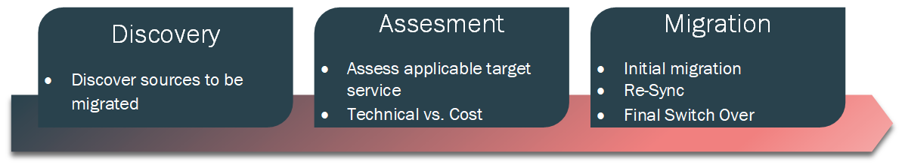
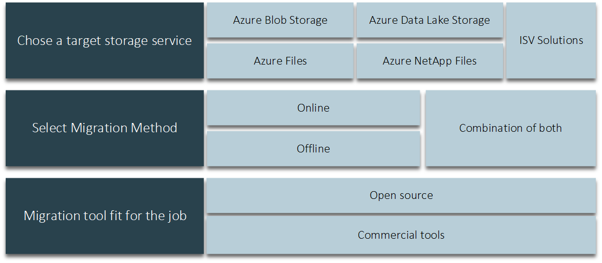

# Azure Storage migration overview

This article focuses on storage migrations to Azure and provides guidance on the following storage migration scenarios:

- Migration of unstructured data, such as files and objects
- Migration of block-based devices, such as disks and storage area networks (SANs)

## Migration of unstructured data

Migration of unstructured data includes both of the following scenarios:

- the migration of files from network attached storage (NAS) devices like SMB file shares or NFS exports to one of the Azure file offerings (Azure Files, Azure NetApp Files or various [independent software vendor (ISV) solutions](https://docs.microsoft.com/en-us/azure/storage/solution-integration/validated-partners/primary-secondary-storage/partner-overview)).
- the migration of objects from object storage devices to the Azure object storage platform (Blob Storage and Data Lake Storage).

### Migration phases

A full migration consists of several different phases: discovery, assessment, and migration.

#### Discovery phase

In the discovery phase, you determine all sources that need to be migrated like SMB shares, NFS exports or object namespaces. You can do this phase manually, or use automated tools.

#### Assessment phase

The assessment phase is critical to understand the available options for the migration. It is recommended to follow three steps.

There are several commercial (ISV) tools that can help with the assessment phase. See the [comparison matrix](../solution-integration/validated-partners/data-management/migration-tools-comparison.md).

##### Choose a target storage service

Choosing a target storage service mostly depends on the application or users who access the data. The correct choice depends on both technical and financial aspects. First, perform a technical assessment first to assess possible targets and determine which services are a fit. Next, perform a financial assessment to determine the best choice.

To help select the target storage service for the migration, evaluate the following aspects of each service:

- Protocol support
- Performance characteristics
- Limits of the target storage service

The following diagram is a simplified decision tree that helps guide you to the recommended Azure service. There are also ISV solutions that cover file and object-based protocols (SMB, NFS, S3), which you can also use.

After you perform the technical assessment, and it is clear which service or ISV solution(s) can be used, perform a cost assessment to determine the most cost-effective option.

To keep the decision tree simple, limits of the target storage service aren't incorporated in the diagram. To find out more about current limits, and to determine whether you need to modify your choices based on them, see:

- [Storage account limits](https://docs.microsoft.com/en-us/azure/azure-resource-manager/management/azure-subscription-service-limits#storage-limits)
- [Blob Storage limits](https://docs.microsoft.com/en-us/azure/azure-resource-manager/management/azure-subscription-service-limits#azure-blob-storage-limits)
- [Azure Files scalability and performance targets](https://docs.microsoft.com/en-us/azure/storage/files/storage-files-scale-targets)
- [Azure NetApp Files resource limits](https://docs.microsoft.com/en-us/azure/azure-netapp-files/azure-netapp-files-resource-limits)

If any of the limits pose a blocker for using a service, Azure supports several storage vendors that offer their solutions on Azure Marketplace. For information about validated ISV partners that provide file services, see [Azure Storage partners for primary and secondary storage](https://docs.microsoft.com/en-us/azure/storage/solution-integration/validated-partners/primary-secondary-storage/partner-overview).

##### Select the migration method

There are two basic migration methods for storage migrations.

- **Online**. The online method uses the network for data migration. Either the public internet or [Azure ExpressRoute](https://docs.microsoft.com/azure/expressroute/expressroute-introduction) can be used. If the service doesn't have a public endpoint (like Azure NetApp Files or 3rd party services that run as part of your virtual network), you must use a VPN with public internet.
- **Offline.** The offline method uses one of the [Azure Data Box](https://azure.microsoft.com/services/databox/) devices.

The decision to use an online method versus an offline method depends on the available network bandwidth. The online method is preferred in cases where there's sufficient network bandwidth to perform a migration within the needed timeline.

It is also possible to use a combination of both methods. For example, you could use an offline method for the initial bulk migration and an online method for migration of changes that happened after the initial migration. Using both methods simultaneously requires a high level of coordination and is not recommended for this reason. If you choose to do so, then isolate the data sets that are migrated online from the data sets that are migrated offline.

For more information about the different migration methods and guidelines, see [Choose an Azure solution for data transfer](https://docs.microsoft.com/azure/storage/common/storage-choose-data-transfer-solution) and [Migrate to Azure file shares](https://docs.microsoft.com/azure/storage/files/storage-files-migration-overview).

##### Choose the best migration tool for the job

There are various migration tools that you can use to perform the migration. Some are open source (like AzCopy, Robocopy, Xcopy, and Rsync) while others are commercial (like Azure File Sync and ISV partner solutions like Datadobi, Komprise, Data Dynamics, etc.).

Open-source tools work well for small-scale migrations. For cases that includes migration from Windows file servers to Azure Files, Microsoft recommends that you start with Azure Files native capability and use [Azure File Sync](https://docs.microsoft.com/windows-server/manage/windows-admin-center/azure/azure-file-sync). For more complex migrations that consist of different sources, large capacity, or special requirements like throttling or detailed reporting with audit capabilities, ISV commercial tools are the best choice. These tools make the migration easier and reduce the risk significantly. Most commercial tools can also perform the discovery, which provides a valuable input for the assessment.

To compare various commercial tools, see the [comparison matrix](../solution-integration/validated-partners/data-management/migration-tools-comparison.md).

#### Migration phase

The migration phase is the final migration step that performs data movement and migration. Typically, you will run through the migration phase several times to accomplish an easier switchover. The migration phase consists of the following steps:

- **Initial migration.** The initial migration step migrates all the data from the source to the target. This step migrates the bulk of the data that needs to be migrated.
- **Re-sync.** A re-sync operation migrates any data that was changed after the initial migration step. You can repeat this step several times if there are a lot of changes. The goal of running multiple re-sync operations is to reduce the time it takes for the final step. For inactive data and for data that has no changes (like backup or archive data), you can skip this step.
- **Final switchover**. The final switchover step switches the active usage of the data from the source to the target and retires the source.

The duration of the migration for unstructured data depends on several aspects. Outside of the chosen method, the most critical factors are the total size of the data and file size distribution. The bigger the total data set, the longer the migration time. The smaller the average file size, the longer the migration time. If you have a large number of small files, then consider archiving them in large files (like to a .tar or .zip file), if applicable, as this will reduce the total migration time.

 

## Migration of block-based devices

Migration of block-based devices is typically done as part of virtual machine or physical host migration. It&#39;s a common misconception to delay block storage decisions until after the migration. If you make these decisions ahead of time with appropriate considerations for workload requirements, this leads to a smoother migration to the cloud.

To determine which workloads to migrate and which approach to take, see the [Azure Disk Storage documentation](https://docs.microsoft.com/azure/virtual-machines/disks-types), and resources on the [Disk Storage product page](https://azure.microsoft.com/services/storage/disks/#resources). You can learn about which disks fit your requirements, and the latest capabilities such as [disk bursting](https://docs.microsoft.com/azure/virtual-machines/disk-bursting). For information about how to migrate the virtual machines together with the underlying block-based devices, see the [Azure Migrate](https://docs.microsoft.com/azure/migrate/) documentation.

 

## See also

- [Choose an Azure solution for data transfer](https://docs.microsoft.com/azure/storage/common/storage-choose-data-transfer-solution?toc=/azure/storage/blobs/toc.json)
- [Commercial migration tools comparison](../solution-integration/validated-partners/data-management/migration-tools-comparison.md)
- [Migrate to Azure file shares](https://docs.microsoft.com/azure/storage/files/storage-files-migration-overview)
- [Migrate to Data Lake Storage with WANdisco LiveData Platform for Azure](https://docs.microsoft.com/azure/storage/blobs/migrate-gen2-wandisco-live-data-platform)
- [Copy or move data to Azure Storage with AzCopy](https://aka.ms/azcopy)
- [Migrate large datasets to Azure Blob Storage with AzReplicate](https://github.com/Azure/AzReplicate/tree/master/)