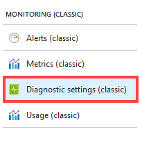
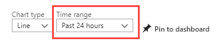
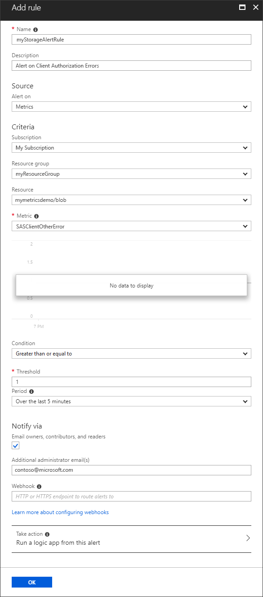
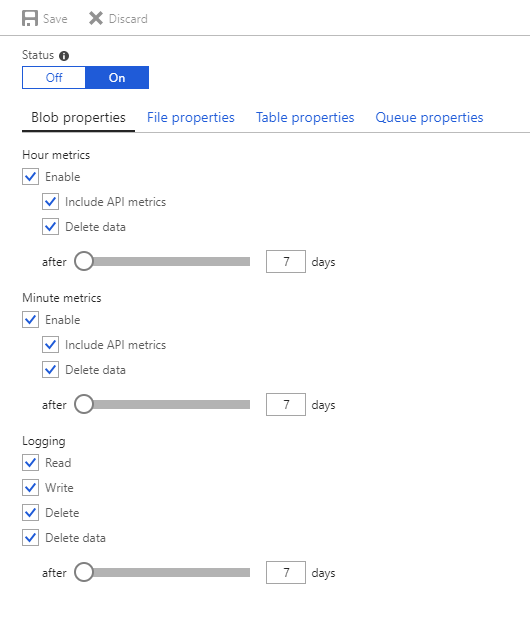

# Monitor a storage account in the Azure portal

[Azure Storage Analytics](storage-analytics.md) provides metrics for all storage services, and logs for blobs, queues, and tables. You can use the [Azure portal](https://portal.azure.com) to configure which metrics and logs are recorded for your account, and configure charts that provide visual representations of your metrics data. 

We recommend you review [Azure Monitor for Storage](../../azure-monitor/insights/storage-insights-overview.md) (preview). It is a feature of Azure Monitor that offers comprehensive monitoring of your Azure Storage accounts by delivering a unified view of your Azure Storage services performance, capacity, and availability. It does not require you to enable or configure anything, and you can immediately view these metrics from the pre-defined interactive charts and other visualizations included.

> [!NOTE]
> There are costs associated with examining monitoring data in the Azure portal. For more information, see [Storage Analytics](storage-analytics.md).
>
> Azure Files currently supports Storage Analytics metrics, but does not yet support logging.
>
> Premium performance block blob storage accounts don't support Storage Analytic metrics but they do support logging. You can enable logging programmatically via the REST API or the client library. If you want to view metrics with premium performance blob blob storage accounts, consider using [Azure Storage Metrics in Azure Monitor](storage-metrics-in-azure-monitor.md).
>
> For an in-depth guide on using Storage Analytics and other tools to identify, diagnose, and troubleshoot Azure Storage-related issues, see [Monitor, diagnose, and troubleshoot Microsoft Azure Storage](storage-monitoring-diagnosing-troubleshooting.md).
>

## Configure monitoring for a storage account

1. In the [Azure portal](https://portal.azure.com), select **Storage accounts**, then the storage account name to open the account dashboard.
1. Select **Diagnostics** in the **MONITORING** section of the menu blade.

    

1. Select the **type** of metrics data for each **service** you wish to monitor, and the **retention policy** for the data. You can also disable monitoring by setting **Status** to **Off**.

    

   To set the data retention policy, move the **Retention (days)** slider or enter the number of days of data to retain, from 1 to 365. The default for new storage accounts is seven days. If you do not want to set a retention policy, enter zero. If there is no retention policy, it is up to you to delete the monitoring data.

   > [!WARNING]
   > You are charged when you manually delete metrics data. Stale analytics data (data older than your retention policy) is deleted by the system at no cost. We recommend setting a retention policy based on how long you want to retain storage analytics data for your account. See [Billing on storage metrics](storage-analytics-metrics.md#billing-on-storage-metrics) for more information.
   >

1. When you finish the monitoring configuration, select **Save**.

A default set of metrics is displayed in charts on the storage account blade, as well as the individual service blades (blob, queue, table, and file). Once you've enabled metrics for a service, it may take up to an hour for data to appear in its charts. You can select **Edit** on any metric chart to configure which metrics are displayed in the chart.

You can disable metrics collection and logging by setting **Status** to **Off**.

> [!NOTE]
> Azure Storage uses [table storage](storage-introduction.md#table-storage) to store the metrics for your storage account, and stores the metrics in tables in your account. For more information, see. [How metrics are stored](storage-analytics-metrics.md#how-metrics-are-stored).
>

## Customize metrics charts

Use the following procedure to choose which storage metrics to view in a metrics chart.

1. Start by displaying a storage metric chart in the Azure portal. You can find charts on the **storage account blade** and in the **Metrics** blade for an individual service (blob, queue, table, file).

   In this example, uses the following chart that appears on the **storage account blade**:

   

1. Click anywhere within the chart to edit the chart.

1. Next, select the **Time Range** of the metrics to display in the chart, and the **service** (blob, queue, table, file) whose metrics you wish to display. Here, the past week's metrics are selected to display for the blob service:

   

1. Select the individual **metrics** you'd like displayed in the chart, then click **OK**.

   

Your chart settings do not affect the collection, aggregation, or storage of monitoring data in the storage account.

### Metrics availability in charts

The list of available metrics changes based on which service you've chosen in the drop-down, and the unit type of the chart you're editing. For example, you can select percentage metrics like *PercentNetworkError* and *PercentThrottlingError* only if you're editing a chart that displays units in percentage:

### Metrics resolution

The metrics you selected in **Diagnostics** determines the resolution of the metrics that are available for your account:

* **Aggregate** monitoring provides metrics such as ingress/egress, availability, latency, and success percentages. These metrics are aggregated from the blob, table, file, and queue services.
* **Per API** provides finer resolution, with metrics available for individual storage operations, in addition to the service-level aggregates.

## Configure metrics alerts

You can create alerts to notify you when thresholds have been reached for storage resource metrics.

1. To open the **Alert rules blade**, scroll down to the **MONITORING** section of the **Menu blade** and select **Alerts (classic)**.
2. Select **Add metric alert (classic)** to open the **Add an alert rule** blade
3. Enter a **Name** and **Description** for your new alert rule.
4. Select the **Metric** for which you'd like to add an alert, an alert **Condition**, and a **Threshold**. The threshold unit type changes depending on the metric you've chosen. For example, "count" is the unit type for *ContainerCount*, while the unit for the *PercentNetworkError* metric is a percentage.
5. Select the **Period**. Metrics that reach or exceed the Threshold within the period trigger an alert.
6. (Optional) Configure **Email** and **Webhook** notifications. For more information on webhooks, see [Configure a webhook on an Azure metric alert](../../azure-monitor/platform/alerts-webhooks.md). If you do not configure email or webhook notifications, alerts will appear only in the Azure portal.

## Add metrics charts to the portal dashboard

You can add Azure Storage metrics charts for any of your storage accounts to your portal dashboard.

1. Select click **Edit dashboard** while viewing your dashboard in the [Azure portal](https://portal.azure.com).
1. In the **Tile Gallery**, select **Find tiles by** > **Type**.
1. Select **Type** > **Storage accounts**.
1. In **Resources**, select the storage account whose metrics you wish to add to the dashboard.
1. Select **Categories** > **Monitoring**.
1. Drag-and-drop the chart tile onto your dashboard for the metric you'd like displayed. Repeat for all metrics you'd like displayed on the dashboard. In the following image, the "Blobs - Total requests" chart is highlighted as an example, but all the charts are available for placement on your dashboard.

   
1. Select **Done customizing** near the top of the dashboard when you're done adding charts.

Once you've added charts to your dashboard, you can further customize them as described in Customize metrics charts.

## Configure logging

You can instruct Azure Storage to save diagnostics logs for read, write, and delete requests for the blob, table, and queue services. The data retention policy you set also applies to these logs.

> [!NOTE]
> Azure Files currently supports Storage Analytics metrics, but does not yet support logging.
>

1. In the [Azure portal](https://portal.azure.com), select **Storage accounts**, then the name of the storage account to open the storage account blade.
1. Select **Diagnostics settings (classic)** in the **Monitoring (classic)** section of the menu blade.

    

1. Ensure **Status** is set to **On**, and select the **services** for which you'd like to enable logging.

    
1. Click **Save**.

The diagnostics logs are saved in a blob container named *$logs* in your storage account. You can view the log data using a storage explorer like the [Microsoft Storage Explorer](https://storageexplorer.com), or programmatically using the storage client library or PowerShell.

For information about accessing the $logs container, see [Storage analytics logging](storage-analytics-logging.md).

## Next steps

* Find more details about [metrics, logging, and billing](storage-analytics.md) for Storage Analytics.
