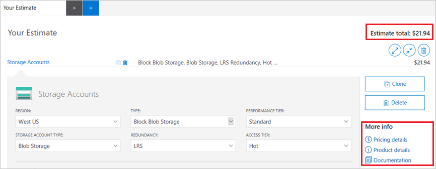
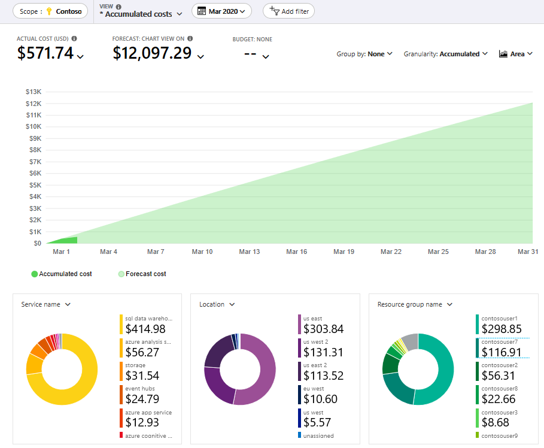
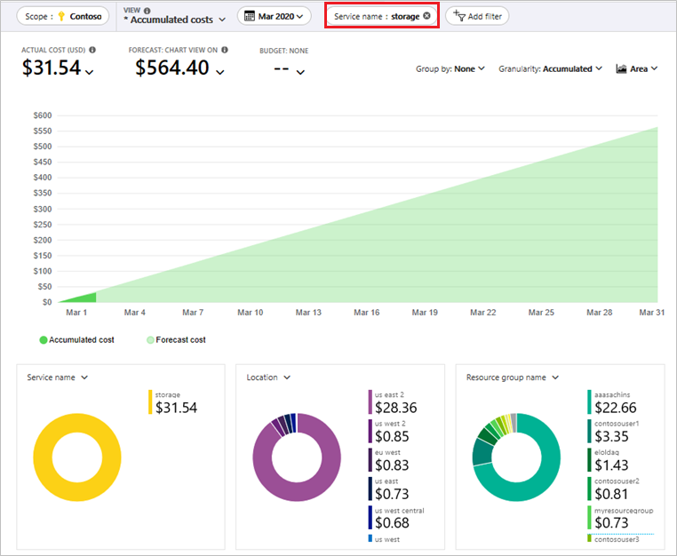

# Plan and manage costs for Azure Blob Storage

This article helps you plan and manage costs for Azure Blob Storage. First, estimate costs by using the Azure pricing calculator. After you create your storage account, optimize the account so that you pay only for what you need. Use cost management features to set budgets and monitor costs. You can also review forecasted costs, and monitor spending trends to identify areas where you might want to act.

Keep in mind that costs for Blob Storage are only a portion of the monthly costs in your Azure bill. Although this article explains how to estimate and manage costs for Blob Storage, you're billed for all Azure services and resources used for your Azure subscription, including the third-party services. After you're familiar with managing costs for Blob Storage, you can apply similar methods to manage costs for all the Azure services used in your subscription.

## Estimate costs

Use the [Azure pricing calculator](https://azure.microsoft.com/pricing/calculator/) to estimate costs before you create and begin transferring data to an Azure Storage account.

1. On the [Azure pricing calculator](https://azure.microsoft.com/pricing/calculator/) page, choose the **Storage Accounts** tile.

2. Scroll down the page and locate the **Storage Accounts** section of your estimate.

3. Choose options from the drop-down lists.

   As you modify the value of these drop-down lists, the cost estimate changes. That estimate appears in the upper corner as well as the bottom of the estimate.

   

   As you change the value of the **Type** drop-down list, other options that appear on this worksheet change as well. Use the links in the **More Info** section to learn more about what each option means and how these options affect the price of storage-related operations.

4. Modify the remaining options to see their effect on your estimate.

   > [!TIP]
   > - To view an Excel template which can help you to itemize the amount of storage and number of operations required by your workloads, see [Estimating Pricing for Azure Block Blob Deployments](https://azure.github.io/Storage/docs/application-and-user-data/code-samples/estimate-block-blob/). 
   > 
   >   You can use that information as input to the Azure pricing calculator.
   >
   > - For more information about how to estimate the cost of archiving data that is rarely used, see [Estimate the cost of archiving data](../blobs/archive-cost-estimation.md).

## Understand the full billing model for Azure Blob Storage

Azure Blob Storage runs on Azure infrastructure that accrues costs when you deploy new resources. It's important to understand that there could be other additional infrastructure costs that might accrue.

### How you're charged for Azure Blob Storage

When you create or use Blob Storage resources, you'll be charged for the following meters:

| Meter | Unit |
|---|---|
| Data storage | Per GB / per month|
| Operations | Per transaction |
| Data transfer | Per GB |
| Metadata | Per GB / per month1 |
| Blob index tags | Per tag2  |
| Change feed | Per logged change2 |
| Encryption scopes | Per month2 |
| Query acceleration | Per GB scanned & Per GB returned |

1 Applies only to accounts that have a hierarchical namespace. 
2 Applies only if you enable the feature. 

Data traffic might also incur networking costs. See the [Bandwidth pricing](https://azure.microsoft.com/pricing/details/data-transfers/).

At the end of your billing cycle, the charges for each meter are summed. Your bill or invoice shows a section for all Azure Blob Storage costs. There's a separate line item for each meter.

Data storage and metadata are billed per GB on a monthly basis. For data and metadata stored for less than a month, you can estimate the impact on your monthly bill by calculating the cost of each GB per day. You can use a similar approach to estimating the cost of encryption scopes that are in use for less than a month. The number of days in any given month varies. Therefore, to obtain the best approximation of your costs in a given month, make sure to divide the monthly cost by the number of days that occur in that month.

### Finding the unit price for each meter

To find unit prices, open the correct pricing page and select the appropriate file structure. Then, apply the appropriate redundancy, region, and currency filters. Prices for each meter appear in a table. Prices differ based on other settings in your account such as data redundancy options, access tier and performance tier.

The correct pricing page and file structure matter mostly to the cost of reading and writing data as the cost to store data is essentially unchanged by those selections. To accurately estimate the cost of reading and writing data, start by determining which [Storage account endpoint](storage-account-overview.md#storage-account-endpoints) clients, applications, and workloads will use to read and write data.  

#### Pricing requests to the blob service endpoint

The format of the blob service endpoint is `https://<storage-account>.blob.core.windows.net` and is the most common endpoint used by tools and applications that interact with Blob Storage. 

Requests can originate from any of these sources:

- Hadoop workloads that use the [WASB](https://hadoop.apache.org/docs/current/hadoop-azure/index.html) driver

- Clients that use [Blob Storage REST APIs](/rest/api/storageservices/blob-service-rest-api) or Blob Storage APIs from an Azure Storage client library

- Transfers to [Network File System (NFS) 3.0](../blobs/network-file-system-protocol-support.md) mounted containers

- Transfers made by using the [SSH File Transfer Protocol (SFTP)](../blobs/secure-file-transfer-protocol-support.md)

The correct pricing page for these requests is the [Block blob pricing](https://azure.microsoft.com/pricing/details/storage/blobs/) page. 

Requests to this endpoint can also occur in accounts that have a hierarchical namespace. In fact, to use NFS 3.0 and SFTP protocols, you must first enable the hierarchical namespace feature of the account. 

If your account has the hierarchical namespace feature enabled, make sure that the **File Structure** drop-down list is set to **Hierarchical Namespace (NFS v3.0, SFTP Protocol)**. Otherwise, make sure that it is set to **Flat Namespace**.

#### Pricing requests to the Data Lake Storage endpoint

The format of the Data Lake Storage endpoint is `https://<storage-account>.dfs.core.windows.net` and is most common endpoint used by analytic workloads and applications. This endpoint is typically used with accounts that have a hierarchical namespace but not always.

Requests can originate from any of these sources:

- Hadoop workloads that use the [Azure Blob File System driver (ABFS)](../blobs/data-lake-storage-abfs-driver.md) driver

- Clients that use [Data Lake Storage Gen2 REST APIs](/rest/api/storageservices/data-lake-storage-gen2) or Data Lake Storage Gen2 APIs from an Azure Storage client library

The correct pricing page for these requests is the [Azure Data Lake Storage Gen2 pricing](https://azure.microsoft.com/pricing/details/storage/data-lake/) page. 

If your account does not have the hierarchical namespace feature enabled, but you expect clients, workloads, or applications to make requests over the Data Lake Storage endpoint of your account, then set the **File Structure** drop-down list to **Flat Namespace**. Otherwise, make sure that it is set to **Hierarchical Namespace**.

#### Find the price of each operation

Each request made by tools such as AzCopy or Azure Storage Explorer arrives to the service in the form of a REST operation. This is also true for a custom application that leverages an Azure Storage Client library. 

To determine the price of each operation, you must first determine how that operation is classified in terms of its _type_. That's because the pricing pages list prices only by operation type and not by each individual operation. To see how each operation maps to an operation type, see [Map each REST operation to a price](../blobs/map-rest-apis-transaction-categories.md).

### Using Azure Prepayment with Azure Blob Storage

You can pay for Azure Blob Storage charges with your Azure Prepayment (previously called monetary commitment) credit. However, you can't use Azure Prepayment credit to pay for charges for third party products and services including those from the Azure Marketplace.

## Optimize costs

Consider using these options to reduce costs.

- Analyze existing containers and blobs

- Reserve storage capacity

- Organize data into access tiers

- Automatically move data between access tiers

This section covers each option in more detail.

#### Analyze existing containers and blobs

If you've been using Blob Storage for some time, you should periodically review the contents of your containers to identify opportunities to reduce your costs. By understanding how your blobs are stored, organized, and used in production, you can better optimize the tradeoffs between availability, performance, and cost of those blobs.

See any of these articles to itemize and analyze your existing containers and blobs:

- [Tutorial: Analyze blob inventory reports](../blobs/storage-blob-inventory-report-analytics.md)

- [Tutorial: Calculate container statistics by using Databricks](../blobs/storage-blob-calculate-container-statistics-databricks.md)

- [Calculate blob count and total size per container using Azure Storage inventory](../blobs/calculate-blob-count-size.md)

#### Reserve storage capacity

You can save money on storage costs for blob data with Azure Storage reserved capacity. Azure Storage reserved capacity offers you a discount on capacity for block blobs and for Azure Data Lake Storage Gen2 data in standard storage accounts when you commit to a reservation for either one year or three years. A reservation provides a fixed amount of storage capacity for the term of the reservation. Azure Storage reserved capacity can significantly reduce your capacity costs for block blobs and Azure Data Lake Storage Gen2 data.

To learn more, see [Optimize costs for Blob Storage with reserved capacity](../blobs/storage-blob-reserved-capacity.md).

#### Organize data into access tiers

You can reduce costs by placing blob data into the most cost effective access tiers. Choose from three tiers that are designed to optimize your costs around data use. For example, the *hot* tier has a higher storage cost but lower access cost. Therefore, if you plan to access data frequently, the hot tier might be the most cost-efficient choice. If you plan to access data less frequently, the *cold* or *archive* tier might make the most sense because it raises the cost of accessing data while reducing the cost of storing data. 

See any of these articles:

- [Access tiers for blob data](../blobs/access-tiers-overview.md?tabs=azure-portal)

- [Best practices for using blob access tiers](../blobs/access-tiers-best-practices.md)

- [Estimate the cost of archiving data](../blobs/archive-cost-estimation.md)

#### Automatically move data between access tiers

Use lifecycle management policies to periodically move data between tiers to save the most money. These policies can move data to by using rules that you specify. For example, you might create a rule that moves blobs to the archive tier if that blob hasn't been modified in 90 days. By creating policies that adjust the access tier of your data, you can design the least expensive storage options for your needs.

To learn more, see [Manage the Azure Blob Storage lifecycle](../blobs/lifecycle-management-overview.md?tabs=azure-portal)

## Create budgets

You can create [budgets](../../cost-management-billing/costs/tutorial-acm-create-budgets.md?WT.mc_id=costmanagementcontent_docsacmhorizontal_-inproduct-learn) to manage costs and create alerts that automatically notify stakeholders of spending anomalies and overspending risks. Alerts are based on spending compared to budget and cost thresholds. Budgets and alerts are created for Azure subscriptions and resource groups, so they're useful as part of an overall cost monitoring strategy. However, they might have limited functionality to manage individual Azure service costs like the cost of Azure Storage because they are designed to track costs at a higher level.

## Monitor costs

As you use Azure resources with Azure Storage, you incur costs. Resource usage unit costs vary by time intervals (seconds, minutes, hours, and days) or by unit usage (bytes, megabytes, and so on.) Costs are incurred as soon as usage of Azure Storage starts. You can see the costs in the [cost analysis](../../cost-management-billing/costs/quick-acm-cost-analysis.md?WT.mc_id=costmanagementcontent_docsacmhorizontal_-inproduct-learn) pane in the Azure portal.

When you use cost analysis, you can view Azure Storage costs in graphs and tables for different time intervals. Some examples are by day, current and prior month, and year. You can also view costs against budgets and forecasted costs. Switching to longer views over time can help you identify spending trends and see where overspending might have occurred. If you've created budgets, you can also easily see where they exceeded.

> [!NOTE]
> Cost analysis supports different kinds of Azure account types. To view the full list of supported account types, see [Understand Cost Management data](../../cost-management-billing/costs/understand-cost-mgt-data.md?WT.mc_id=costmanagementcontent_docsacmhorizontal_-inproduct-learn). To view cost data, you need at least read access for your Azure account. For information about assigning access to Azure Cost Management data, see [Assign access to data](../../cost-management-billing/costs/assign-access-acm-data.md?WT.mc_id=costmanagementcontent_docsacmhorizontal_-inproduct-learn).

To view Azure Storage costs in cost analysis:

1. Sign in to the [Azure portal](https://portal.azure.com).

2. Open the **Cost Management + Billing** window, select **Cost management** from the menu and then select **Cost analysis**. You can then change the scope for a specific subscription from the **Scope** dropdown.

   

4. To view only costs for Azure Storage, select **Add filter** and then select **Service name**. Then, choose **storage** from the list.

   Here's an example showing costs for just Azure Storage:

   

In the preceding example, you see the current cost for the service. Costs by Azure regions (locations) and by resource group also appear. 
You can add other filters as well (For example: a filter to see costs for specific storage accounts).

## Export cost data

You can also [export your cost data](../../cost-management-billing/costs/tutorial-export-acm-data.md?WT.mc_id=costmanagementcontent_docsacmhorizontal_-inproduct-learn) to a storage account. This is helpful when you need or others to do additional data analysis for costs. For example, a finance team can analyze the data using Excel or Power BI. You can export your costs on a daily, weekly, or monthly schedule and set a custom date range. Exporting cost data is the recommended way to retrieve cost datasets.

## Avoid billing surprises

Some actions, such as changing the default access tier of your account, can lead to costs that you might not expect. While articles about each feature contain information about how to avoid unexpected costs, this table captures common causes.  

| Category | Action | Potential impact on your bill |
|----------|--------|-------------------------------|
| Access tiers | Changing the default access tier setting | If your account contains a large number of blobs for which the access tier is inferred, then a change to this setting can incur a significant cost.   A change to the default access tier setting of a storage account applies to all blobs in the account for which an access tier hasn't been explicitly set. For example, if you toggle the default access tier setting from hot to cool in a general-purpose v2 account, then you're charged for write operations (per 10,000) for all blobs for which the access tier is inferred. You're charged for both read operations (per 10,000) and data retrieval (per GB) if you toggle from cool to hot in a general-purpose v2 account.   For more information, see [Default account access tier setting](../blobs/access-tiers-overview.md#default-account-access-tier-setting). |
| Access tiers | Rehydrating from archive  | High priority rehydration from archive can lead to higher than normal bills. Microsoft recommends reserving high-priority rehydration for use in emergency data restoration situations.   For more information, see [Rehydration priority](../blobs/archive-rehydrate-overview.md#rehydration-priority).|
| Data protection | Enabling blob soft delete | Overwriting blobs can lead to blob snapshots. Unlike the case where a blob is deleted, the creation of these snapshots isn't logged. This can lead to unexpected storage costs. Consider whether data that is frequently overwritten should be placed in an account that doesn't have soft delete enabled.  For more information, see [How overwrites are handled when soft delete is enabled](../blobs/soft-delete-blob-overview.md#how-overwrites-are-handled-when-soft-delete-is-enabled).|
| Data protection | Enabling blob versioning | Every write operation on a blob creates a new version. As is the case with enabling blob soft delete, consider whether data that is frequently overwritten should be placed in an account that doesn't have versioning enabled.   For more information, see [Versioning on write operations](../blobs/versioning-overview.md#versioning-on-write-operations). |
| Monitoring | Enabling Storage Analytics logs (classic logs)| Storage analytics logs can accumulate in your account over time if the retention policy is not set. Make sure to set the retention policy to avoid log buildup which can lead to unexpected capacity charges.  For more information, see [Modify log data retention period](manage-storage-analytics-logs.md#modify-log-data-retention-period) |
| Protocols | Enabling SSH File Transfer Protocol (SFTP) support| Enabling the SFTP endpoint incurs an hourly cost. To avoid passive charges, consider enabling SFTP only when you are actively using it to transfer data.   For guidance about how to enable and then disable SFTP support, see [Connect to Azure Blob Storage by using the SSH File Transfer Protocol (SFTP)](../blobs/secure-file-transfer-protocol-support-how-to.md). |

## Frequently asked questions (FAQ)

See [Managing costs FAQ](../blobs/storage-blob-faq.yml#managing-costs).

## Next steps

- Learn more on how pricing works with Azure Storage. See [Azure Storage Overview pricing](https://azure.microsoft.com/pricing/details/storage/).
- Understanding how your blobs and containers are stored, organized, and used in production so that you better optimize the tradeoffs between cost and performance. See [Tutorial: Analyze blob inventory reports](../blobs/storage-blob-inventory-report-analytics.md).
- [Optimize costs for Blob Storage with reserved capacity](../blobs/storage-blob-reserved-capacity.md).
- Learn [how to optimize your cloud investment with Azure Cost Management](../../cost-management-billing/costs/cost-mgt-best-practices.md?WT.mc_id=costmanagementcontent_docsacmhorizontal_-inproduct-learn).
- Learn more about managing costs with [cost analysis](../../cost-management-billing/costs/quick-acm-cost-analysis.md?WT.mc_id=costmanagementcontent_docsacmhorizontal_-inproduct-learn).
- Learn about how to [prevent unexpected costs](../../cost-management-billing/cost-management-billing-overview.md?WT.mc_id=costmanagementcontent_docsacmhorizontal_-inproduct-learn).
- Take the [Cost Management](/training/paths/control-spending-manage-bills?WT.mc_id=costmanagementcontent_docsacmhorizontal_-inproduct-learn) guided learning course.
