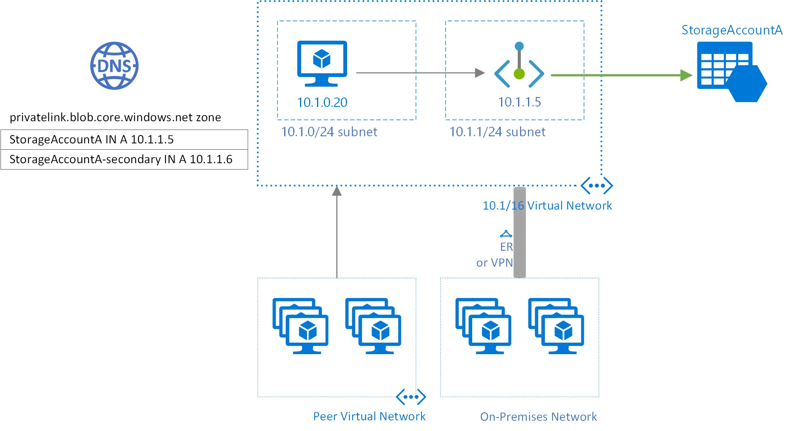

# Use private endpoints for Azure Storage

You can use [private endpoints](../../private-link/private-endpoint-overview.md) for your Azure Storage accounts to allow clients on a virtual network (VNet) to securely access data over a [Private Link](../../private-link/private-link-overview.md). The private endpoint uses a separate IP address from the VNet address space for each storage account service. Network traffic between the clients on the VNet and the storage account traverses over the VNet and a private link on the Microsoft backbone network, eliminating exposure from the public internet.

> [!NOTE]
> Private endpoints are not available for general-purpose v1 storage accounts.   

Using private endpoints for your storage account enables you to:

- Secure your storage account by configuring the storage firewall to block all connections on the public endpoint for the storage service.
- Increase security for the virtual network (VNet), by enabling you to block exfiltration of data from the VNet.
- Securely connect to storage accounts from on-premises networks that connect to the VNet using [VPN](../../vpn-gateway/vpn-gateway-about-vpngateways.md) or [ExpressRoutes](../../expressroute/expressroute-locations.md) with private-peering.

## Conceptual overview

A private endpoint is a special network interface for an Azure service in your [Virtual Network](../../virtual-network/virtual-networks-overview.md) (VNet). When you create a private endpoint for your storage account, it provides secure connectivity between clients on your VNet and your storage. The private endpoint is assigned an IP address from the IP address range of your VNet. The connection between the private endpoint and the storage service uses a secure private link.

Applications in the VNet can connect to the storage service over the private endpoint seamlessly, **using the same connection strings and authorization mechanisms that they would use otherwise**. Private endpoints can be used with all protocols supported by the storage account, including REST and SMB.

Private endpoints can be created in subnets that use [Service Endpoints](../../virtual-network/virtual-network-service-endpoints-overview.md). Clients in a subnet can thus connect to one storage account using private endpoint, while using service endpoints to access others.

When you create a private endpoint for a storage service in your VNet, a consent request is sent for approval to the storage account owner. If the user requesting the creation of the private endpoint is also an owner of the storage account, this consent request is automatically approved.

Storage account owners can manage consent requests and the private endpoints through the '*Private endpoints*' tab for the storage account in the [Azure portal](https://portal.azure.com).

> [!TIP]
> If you want to restrict access to your storage account through the private endpoint only, configure the storage firewall to deny or control access through the public endpoint.

You can secure your storage account to only accept connections from your VNet by [configuring the storage firewall](storage-network-security.md#change-the-default-network-access-rule) to deny access through its public endpoint by default. You don't need a firewall rule to allow traffic from a VNet that has a private endpoint, since the storage firewall only controls access through the public endpoint. Private endpoints instead rely on the consent flow for granting subnets access to the storage service.

> [!NOTE]
> When copying blobs between storage accounts, your client must have network access to both accounts. So if you choose to use a private link for only one account (either the source or the destination), make sure that your client has network access to the other account. To learn about other ways to configure network access, see [Configure Azure Storage firewalls and virtual networks](storage-network-security.md?toc=/azure/storage/blobs/toc.json).

## Creating a private endpoint

To create a private endpoint by using the Azure Portal, see [Connect privately to a storage account from the Storage Account experience in the Azure portal](../../private-link/tutorial-private-endpoint-storage-portal.md).

To create a private endpoint by using PowerShell or the Azure CLI, see either of these articles. Both of them feature an Azure web app as the target service, but the steps to create a private link are the same for an Azure Storage account.

- [Create a private endpoint using Azure CLI](../../private-link/create-private-endpoint-cli.md)

- [Create a private endpoint using Azure PowerShell](../../private-link/create-private-endpoint-powershell.md)

When you create a private endpoint, you must specify the storage account and the storage service to which it connects.

You need a separate private endpoint for each storage resource that you need to access, namely [Blobs](../blobs/storage-blobs-overview.md), [Data Lake Storage Gen2](../blobs/data-lake-storage-introduction.md), [Files](../files/storage-files-introduction.md), [Queues](../queues/storage-queues-introduction.md), [Tables](../tables/table-storage-overview.md), or [Static Websites](../blobs/storage-blob-static-website.md). On the private endpoint, these storage services are defined as the **target sub-resource** of the associated storage account.

If you create a private endpoint for the Data Lake Storage Gen2 storage resource, then you should also create one for the Blob Storage resource. That's because operations that target the Data Lake Storage Gen2 endpoint might be redirected to the Blob endpoint. Similarly, if you add a private endpoint for Blob Storage only, and not for Data Lake Storage Gen2, some operations (such as Manage ACL, Create Directory, Delete Directory, etc.) will fail since the Gen2 APIs require a DFS private endpoint. By creating a private endpoint for both resources, you ensure that all operations can complete successfully.

> [!TIP]
> Create a separate private endpoint for the secondary instance of the storage service for better read performance on RA-GRS accounts.
> Make sure to create a general-purpose v2(Standard or Premium) storage account.

For read access to the secondary region with a storage account configured for geo-redundant storage, you need separate private endpoints for both the primary and secondary instances of the service. You don't need to create a private endpoint for the secondary instance for **failover**. The private endpoint will automatically connect to the new primary instance after failover. For more information about storage redundancy options, see [Azure Storage redundancy](storage-redundancy.md).

## Connecting to a private endpoint

Clients on a VNet using the private endpoint should use the same connection string for the storage account as clients connecting to the public endpoint. We rely upon DNS resolution to automatically route the connections from the VNet to the storage account over a private link.

> [!IMPORTANT]
> Use the same connection string to connect to the storage account using private endpoints as you'd use otherwise. Please don't connect to the storage account using its `privatelink` subdomain URL.

By default, We create a [private DNS zone](../../dns/private-dns-overview.md) attached to the VNet with the necessary updates for the private endpoints. However, if you're using your own DNS server, you may need to make additional changes to your DNS configuration. The section on [DNS changes](#dns-changes-for-private-endpoints) below describes the updates required for private endpoints.

## DNS changes for private endpoints

> [!NOTE]
> For details on how to configure your DNS settings for private endpoints, see [Azure Private Endpoint DNS configuration](../../private-link/private-endpoint-dns.md).

When you create a private endpoint, the DNS CNAME resource record for the storage account is updated to an alias in a subdomain with the prefix `privatelink`. By default, we also create a [private DNS zone](../../dns/private-dns-overview.md), corresponding to the `privatelink` subdomain, with the DNS A resource records for the private endpoints.

When you resolve the storage endpoint URL from outside the VNet with the private endpoint, it resolves to the public endpoint of the storage service. When resolved from the VNet hosting the private endpoint, the storage endpoint URL resolves to the private endpoint's IP address.

For the illustrated example above, the DNS resource records for the storage account 'StorageAccountA', when resolved from outside the VNet hosting the private endpoint, will be:

| Name                                                  | Type  | Value                                                 |
| :---------------------------------------------------- | :---: | :---------------------------------------------------- |
| `StorageAccountA.blob.core.windows.net`             | CNAME | `StorageAccountA.privatelink.blob.core.windows.net` |
| `StorageAccountA.privatelink.blob.core.windows.net` | CNAME | \<storage service public endpoint\>                   |
| \<storage service public endpoint\>                   | A     | \<storage service public IP address\>                 |

As previously mentioned, you can deny or control access for clients outside the VNet through the public endpoint using the storage firewall.

The DNS resource records for StorageAccountA, when resolved by a client in the VNet hosting the private endpoint, will be:

| Name  | Type | Value |
| :--- | :---: | :--- |
| `StorageAccountA.blob.core.windows.net` | CNAME | `StorageAccountA.privatelink.blob.core.windows.net` |
| `StorageAccountA.privatelink.blob.core.windows.net` | A | `10.1.1.5` |

This approach enables access to the storage account **using the same connection string** for clients on the VNet hosting the private endpoints, as well as clients outside the VNet.

If you are using a custom DNS server on your network, clients must be able to resolve the FQDN for the storage account endpoint to the private endpoint IP address. You should configure your DNS server to delegate your private link subdomain to the private DNS zone for the VNet, or configure the A records for `StorageAccountA.privatelink.blob.core.windows.net` with the private endpoint IP address.

> [!TIP]
> When using a custom or on-premises DNS server, you should configure your DNS server to resolve the storage account name in the `privatelink` subdomain to the private endpoint IP address. You can do this by delegating the `privatelink` subdomain to the private DNS zone of the VNet or by configuring the DNS zone on your DNS server and adding the DNS A records.

The recommended DNS zone names for private endpoints for storage services, and the associated endpoint target sub-resources, are:

| Storage service        | Target sub-resource | Zone name                            |
| :--------------------- | :------------------ | :----------------------------------- |
| Blob service           | blob                | `privatelink.blob.core.windows.net`  |
| Data Lake Storage Gen2 | dfs                 | `privatelink.dfs.core.windows.net`   |
| File service           | file                | `privatelink.file.core.windows.net`  |
| Queue service          | queue               | `privatelink.queue.core.windows.net` |
| Table service          | table               | `privatelink.table.core.windows.net` |
| Static Websites        | web                 | `privatelink.web.core.windows.net`   |

For more information on configuring your own DNS server to support private endpoints, refer to the following articles:

- [Name resolution for resources in Azure virtual networks](../../virtual-network/virtual-networks-name-resolution-for-vms-and-role-instances.md#name-resolution-that-uses-your-own-dns-server)
- [DNS configuration for private endpoints](../../private-link/private-endpoint-overview.md#dns-configuration)

## Pricing

For pricing details, see [Azure Private Link pricing](https://azure.microsoft.com/pricing/details/private-link).

## Known Issues

Keep in mind the following known issues about private endpoints for Azure Storage.

### Storage access constraints for clients in VNets with private endpoints

Clients in VNets with existing private endpoints face constraints when accessing other storage accounts that have private endpoints. For example, suppose a VNet N1 has a private endpoint for a storage account A1 for Blob storage. If storage account A2 has a private endpoint in a VNet N2 for Blob storage, then clients in VNet N1 must also access Blob storage in account A2 using a private endpoint. If storage account A2 does not have any private endpoints for Blob storage, then clients in VNet N1 can access Blob storage in that account without a private endpoint.

This constraint is a result of the DNS changes made when account A2 creates a private endpoint.

### Copying blobs between storage accounts

You can copy blobs between storage accounts by using private endpoints only if you use the Azure REST API, or tools that use the REST API. These tools include AzCopy, Storage Explorer, Azure PowerShell, Azure CLI, and the Azure Blob Storage SDKs.

Only private endpoints that target the `blob` storage resource endpoint are supported.  This includes REST API calls against Data Lake Storage Gen2 accounts in which the `blob` resource endpoint is referenced explicitly or implicitly. Private endpoints that target the Data Lake Storage Gen2 `dfs` endpoint or the `file` resource endpoint are not yet supported. Copying between storage accounts by using the Network File System (NFS) protocol is not yet supported.

## Next steps

- [Azure Private Endpoint DNS configuration](../../private-link/private-endpoint-dns.md)
- [Configure Azure Storage firewalls and virtual networks](storage-network-security.md)
- [Security recommendations for Blob storage](../blobs/security-recommendations.md)
