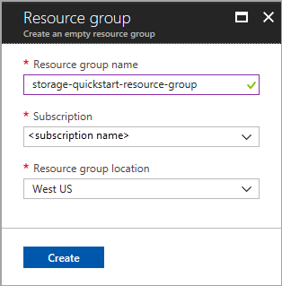
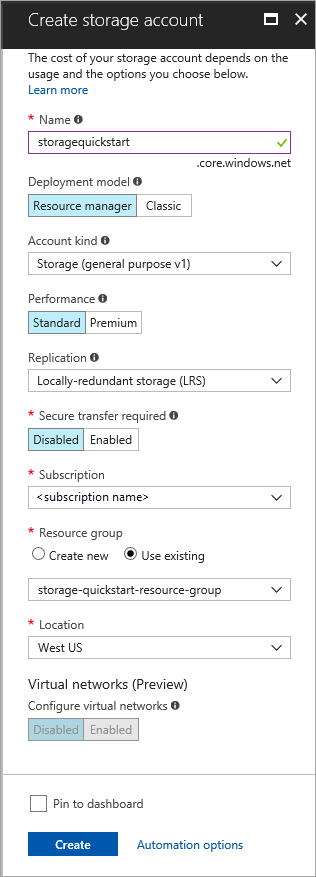

# Create a storage account

In this quickstart, you learn to create a storage account using the [Azure portal](https://portal.azure.com/), [Azure PowerShell](https://docs.microsoft.com/powershell/azure/overview), or [Azure CLI](https://docs.microsoft.com/cli/azure?view=azure-cli-latest).  

## Prerequisites

If you don't have an Azure subscription, create a [free account](https://azure.microsoft.com/free/) before you begin.

# [Portal](#tab/portal)

None.

# [PowerShell](#tab/powershell)

This quickstart requires the Azure PowerShell module version 3.6 or later. Run `Get-Module -ListAvailable AzureRM` to find your current version. If you need to install or upgrade, see [Install Azure PowerShell module](/powershell/azure/install-azurerm-ps).

# [Azure CLI](#tab/azure-cli)

You can log in to Azure and run Azure CLI commands in one of two ways:

- You can run CLI commands from within the Azure portal, in Azure Cloud Shell 
- You can install the CLI and run CLI commands locally  

### Use Azure Cloud Shell

Azure Cloud Shell is a free Bash shell that you can run directly within the Azure portal. It has the Azure CLI preinstalled and configured to use with your account. Click the **Cloud Shell** button on the menu in the upper-right of the Azure portal:

[](https://portal.azure.com)

The button launches an interactive shell that you can use to run the steps in this quickstart:

[](https://portal.azure.com)

### Install the CLI locally

You can also install and use the Azure CLI locally. This quickstart requires that you are running the Azure CLI version 2.0.4 or later. Run `az --version` to find the version. If you need to install or upgrade, see [Install Azure CLI 2.0](/cli/azure/install-azure-cli). 

---

## Log in to Azure

# [Portal](#tab/portal)

Log in to the [Azure portal](https://portal.azure.com).

# [PowerShell](#tab/powershell)

Log in to your Azure subscription with the `Connect-AzureRmAccount` command and follow the on-screen directions to authenticate.

```powershell
Connect-AzureRmAccount
```

# [Azure CLI](#tab/azure-cli)

To launch Azure Cloud Shell, log in to the [Azure portal](https://portal.azure.com).

To log into your local installation of the CLI, run the login command:

```cli
az login
```

---

## Create a resource group

An Azure resource group is a logical container into which Azure resources are deployed and managed. For more information on resource groups, see [Azure Resource Manager overview](../../azure-resource-manager/resource-group-overview.md).

# [Portal](#tab/portal)

To create a resource group in the Azure portal, follow these steps:

1. In the Azure portal, expand the menu on the left side to open the menu of services, and choose **Resource Groups**.
2. Click the **Add** button to add a new resource group.
3. Enter a name for the new resource group.
4. Select the subscription in which to create the new resource group.
5. Choose the location for the resource group.
6. Click the **Create** button.  



# [PowerShell](#tab/powershell)

To create a new resource group with PowerShell, use the [New-AzureRmResourceGroup](/powershell/module/azurerm.resources/new-azurermresourcegroup) command: 

```powershell
# put resource group in a variable so you can use the same group name going forward,
# without hardcoding it repeatedly
$resourceGroup = "storage-quickstart-resource-group"
New-AzureRmResourceGroup -Name $resourceGroup -Location $location 
```

If you're not sure which region to specify for the `-Location` parameter, you can retrieve a list of supported regions for your subscription with the [Get-AzureRmLocation](/powershell/module/azurerm.resources/get-azurermlocation) command:

```powershell
Get-AzureRmLocation | select Location 
$location = "westus"
```

# [Azure CLI](#tab/azure-cli)

To create a new resource group with Azure CLI, use the [az group create](/cli/azure/group#az_group_create) command. 

```azurecli-interactive
az group create \
    --name storage-quickstart-resource-group \
    --location westus
```

If you're not sure which region to specify for the `--location` parameter, you can retrieve a list of supported regions for your subscription with the [az account list-locations](/cli/azure/account#az_account_list) command.

```azurecli-interactive
az account list-locations \
    --query "[].{Region:name}" \
    --out table
```

---

## Create a storage account

Azure Storage offers the following types of storage accounts:

- **General-purpose accounts:** A general-purpose storage account provides access to all of the Azure Storage services: blobs, files, queues, and tables. A general-purpose storage account can be created in either a standard or a premium tier. The examples in this article show how to create a general-purpose storage account in the standard tier, which is the default storage account type. 
    
    General-purpose v2 accounts are the latest version of the general-purpose storage account. It's recommended that you create new storage accounts as **general-purpose v2 accounts**, to take advantage of newer features available to those accounts.  

- **Blob storage accounts:** A Blob storage account is a specialized storage account for storing unstructured object data. Blob storage accounts provide the same durability, availability, scalability, and performance features that are available with general-purpose v2 storage accounts. Blob storage accounts support storing block blobs and append blobs, but not page blobs.

For more information about storage account types, see [Azure storage account overview](storage-account-overview.md).

# [Portal](#tab/portal)

To create a general-purpose v2 storage account in the Azure portal, follow these steps:

1. In the Azure portal, expand the menu on the left side to open the menu of services, and choose **All services**. Then, scroll down to **Storage**, and choose **Storage accounts**. On the **Storage Accounts** window that appears, choose **Add**.
2. Enter a name for your storage account.
3. Set the **Account kind** field to **StorageV2 (general-purpose v2)**.
4. Leave the **Replication** field set to **Locally-redundant storage (LRS)**. Alternately, you can chooose **Zone-redundant storage (ZRS)**, **Geo-redundant storage (GRS)**, or **Read-access geo-redundant storage (RA-GRS)**.
5. Leave these fields set to their defaults: **Deployment model**, **Performance**, **Secure transfer required**.
6. Choose the subscription in which you want to create the storage account.
7. In the **Resource group** section, select **Use existing**, then choose the resource group you created in the previous section.
8. Choose the location for your new storage account.
9. Click **Create** to create the storage account.      



# [PowerShell](#tab/powershell)

To create a general-purpose v2 storage account from PowerShell with locally-redundant storage (LRS), use the [New-AzureRmStorageAccount](/powershell/module/azurerm.storage/New-AzureRmStorageAccount) command: 

```powershell
New-AzureRmStorageAccount -ResourceGroupName $resourceGroup `
  -Name "storagequickstart" `
  -Location $location `
  -SkuName Standard_LRS `
  -Kind StorageV2 
```

To create a general-purpose v2 storage account with zone-redundant storage (ZRS) (preview), geo-redundant storage (GRS), or read-access geo-redundant storage (RA-GRS), substitute the desired value in the table below for the **SkuName** parameter. 

|Replication option  |SkuName parameter  |
|---------|---------|
|Locally-redundant storage (LRS)     |Standard_LRS         |
|Zone-redundant storage (ZRS)     |Standard_ZRS         |
|Geo-redundant storage (GRS)     |Standard_GRS         |
|Read-access geo-redundant storage (GRS)     |Standard_RAGRS         |

# [Azure CLI](#tab/azure-cli)

To create a general-purpose v2 storage account from the Azure CLI with locally-redundant storage, use the [az storage account create](/cli/azure/storage/account#az_storage_account_create) command.

```azurecli-interactive
az storage account create \
    --name storagequickstart \
    --resource-group storage-quickstart-resource-group \
    --location westus \
    --sku Standard_LRS \
    --kind StorageV2
```

To create a general-purpose v2 storage account with zone-redundant storage (ZRS Preview), geo-redundant storage (GRS), or read-access geo-redundant storage (RA-GRS), substitute the desired value in the table below for the **sku** parameter. 

|Replication option  |sku parameter  |
|---------|---------|
|Locally-redundant storage (LRS)     |Standard_LRS         |
|Zone-redundant storage (ZRS)     |Standard_ZRS         |
|Geo-redundant storage (GRS)     |Standard_GRS         |
|Read-access geo-redundant storage (GRS)     |Standard_RAGRS         |

---

For more information about available replication options, see [Storage replication options](storage-redundancy.md).

## Clean up resources

If you wish to clean up the resources created by this quickstart, you can simply delete the resource group. Deleting the resource group also deletes the associated storage account, and any other resources associated with the resource group.

# [Portal](#tab/portal)

To remove a resource group using the Azure portal:

1. In the Azure portal, expand the menu on the left side to open the menu of services, and choose **Resource Groups** to display the list of your resource groups.
2. Locate the resource group to delete, and right-click the **More** button (**...**) on the right side of the listing.
3. Select **Delete resource group**, and confirm.

# [PowerShell](#tab/powershell)

To remove the resource group and its associated resources, including the new storage account, use the [Remove-AzureRmResourceGroup](/powershell/module/azurerm.resources/remove-azurermresourcegroup) command: 

```powershell
Remove-AzureRmResourceGroup -Name $resourceGroup
```

# [Azure CLI](#tab/azure-cli)

To remove the resource group and its associated resources, including the new storage account, use the [az group delete](/cli/azure/group#az_group_delete) command.

```azurecli-interactive
az group delete --name myResourceGroup
```

---

## Next steps

In this quick start, you've created a general-purpose standard storage account. To learn how to upload and download blobs to and from your storage account, continue to the Blob storage quickstart.

# [Portal](#tab/portal)

> [!div class="nextstepaction"]
> [Work with blobs using the Azure portal](../blobs/storage-quickstart-blobs-portal.md)

# [PowerShell](#tab/powershell)

> [!div class="nextstepaction"]
> [Work with blobs using PowerShell](../blobs/storage-quickstart-blobs-powershell.md)

# [Azure CLI](#tab/azure-cli)

> [!div class="nextstepaction"]
> [Work with blobs storage using the Azure CLI](../blobs/storage-quickstart-blobs-cli.md)

---
