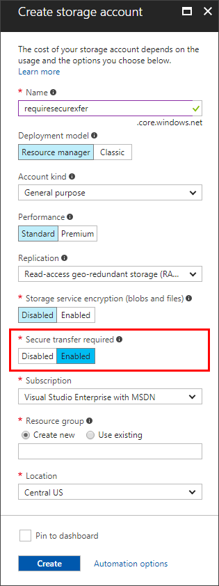
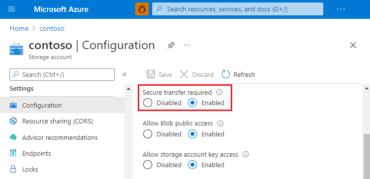

# Require secure transfer to ensure secure connections

You can configure your storage account to accept requests from secure connections only by setting the **Secure transfer required** property for the storage account. When you require secure transfer, any requests originating from an insecure connection are rejected. Microsoft recommends that you always require secure transfer for all of your storage accounts.

When secure transfer is required, a call to an Azure Storage REST API operation must be made over HTTPS. Any request made over HTTP is rejected. By default, the **Secure transfer required** property is enabled when you create a storage account.

Azure Policy provides a built-in policy to ensure that secure transfer is required for your storage accounts. For more information, see the **Storage** section in [Azure Policy built-in policy definitions](../../governance/policy/samples/built-in-policies.md#storage).

Connecting to an Azure file share over SMB without encryption fails when secure transfer is required for the storage account. Examples of insecure connections include those made over SMB 2.1 or SMB 3.x without encryption.

> [!NOTE]
> Because Azure Storage doesn't support HTTPS for custom domain names, this option is not applied when you're using a custom domain name.
>
> This secure transfer setting does not apply to TCP. Connections via NFS 3.0 protocol support in Azure Blob Storage using TCP, which is not secured, will succeed.

## Require secure transfer in the Azure portal

You can turn on the **Secure transfer required** property when you create a storage account in the [Azure portal](https://portal.azure.com). You can also enable it for existing storage accounts.

### Require secure transfer for a new storage account

1. Open the **Create storage account** pane in the Azure portal.
1. In the **Advanced** page, select the **Enable secure transfer** checkbox.

   

### Require secure transfer for an existing storage account

1. Select an existing storage account in the Azure portal.
1. In the storage account menu pane, under **Settings**, select **Configuration**.
1. Under **Secure transfer required**, select **Enabled**.

   

## Require secure transfer from code

To require secure transfer programmatically, set the *enableHttpsTrafficOnly* property to *True* on the storage account. You can set this property by using the Storage Resource Provider REST API, client libraries, or tools:

- [REST API](/rest/api/storagerp/storageaccounts)
- [PowerShell](/powershell/module/az.storage/set-azstorageaccount)
- [CLI](/cli/azure/storage/account)
- [NodeJS](https://www.npmjs.com/package/@azure/arm-storage/)
- [.NET SDK](https://www.nuget.org/packages/Microsoft.Azure.Management.Storage)
- [Python SDK](https://pypi.org/project/azure-mgmt-storage)
- [Ruby SDK](https://rubygems.org/gems/azure_mgmt_storage)

## Require secure transfer with PowerShell

[!INCLUDE [updated-for-az](../../../includes/updated-for-az.md)]

This sample requires the Azure PowerShell module Az version 0.7 or later. Run `Get-Module -ListAvailable Az` to find the version. If you need to install or upgrade, see [Install Azure PowerShell module](/powershell/azure/install-azure-powershell).

Run `Connect-AzAccount` to create a connection with Azure.

 Use the following command line to check the setting:

```powershell
Get-AzStorageAccount -Name "{StorageAccountName}" -ResourceGroupName "{ResourceGroupName}"
StorageAccountName     : {StorageAccountName}
Kind                   : Storage
EnableHttpsTrafficOnly : False
...

```

Use the following command line to enable the setting:

```powershell
Set-AzStorageAccount -Name "{StorageAccountName}" -ResourceGroupName "{ResourceGroupName}" -EnableHttpsTrafficOnly $True
StorageAccountName     : {StorageAccountName}
Kind                   : Storage
EnableHttpsTrafficOnly : True
...

```

## Require secure transfer with Azure CLI

[!INCLUDE [sample-cli-install](../../../includes/sample-cli-install.md)]

[!INCLUDE [quickstarts-free-trial-note](../../../includes/quickstarts-free-trial-note.md)]

 Use the following command to check the setting:

```azurecli-interactive
az storage account show -g {ResourceGroupName} -n {StorageAccountName}
{
  "name": "{StorageAccountName}",
  "enableHttpsTrafficOnly": false,
  "type": "Microsoft.Storage/storageAccounts"
  ...
}

```

Use the following command to enable the setting:

```azurecli-interactive
az storage account update -g {ResourceGroupName} -n {StorageAccountName} --https-only true
{
  "name": "{StorageAccountName}",
  "enableHttpsTrafficOnly": true,
  "type": "Microsoft.Storage/storageAccounts"
  ...
}

```

## Next steps

[Security recommendations for Blob storage](../blobs/security-recommendations.md)
