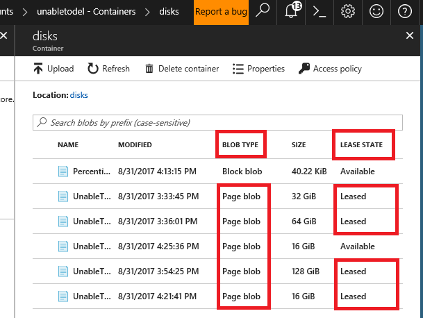
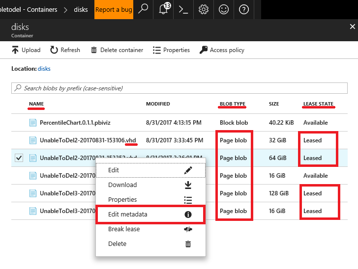
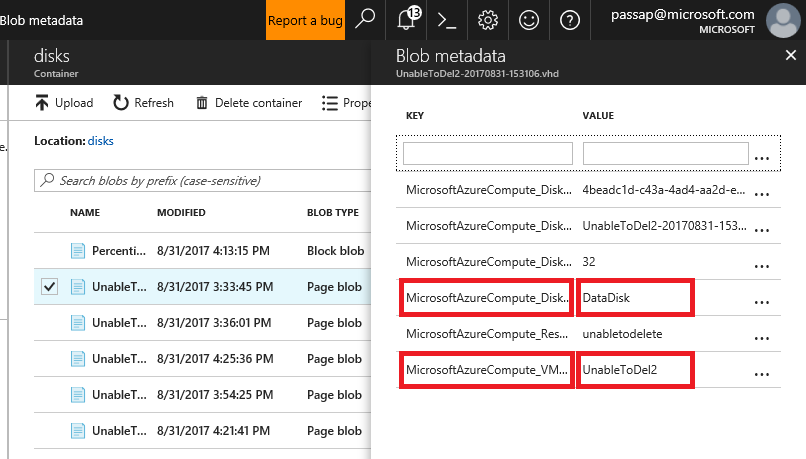

# Troubleshoot errors when you delete storage accounts, containers, or VHDs in Azure Resource Manager (ARM)

You might receive errors when you try to delete an Azure storage account, container, or virtual hard disk (VHD). This article provides troubleshooting guidance to help resolve storage object deletion problem in Azure Resource Manager (ARM).

Azure prevents deletion of disks that are leased and attached to a VM because VM corruption could occur if the lease is broken an attached disk were deleted without first detaching from the VM. Detaching disks from its VMs will automatically break the lease on the disks so the best practice to deleting a disk, container, or storage account is to first make sure that all disks are detached from VMs before deleting the storage objects.

## Symptoms
### Scenario 1
When you try to delete a storage account in a Resource Manager (ARM) deployment, you receive the following error message:

>_Failed to delete storage account 'StorageAccountName'. Error: The storage account cannot be deleted due to its artifacts being in use._

This problem can occur because the storage account contains at least one VHD(s) that is attache to a VM.

### Scenario 2
When you try to delete a container in a Resource Manager (ARM) deployment, you receive one of the following error message:

>_Failed to delete # out of # container(s): vhds: There is currently a lease on the container and no lease ID was specified in the request._

This problem can occur because the container contains at least one VHD(s) that is attached to a VM.

### Scenario 3
When you try to delete a VHD and receive the following error message:

>_Failed to delete # out of # blobs: BlobName.vhd: There is currently a lease on the blob and no lease ID was specified in the request._

This problem can occur because a VM is attached to the VHD you are trying to delete.

## Solution 
The process to delete the storage account, container, or disk in one of the above scenarios is:
1. [Identify all VMs with attach disks that prevent deletion](#Step-1:-Identify-all-VMs-and-disks-that-prevent-deletion-of-storage-objects)
2. [Delete all VMs with attached **OS disks**](#How-to-delete-VM-to-detach-OS-disk)
3. [Detach all **Data disks** from the VM](#Step-3:-Detach-data-disk-from-the-VM)
4. Delete the desired storage [account](storage-create-storage-account.md#delete-a-storage-account), [container](#Scenario-2:-Delete-a-storage-container), or [blob](#Scenario-3:-Delete-a-storage-blob)

### Step 1: Identify all VMs and disks that prevent deletion of storage objects

#### Scenario 1: Identifying objects that prevent deletion of the storage account
1. Sign in to the [Azure portal](https://portal.azure.com).
2. On the Hub menu, select **_All resources_**. Go to the storage account, under **_Blob Service_** select **_Containers_**.

    

3. In the list of containers, identify all containers where **_Lease State_** is **_Leased_** and follow steps in [Scenario 2: Identifying objects that prevent deletion of the blob container](#Scenario-2:-Identifying-objects-that-prevent-deletion-of-the-blob-container) for each **_Leased_** container.

#### Scenario 2: Identifying objects that prevent deletion in the blob container
1. Sign in to the [Azure portal](https://portal.azure.com).
2. On the Hub menu, select **_All resources_**. Go to the storage account, under **_Blob Service_** select **_Containers_** and find the container to be deleted.
3. Click to open the container and list of blobs inside it will appear. Follow steps 3-6 in [Scenario 3: Identifying VMs that prevent deletion of the VHD](#Scenario-3:-Identifying-VMs-that-prevent-deletion-of-the-VHD) for all blobs with the following properties:
    -	Blob Type = **Page blob**
    -	Lease State = **Leased**
    -	Name ending with **.vhd**

    

#### Scenario 3: Identifying VMs that prevent deletion of the VHD
1. Sign in to the [Azure portal](https://portal.azure.com).
2. On the Hub menu, select **_All resources_**. Go to the storage account, under **_Blob Service_** select **_Containers_** and browse to the blob to be deleted.
3. If the blob **_Lease State_** is **_Leased_**, right click, and select **_Edit Metadata_** to open Blob metadata pane. 

    

4. In Blob metadata pane, find MicrosoftAzureCompute_VMName key, the value of this key is the name of the VM that this disk is attached to. (See *Note if this field does not exist)
5. In Blob metadata pane, find MicrosoftAzureCompute_DiskType key.
 The value of this key is the disk type. (See *Note if this field does not exist). 

     

6. Record VM name and disk type then follow steps in [Detaching disk from a VM](Detaching disk from a VM) section.

> Note: _If MicrosoftAzureCompute_VMName and MicrosoftAzureCompute_DiskType does not appear in the blob metadata and/or the blob name does not end with .vhd, this indicate that the blob is leased but is not attached to a VM. Leased blobs cannot be deleted without breaking the lease first; however, leased blobs that are not attached to a VM will not prevent deletion of container or Storage Account containing it. To break lease, right click on the blob and select Break lease._

#### What is a lease?
A lease is a lock that can be used to control access to a blob (for example, a VHD). When a blob is leased, only the owners of the lease can access the blob. A lease is important for the following reasons:

* It prevents data corruption if multiple owners try to write to the same portion of the blob at the same time.
* It prevents the blob from being deleted if something is actively using it (for example, a VM).
* It prevents the storage account from being deleted if something is actively using it (for example, a VM).

### Step 2: Delete VM to detach OS disk
If the VHD is an OS disk, you must delete the VM to detach and remove the lease. No additional action will be required for data disks attached to this VM once these steps are completed:

1. Sign in to the [Azure portal](https://portal.azure.com).
2. On the _Hub_ menu, select **_Virtual Machines_**.
3. Select the VM that the VHD is attached to.
4. Make sure that nothing is actively using the virtual machine, and that you no longer need the virtual machine.
5. At the top of the **_VM details_** blade, select **_Delete_**, and then click **_Yes_** to confirm.
6. The VM should be deleted, but the VHD can be retained. However, the VHD should no longer be attached to a VM or have a lease on it. It may take a few minutes for the lease to be released. To verify that the lease is released, browse to the blob location and in the **_Blob properties_** pane, the **_Lease Status_** value should be **_Unlocked_**.

### Step 3: Detach data disk from the VM
If the VHD is a data disk, detach the VHD from the VM to remove the lease:

1. Sign in to the [Azure portal](https://portal.azure.com).
2. On the _Hub_ menu, select **_Virtual Machines_**.
3. Select the VM that the VHD is attached to.
4. Select **_Disks_** on the **_VM details_** blade.
5. Select the data disk that the VHD is attached to. You can determine which VHD is attached in the disk by checking the URL of the VHD.
6. Determine with certainty that nothing is actively using the data disk.
7. Click **_Detach_** on the **_Disk details_** blade.
8. The disk should now be detached from the VM, and the VHD should no longer have a lease on it. It may take a few minutes for the lease to be released. To verify that the lease has been released, browse to the blob location and in the **_Blob properties_** pane, the **_Lease Status_** value should be **_Unlocked_**.

### Step 4: Delete Storage object
#### Scenario 1: Delete a storage account
Follow the steps in [this article](storage-create-storage-account.md#delete-a-storage-account)

#### Scenario 2: Delete a storage container
1. Sign in to the [Azure portal](https://portal.azure.com).
2. On the _Hub_ menu, select **_All resources_**. Go to the storage account, under **_Blob Service_** select **_Containers_**.
3. Find the container to be deleted and ensure that its **_Lease State_** is not **_Leased_** then select it to show **_Container_** blade.
3. At the top of the **_Container_** blade, select **_Delete container_**, and then click **_Yes_** to confirm.
4. The container should be deleted when **_Successfully deleted container(s)_** message appears.

#### Scenario 3: Delete a storage blob
1. Sign in to the [Azure portal](https://portal.azure.com).
2. On the _Hub_ menu, select **_All resources_**. Go to the storage account, under **_Blob Service_** select **_Containers_**.
3. Drill down to find the blob to be deleted and ensure that its **_Lease State_** is not **_Leased_** then select to view its **_Blob Properties_**.
3. At the top of the **_Blob Properties_** blade, select **_Delete_**, and then click **_Yes_** to confirm.
4. The blob should be deleted when **_Successfully deleted blob(s)_** message appears.

