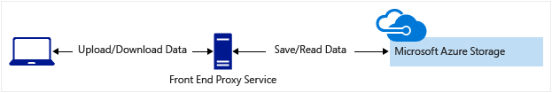
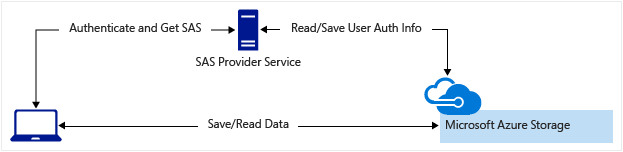

# Grant limited access to Azure Storage resources using shared access signatures (SAS)

A shared access signature (SAS) provides secure delegated access to resources in your storage account. With a SAS, you have granular control over how a client can access your data. For example:

- What resources the client may access.

- What permissions they have to those resources.

- How long the SAS is valid.

## Types of shared access signatures

Azure Storage supports three types of shared access signatures:

- User delegation SAS

- Service SAS

- Account SAS

### User delegation SAS

A user delegation SAS is secured with Microsoft Entra credentials and also by the permissions specified for the SAS. A user delegation SAS applies to Blob storage only.

For more information about the user delegation SAS, see [Create a user delegation SAS (REST API)](/rest/api/storageservices/create-user-delegation-sas).

### Service SAS

A service SAS is secured with the storage account key. A service SAS delegates access to a resource in only one of the Azure Storage services: Blob storage, Queue storage, Table storage, or Azure Files.

For more information about the service SAS, see [Create a service SAS (REST API)](/rest/api/storageservices/create-service-sas).

### Account SAS

An account SAS is secured with the storage account key. An account SAS delegates access to resources in one or more of the storage services. All of the operations available via a service or user delegation SAS are also available via an account SAS.

You can also delegate access to the following:

- Service-level operations (For example, the **Get/Set Service Properties** and **Get Service Stats** operations).

- Read, write, and delete operations that aren't permitted with a service SAS.

For more information about the account SAS, [Create an account SAS (REST API)](/rest/api/storageservices/create-account-sas).

> [!NOTE]
> Microsoft recommends that you use Microsoft Entra credentials when possible as a security best practice, rather than using the account key, which can be more easily compromised. When your application design requires shared access signatures for access to Blob storage, use Microsoft Entra credentials to create a user delegation SAS when possible for superior security. For more information, see [Authorize access to data in Azure Storage](authorize-data-access.md).

A shared access signature can take one of the following two forms:

- **Ad hoc SAS**. When you create an ad hoc SAS, the start time, expiry time, and permissions are specified in the SAS URI. Any type of SAS can be an ad hoc SAS.

- **Service SAS with stored access policy**. A stored access policy is defined on a resource container, which can be a blob container, table, queue, or file share. The stored access policy can be used to manage constraints for one or more service shared access signatures. When you associate a service SAS with a stored access policy, the SAS inherits the constraints&mdash;the start time, expiry time, and permissions&mdash;defined for the stored access policy.

> [!NOTE]
> A user delegation SAS or an account SAS must be an ad hoc SAS. Stored access policies are not supported for the user delegation SAS or the account SAS.

## How a shared access signature works

A shared access signature is a token that is appended to the URI for an Azure Storage resource. The token that contains a special set of query parameters that indicate how the resources may be accessed by the client. One of the query parameters, the signature, is constructed from the SAS parameters and signed with the key that was used to create the SAS. This signature is used by Azure Storage to authorize access to the storage resource.

> [!NOTE]
> It's not possible to audit the generation of SAS tokens. Any user that has privileges to generate a SAS token, either by using the account key, or via an Azure role assignment, can do so without the knowledge of the owner of the storage account. Be careful to restrict permissions that allow users to generate SAS tokens. To prevent users from generating a SAS that is signed with the account key for blob and queue workloads, you can disallow Shared Key access to the storage account. For more information, see [Prevent authorization with Shared Key](shared-key-authorization-prevent.md).

### SAS signature and authorization

You can sign a SAS token with a user delegation key or with a storage account key (Shared Key).

#### Signing a SAS token with a user delegation key

You can sign a SAS token by using a *user delegation key* that was created using Microsoft Entra credentials. A user delegation SAS is signed with the user delegation key.

To get the key, and then create the SAS, a Microsoft Entra security principal must be assigned an Azure role that includes the `Microsoft.Storage/storageAccounts/blobServices/generateUserDelegationKey` action. For more information, see [Create a user delegation SAS (REST API)](/rest/api/storageservices/create-user-delegation-sas).

#### Signing a SAS token with an account key

Both a service SAS and an account SAS are signed with the storage account key. To create a SAS that is signed with the account key, an application must have access to the account key.

When a request includes a SAS token, that request is authorized based on how that SAS token is signed. The access key or credentials that you use to create a SAS token are also used by Azure Storage to grant access to a client that possesses the SAS.

The following table summarizes how each type of SAS token is authorized.

| Type of SAS | Type of authorization |
|-|-|
| User delegation SAS (Blob storage only) | Microsoft Entra ID |
| Service SAS | Shared Key |
| Account SAS | Shared Key |

Microsoft recommends using a user delegation SAS when possible for superior security.

### SAS token

The SAS token is a string that you generate on the client side, for example by using one of the Azure Storage client libraries. The SAS token is not tracked by Azure Storage in any way. You can create an unlimited number of SAS tokens on the client side. After you create a SAS, you can distribute it to client applications that require access to resources in your storage account.

Client applications provide the SAS URI to Azure Storage as part of a request. Then, the service checks the SAS parameters and the signature to verify that it is valid. If the service verifies that the signature is valid, then the request is authorized. Otherwise, the request is declined with error code 403 (Forbidden).

Here's an example of a service SAS URI, showing the resource URI, the delimiter character ('?'), and the SAS token.

:::image type="content" source="media/storage-sas-overview/sas-storage-uri.svg" alt-text="Diagram showing the components of a resource URI with SAS token.":::

> [!NOTE]
> The delimiter character ('?') for the query string is not part of the SAS token. If you generate a SAS token from the portal, PowerShell, Azure CLI, or one of the Azure Storage SDKs, you may need to append the delimiter character to the resource URL.

## When to use a shared access signature

Use a SAS to give secure access to resources in your storage account to any client who does not otherwise have permissions to those resources.

A common scenario where a SAS is useful is a service where users read and write their own data to your storage account. In a scenario where a storage account stores user data, there are two typical design patterns:

1. Clients upload and download data via a front-end proxy service, which performs authentication. This front-end proxy service allows the validation of business rules. But for large amounts of data, or high-volume transactions, creating a service that can scale to match demand may be expensive or difficult.

   

2. A lightweight service authenticates the client as needed and then generates a SAS. Once the client application receives the SAS, it can access storage account resources directly. Access permissions are defined by the SAS and for the interval allowed by the SAS. The SAS mitigates the need for routing all data through the front-end proxy service.

   

Many real-world services may use a hybrid of these two approaches. For example, some data might be processed and validated via the front-end proxy. Other data is saved and/or read directly using SAS.

Additionally, a SAS is required to authorize access to the source object in a copy operation in certain scenarios:

- When you copy a blob to another blob that resides in a different storage account.

  You can optionally use a SAS to authorize access to the destination blob as well.

- When you copy a file to another file that resides in a different storage account.

  You can optionally use a SAS to authorize access to the destination file as well.

- When you copy a blob to a file, or a file to a blob.

  You must use a SAS even if the source and destination objects reside within the same storage account.

## Best practices when using SAS

When you use shared access signatures in your applications, you need to be aware of two potential risks:

- If a SAS is leaked, it can be used by anyone who obtains it, which can potentially compromise your storage account.

- If a SAS provided to a client application expires and the application is unable to retrieve a new SAS from your service, then the application's functionality may be hindered.

The following recommendations for using shared access signatures can help mitigate these risks:

- **Always use HTTPS** to create or distribute a SAS. If a SAS is passed over HTTP and  intercepted, an attacker performing a man-in-the-middle attack is able to read the SAS. Then, they can use that SAS just as the intended user could have. This can potentially compromise sensitive data or allowing for data corruption by the malicious user.

- **Use a user delegation SAS when possible.** A user delegation SAS provides superior security to a service SAS or an account SAS. A user delegation SAS is secured with Microsoft Entra credentials, so that you do not need to store your account key with your code.

- **Have a revocation plan in place for a SAS.** Make sure you are prepared to respond if a SAS is compromised.

- **Configure a SAS expiration policy for the storage account.** A SAS expiration policy specifies a recommended interval over which the SAS is valid. SAS expiration policies apply to a service SAS or an account SAS. When a user generates service SAS or an account SAS with a validity interval that is larger than the recommended interval, they'll see a warning. If Azure Storage logging with Azure Monitor is enabled, then an entry is written to the Azure Storage logs. To learn more, see [Create an expiration policy for shared access signatures](sas-expiration-policy.md).

- **Create a stored access policy for a service SAS.** Stored access policies give you the option to revoke permissions for a service SAS without having to regenerate the storage account keys. Set the expiration on these very far in the future (or infinite) and make sure it's regularly updated to move it farther into the future. There is a limit of five stored access policies per container.

- **Use near-term expiration times on an ad hoc SAS service SAS or account SAS.** In this way, even if a SAS is compromised, it's valid only for a short time. This practice is especially important if you cannot reference a stored access policy. Near-term expiration times also limit the amount of data that can be written to a blob by limiting the time available to upload to it.

- **Have clients automatically renew the SAS if necessary.** Clients should renew the SAS well before the expiration, in order to allow time for retries if the service providing the SAS is unavailable. This might be unnecessary in some cases. For example, you might intend for the SAS to be used for a small number of immediate, short-lived operations. These operations are expected to be completed within the expiration period. As a result, you are not expecting the SAS to be renewed. However, if you have a client that is routinely making requests via SAS, then the possibility of expiration comes into play.

- **Be careful with SAS start time.** If you set the start time for a SAS to the current time, failures might occur intermittently for the first few minutes. This is due to different machines having slightly different current times (known as clock skew). In general, set the start time to be at least 15 minutes in the past. Or, don't set it at all, which will make it valid immediately in all cases. The same generally applies to expiry time as well--remember that you may observe up to 15 minutes of clock skew in either direction on any request. For clients using a REST version prior to 2012-02-12, the maximum duration for a SAS that does not reference a stored access policy is 1 hour. Any policies that specify a longer term than 1 hour will fail.

- **Be careful with SAS datetime format.** For some utilities (such as AzCopy), date/time values must be formatted as '+%Y-%m-%dT%H:%M:%SZ'. This format specifically includes the seconds.

- **Grant the least possible privileges with the SAS.** A security best practice is to provide a user with the minimum required privileges to the fewest possible resources. Use a read-only SAS when possible. If a user needs only read access to a single object, then grant them read access to that single object, and not read/write/delete access to all objects. This also helps lessen the damage if a SAS is compromised because the SAS has less power in the hands of an attacker.

   There is no direct way to identify which clients have accessed a resource. However, you can use the unique fields in the SAS, the signed IP (`sip`), signed start (`st`), and signed expiry (`se`) fields, to track access. For example, you can generate a SAS token with a unique expiry time that you can then correlate with the client to whom it was issued.

- **Understand that your account will be billed for any usage, including via a SAS.** If you provide write access to a blob, a user may choose to upload a 200 GB blob. If you've given them read access as well, they may choose to download it 10 times, incurring 2 TB in egress costs for you. Again, provide limited permissions to help mitigate the potential actions of malicious users. Use short-lived SAS to reduce this threat (but be mindful of clock skew on the end time).

- **Validate data written using a SAS.** When a client application writes data to your storage account, keep in mind that there can be problems with that data. If you plan to validate data, perform that validation after the data is written and before it is used by your application. This practice also protects against corrupt or malicious data being written to your account, either by a user who properly acquired the SAS, or by a user exploiting a leaked SAS.

- **Know when not to use a SAS.** Sometimes the risks associated with a particular operation against your storage account outweigh the benefits of using a SAS. For such operations, create a middle-tier service that writes to your storage account after performing business rule validation, authentication, and auditing. Also, sometimes it's simpler to manage access in other ways. For example, if you want to make all blobs in a container publicly readable, you can make the container Public, rather than providing a SAS to every client for access.

- **Use Azure Monitor and Azure Storage logs to monitor your application.** Authorization failures can occur because of an outage in your SAS provider service. They can also occur from an inadvertent removal of a stored access policy. You can use Azure Monitor and storage analytics logging to observe any spike in these types of authorization failures. For more information, see [Azure Storage metrics in Azure Monitor](../blobs/monitor-blob-storage.md?toc=%252fazure%252fstorage%252fblobs%252ftoc.json) and [Azure Storage Analytics logging](storage-analytics-logging.md?toc=/azure/storage/blobs/toc.json).

- **Configure a SAS expiration policy for the storage account.** Best practices recommend that you limit the interval for a SAS in case it is compromised. By setting a SAS expiration policy for your storage accounts, you can provide a recommended upper expiration limit when a user creates a service SAS or an account SAS. For more information, see [Create an expiration policy for shared access signatures](sas-expiration-policy.md).

> [!NOTE]
> Storage doesn't track the number of shared access signatures that have been generated for a storage account, and no API can provide this detail. If you need to know the number of shared access signatures that have been generated for a storage account, you must track the number manually.

## Get started with SAS

To get started with shared access signatures, see the following articles for each SAS type.

### User delegation SAS

- [Create a user delegation SAS for a container or blob with PowerShell](../blobs/storage-blob-user-delegation-sas-create-powershell.md)
- [Create a user delegation SAS for a container or blob with the Azure CLI](../blobs/storage-blob-user-delegation-sas-create-cli.md)
- [Create a user delegation SAS for a container or blob with .NET](../blobs/storage-blob-user-delegation-sas-create-dotnet.md)

### Service SAS

- [Create a service SAS for a container or blob with .NET](../blobs/sas-service-create.md)

### Account SAS

- [Create an account SAS with .NET](storage-account-sas-create-dotnet.md)

## Next steps

- [Delegate access with a shared access signature (REST API)](/rest/api/storageservices/delegate-access-with-shared-access-signature)
- [Create a user delegation SAS (REST API)](/rest/api/storageservices/create-user-delegation-sas)
- [Create a service SAS (REST API)](/rest/api/storageservices/create-service-sas)
- [Create an account SAS (REST API)](/rest/api/storageservices/create-account-sas)
