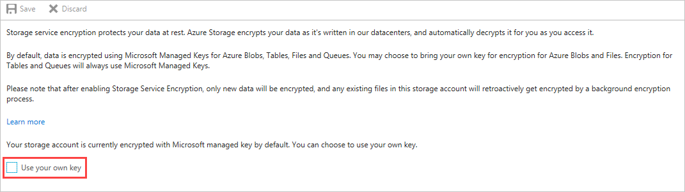
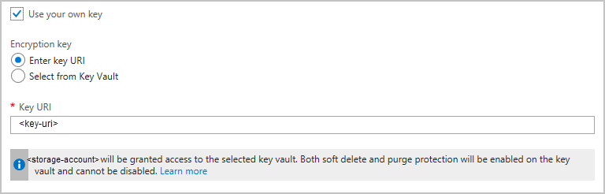
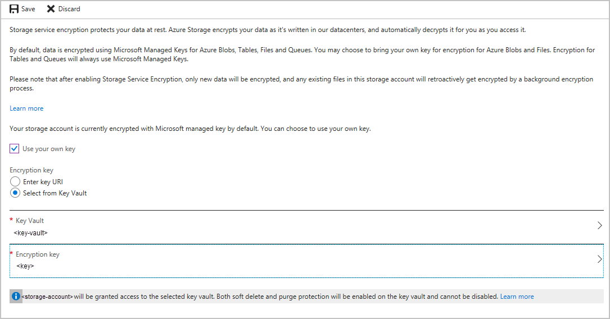
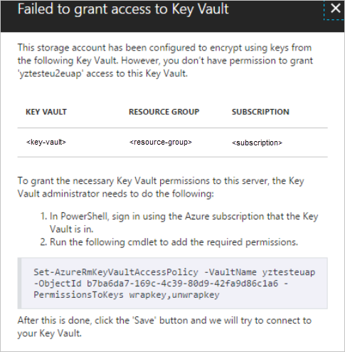

# Storage Service Encryption using customer-managed keys in Azure Key Vault
Microsoft Azure is committed to helping you protect and safeguard your data to meet your organizational security and compliance commitments. One way that the Azure storage platform protects your data is via Storage Service Encryption (SSE), which encrypts your data when writing it to storage, and decrypts your data when retrieving it. The encryption and decryption is automatic, transparent, and uses 256-bit [AES encryption](https://wikipedia.org/wiki/Advanced_Encryption_Standard), one of the strongest block ciphers available.

You can use Microsoft-managed encryption keys with SSE or you can use your own encryption keys. This article describes how to use your own encryption keys. For more information about using Microsoft-managed keys, or about SSE in general, see [Storage Service Encryption for data at rest](storage-service-encryption.md).

SSE for Azure Blob storage and Azure Files is integrated with Azure Key Vault, so that you can use a key vault to manage your encryption keys. You can create your own encryption keys and store them in a key vault, or you can use Azure Key Vault's APIs to generate encryption keys. With Azure Key Vault, you can manage and control your keys and also audit your key usage.

> [!Note]  
> Storage Service Encryption using customer-managed keys is not available for [Azure Managed Disks](../../virtual-machines/windows/managed-disks-overview.md). [Azure Disk Encryption](../../security/azure-security-disk-encryption-overview.md) uses industry-standard [BitLocker](https://docs.microsoft.com/windows/security/information-protection/bitlocker/bitlocker-overview) on Windows and [DM-Crypt](https://en.wikipedia.org/wiki/Dm-crypt) on Linux to provide an encryption solution integrated with KeyVault.

Why create your own keys? Custom keys give you more flexibility, so that you can create, rotate, disable, and define access controls. Custom keys also enable you to audit the encryption keys used to protect your data.

## Get started with customer-managed keys
To use customer-managed keys with SSE, you can either create a new key vault and key or you can use an existing key vault and key. The storage account and the key vault must be in the same region, but they can be in different subscriptions. 

### Step 1: Create a storage account
First, create a storage account if you don't have one already. For more information, see [Create a storage account](storage-quickstart-create-account.md).

### Step 2: Enable SSE for Blob and File storage
To enable SSE using customer-managed keys, two key protection features, Soft Delete and Do Not Purge, must also be enabled in Azure Key Vault. These settings ensure the keys cannot be accidently or intentionally deleted. The maximum retention period of the keys is set to 90 days, protecting users against malicious actors or ransomware attacks.

If you want to programmatically enable customer-managed keys for SSE, you can use the [Azure Storage Resource Provider REST API](https://docs.microsoft.com/rest/api/storagerp), the [Storage Resource Provider Client Library for .NET](https://docs.microsoft.com/dotnet/api), [Azure PowerShell](https://docs.microsoft.com/powershell/azure/overview), or the [Azure CLI](https://docs.microsoft.com/azure/storage/storage-azure-cli).

To use customer-managed keys with SSE, you must assign a storage account identity to the storage account. You can set the identity by executing the following PowerShell command:

```powershell
Set-AzureRmStorageAccount -ResourceGroupName \$resourceGroup -Name \$accountName -AssignIdentity
```

You can enable Soft Delete and Do Not Purge by executing the following PowerShell commands:

```powershell
($resource = Get-AzureRmResource -ResourceId (Get-AzureRmKeyVault -VaultName
$vaultName).ResourceId).Properties | Add-Member -MemberType NoteProperty -Name
enableSoftDelete -Value 'True'

Set-AzureRmResource -resourceid $resource.ResourceId -Properties
$resource.Properties

($resource = Get-AzureRmResource -ResourceId (Get-AzureRmKeyVault -VaultName
$vaultName).ResourceId).Properties | Add-Member -MemberType NoteProperty -Name
enablePurgeProtection -Value 'True'

Set-AzureRmResource -resourceid $resource.ResourceId -Properties
$resource.Properties
```

### Step 3: Enable encryption with customer-managed keys
By default, SSE uses Microsoft-managed keys. You can enable SSE with customer-managed keys for the storage account using the [Azure portal](https://portal.azure.com/). On the **Settings** blade for the storage account, click **Encryption**. Select the **Use your own key** option, as shown in the following figure.



### Step 4: Select your key
You can specify your key either as a URI, or by selecting the key from a key vault.

#### Specify a key as a URI
To specify your key from a URI, follow these steps:

1. Choose the **Enter key URI** option.  
2. In the **Key URI** field, specify the URI.

    


#### Specify a key from a key vault 
To specify your key from a key vault, follow these steps:

1. Choose the **Select from Key Vault** option.  
2. Choose the key vault containing the key you want to use.
3. Choose the key from the key vault.

    

If the storage account does not have access to the key vault, you can run the Azure PowerShell command shown in the following image to grant access.



You can also grant access via the Azure portal by navigating to the Azure Key Vault in the Azure portal and granting access to the storage account.


You can associate the above key with an existing storage account using the following PowerShell commands:
```powershell
$storageAccount = Get-AzureRmStorageAccount -ResourceGroupName "myresourcegroup" -AccountName "mystorageaccount"
$keyVault = Get-AzureRmKeyVault -VaultName "mykeyvault"
$key = Get-AzureKeyVaultKey -VaultName $keyVault.VaultName -Name "keytoencrypt"
Set-AzureRmKeyVaultAccessPolicy -VaultName $keyVault.VaultName -ObjectId $storageAccount.Identity.PrincipalId -PermissionsToKeys wrapkey,unwrapkey,get
Set-AzureRmStorageAccount -ResourceGroupName $storageAccount.ResourceGroupName -AccountName $storageAccount.StorageAccountName -KeyvaultEncryption -KeyName $key.Name -KeyVersion $key.Version -KeyVaultUri $keyVault.VaultUri
```

### Step 5: Copy data to storage account
To transfer data into your new storage account so that it's encrypted. For more information see [FAQ for Storage Service Encryption](storage-service-encryption.md#faq-for-storage-service-encryption).

### Step 6: Query the status of the encrypted data
Query the status of the encrypted data.

## FAQ for SSE with customer-managed-keys
**I'm using Premium storage; can I use customer-managed keys with SSE?**  
Yes, SSE with Microsoft-managed and customer-managed keys is supported on both Standard storage and Premium storage.

**Can I create new storage accounts with SSE with customer-managed keys enabled using Azure PowerShell and Azure CLI?**  
Yes.

**How much more does Azure Storage cost if I use customer-managed keys with SSE?**  
There is a cost associated for using Azure Key Vault. For more details, visit [Key Vault Pricing](https://azure.microsoft.com/pricing/details/key-vault/). There is no additional cost for SSE, which is enabled for all storage accounts.

**Is Storage Service Encryption available on Azure Managed Disks?**  
Storage Service Encryption is available for Azure Managed Disks with Microsoft-managed keys, but not with customer managed keys. In lieu of Managed Disks supporting SSE with customer-managed keys, we recommend [Azure Disk Encryption](../../security/azure-security-disk-encryption-overview.md), which uses industry-standard [BitLocker](https://docs.microsoft.com/windows/security/information-protection/bitlocker/bitlocker-overview) on Windows and [DM-Crypt](https://en.wikipedia.org/wiki/Dm-crypt) on Linux to provide encryption integrated with KeyVault.

**How is Storage Service Encryption different from Azure Disk Encryption?**  
Azure Disk Encryption provides integration between OS-based solutions like BitLocker and DM-Crypt and Azure KeyVault. Storage Service Encryption provides encryption natively at the Azure storage platform layer, below the virtual machine.

**Can I revoke access to the encryption keys?**
Yes, you can revoke access at any time. There are several ways to revoke access to your keys. Refer to [Azure Key Vault PowerShell](https://docs.microsoft.com/powershell/module/azurerm.keyvault/) and [Azure Key Vault CLI](https://docs.microsoft.com/cli/azure/keyvault) for more details. Revoking access will effectively block access to all blobs in the storage account as the account encryption key is inaccessible by Azure Storage.

**Can I create a storage account and key in different region?**  
No, the storage account and the Azure Key Vault and key need to be in the same region.

**Can I enable customer-managed keys for SSE while creating the storage account?**  
No. When you first create the storage account, only Microsoft-managed keys are available for SSE. To use customer-managed keys, you must update the storage account properties. You can use REST or one of the storage client libraries to programmatically update your storage account, or update the storage account properties using the Azure portal after creating the account.

**Can I disable encryption while using customer-managed keys with SSE?**  
No, you cannot disable encryption. Encryption is enabled by default for Azure Blob storage, Azure Files, Azure Queue, and Azure Table storage. You can optionally switch from using Microsoft-managed keys to using customer-managed keys, and vice versa.

**Is SSE enabled when I create a new storage account?**  
SSE is enabled for all storage accounts and for Azure Blob storage, Azure Files, Azure Queue storage, and Azure Table storage.

**I can't enable SSE using customer-managed keys on my storage account.**  
Is it an Azure Resource Manager storage account? Classic storage accounts are not supported with customer-managed keys. SSE with customer-managed keys can only be enabled on Resource Manager storage accounts.

**What is Soft Delete and Do Not Purge? Do I need to enable this setting to use SSE with customer-managed keys?**  
Soft Delete and Do Not Purge must be enabled to use SSE with customer-managed keys. These settings ensure that your key is not accidently or intentionally deleted. The maximum retention period of the keys is set to 90 days, protecting users against malicious actors and ransomware attacks. This setting cannot be disabled.

**Is SSE with customer-managed keys only permitted in specific regions?**  
SSE with customer-managed keys is available in all regions for Azure Blob storage and Azure Files.

**How do I contact someone if I have any issues or want to provide feedback?**  
Contact [ssediscussions@microsoft.com](mailto:ssediscussions@microsoft.com) for any issues related to Storage Service Encryption.

## Next steps
- For more information on the comprehensive set of security capabilities that help developers build secure applications, see the [Storage Security Guide](storage-security-guide.md).
- For overview information about Azure Key Vault, see [What is Azure Key Vault](https://docs.microsoft.com/azure/key-vault/key-vault-whatis)?
- For getting started on Azure Key Vault, see [Getting Started with Azure Key Vault](https://docs.microsoft.com/azure/key-vault/key-vault-get-started).
