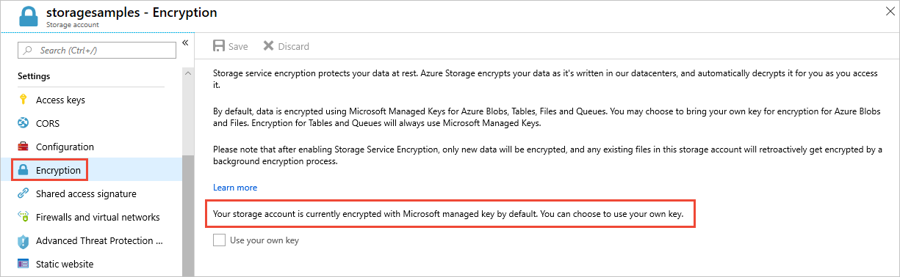

# Azure Storage encryption for data at rest

Azure Storage automatically encrypts your data when persisting it to the cloud. Encryption protects your data and to help you to meet your organizational security and compliance commitments. Data in Azure Storage is encrypted and decrypted transparently using 256-bit [AES encryption](https://en.wikipedia.org/wiki/Advanced_Encryption_Standard), one of the strongest block ciphers available, and is FIPS 140-2 compliant. Azure Storage encryption is similar to BitLocker encryption on Windows.

Azure Storage encryption is enabled for all new and existing storage accounts and cannot be disabled. Because your data is secured by default, you don't need to modify your code or applications to take advantage of Azure Storage encryption. 

Storage accounts are encrypted regardless of their performance tier (standard or premium) or deployment model (Azure Resource Manager or classic). All Azure Storage redundancy options support encryption, and all copies of a storage account are encrypted. All Azure Storage resources are encrypted, including blobs, disks, files, queues, and tables. All object metadata is also encrypted.

Encryption does not affect Azure Storage performance. There is no additional cost for Azure Storage encryption.

For more information about the cryptographic modules underlying Azure Storage encryption, see [Cryptography API: Next Generation](https://docs.microsoft.com/windows/desktop/seccng/cng-portal).

## Key management

You can rely on Microsoft-managed keys for the encryption of your storage account, or you can manage encryption with your own keys, together with Azure Key Vault.

### Microsoft-managed keys

By default, your storage account uses Microsoft-managed encryption keys. You can see the encryption settings for your storage account in the **Encryption** section of the [Azure portal](https://portal.azure.com), as shown in the following image.

### Customer-managed keys

You can manage Azure Storage encryption with customer-managed keys. Customer-managed keys give you more flexibility to create, rotate, disable, and revoke access controls. You can also audit the encryption keys used to protect your data. 

Use Azure Key Vault to manage your keys and audit your key usage. You can either create your own keys and store them in a key vault, or you can use the Azure Key Vault APIs to generate keys. The storage account and the key vault must be in the same region, but they can be in different subscriptions. For more information about Azure Key Vault, see [What is Azure Key Vault?](../../key-vault/key-vault-overview.md).

To revoke access to customer-managed keys, see [Azure Key Vault PowerShell](https://docs.microsoft.com/powershell/module/azurerm.keyvault/) and [Azure Key Vault CLI](https://docs.microsoft.com/cli/azure/keyvault). Revoking access effectively blocks access to all data in the storage account, as the encryption key is inaccessible by Azure Storage.

To learn how to use customer-managed keys with Azure Storage, see one of these articles:

- [Configure customer-managed keys for Azure Storage encryption from the Azure portal](storage-encryption-keys-portal.md)
- [Configure customer-managed keys for Azure Storage encryption from PowerShell](storage-encryption-keys-powershell.md)
- [Use customer-managed keys with Azure Storage encryption from Azure CLI](storage-encryption-keys-cli.md)

> [!IMPORTANT]
> Customer-managed keys rely on managed identities for Azure resources, a feature of Azure Active Directory (Azure AD). When you transfer a subscription from one Azure AD directory to another, managed identities are not updated and customer-managed keys may no longer work. For more information, see **Transferring a subscription between Azure AD directories** in [FAQs and known issues with managed identities for Azure resources](../../active-directory/managed-identities-azure-resources/known-issues.md#transferring-a-subscription-between-azure-ad-directories).  

> [!NOTE]  
> Customer-managed keys are not supported for [Azure managed disks](../../virtual-machines/windows/managed-disks-overview.md).

## Azure Storage encryption versus disk encryption

With Azure Storage encryption, all Azure Storage accounts and the resources they contain are encrypted, including the page blobs that back Azure virtual machine disks. Additionally, Azure virtual machine disks may be encrypted with [Azure Disk Encryption](../../security/azure-security-disk-encryption-overview.md). Azure Disk Encryption uses industry-standard [BitLocker](https://docs.microsoft.com/windows/security/information-protection/bitlocker/bitlocker-overview) on Windows and [DM-Crypt](https://en.wikipedia.org/wiki/Dm-crypt) on Linux to provide operating system-based encryption solutions that are integrated with Azure Key Vault.

## Next steps

- [What is Azure Key Vault?](../../key-vault/key-vault-overview.md)
