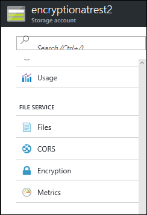
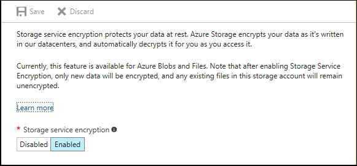

# Azure Storage Service Encryption for Data at Rest
Azure Storage Service Encryption for Data at Rest helps you protect your data to meet your organizational security and compliance commitments. With this feature, Azure Storage automatically encrypts your data before persisting to storage and decrypts the data before retrieval.

The following sections provide detailed guidance on how to use the Storage Service Encryption features. They also describe supported scenarios and customer experiences.

## Overview
Azure Storage provides a comprehensive set of security capabilities that together help developers build secure applications. Data can be secured in transit between an application and Azure through [client-side encryption](../storage-client-side-encryption.md), HTTPS, or SMB 3.0. 

Storage Service Encryption provides encryption at rest. It handles encryption, decryption, and key management in a totally transparent fashion. All data is encrypted through 256-bit [AES encryption](https://en.wikipedia.org/wiki/Advanced_Encryption_Standard), one of the strongest block ciphers available.

Storage Service Encryption works by encrypting the data when it is written to Azure Storage. It works for the following:

* General-purpose (standard) storage accounts for Azure Blob storage, Azure Table storage, Azure Queue storage, and Azure Files accounts
* Premium storage 
* Classic and Azure Resource Manager storage accounts (enabled by default) 
* All redundancy levels (locally redundant storage, zone-redundant storage, geo-redundant storage, read-access geo-redundant storage)
* All regions

To learn more, refer to the FAQ later in this article.

To view the settings of Storage Service Encryption for a storage account:

1. Sign in to the [Azure portal](https://portal.azure.com) and select a storage account. 
2. In the **Settings** pane, look for the **BLOB SERVICE** section or the **FILE SERVICE** section, and select **Encryption**:

   
 *Figure 1: Enable Storage Service Encryption for Blob storage*

   
 *Figure 2: Enable Storage Service Encryption for Azure Files*

3. Enable or disable Storage Service Encryption.

   
 *Figure 3: Enable Storage Service Encryption for Blob storage or Azure Files*

## Encryption scenarios
Storage Service Encryption is enabled at a storage account level. It's enabled for all services by default. It supports the encryption of Blob storage, Table storage, Queue storage, and Azure Files for both classic and Resource Manager accounts.

Storage Service Encryption has the following limitations:

* Existing data: Storage Service Encryption encrypts only newly created data after the encryption is enabled. For example, if you create a new Resource Manager storage account but don't turn on encryption, and then you upload blobs or archived VHDs to that storage account and then turn on Storage Service Encryption, those blobs will not be encrypted unless they are rewritten or copied.
* Marketplace support: You can enable the encryption of virtual machines (VMs) created from the Azure Marketplace by using the [Azure portal](https://portal.azure.com), PowerShell, and Azure CLI. The VHD base image will remain unencrypted. However, any writes done after the VM has spun up will be encrypted.

## Getting started
### Step 1: Create a storage account
For details, see [About Azure storage accounts](../storage-create-storage-account.md).
### Step 2: Verify encryption
You can verify encryption by using the [Azure portal](https://portal.azure.com).

> [!NOTE]
> If you want to programmatically verify Storage Service Encryption on a storage account, you can use the [Azure Storage Resource Provider REST API](https://msdn.microsoft.com/library/azure/mt163683.aspx), the [Storage Resource Provider Client Library for .NET](https://msdn.microsoft.com/library/azure/mt131037.aspx), [Azure PowerShell](/powershell/azureps-cmdlets-docs), or [Azure CLI](../storage-azure-cli.md).
> 
> 

### Step 3: Copy data to the storage account
After you enable Storage Service Encryption for a storage account, any data written to that storage account will be encrypted. Any data already located in that storage account will not be encrypted until it's rewritten. 

To ensure that previous data is encrypted, you can copy data from one container to another. You can use any of the following tools to accomplish this. The behavior is the same for Azure Files, Table storage, and Queue storage.

#### AzCopy
AzCopy is a Windows command-line tool that's designed for copying data to and from Blob storage, Table storage, and Azure Files through simple commands with optimal performance. You can use this tool to copy your blobs or files from one storage account to another one that has Storage Service Encryption enabled. 

To learn more, see [Transfer data with AzCopy on Windows](storage-use-azcopy.md).

#### SMB
Azure Files offers file shares in the cloud through the standard SMB protocol. You can mount a file share from a client on-premises or in Azure. After the file share is mounted, you can use tools like Robocopy to copy files over to Azure file shares. For more information, see [How to mount an Azure file share on Windows](../files/storage-how-to-use-files-windows.md) and [How to mount an Azure file share on Linux](../files/storage-how-to-use-files-linux.md).

#### Storage Client Libraries
You can copy blob or file data to and from Blob storage or between storage accounts by using Storage Client Libraries. Libraries include .NET, C++, Java, Android, Node.js, PHP, Python, and Ruby.

To learn more, see [Get started with Azure Blob storage using .NET](../blobs/storage-dotnet-how-to-use-blobs.md).

#### Storage client tools
You can use an Azure Storage client tool, like Azure Storage Explorer, to:
- Create storage accounts.
- Upload and download data.
- View contents of blobs.
- Browse through directories. 

You can use one of the Azure Storage client tools to upload blobs to your storage account with encryption enabled. With some these tools, you can also copy data from existing Blob storage to a different container in the storage account or a new storage account that has Storage Service Encryption enabled.

To learn more, see [Azure Storage client tools](../storage-explorers.md).

### Step 4: Query the status of the encrypted data
An updated version of the Storage Client Libraries enables you to query the state of an object to determine whether it's encrypted. This ability is currently available only for Blob storage. Support for Azure Files is on the roadmap. 

In the meantime, you can call [Get Account Properties](https://msdn.microsoft.com/library/azure/mt163553.aspx) to verify that the storage account has encryption enabled. Or you can view the storage account properties in the Azure portal.

## Encryption/decryption workflow
Here's a brief description of the encryption/decryption workflow:

1. Encryption is enabled for a storage account.
2. When the customer writes new data (by using PUT Blob, PUT Block, PUT Page, or PUT File, for example) to Blob storage or Azure Files, every write is encrypted through 256-bit [AES encryption](https://en.wikipedia.org/wiki/Advanced_Encryption_Standard).
3. When the customer needs to access data (by using GET Blob, for example), data is automatically decrypted before it returns to the customer.
4. If encryption is disabled, new writes are no longer encrypted. Existing encrypted data remains encrypted until the customer rewrites it. While encryption is enabled, writes to Blob storage or Azure Files are encrypted. The state of data does not change with the customer switching between enabling and disabling encryption for the storage account.

Microsoft stores, encrypts, and manages all encryption keys.

## Frequently asked questions about Storage Service Encryption for Data at Rest
**Q: I have a classic storage account. Can I enable Storage Service Encryption on it?**

A: Storage Service Encryption is enabled by default for all storage accounts (classic and Resource Manager).

**Q: How can I encrypt data in my classic storage account?**

A: With encryption enabled by default, Azure Storage automatically encrypts your new data. 

You can also create a new Resource Manager storage account and copy all your data by using [AzCopy](storage-use-azcopy.md) from your classic storage account to your newly created Resource Manager storage account. 

You can also choose to migrate your classic storage account to a Resource Manager storage account. This operation is instantaneous. It changes the type of your account but does not affect your existing data. Any new data that's written will be encrypted only after you enable encryption. For more information, see [Platform supported migration of IaaS resources from classic to Resource Manager](https://azure.microsoft.com/blog/iaas-migration-classic-resource-manager/). Note that this ability is supported only for Blob storage and Azure Files.

**Q: I have a Resource Manager storage account. Can I enable Storage Service Encryption on it?**

A: Storage Service Encryption is enabled by default on all existing Resource Manager storage accounts. This is supported for Blob storage, Table storage, Queue storage, and Azure Files. 

**Q: How do I encrypt the data in a Resource Manager storage account?**

A: Storage Service Encryption is enabled by default for all storage accounts--classic and Resource Manager. However, existing data is not encrypted. To encrypt existing data, you can copy it to another name or another container and then remove the unencrypted versions. 

**Q: I'm using premium storage. Can I use Storage Service Encryption?**

A: Yes, Storage Service Encryption is supported on both standard storage and premium storage.  Premium storage is not supported for Azure Files.

**Q: If I create a storage account with Storage Service Encryption enabled, and then create a VM by using that storage account, does that mean my VM is encrypted?**

A: Yes. Any created disks that use the new storage account will be encrypted, as long as they're created after Storage Service Encryption is enabled. If you created the VM by using the Azure Marketplace, the VHD base image remains unencrypted. However, any writes done after the VM has spun up will be encrypted.

**Q: Can I create storage accounts with Storage Service Encryption enabled by using Azure PowerShell and Azure CLI?**

A: Storage Service Encryption is enabled by default at the time of creating any storage account (classic or Resource Manager). You can verify account properties by using both Azure PowerShell and Azure CLI.

**Q: How much more does Azure Storage cost if Storage Service Encryption is enabled?**

A: There is no additional cost.

**Q: Who manages the encryption keys?**

A: Microsoft manages the keys.

**Q: Can I use my own encryption keys?**

A: Not at this time.

**Q: Can I revoke access to the encryption keys?**

A: Not at this time. Microsoft fully manages the keys.

**Q: Is Storage Service Encryption enabled by default when I create a storage account?**

A: Yes, Storage Service Encryption (using Microsoft-managed keys) is enabled by default for all storage accounts--Azure Resource Manager and classic. It's enabled for all services as well--Blob storage, Table storage, Queue storage, and Azure Files.

**Q: How is this different from Azure Disk Encryption?**

A: This feature is used to encrypt data in Azure Blob storage. Azure Disk Encryption is used to encrypt OS and data disks in IaaS VMs. For more details, see the [Storage security guide](../storage-security-guide.md).

**Q: What if Storage Service Encryption is enabled, and then I enable Azure Disk Encryption on the disks?**

A: This will work seamlessly. Your data will be encrypted by both methods.

**Q: My storage account is set up to be replicated geo-redundantly. If Storage Service Encryption is enabled, will my redundant copy also be encrypted?**

A: Yes, all copies of the storage account are encrypted. All redundancy options are supported--locally redundant storage, zone-redundant storage, geo-redundant storage, and read-access geo-redundant storage.

**Q: Can I disable encryption on my storage account?**

A: Encryption is enabled by default, and there is no provision to disable encryption for your storage account. 

**Q: Is Storage Service Encryption permitted only in specific regions?**

A: Storage Service Encryption is available in all regions for all services. 

**Q: How do I contact someone if I have any problems or want to provide feedback?**

A: Contact [ssediscussions@microsoft.com](mailto:ssediscussions@microsoft.com) for any problems or feedback related to Storage Service Encryption.

## Next steps
Azure Storage provides a comprehensive set of security capabilities that together help developers build secure applications. For more details, see the [Storage security guide](../storage-security-guide.md).
