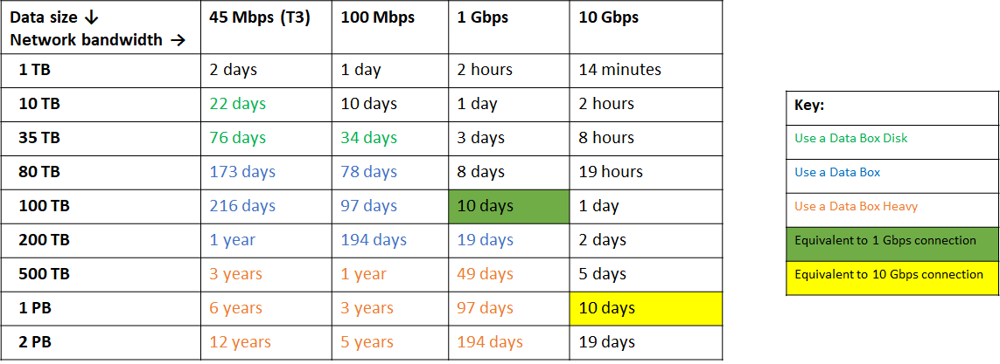

# Data transfer for large datasets with moderate to high network bandwidth
 
This article provides an overview of the data transfer solutions when you have moderate to high network bandwidth in your environment and you are planning to transfer large datasets. The article also describes the recommended data transfer options and the respective key capability matrix for this scenario.

To understand an overview of all the available data transfer options, go to [Choose an Azure data transfer solution](storage-choose-data-transfer-solution.md).

## Scenario description

Large datasets refer to data sizes in the order of TBs to PBs. Moderate to high network bandwidth refers to 100 Mbps to 10 Gbps.

## Recommended options

The options recommended in this scenario depend on whether you have moderate network bandwidth or high network bandwidth.

### Moderate network bandwidth (100 Mbps - 1 Gbps)

With moderate network bandwidth, you need to project the time for data transfer over the network.

Use the following table to estimate the time and based on that, choose between an offline transfer or over the network transfer. The table shows the projected time for network data transfer, for various available network bandwidths (assuming 90% utilization).  

- If the network transfer is projected to be too slow, you should use a physical device. The recommended options in this case are the offline transfer devices from Azure Data Box family or Azure Import/Export using your own disks.

    - **Azure Data Box family for offline transfers** – Use devices from Microsoft-supplied Data Box devices to move large amounts of data to Azure when you’re limited by time, network availability, or costs. Copy on-premises data using tools such as Robocopy. Depending on the data size intended for transfer, you can choose from Data Box Disk, Data Box, or Data Box Heavy.
    - **Azure Import/Export** – Use Azure Import/Export service by shipping your own disk drives to securely import large amounts of data to Azure Blob storage and Azure Files. This service can also be used to transfer data from Azure Blob storage to disk drives and ship to your on-premises sites.

- If the network transfer is projected to be reasonable, then you can use any of the following tools detailed in [High network bandwidth](#high-network-bandwidth).

### High network bandwidth (1 Gbps - 100 Gbps)

If the available network bandwidth is high, use one of the following tools.

- **AzCopy** - Use this command-line tool to easily copy data to and from Azure Blobs, Files, and Table storage with optimal performance. AzCopy supports concurrency and parallelism, and the ability to resume copy operations when interrupted.
- **Azure Storage REST APIs/SDKs** – When building an application, you can develop the application against Azure Storage REST APIs and use the Azure SDKs offered in multiple languages.
- **Azure Data Box family for online transfers** – Data Box Edge and Data Box Gateway are online network devices that can move data into and out of Azure. Use Data Box Edge physical device when there is a simultaneous need for continuous ingestion and pre-processing of the data prior to upload. Data Box Gateway is a virtual version of the device with the same data transfer capabilities. In each case, the data transfer is managed by the device.
- **Azure Data Factory** – Data Factory should be used to scale out a transfer operation, and if there is a need for orchestration and enterprise grade monitoring capabilities. Use Data Factory to regularly transfer files between several Azure services, on-premises, or a combination of the two. with Data Factory, you can create and schedule data-driven workflows (called pipelines) that ingest data from disparate data stores and automate data movement and data transformation.

## Comparison of key capabilities

The following tables summarize the differences in key capabilities for the recommended options.

### Moderate network bandwidth

If using offline data transfer, use the following table to understand the differences in key capabilities.

|                                     |    Data Box Disk      |    Data Box                                      |    Data Box Heavy            |    Import/Export                       |
|-------------------------------------|---------------------------------|--------------------------------------------------|------------------------------------------|----------------------------------------|
|    Data size                        |    Up to 35 TBs                 |    Up to 80 TBs per device                       |    Up to 800 TB per device               |    Variable                            |
|    Data type                        |    Azure Blobs                  |    Azure Blobs Azure Files                    |    Azure Blobs Azure Files            |    Azure Blobs Azure Files          |
|    Form factor                      |    5 SSDs per order             |    1 X 50-lbs. desktop-sized device per order    |    1 X ~500-lbs. large device per order    |    Up to 10 HDDs/SSDs per order        |
|    Initial setup time               |    Low  (15 mins)            |    Low to moderate   (<30 mins)               |    Moderate (1-2 hours)               |    Moderate to difficult (variable) |
|    Send data to Azure               |    Yes                          |    Yes                                           |    Yes                                   |    Yes                                 |
|    Export data from Azure           |    No                           |    No                                            |    No                                    |    Yes                                 |
|    Encryption                       |    AES 128-bit                  |    AES 256-bit                                   |    AES 256-bit                           |    AES 128-bit                         |
|    Hardware                         |     Microsoft supplied          |    Microsoft supplied                            |    Microsoft supplied                    |    Customer supplied                   |
|    Network interface                |    USB 3.1/SATA                 |    RJ 45, SFP+                                   |    RJ45, QSFP+                           |    SATA II/SATA III                    |
|    Partner integration              |    Some                         |    [High](https://azuremarketplace.microsoft.com/en-us/marketplace/apps/Microsoft.AzureExpressPod)                                          |    [High](https://azuremarketplace.microsoft.com/en-us/marketplace/apps/Microsoft.AzureExpressPod)                                  |    Some                                |
|    Shipping                         |    Microsoft managed            |    Microsoft managed                             |    Microsoft managed                     |    Customer managed                    |
| Use when data moves         |Within a commerce boundary|Within a commerce boundary|Within a commerce boundary|Across geographic boundaries, e.g. US to EU|
|    Pricing                          |    [Pricing](https://azure.microsoft.com/pricing/details/databox/disk/)                    |   [Pricing](https://azure.microsoft.com/pricing/details/storage/databox/)                                      |  [Pricing](https://azure.microsoft.com/pricing/details/storage/databox/heavy/)                               |   [Pricing](https://azure.microsoft.com/pricing/details/storage-import-export/)                            |

If using online data transfer, use the table in the following section for high network bandwidth.

### High network bandwidth

|                                     |    Tools AzCopy,  Azure PowerShell,  Azure CLI             |    Azure Storage REST APIs, SDKs                   |    Data Box Gateway or Data Box Edge          |    Azure Data Factory                                            |
|-------------------------------------|------------------------------------|----------------------------------------------|----------------------------------|-----------------------------------------------------------------------|
|    Data type                  |    Azure Blobs, Azure Files, Azure Tables    |    Azure Blobs, Azure Files, Azure Tables    |    Azure Blobs, Azure Files                           |   Supports 70+ data connectors for data stores and formats    |
|    Form factor                |    Command-line tools                        |    Programmatic interface                    |    Microsoft supplies a virtual  or physical device     |    Service in Azure portal                                            |
|    Initial one-time setup     |    Easy               |    Moderate                       |    Easy (<30 minutes) to moderate (1-2 hours)            |    Extensive                                                          |
|    Data pre-processing              |    No                                        |    No                                        |    Yes (With Edge compute)                               |    Yes                                                                |
|    Transfer from other clouds       |    No                                        |    No                                        |    No                                                    |    Yes                                                                |
|    User type                        |    IT Pro or dev                                       |    Dev                                       |    IT Pro                                                |    IT Pro                                                             |
|    Pricing                          |    Free, data egress charges apply         |    Free, data egress charges apply         |    [Pricing](https://azure.microsoft.com/pricing/details/storage/databox/edge/)                                               |    [Pricing](https://azure.microsoft.com/pricing/details/data-factory/)                                                            |

## Next steps

- [Learn how to transfer data with Import/Export](/azure/storage/common/storage-import-export-data-to-blobs).
- Understand how to

    - [Transfer data with Data Box Disk](https://docs.microsoft.com/azure/databox/data-box-disk-quickstart-portal).
    - [Transfer data with Data Box](https://docs.microsoft.com/azure/databox/data-box-quickstart-portal).
- [Transfer data with AzCopy](/azure/storage/common/storage-use-azcopy-v10).
- Understand how to:
    - [Transfer data with Data Box Gateway](https://docs.microsoft.com/azure/databox-online/data-box-gateway-deploy-add-shares).
    - [Transform data with Data Box Edge before sending to Azure](https://docs.microsoft.com/azure/databox-online/data-box-edge-deploy-configure-compute).
- [Learn how to transfer data with Azure Data Factory](https://docs.microsoft.com/azure/data-factory/quickstart-create-data-factory-portal).
- Use the REST APIs to transfer data

    - [In .NET](https://docs.microsoft.com/dotnet/api/overview/azure/storage)
    - [In Java](https://docs.microsoft.com/java/api/overview/azure/storage)
