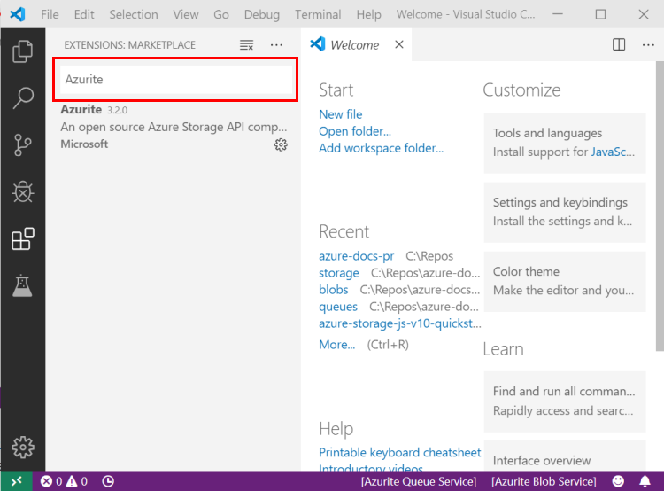
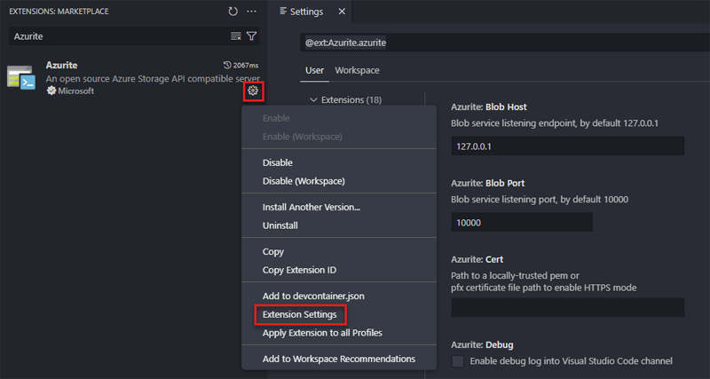

# Use the Azurite emulator for local Azure Storage development and testing (preview)

The Azurite version 3.2 open-source emulator (preview) provides a free local environment for testing your Azure blob and queue storage applications. When you're satisfied with how your application is working locally, switch to using an Azure Storage account in the cloud. The emulator provides cross-platform support on Windows, Linux, and macOS. Azurite v3 supports APIs implemented by the Azure Blob service.

Azurite is the future storage emulator platform. Azurite supersedes the [Azure Storage Emulator](storage-use-emulator.md). Azurite will continue to be updated to support the latest versions of Azure Storage APIs.

There are several different ways to install and run Azurite on your local system:

  1. [Install and run the Azurite Visual Studio Code extension](#install-and-run-the-azurite-visual-studio-code-extension)
  1. [Install and run Azurite by using NPM](#install-and-run-azurite-by-using-npm)
  1. [Install and run the Azurite Docker image](#install-and-run-the-azurite-docker-image)
  1. [Clone, build, and run Azurite from the GitHub repository](#clone-build-and-run-azurite-from-the-github-repository)

## Install and run the Azurite Visual Studio Code extension

Within Visual Studio Code, select the **EXTENSIONS** pane and search for *Azurite* in the **EXTENSIONS:MARKETPLACE**.



You can also navigate to [Visual Studio Code extension market](https://marketplace.visualstudio.com/items?itemName=Azurite.azurite) in your browser. Select the **Install** button to open Visual Studio Code and go directly to the Azurite extension page.

You can quickly start or close Azurite in the Visual Studio Code status bar. Click on **[Azurite Blob Service]** or **[Azurite Queue Service]**.

The extension supports the following Visual Studio Code commands. To open the command palette, press F1 in Visual Studio Code. 

   - **Azurite: Clean** - Reset all Azurite services persistency data
   - **Azurite: Clean Blob Service** - Clean blob service
   - **Azurite: Clean Queue Service** - Clean queue service
   - **Azurite: Close** - Close all Azurite services
   - **Azurite: Close Blob Service** - Close blob service
   - **Azurite: Close Queue Service** - Close queue service
   - **Azurite: Start** - Start all Azurite services
   - **Azurite: Start Blob Service** - Start blob service
   - **Azurite: Start Queue Service** - Start queue service

To configure Azurite within Visual Studio Code, select the extensions pane. Select the **Manage** (gear) icon for **Azurite**. Select **Extension Settings**.



The following settings are supported:

   - **Azurite: Blob Host** - The Blob service listening endpoint. The default setting is 127.0.0.1.
   - **Azurite: Blob Port** - The Blob service listening port. The default port is 10000.
   - **Azurite: Cert** - Path to a locally trusted PEM or PFX certificate file path to enable HTTPS mode.
   - **Azurite: Debug** - Output the debug log to the Azurite channel. The default value is **false**.
   - **Azurite: Key** - Path to a locally trusted PEM key file, required when **Azurite: Cert** points to a PEM file.
   - **Azurite: Location** - The workspace location path. The default is the Visual Studio Code working folder.
   - **Azurite: Loose** - Enable loose mode, which ignores unsupported headers and parameters.
   - **Azurite: Oauth** - Optional OAuth level.
   - **Azurite: Pwd** - Password for PFX file. Required when **Azurite: Cert** points to a PFX file.
   - **Azurite: Queue Host** - The Queue service listening endpoint. The default setting is 127.0.0.1.
   - **Azurite: Queue Port** - The Queue service listening port. The default port is 10001.
   - **Azurite: Silent** - Silent mode disables the access log. The default value is **false**.

## Install and run Azurite by using NPM

This installation method requires that you have [Node.js version 8.0 or later](https://nodejs.org) installed. Node Package Manager (npm) is the package management tool included with every Node.js installation. After installing Node.js, execute the following `npm` command to install Azurite.

```console
npm install -g azurite
```

After installing Azurite, see [Run Azurite from a command line](#run-azurite-from-a-command-line).

## Install and run the Azurite Docker image

Use [DockerHub](https://hub.docker.com/) to pull the [latest Azurite image](https://hub.docker.com/_/microsoft-azure-storage-azurite) by using the following command:

```console
docker pull mcr.microsoft.com/azure-storage/azurite
```

**Run the Azurite Docker image**:

The following command runs the Azurite Docker image. The `-p 10000:10000` parameter redirects requests from host machine's port 10000 to the Docker instance.

```console
docker run -p 10000:10000 -p 10001:10001 \
    mcr.microsoft.com/azure-storage/azurite
```

**Specify the workspace location**:

In the following example, the `-v c:/azurite:/data` parameter specifies *c:/azurite* as the Azurite persisted data location. The directory, *c:/azurite*, must be created before running the Docker command.

```console
docker run -p 10000:10000 -p 10001:10001 \
    -v c:/azurite:/data mcr.microsoft.com/azure-storage/azurite
```

**Run just the blob service**

```console
docker run -p 10000:10000 mcr.microsoft.com/azure-storage/azurite \
    azurite-blob --blobHost 0.0.0.0 --blobPort 10000
```

For more information about configuring Azurite at start-up, see [Command-line options](#command-line-options).

## Clone, build, and run Azurite from the GitHub repository

This installation method requires that you have [Git](https://git-scm.com/) installed. Clone the [GitHub repository](https://github.com/azure/azurite) for the Azurite project by using the following console command.

```console
git clone https://github.com/Azure/Azurite.git
```

After cloning the source code, execute following commands from the root of the cloned repo to build and install Azurite.

```console
npm install
npm run build
npm install -g
```

After installing and building Azurite, see [Run Azurite from a command line](#run-azurite-from-a-command-line).

## Run Azurite from a command line

> [!NOTE]
> Azurite cannot be run from the command line if you only installed the Visual Studio Code extension. Instead, use the Visual Studio Code command palette. For more information, see [Install and run the Azurite Visual Studio Code extension](#install-and-run-the-azurite-visual-studio-code-extension).

To get started immediately with the command line, create a directory called *c:\azurite*, then launch Azurite by issuing the following command:

```console
azurite --silent --location c:\azurite --debug c:\azurite\debug.log
```

This command tells Azurite to store all data in a particular directory, *c:\azurite*. If the `--location` option is omitted, it will use the current working directory.

## Command-line options

This section details the command line switches available when launching Azurite.

### Help

**Optional** - Get command-line help by using the `-h` or `--help` switch.

```console
azurite -h
azurite --help
```

### Blob listening host

**Optional** - By default, Azurite will listen to 127.0.0.1 as the local server. Use the `--blobHost` switch to set the address to your requirements.

Accept requests on the local machine only:

```console
azurite --blobHost 127.0.0.1
```

Allow remote requests:

```console
azurite --blobHost 0.0.0.0
```

> [!CAUTION]
> Allowing remote requests may make your system vulnerable to external attacks.

### Blob listening port configuration

**Optional** - By default, Azurite will listen for the Blob service on port 10000. Use the `--blobPort` switch to specify the listening port that you require.

> [!NOTE]
> After using a customized port, you need to update the connection string or corresponding configuration in your Azure Storage tools or SDKs.

Customize the Blob service listening port:

```console
azurite --blobPort 8888
```

Let the system auto select an available port:

```console
azurite --blobPort 0
```

The port in use is displayed during Azurite startup.

### Queue listening host

**Optional** - By default, Azurite will listen to 127.0.0.1 as the local server. Use the `--queueHost` switch to set the address to your requirements.

Accept requests on the local machine only:

```console
azurite --queueHost 127.0.0.1
```

Allow remote requests:

```console
azurite --queueHost 0.0.0.0
```

> [!CAUTION]
> Allowing remote requests may make your system vulnerable to external attacks.

### Queue listening port configuration

**Optional** - By default, Azurite will listen for the Queue service on port 10001. Use the `--queuePort` switch to specify the listening port that you require.

> [!NOTE]
> After using a customized port, you need to update the connection string or corresponding configuration in your Azure Storage tools or SDKs.

Customize the Queue service listening port:

```console
azurite --queuePort 8888
```

Let the system auto select an available port:

```console
azurite --queuePort 0
```

The port in use is displayed during Azurite startup.

### Workspace path

**Optional** - Azurite stores data to the local disk during execution. Use the `-l` or `--location` switch to specify a path as the workspace location. By default, the current process working directory will be used. Note the lowercase 'l'.

```console
azurite -l c:\azurite
azurite --location c:\azurite
```

### Access log

**Optional** - By default, the access log is displayed in the console window. Disable the display of the access log by using the `-s` or `--silent` switch.

```console
azurite -s
azurite --silent
```
### Debug log

**Optional** - The debug log includes detailed information on every request and exception stack trace. Enable the debug log by providing a valid local file path to the `-d` or `--debug` switch.

```console
azurite -d path/debug.log
azurite --debug path/debug.log
```

### Loose mode

**Optional** - By default, Azurite applies strict mode to block unsupported request headers and parameters. Disable strict mode by using the `-L` or `--loose` switch. Note the capital 'L'.

```console
azurite -L
azurite --loose
```
### Version

**Optional** - Display the installed Azurite version number by using the `-v` or `--version` switch.

```console
azurite -v
azurite --version
```

### Certificate configuration (HTTPS)

**Optional** - By default, Azurite uses the HTTP protocol. Enable HTTPS mode by providing a path to a Privacy Enhanced Mail (.pem) or [Personal Information Exchange (.pfx)](https://docs.microsoft.com/windows-hardware/drivers/install/personal-information-exchange---pfx--files) certificate file to the `--cert` switch.

When `--cert` is provided for a PEM file, you must provide a corresponding `--key` switch.

```console
azurite --cert path/server.pem --key path/key.pem
```

When `--cert` is provided for a PFX file, you must provide a corresponding `--pwd` switch.

```console
azurite --cert path/server.pfx --pwd pfxpassword
```

For detailed information on creating PEM and PFX files, see [HTTPS Setup](https://github.com/Azure/Azurite/blob/master/README.md#https-setup).

### OAuth configuration

**Optional** - Enable OAuth authentication for Azurite by using the `--oauth` switch.

```console
azurite --oauth basic --cert path/server.pem --key path/key.pem
```

> [!NOTE]
> OAuth requires an HTTPS endpoint. Make sure HTTPS is enabled by providing `--cert` switch along with the `--oauth` switch.

Azurite supports basic authentication by specifying the `basic` parameter to the `--oauth` switch. Azurite will do basic authentication, like validating the incoming bearer token, checking the issuer, audience, and expiry. Azurite won't check the token signature or permissions.

## Authorization for tools and SDKs

Connect to Azurite from Azure Storage SDKs or tools, like [Azure Storage Explorer](https://azure.microsoft.com/features/storage-explorer/), by using any authentication strategy. Authentication is required. Azurite supports authorization with OAuth, Shared Key, and shared access signatures (SAS). Azurite also supports anonymous access to public containers.

If you're using the Azure SDKs, start Azurite with the `--oauth basic and --cert --key/--pwd` options.

### Well-known storage account and key

Azurite accepts the same well-known account and key used by the legacy Azure storage emulator.

- Account name: `devstoreaccount1`
- Account key: `Eby8vdM02xNOcqFlqUwJPLlmEtlCDXJ1OUzFT50uSRZ6IFsuFq2UVErCz4I6tq/K1SZFPTOtr/KBHBeksoGMGw==`

### Custom storage accounts and keys

Azurite supports custom storage account names and keys by setting the `AZURITE_ACCOUNTS` environment variable in the following format: `account1:key1[:key2];account2:key1[:key2];...`.

For example, use a custom storage account that has one key:

```cmd
set AZURITE_ACCOUNTS="account1:key1"
```

```bash
export AZURITE_ACCOUNTS="account1:key1"
```

Or use multiple storage accounts with two keys each:

```cmd
set AZURITE_ACCOUNTS="account1:key1:key2;account2:key1:key2"
```

```bash
export AZURITE_ACCOUNTS="account1:key1:key2;account2:key1:key2"
```

Azurite refreshes custom account names and keys from the environment variable every minute by default. With this feature, you can dynamically rotate the account key, or add new storage accounts without restarting Azurite.

> [!NOTE]
> The default `devstoreaccount1` storage account is disabled when you set custom storage accounts.

### Connection strings

The easiest way to connect to Azurite from your application is to configure a connection string in your application's configuration file that references the shortcut *UseDevelopmentStorage=true*. Here's an example of a connection string in an *app.config* file:

```xml
<appSettings>
  <add key="StorageConnectionString" value="UseDevelopmentStorage=true" />
</appSettings>
```

#### HTTP connection strings

You can pass the following connection strings to the [Azure SDKs](https://aka.ms/azsdk) or tools, like Azure CLI 2.0 or Storage Explorer.

The full connection string is:

`DefaultEndpointsProtocol=http;AccountName=devstoreaccount1;AccountKey=Eby8vdM02xNOcqFlqUwJPLlmEtlCDXJ1OUzFT50uSRZ6IFsuFq2UVErCz4I6tq/K1SZFPTOtr/KBHBeksoGMGw==;BlobEndpoint=http://127.0.0.1:10000/devstoreaccount1;QueueEndpoint=http://127.0.0.1:10001/devstoreaccount1;`

To connect to the blob service only, the connection string is:

`DefaultEndpointsProtocol=http;AccountName=devstoreaccount1;AccountKey=Eby8vdM02xNOcqFlqUwJPLlmEtlCDXJ1OUzFT50uSRZ6IFsuFq2UVErCz4I6tq/K1SZFPTOtr/KBHBeksoGMGw==;BlobEndpoint=http://127.0.0.1:10000/devstoreaccount1;`

To connect to the queue service only, the connection string is:

`DefaultEndpointsProtocol=http;AccountName=devstoreaccount1;AccountKey=Eby8vdM02xNOcqFlqUwJPLlmEtlCDXJ1OUzFT50uSRZ6IFsuFq2UVErCz4I6tq/K1SZFPTOtr/KBHBeksoGMGw==;QueueEndpoint=http://127.0.0.1:10001/devstoreaccount1;`

#### HTTPS connection strings

The full HTTPS connection string is:

`DefaultEndpointsProtocol=https;AccountName=devstoreaccount1;AccountKey=Eby8vdM02xNOcqFlqUwJPLlmEtlCDXJ1OUzFT50uSRZ6IFsuFq2UVErCz4I6tq/K1SZFPTOtr/KBHBeksoGMGw==;BlobEndpoint=https://127.0.0.1:10000/devstoreaccount1;QueueEndpoint=https://127.0.0.1:10001/devstoreaccount1;`

To use the blob service only, the HTTPS connection string is:

`DefaultEndpointsProtocol=https;AccountName=devstoreaccount1;AccountKey=Eby8vdM02xNOcqFlqUwJPLlmEtlCDXJ1OUzFT50uSRZ6IFsuFq2UVErCz4I6tq/K1SZFPTOtr/KBHBeksoGMGw==;BlobEndpoint=https://127.0.0.1:10000/devstoreaccount1;`

To use the queue service only, the HTTPS connection string is:

`DefaultEndpointsProtocol=https;AccountName=devstoreaccount1;AccountKey=Eby8vdM02xNOcqFlqUwJPLlmEtlCDXJ1OUzFT50uSRZ6IFsuFq2UVErCz4I6tq/K1SZFPTOtr/KBHBeksoGMGw==;QueueEndpoint=https://127.0.0.1:10001/devstoreaccount1;`

If you used `dotnet dev-certs` to generate your self-signed certificate, use the following connection string.

`DefaultEndpointsProtocol=https;AccountName=devstoreaccount1;AccountKey=Eby8vdM02xNOcqFlqUwJPLlmEtlCDXJ1OUzFT50uSRZ6IFsuFq2UVErCz4I6tq/K1SZFPTOtr/KBHBeksoGMGw==;BlobEndpoint=https://localhost:10000/devstoreaccount1;QueueEndpoint=https://localhost:10001/devstoreaccount1;`

Update the connection string when using [custom storage accounts and keys](#custom-storage-accounts-and-keys).

For more information, see [Configure Azure Storage connection strings](storage-configure-connection-string.md).

### Azure SDKs

To use Azurite with the [Azure SDKs](https://aka.ms/azsdk), use OAuth and HTTPS options:

```console
azurite --oauth basic --cert certname.pem --key certname-key.pem
```

#### Azure Blob Storage

You can then instantiate a BlobContainerClient, BlobServiceClient, or BlobClient.

```csharp
// With container URL and DefaultAzureCredential
var client = new BlobContainerClient(
    new Uri("https://127.0.0.1:10000/devstoreaccount1/container-name"), new DefaultAzureCredential()
  );

// With connection string
var client = new BlobContainerClient(
    "DefaultEndpointsProtocol=https;AccountName=devstoreaccount1;AccountKey=Eby8vdM02xNOcqFlqUwJPLlmEtlCDXJ1OUzFT50uSRZ6IFsuFq2UVErCz4I6tq/K1SZFPTOtr/KBHBeksoGMGw==;BlobEndpoint=https://127.0.0.1:10000/devstoreaccount1;QueueEndpoint=https://127.0.0.1:10001/devstoreaccount1;", "container-name"
  );

// With account name and key
var client = new BlobContainerClient(
    new Uri("https://127.0.0.1:10000/devstoreaccount1/container-name"),
    new StorageSharedKeyCredential("devstoreaccount1", "Eby8vdM02xNOcqFlqUwJPLlmEtlCDXJ1OUzFT50uSRZ6IFsuFq2UVErCz4I6tq/K1SZFPTOtr/KBHBeksoGMGw==")
  );
```

#### Azure Queue Storage

You can also instantiate a QueueClient or QueueServiceClient.

```csharp
// With queue URL and DefaultAzureCredential
var client = new QueueClient(
    new Uri("https://127.0.0.1:10001/devstoreaccount1/queue-name"), new DefaultAzureCredential()
  );

// With connection string
var client = new QueueClient(
    "DefaultEndpointsProtocol=https;AccountName=devstoreaccount1;AccountKey=Eby8vdM02xNOcqFlqUwJPLlmEtlCDXJ1OUzFT50uSRZ6IFsuFq2UVErCz4I6tq/K1SZFPTOtr/KBHBeksoGMGw==;BlobEndpoint=https://127.0.0.1:10000/devstoreaccount1;QueueEndpoint=https://127.0.0.1:10001/devstoreaccount1;", "queue-name"
  );

// With account name and key
var client = new QueueClient(
    new Uri("https://127.0.0.1:10001/devstoreaccount1/queue-name"),
    new StorageSharedKeyCredential("devstoreaccount1", "Eby8vdM02xNOcqFlqUwJPLlmEtlCDXJ1OUzFT50uSRZ6IFsuFq2UVErCz4I6tq/K1SZFPTOtr/KBHBeksoGMGw==")
  );
```

### Microsoft Azure Storage Explorer

You can use Storage Explorer to view the data stored in Azurite.

#### Connect to Azurite using HTTP

In Storage Explorer, connect to Azurite by following these steps:

 1. Select the **Manage Accounts** icon
 1. Select **Add an account**
 1. Select **Attach to a local emulator**
 1. Select **Next**
 1. Edit the **Display name** field to a name of your choice
 1. Select **Next** again
 1. Select **Connect**

#### Connect to Azurite using HTTPS

By default Storage Explorer won't open an HTTPS endpoint that uses a self-signed certificate. If you're running Azurite with HTTPS, you're likely using a self-signed certificate. In Storage Explorer, import SSL certificates via the **Edit** -> **SSL Certificates** -> **Import Certificates** dialog.

##### Import Certificate to Storage Explorer

1. Find the certificate on your local machine.
1. In Storage Explorer, go to **Edit** -> **SSL Certificates** -> **Import Certificates** and import your certificate.

If you don't import a certificate, you'll get an error:

`unable to verify the first certificate` or `self signed certificate in chain`

##### Add Azurite via HTTPS connection string

Follow these steps to add Azurite HTTPS to Storage Explorer:

1. Select **Toggle Explorer**
1. Select **Local & Attached**
1. Right-click on **Storage Accounts** and select **Connect to Azure Storage**.
1. Select **Use a connection string**
1. Select **Next**.
1. Enter a value in the **Display name** field.
1. Enter the [HTTPS connection string](#https-connection-strings) from the previous section of this document
1. Select **Next**
1. Select **Connect**

## Workspace structure

The following files and folders may be created in the workspace location when initializing Azurite.

- `__blobstorage__` - Directory containing Azurite blob service persisted binary data
- `__queuestorage__` - Directory containing Azurite queue service persisted binary data
- `__azurite_db_blob__.json` - Azurite blob service metadata file
- `__azurite_db_blob_extent__.json` - Azurite blob service extent metadata file
- `__azurite_db_queue__.json` - Azurite queue service metadata file
- `__azurite_db_queue_extent__.json` - Azurite queue service extent metadata file

To clean up Azurite, delete above files and folders and restart the emulator.

## Differences between Azurite and Azure Storage

There are functional differences between a local instance of Azurite and an Azure Storage account in the cloud.

### Endpoint and connection URL

The service endpoints for Azurite are different from the endpoints of an Azure Storage account. The local computer doesn't do domain name resolution, requiring Azurite endpoints to be local addresses.

When you address a resource in an Azure Storage account, the account name is part of the URI host name. The resource being addressed is part of the URI path:

`<http|https>://<account-name>.<service-name>.core.windows.net/<resource-path>`

The following URI is a valid address for a blob in an Azure Storage account:

`https://myaccount.blob.core.windows.net/mycontainer/myblob.txt`

Since the local computer doesn't do domain name resolution, the account name is part of the URI path instead of the host name. Use the following URI format for a resource in Azurite:

`http://<local-machine-address>:<port>/<account-name>/<resource-path>`

The following address might be used for accessing a blob in Azurite:

`http://127.0.0.1:10000/myaccount/mycontainer/myblob.txt`

### Scaling and performance

Azurite doesn't support large numbers of connected clients. There's no performance guarantee. Azurite is intended for development and testing purposes.

### Error handling

Azurite is aligned with Azure Storage error handling logic, but there are differences. For example, error messages may be different, while error status codes align.

### RA-GRS

Azurite supports read-access geo-redundant replication (RA-GRS). For storage resources, access the secondary location by appending `-secondary` to the account name. For example, the following address might be used for accessing a blob using the read-only secondary in Azurite:

`http://127.0.0.1:10000/devstoreaccount1-secondary/mycontainer/myblob.txt`

## Azurite is open-source

Contributions and suggestions for Azurite are welcome. Go to the Azurite [GitHub project](https://github.com/Azure/Azurite/projects) page or [GitHub issues](https://github.com/Azure/Azurite/issues) for milestones and work items we're tracking for upcoming features and bug fixes. Detailed work items are also tracked in GitHub.

## Next steps

- [Use the Azure storage emulator for development and testing](storage-use-emulator.md) documents the legacy Azure storage emulator, which is being superseded by Azurite.
- [Configure Azure Storage connection strings](storage-configure-connection-string.md) explains how to assemble a valid Azure STorage connection string.
