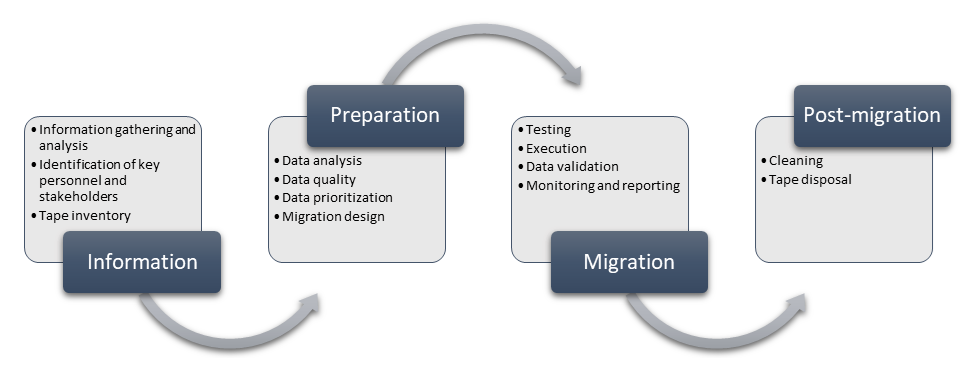

# Azure Storage tape migration overview

This article focuses on tape migrations. It aims to simplify, provide guidance, and considerations to run through a successful migration of data stored on various tape media to Azure storage services.

## Overview

Tape stores a large portion of worlds data, and remains one of the dominant types of storage media. Tape media exists for decades, and is still heavily used with hundreds of exabytes of new tapes shipped every year.

Tapes are a great medium for storing cold data. They're fast in sequential reading, but stages requiring mechanical movements (like loading, and unloading of tapes, tape seeks, etc.) are slower. That makes tapes unusable for traditional, random based access, and is the main reason that even today data stored on tapes is rarely used. In addition, tape is a magnetic medium that requires special handling. They're sensitive to environment, particularly temperature, and humidity. If kept within their operating environmental range, they can achieve high durability, and good restore success rate. However, when kept in unfriendly environment, deterioration happens often, and renders the tape unreadable.

Large portions of tapes store dark data (data that is created, and stored, but not used for any purpose). Dark data brings no value to the data owner. With the increase in AI capability, and accessibility, the trend is changing. Customers are looking into how dark data can help them to increase efficiency, open new revenue streams, or increase their competitive advantage. To take advantage of dark data, many organizations are considering migrating the data from tapes to cloud storage. Cloud storage provides an easy way to analyze the data, extract business value (with services like AI, Machine Learning, Azure Search, etc.), or reduce cost by taking advantage of archival storage for long-term retention.

Some of the major reasons we're seeing increase in tape to cloud migrations are:

- Extracting business value from dark data,
- Reduce the effort required for managing data with long term retention,
- Avoid migration process from one tape generation to another,
- Reduce the risk for data loss, particularly for older generations of tapes,
- Replace off-site tape storage facilities,
- Simplify disaster recovery processes,
- Applying modern tools like AI, and ML to historical data.

## Considerations

Before a tape migration process starts, options must be carefully considered. First consideration is deciding who executes the migration. Two options are commonly used:
- **Customer performed migration** where customer executes the migration end-to-end,
- **Tape migration partner** where customer ships the tapes to the partner, and partner executes the migration process.

|Approach | Pros | Cons |
| ------- | ---- | ---- |
| **Customer performed migration** | - Data never leaves the site   - No logistics for shipping tapes | - Requires hardware resources   - Adds more work to personnel   - Requires specific knowledge in handling tapes   - Possible unknown costs |
| **Tape migration partner** | - Simple pricing, and known cost upfront (paid per tape)   - No impact on production   - No impact on personnel | - Requires logistics for shipping tapes   - Security considerations required due to shipping tapes   - Multiple copies needed for data availability during migration |

Several major considerations can easily guide our decision on who can execute the migration, customer, or partner.

### Resources

Resources are the most critical part of the tape migration process, and we divide them in following categories:

| Category | Notes |
| -------- | ------|
| **People**   | - Specific set of skills are required  - Process is labor intensive |
| **Hardware** | - Different tape generations require different type of hardware   - Speed of the migration is proportional to available drives, and network bandwidth |
| **Software** | - Access to software that created the data is needed   - Access to encryption keys is needed |

Hardware is usually the most challenging part. If we're migrating existing tape generations, hardware is available, but used as part of the existing production. But for older tape generations, hardware is often end-of-life, and it's harder to acquire. With older tape generation, using a tape migration partner is a preferred, and simpler option.
When production hardware is used for migrations, careful planning is needed to make sure migration doesn't interfere with the production workloads. Here we can apply three different models:

1. **Use dedicated hardware for migration**: simplest migration model, it's easy to schedule, and plan with no impact to production. It adds cost for acquiring the hardware (if not available already), and causes a low hardware utilization post-migration.
1. **Run migration off-hours on production hardware**: migration model with no impact to production. Requires complex scheduling, execution, and people working off-hours. Possible only if production hardware isn't utilized 24x7.
1. **Run production, and migration together**: least-preferred migration model as it can easily impact production. This model reduces hardware available for production, requires complex scheduling, and planning. If this model is used, processes around reducing impact to production are critical to keep the migration timeline under control. This model is recommended only when production hardware has low utilization.

### Data transfer options

After the data is read from tapes, it needs to be moved to Azure Storage. Data can be moved using network, or offline devices like [Azure Data Box](https://azure.microsoft.com/products/databox/). Some of the parameters that are affecting the choice for data transfer options are:

- Available network bandwidth
- Required timeline to finish the migration
- Frequency of data changes

Learn more on guidance for selecting the optimal option [here](./storage-choose-data-transfer-solution.md). Network transfer is simpler and preferred option. Combination of network, and offline method is also possible, but requires more planning to make sure that migrated data doesn't overlap.

If there are no available resources to perform the migration, no matter what type of resource, our only option is to use a tape migration partner. In that case, we can choose between two options:

1. **Migration performed on customer's site**: tape migration partner ships the hardware, hires people, and performs the work on customer's location. Customer needs to provide access to the tapes, dedicated space for the equipment, network connections, and access to Azure Storage service. Partner is responsible for all other activities.
1. **Migration performed on partner's site**: customer ships the tapes to the partner, and provides access to Azure Storage service. Tape migration partner performs all the work to migrate the data from tapes to Azure Storage.

Second option is easier, and more commonly used. Tape migration partners have facilities that are designed, and equipped to perform tape migration on a large scale. This option also reduces the risk, and the timeline since partners have more hardware resources available. Performing migration on customer's site is used only when security, and privacy concerns don't allow the customer to ship the tapes to the partner.

Several partners can perform tape migrations to Azure. The full list of partners can be found on [offline media import](https://azure.microsoft.com/products/databox/offline-media-import/).

Here's a simple flowchart to ease the selection process.

### Data format

Data format has a large impact on migration design, and is the critical consideration for future data usability. Data can be stored in a proprietary, or native format. Proprietary formats are commonly stored as virtual tapes. Native format requires restoring files from tapes, and storing them as files, or objects.

| Model | Pros | Cons |
| ----- | ---- | ---- |
|Virtual tapes | - Easier, and faster migration   - Can recreate identical tape media as the original   - No need to have access to the original software to write the data | - Requires maintaining virtual tape inventory   - Data stored in application dependent format, requires original software to restore the data   - Data not accessible by Azure services (AI / ML) without restore |
| Native files | - Files accessible by any application, and service (AI / ML)   - Possible to monetize the data   - No need to have access to original software for restores | - More complex migration   - Requires access to original software to write the data |

The main criterion for deciding the format is the way we plan to use the data. If data is migrated only for long-term retention, then virtual tapes are a great choice. In any other case, storing data in native format is a preferred option. It allows simple usage of data in the future, and opens up many possibilities with data analysis.

## Migration process

Once we made decisions on migration execution, and preferred data format, we can start with the migration. Migration goes through several phases.

### Information phase

Information phase is critical for gathering key requirements. Gathered information guides correct design, and planning. Even though some information can be updated in later stages, providing precise information sets the scene, and avoids the need to make huge changes to the process. Some of the key questions that this phase needs to answer are:

- What type of tapes need to be migrated (for example, LTO3, LTO6, 3592JC, etc.)?
- What quantity of tapes for each model that need to be migrated (for example, 100xLTO3, 200xLTO6, etc.)?
- What software was used to write the data on tapes, is that software still available?
- What is the format used to write the data on tapes, is the format open, or proprietary, is compression applied?
- Was encryption used, and if yes, what is the most secure option to exchange encryption keys?
- What is the target region?
- What storage service is used?
- What regulatory requirements are critical (HIPAA, GDPR, etc.)? Is chain of custody mandatory?
- What is the migration deadline? Are there any critical milestones?
- How much network bandwidth is available for migration?
- Where are tapes physically stored, and can they be shipped?
- Do you already have hash values for all files? If yes, which hashing algorithm is used?
- Are tapes needed after migration?
- How to maintain temperature, and humidity for tapes during migration / transport?
- Who are main stakeholders?

### Preparation phase

After we gathered basic information, we can prepare for the migration. Preparation phase can include many different steps, but there are some common steps most migrations go through:

1. **Data analysis** provides information on the data that needs to be migrated. Information is critical to estimate how fast data can be read from tapes, and how much parallelism we need to achieve to successfully finish the migration before the deadline. It impacts estimates on the required hardware (libraries, robots, drives). Data analysis is done by sampling multiple tapes that represent the data set to be migrated. Typical information we're looking for is:
    - file sizes, 
    - amount of data stored per tape, 
    - number of files per tape, 
    - minimum, and maximum file sizes, 
    - file types. 
1. **Data quality** helps in estimating final, and unique dataset that needs to be migrated. One of the most common issues with tape migration is duplication of data. Tape migration is ideal time to clean up duplicated data. This process improves data quality for future use, it reduces cost, and the duration of the migration.
1. **Data prioritization** determines the order in which the data can be migrated. Ideally, we want to achieve direct streaming from each tape instead of randomly reading files from different tapes (to avoid constant loading, unloading, and seeks). This approach achieves the highest possible throughput, and is always the fastest migration path. Data prioritization takes business requirements, and technical feasibility to achieve the best results.
1. **Migration design** includes all the technical aspects of the migration, and the gathered information to form a final migration process. It's a written document that becomes source of truth for the remaining stages. It must contain at least:

    - clear migration process, and migration deadline,
    - hardware, and personnel requirements,
    - infrastructure, and network design,
    - security considerations,
    - how to deal with unreadable tapes,
    - roles, and responsibilities, etc.

### Migration phase

Once the migration design is final, we start the migration process. Before ramping up to full migration pace, we always perform a test with a smaller sample. Goal for the test is to make sure that end-to-end process works. It allows us to make tweaks, and improve the process. Once the test is successful, and we're happy with the results, we execute the migration. Migration phase is slightly different if we're using native files vs. virtual tapes. In both cases, it's a repetitive process that circles through all the tapes, and reads their entire content. This flowchart shows the migration phase when migrating to native files.
 

#### Data validation
For each file we migrate, we need to perform data validation to make sure that data wasn't corrupted during the migration process. Data validation is done by comparing hash values before the migration, and after the migration. There are many types of hashing algorithms that can be used. A common approach is to use MD5 since Azure Storage contains a pre-defined metadata field Content-MD5 that can be filled during the migration. This approach allows checking the same MD5 value when we access the data to validate the data is not changed, or corrupted. In ideal situation, source data already contains hash values that can be easily compared to hash values post-migration. If hashes don't exist, they must be calculated before the file is migrated. If hashes match, file is marked as migrated. If not, file is discarded, and migrated again. Sometimes the data is corrupted on the source tapes. Having the original hash values helps with catching those rare cases. If they happen, we can read the data from secondary copy if it exists. Data validation process is a critical component for a migration design. Process for handling failed validation must be defined. Migration phase is also constantly monitored to make sure we can react to unpredictable situation, and adapt to it. Regular reporting to main stakeholders is important to keep the migration on track.

### Post-migration phase

After migration is done, there are still couple of steps we need to consider, before successfully closing the migration project. We need to dispose hardware used for the migration, if not needed anymore. The most important question is how to dispose of the tapes. Tape disposal is a two steps process. If tapes are storing sensitive, and confidential information (and they typically do), they must be degaussed first. Degaussing ensures that all data is magnetically deleted from the media. After deletion, tapes need to be properly destroyed, and recycled. If we used a tape migration partner, we can also let the partner securely dispose of the tapes.

## Next steps

- [Azure Storage overview](../blobs/storage-blobs-overview.md)
- [Azure offline media import](https://azure.microsoft.com/products/databox/offline-media-import/)
- [Compare data transfer options](./storage-choose-data-transfer-solution.md)
- [Storage migration overview](../blobs/storage-blobs-overview.md)
