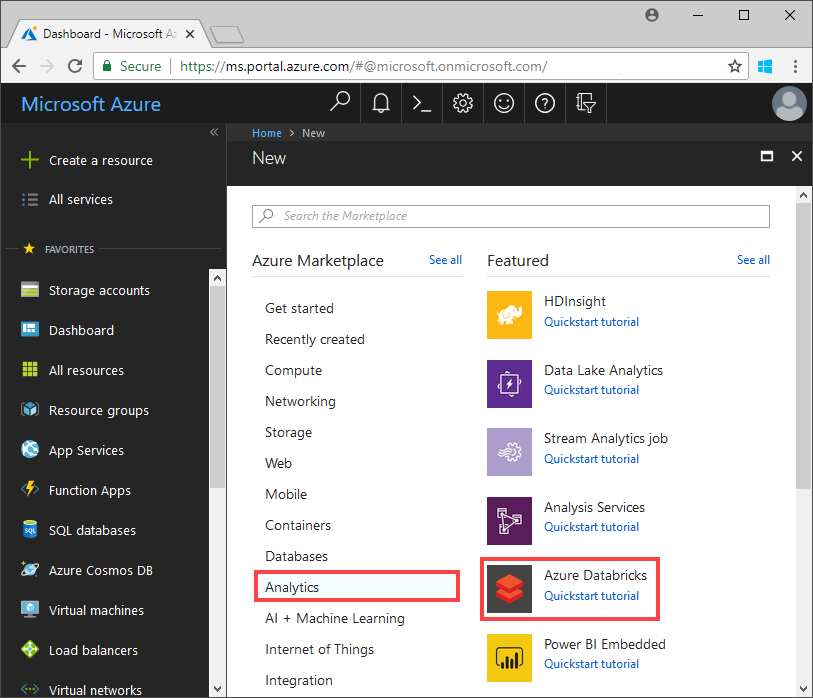
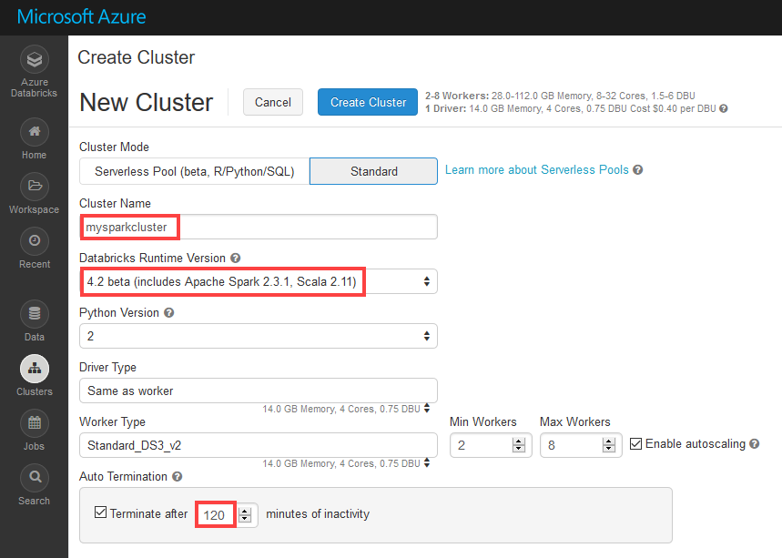

# Tutorial: Extract, transform, and load data using Azure Databricks

In this tutorial, you perform an ETL (extract, transform, and load data) operation to move data from Azure Data Lake Storage Gen2 Preview to Azure SQL Data Warehouse, using Azure Databricks.

The following illustration shows the application flow:


This tutorial covers the following tasks:

> [!div class="checklist"]
> * Create an Azure Databricks workspace
> * Create a Spark cluster in Azure Databricks
> * Create an Azure Data Lake Storage Gen2 capable account
> * Upload data to Azure Data Lake Storage Gen2
> * Create a notebook in Azure Databricks
> * Extract data from Data Lake Storage Gen2
> * Transform data in Azure Databricks
> * Load data into Azure SQL Data Warehouse

If you don't have an Azure subscription, [create a free account](https://azure.microsoft.com/free/) before you begin.

## Prerequisites

To complete this tutorial:

* Create an Azure SQL Data Warehouse, create a server-level firewall rule, and connect to the server as a server admin. Follow the instructions at [Quickstart: Create an Azure SQL Data Warehouse](../../sql-data-warehouse/create-data-warehouse-portal.md)
* Create a database master key for the Azure SQL Data Warehouse. Follow the instructions at [Create a Database Master Key](https://docs.microsoft.com/sql/relational-databases/security/encryption/create-a-database-master-key).
* [Create a Azure Data Lake Storage Gen2 account](quickstart-create-account.md)

## Sign in to the Azure Portal

Sign in to the [Azure portal](https://portal.azure.com/).

## Create an Azure Databricks workspace

In this section, you create an Azure Databricks workspace using the Azure portal. 

1. In the Azure portal, select **Create a resource** > **Analytics** > **Azure Databricks**.

    

2. Under **Azure Databricks Service**, provide the values to create a Databricks workspace.

    

    Provide the following values:

    |Property  |Description  |
    |---------|---------|
    |**Workspace name**     | Provide a name for your Databricks workspace.        |
    |**Subscription**     | From the drop-down, select your Azure subscription.        |
    |**Resource group**     | Specify whether you want to create a new resource group or use an existing one. A resource group is a container that holds related resources for an Azure solution. For more information, see [Azure Resource Group overview](../../azure-resource-manager/resource-group-overview.md). |
    |**Location**     | Select **West US 2**. For other available regions, see [Azure services available by region](https://azure.microsoft.com/regions/services/).        |
    |**Pricing Tier**     |  Choose between **Standard** or **Premium**. For more information on these tiers, see [Databricks pricing page](https://azure.microsoft.com/pricing/details/databricks/).       |

    Select **Pin to dashboard** and then select **Create**.

3. The account creation takes a few minutes. During account creation, the portal displays the **Submitting deployment for Azure Databricks** tile on the right side. You may need to scroll right on your dashboard to see the tile. There is also a progress bar displayed near the top of the screen. You can watch either area for progress.

    

## Create a Spark cluster in Databricks

1. In the Azure portal, go to the Databricks workspace that you created, and then select **Launch Workspace**.

2. You are redirected to the Azure Databricks portal. From the portal, select **Cluster**.

    

3. In the **New cluster** page, provide the values to create a cluster.

    

    Fill in values for the following fields, and accept the default values for the other fields:

    * Enter a name for the cluster.
    * For this article, create a cluster with **4.2** runtime.
    * Make sure you select the **Terminate after ____ minutes of inactivity** checkbox. Provide a duration (in minutes) to terminate the cluster, if the cluster is not being used.

    Select **Create cluster**. Once the cluster is running, you can attach notebooks to the cluster and run Spark jobs.

## Create storage account file system

In this section, you create a notebook in Azure Databricks workspace and then run code snippets to configure the storage account.

1. In the [Azure portal](https://portal.azure.com), go to the Azure Databricks workspace you created, and then select **Launch Workspace**.

2. In the left pane, select **Workspace**. From the **Workspace** drop-down, select **Create** > **Notebook**.

    

3. In the **Create Notebook** dialog box, enter a name for the notebook. Select **Scala** as the language, and then select the Spark cluster that you created earlier.

    

    Select **Create**.

4. Enter the following code into the first cell and execute the code:

    ```scala
    spark.conf.set("fs.azure.account.key.<ACCOUNT_NAME>.dfs.core.windows.net", "<ACCOUNT_KEY>") 
    spark.conf.set("fs.azure.createRemoteFileSystemDuringInitialization", "true")
    dbutils.fs.ls("abfs://<FILE_SYSTEM_NAME>@<ACCOUNT_NAME>.dfs.core.windows.net/")
    spark.conf.set("fs.azure.createRemoteFileSystemDuringInitialization", "false") 
    ```

    Press **SHIFT + ENTER** to run the code cell.

    Now the file system is created for the storage account.

## Upload data to the storage account

The next step is to upload a sample data file to the storage account to later transform in Azure Databricks. 

> [!NOTE]
> If you do not already have an Azure Data Lake Storage Gen2 capable account, follow the [quickstart to create one](./quickstart-create-account.md).

1. Download (**small_radio_json.json**) from the [U-SQL Examples and Issue Tracking](https://github.com/Azure/usql/blob/master/Examples/Samples/Data/json/radiowebsite/small_radio_json.json) repo and make note of the path where you save the file.

2. Next, you upload the sample data into your storage account. The method you use to upload data into your storage account differs depending on whether you have the hierarchical namespace enabled.

    If the hierarchical namespace is enabled on your Azure Storage account created for Gen2 account, you can use Azure Data Factory, distp, or AzCopy (version 10) to handle the upload. AzCopy version 10 is only available to preview customers. To use AzCopy pase in the following code into a command window:

    ```bash
    set ACCOUNT_NAME=<ACCOUNT_NAME>
    set ACCOUNT_KEY=<ACCOUNT_KEY>
    azcopy cp "<DOWNLOAD_PATH>\small_radio_json.json" https://<ACCOUNT_NAME>.dfs.core.windows.net/data --recursive 
    ```
    
## Extract data from Azure Storage

Return to your DataBricks Notebook and enter the following code in a new cell:

1. Add the following snippet in an empty code cell and replace the placeholder values with the values you saved earlier from the storage account.

    ```scala
    dbutils.widgets.text("storage_account_name", "STORAGE_ACCOUNT_NAME", "<YOUR_STORAGE_ACCOUNT_NAME>")
    dbutils.widgets.text("storage_account_access_key", "YOUR_ACCESS_KEY", "<YOUR_STORAGE_ACCOUNT_SHARED_KEY>")
    ```

    Press **SHIFT + ENTER** to run the code cell.

2. You can now load the sample json file as a dataframe in Azure Databricks. Paste the following code in a new cell, and then press **SHIFT + ENTER** (making sure to replace the placeholder values):

    ```scala
    val df = spark.read.json("abfs://<FILE_SYSTEM_NAME>@<ACCOUNT_NAME>.dfs.core.windows.net/data/small_radio_json.json")
    ```

3. Run the following code to see the contents of the data frame.

    ```scala
    df.show()
    ```

    You see an output similar to the following snippet:

    ```bash
    +---------------------+---------+---------+------+-------------+----------+---------+-------+--------------------+------+--------+-------------+---------+--------------------+------+-------------+------+
    |               artist|     auth|firstName|gender|itemInSession|  lastName|   length|  level|            location|method|    page| registration|sessionId|                song|status|           ts|userId|
    +---------------------+---------+---------+------+-------------+----------+---------+-------+--------------------+------+--------+-------------+---------+--------------------+------+-------------+------+
    | El Arrebato         |Logged In| Annalyse|     F|            2|Montgomery|234.57914| free  |  Killeen-Temple, TX|   PUT|NextSong|1384448062332|     1879|Quiero Quererte Q...|   200|1409318650332|   309|
    | Creedence Clearwa...|Logged In|   Dylann|     M|            9|    Thomas|340.87138| paid  |       Anchorage, AK|   PUT|NextSong|1400723739332|       10|        Born To Move|   200|1409318653332|    11|
    | Gorillaz            |Logged In|     Liam|     M|           11|     Watts|246.17751| paid  |New York-Newark-J...|   PUT|NextSong|1406279422332|     2047|                DARE|   200|1409318685332|   201|
    ...
    ...
    ```

You have now extracted the data from Azure Data Lake Storage Gen2 into Azure Databricks.

## Transform data in Azure Databricks

The raw sample data **small_radio_json.json** captures the audience for a radio station and has a variety of columns. In this section, you transform the data to only retrieve specific columns in from the dataset.

1. Start by retrieving only the columns *firstName*, *lastName*, *gender*, *location*, and *level* from the dataframe you already created.

    ```scala
    val specificColumnsDf = df.select("firstname", "lastname", "gender", "location", "level")
    ```

    You get an output as shown in the following snippet:

    ```bash
    +---------+----------+------+--------------------+-----+
    |firstname|  lastname|gender|            location|level|
    +---------+----------+------+--------------------+-----+
    | Annalyse|Montgomery|     F|  Killeen-Temple, TX| free|
    |   Dylann|    Thomas|     M|       Anchorage, AK| paid|
    |     Liam|     Watts|     M|New York-Newark-J...| paid|
    |     Tess|  Townsend|     F|Nashville-Davidso...| free|
    |  Margaux|     Smith|     F|Atlanta-Sandy Spr...| free|
    |     Alan|     Morse|     M|Chicago-Napervill...| paid|
    |Gabriella|   Shelton|     F|San Jose-Sunnyval...| free|
    |   Elijah|  Williams|     M|Detroit-Warren-De...| paid|
    |  Margaux|     Smith|     F|Atlanta-Sandy Spr...| free|
    |     Tess|  Townsend|     F|Nashville-Davidso...| free|
    |     Alan|     Morse|     M|Chicago-Napervill...| paid|
    |     Liam|     Watts|     M|New York-Newark-J...| paid|
    |     Liam|     Watts|     M|New York-Newark-J...| paid|
    |   Dylann|    Thomas|     M|       Anchorage, AK| paid|
    |     Alan|     Morse|     M|Chicago-Napervill...| paid|
    |   Elijah|  Williams|     M|Detroit-Warren-De...| paid|
    |  Margaux|     Smith|     F|Atlanta-Sandy Spr...| free|
    |     Alan|     Morse|     M|Chicago-Napervill...| paid|
    |   Dylann|    Thomas|     M|       Anchorage, AK| paid|
    |  Margaux|     Smith|     F|Atlanta-Sandy Spr...| free|
    +---------+----------+------+--------------------+-----+
    ```

2.  You can further transform this data to rename the column **level** to **subscription_type**.

    ```scala
    val renamedColumnsDF = specificColumnsDf.withColumnRenamed("level", "subscription_type")
    renamedColumnsDF.show()
    ```

    You get an output as shown in the following snippet.

    ```bash
    +---------+----------+------+--------------------+-----------------+
    |firstname|  lastname|gender|            location|subscription_type|
    +---------+----------+------+--------------------+-----------------+
    | Annalyse|Montgomery|     F|  Killeen-Temple, TX|             free|
    |   Dylann|    Thomas|     M|       Anchorage, AK|             paid|
    |     Liam|     Watts|     M|New York-Newark-J...|             paid|
    |     Tess|  Townsend|     F|Nashville-Davidso...|             free|
    |  Margaux|     Smith|     F|Atlanta-Sandy Spr...|             free|
    |     Alan|     Morse|     M|Chicago-Napervill...|             paid|
    |Gabriella|   Shelton|     F|San Jose-Sunnyval...|             free|
    |   Elijah|  Williams|     M|Detroit-Warren-De...|             paid|
    |  Margaux|     Smith|     F|Atlanta-Sandy Spr...|             free|
    |     Tess|  Townsend|     F|Nashville-Davidso...|             free|
    |     Alan|     Morse|     M|Chicago-Napervill...|             paid|
    |     Liam|     Watts|     M|New York-Newark-J...|             paid|
    |     Liam|     Watts|     M|New York-Newark-J...|             paid|
    |   Dylann|    Thomas|     M|       Anchorage, AK|             paid|
    |     Alan|     Morse|     M|Chicago-Napervill...|             paid|
    |   Elijah|  Williams|     M|Detroit-Warren-De...|             paid|
    |  Margaux|     Smith|     F|Atlanta-Sandy Spr...|             free|
    |     Alan|     Morse|     M|Chicago-Napervill...|             paid|
    |   Dylann|    Thomas|     M|       Anchorage, AK|             paid|
    |  Margaux|     Smith|     F|Atlanta-Sandy Spr...|             free|
    +---------+----------+------+--------------------+-----------------+
    ```

## Load data into Azure SQL Data Warehouse

In this section, you upload the transformed data into Azure SQL Data Warehouse. Using the Azure SQL Data Warehouse connector for Azure Databricks, you can directly upload a dataframe as a table in SQL data warehouse.

As mentioned earlier, the SQL date warehouse connector uses Azure Blob Storage as a temporary storage to upload data between Azure Databricks and Azure SQL Data Warehouse. So, you start by providing the configuration to connect to the storage account. You must have already created the account as part of the prerequisites for this article.

1. Provide the configuration to access the Azure Storage account from Azure Databricks.

    ```scala
    val storageURI = "<STORAGE_ACCOUNT_NAME>.dfs.core.windows.net"
    val fileSystemName = "<FILE_SYSTEM_NAME>"
    val accessKey =  "<ACCESS_KEY>"
    ```

2. Specify a temporary folder that will be used while moving data between Azure Databricks and Azure SQL Data Warehouse.

    ```scala
    val tempDir = "abfs://" + fileSystemName + "@" + storageURI +"/tempDirs"
    ```

3. Run the following snippet to store Azure Blob storage access keys in the configuration. This ensures that you do not have to keep the access key in the notebook in plain text.

    ```scala
    val acntInfo = "fs.azure.account.key."+ storageURI
    sc.hadoopConfiguration.set(acntInfo, accessKey)
    ```

4. Provide the values to connect to the Azure SQL Data Warehouse instance. You must have created a SQL data warehouse as part of the prerequisites.

    ```scala
    //SQL Data Warehouse related settings
    val dwDatabase = "<DATABASE NAME>"
    val dwServer = "<DATABASE SERVER NAME>" 
    val dwUser = "<USER NAME>"
    val dwPass = "<PASSWORD>"
    val dwJdbcPort =  "1433"
    val dwJdbcExtraOptions = "encrypt=true;trustServerCertificate=true;hostNameInCertificate=*.database.windows.net;loginTimeout=30;"
    val sqlDwUrl = "jdbc:sqlserver://" + dwServer + ".database.windows.net:" + dwJdbcPort + ";database=" + dwDatabase + ";user=" + dwUser+";password=" + dwPass + ";$dwJdbcExtraOptions"
    val sqlDwUrlSmall = "jdbc:sqlserver://" + dwServer + ".database.windows.net:" + dwJdbcPort + ";database=" + dwDatabase + ";user=" + dwUser+";password=" + dwPass
    ```

5. Run the following snippet to load the transformed dataframe, **renamedColumnsDF**, as a table in SQL data warehouse. This snippet creates a table called **SampleTable** in the SQL database.

    ```scala
    spark.conf.set(
        "spark.sql.parquet.writeLegacyFormat",
        "true")
    
    renamedColumnsDF.write
        .format("com.databricks.spark.sqldw")
        .option("url", sqlDwUrlSmall) 
        .option("dbtable", "SampleTable")
        .option( "forward_spark_azure_storage_credentials","True")
        .option("tempdir", tempDir)
        .mode("overwrite")
        .save()
    ```

6. Connect to the SQL database and verify that you see a **SampleTable**.

    

7. Run a select query to verify the contents of the table. It should have the same data as the **renamedColumnsDF** dataframe.

    

## Clean up resources

After you have finished running the tutorial, you can terminate the cluster. To do so, from the Azure Databricks workspace, from the left pane, select **Clusters**. For the cluster you want to terminate, move the cursor over the ellipsis under **Actions** column, and select the **Terminate** icon.


If you do not manually terminate the cluster it will automatically stop, provided you selected the **Terminate after __ minutes of inactivity** checkbox while creating the cluster. In such a case, the cluster automatically stops if it has been inactive for the specified time.

## Next steps

In this tutorial, you learned how to:

> [!div class="checklist"]
> * Create an Azure Databricks workspace
> * Create a Spark cluster in Azure Databricks
> * Create an Azure Data Lake Storage Gen2 capable account
> * Upload data to Azure Data Lake Storage Gen2
> * Create a notebook in Azure Databricks
> * Extract data from Data Lake Storage Gen2
> * Transform data in Azure Databricks
> * Load data into Azure SQL Data Warehouse

Advance to the next tutorial to learn about streaming real-time data into Azure Databricks using Azure Event Hubs.

> [!div class="nextstepaction"]
>[Stream data into Azure Databricks using Event Hubs](../../azure-databricks/databricks-stream-from-eventhubs.md)
