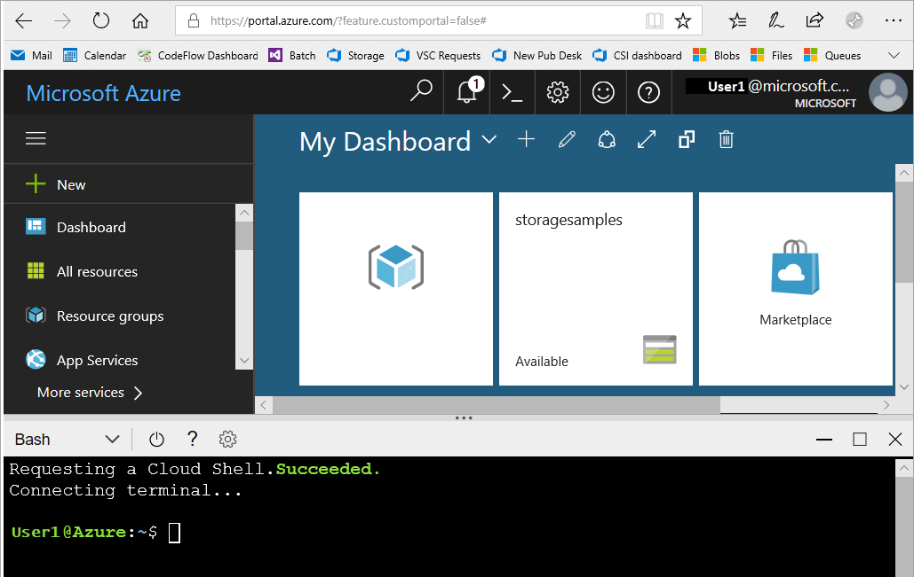
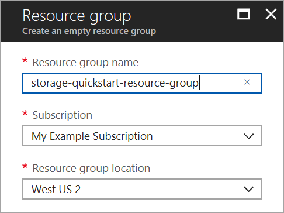

# Quickstart: Create an Azure Data Lake Storage Gen2 Preview storage account

Azure Data Lake Storage Gen2 Preview accounts [support an Hierarchical Namespace Service](introduction.md) which provides a native directory-based file system tailored to work with the Hadoop Distributed File System (HDFS). Access to Data Lake Storage Gen2 data from the HDFS is available through the [ABFS driver](abfs-driver.md).

To enable Data Lake Storage Gen2 capabilities on your storage account, [fill out the preview survey to request access](https://aka.ms/adlsgen2signup). Once approved, then you are able to create a new Data Lake Storage Gen2 account. This quickstart demonstrates how to create an account using the [Azure portal](https://portal.azure.com/), [Azure PowerShell](https://docs.microsoft.com/powershell/azure/overview), or via the [Azure CLI](https://docs.microsoft.com/cli/azure?view=azure-cli-latest).

> [!NOTE]
> The create account UI in the Azure portal is updated once you are approved to create a Data Lake Storage Gen2 account. In the same way, the Data Lake Storage Gen2-related PowerShell and CLI arguments only work once you are approved for the preview.

## Prerequisites

If you don't have an Azure subscription, create a [free account](https://azure.microsoft.com/free/) before you begin.

|           | Prerequisite |
|-----------|--------------|
|Portal     | None         |
|PowerShell | This quickstart requires the Azure PowerShell module version **5.0.4-preview** or later. Run `Get-Module -ListAvailable AzureRM` to find your current version. If you need to install or upgrade, see [Install Azure PowerShell module](/powershell/azure/install-azurerm-ps). |
|CLI        | You can log in to Azure and run Azure CLI commands in one of two ways: <ul><li>You can run CLI commands from within the Azure portal, in Azure Cloud Shell </li><li>You can install the CLI and run CLI commands locally</li></ul>|

When working on the command line you have the option of running the Azure Cloud shell or installing the CLI locally.

### Use Azure Cloud Shell

Azure Cloud Shell is a free Bash shell that you can run directly within the Azure portal. It has the Azure CLI preinstalled and configured to use with your account. Click the **Cloud Shell** button on the menu in the upper-right of the Azure portal:

[](https://portal.azure.com)

The button launches an interactive shell that you can use to run the steps in this quickstart:

[](https://portal.azure.com)

### Install the CLI locally

You can also install and use the Azure CLI locally. This quickstart requires that you are running the Azure CLI version 2.0.38 or later. Run `az --version` to find the version. If you need to install or upgrade, see [Install the Azure CLI](/cli/azure/install-azure-cli).

## Overview of creating an Azure Data Lake Storage Gen2 account

Before you create an account, you first create a resource group that acts as a logical container to storage accounts or any other Azure resources you create. If you wish to clean up the resources created by this quickstart, you can simply delete the resource group. Deleting the resource group also deletes the associated storage account, and any other resources associated with the resource group. For more information regarding resource groups, see [Azure Resource Manager overview](../../azure-resource-manager/resource-group-overview.md).

> [!NOTE]
> You must create new storage accounts as type **StorageV2 (general-purpose V2)** to take advantage of Data Lake Storage Gen2 features.  

For more information about storage accounts, see [Azure Storage account overview](../common/storage-account-overview.md).

When naming your storage account, keep these rules in mind:

- Storage account names must be between 3 and 24 characters in length and may contain numbers and lowercase letters only.
- Your storage account name must be unique within Azure. No two storage accounts can have the same name.

## Create an account using the Azure portal

Log in to the [Azure portal](https://portal.azure.com).

### Create a resource group

To create a resource group in the Azure portal, follow these steps:

1. In the Azure portal, expand the menu on the left side to open the menu of services, and choose **Resource Groups**.
2. Click the **Add** button to add a new resource group.
3. Enter a name for the new resource group.
4. Select the subscription in which to create the new resource group.
5. Choose the location for the resource group.
6. Click the **Create** button.  



### Create a general-purpose v2 storage account

To create a general-purpose v2 storage account in the Azure portal, follow these steps:

> [!NOTE]
> The hierarchical namespace is only enabled in US East, US East 2, West US, West US 2, West Central US, Europe North, Europe West, Asia Southeast, and Australia East. Make sure you specify either one of these locations when creating the storage account.

1. In the Azure portal, expand the menu on the left side to open the menu of services, and choose **All services**. Then, scroll down to **Storage**, and choose **Storage accounts**. On the **Storage Accounts** window that appears, choose **Add**.
2. Enter a name for your storage account.
3. Leave **Deployment model** set to the default value.
4. Set the **Account kind** field to **StorageV2 (general-purpose v2)**.
5. Set **Location** to **West US 2**
6. Leave the **Replication** field set to **Locally-redundant storage (LRS)**.
7. Leave these fields set to their defaults: **Replication**. **Performance**, **Access tier**.
8. Choose the subscription in which you want to create the storage account.
9. In the **Resource group** section, select **Use existing**, then choose the resource group you created in the previous section.
10. Keep the default value for **Virtual Networks**
11. In the **Data Lake Storage Gen2 (preview)** section set **Hierarchical namespace** to **Enabled**.
12. Click **Create** to create the storage account.


Your storage account is now created through the portal.

### Clean up resources

To remove a resource group using the Azure portal:

1. In the Azure portal, expand the menu on the left side to open the menu of services, and choose **Resource Groups** to display the list of your resource groups.
2. Locate the resource group to delete, and right-click the **More** button (**...**) on the right side of the listing.
3. Select **Delete resource group**, and confirm.

## Create an account using PowerShell

Log in to your Azure subscription with the `Login-AzureRmAccount` command and follow the on-screen directions to authenticate.

```powershell
Login-AzureRmAccount
```

### Upgrade your powershell module

In order to interact with Data Lake Storage Gen2 through PowerShell, you will have to upgrade your module to the preview version.

To do that, open an elevated PowerShell and enter the following command: `Install-Module AzureRM.Storage –Repository PSGallery -RequiredVersion 5.0.4-preview –AllowPrerelease –AllowClobber –Force `

Then restart your shell.

### Create a resource group

To create a new resource group with PowerShell, use the [New-AzureRmResourceGroup](/powershell/module/azurerm.resources/new-azurermresourcegroup) command: 

> [!NOTE]
> The hierarchical namespace is only enabled in US East, US East 2, West US, West US 2, West Central US, Europe North, Europe West, Asia Southeast, and Australia East. Make sure you specify either one of these locations when creating the storage account.

```powershell
# put resource group in a variable so you can use the same group name going forward,
# without hardcoding it repeatedly
$resourceGroup = "storage-quickstart-resource-group"
$location = "westus2"
New-AzureRmResourceGroup -Name $resourceGroup -Location $location
```

### Create a general-purpose v2 storage account

To create a general-purpose v2 storage account from PowerShell with locally-redundant storage (LRS), use the [New-AzureRmStorageAccount](/powershell/module/azurerm.storage/New-AzureRmStorageAccount) command:

```powershell
Get-AzureRmLocation | select Location 
$location = "westus2"

New-AzureRmStorageAccount -ResourceGroupName $resourceGroup `
  -Name "storagequickstart" `
  -Location $location `
  -SkuName Standard_LRS `
  -Kind StorageV2 
  -EnableHierarchicalNamespace $True
```

### Clean up resources

To remove the resource group and its associated resources, including the new storage account, use the [Remove-AzureRmResourceGroup](/powershell/module/azurerm.resources/remove-azurermresourcegroup) command: 

```powershell
Remove-AzureRmResourceGroup -Name $resourceGroup
```

## Create an account using Azure CLI

To launch Azure Cloud Shell, log in to the [Azure portal](https://portal.azure.com).

To log into your local installation of the CLI, run the login command:

```cli
az login
```

### Upgrade your CLI module

In order to interact with Data Lake Storage Gen2 through CLI, you will have to add the extension to your shell.

To do that: enter the following command using either the Cloud Shell or a local shell: `az extension add --name storage-preview`

### Create a resource group

To create a new resource group with Azure CLI, use the [az group create](/cli/azure/group#az_group_create) command.

```azurecli-interactive
az group create \
    --name storage-quickstart-resource-group \
    --location westus2
```

> [!NOTE]
> The hierarchical namespace is only enabled in US East, US East 2, West US, West US 2, West Central US, Europe North, Europe West, Asia Southeast, and Australia East. Make sure you specify either one of these locations when creating the storage account.

### Create a general-purpose v2 storage account

To create a general-purpose v2 storage account from the Azure CLI with locally-redundant storage, use the [az storage account create](/cli/azure/storage/account#az_storage_account_create) command.

```azurecli-interactive
az storage account create \
    --name storagequickstart \
    --resource-group storage-quickstart-resource-group \
    --location westus2 \
    --sku Standard_LRS \
    --kind StorageV2 \
    --hierarchical-namespace true
```

### Clean up resources

To remove the resource group and its associated resources, including the new storage account, use the [az group delete](/cli/azure/group#az_group_delete) command.

```azurecli-interactive
az group delete --name myResourceGroup
```

## Next steps

In this quick start, you've created a Data Lake Storage Gen2 storage account. To learn how to upload and download blobs to and from your storage account, continue to the Blob storage quickstart.

* [Move data to and from Azure Blob Storage using AzCopy](https://docs.microsoft.com/en-us/azure/machine-learning/team-data-science-process/move-data-to-azure-blob-using-azcopy)