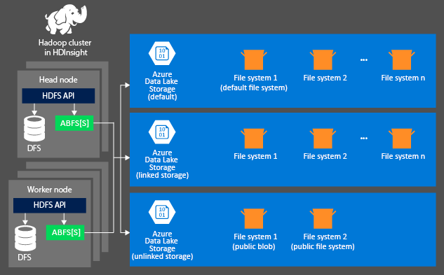
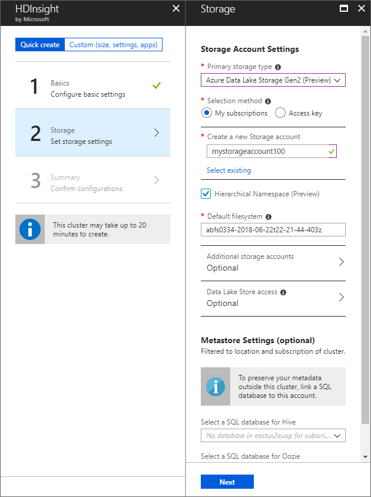

# Use Azure Data Lake Storage Gen2 Preview with Azure HDInsight clusters

To analyze data in HDInsight cluster, you can store the data either in any combination of Azure Storage, Azure Data Lake Storage Gen1, or Azure Data Lake Storage Gen2 Preview. All storage options enable you to safely delete HDInsight clusters that are used for computation without losing user data.

Hadoop supports a notion of the default file system. The default file system implies a default scheme and authority. It can also be used to resolve relative paths. During the HDInsight cluster creation process, you can specify a blob container in Azure Storage or Azure Data Lake Storage as the default file system. Alternatively with HDInsight 3.5, you can select either Azure Storage or Azure Data Lake Storage as the default file system with a few exceptions.

In this article, you learn how Azure Data Lake Storage Gen2 works with HDInsight clusters. For more information about creating an HDInsight cluster, see [Set up HDInsight clusters using Azure Data Lake Storage with Hadoop, Spark, Kafka, and more](quickstart-create-connect-hdi-cluster.md).

Azure storage is a robust, general-purpose storage solution that integrates seamlessly with HDInsight. HDInsight can use Azure Data Lake Storage as the default file system for the cluster. Through a Hadoop distributed file system (HDFS) interface, the full set of components in HDInsight can operate directly on files in Azure Data Lake Storage.

We do not recommend that you use the default file system for storing business data. Deleting the default file system after each use to reduce storage cost is a good practice. Note that default container contains application and system logs. Make sure to retrieve the logs before deleting the container.

Sharing one file system for multiple clusters is not supported.

## HDInsight storage architecture

The following diagram provides an abstract view of the HDInsight storage architecture of using Azure Storage:



HDInsight provides access to the distributed file system that is locally attached to the compute nodes. This file system can be accessed by using the fully qualified URI, for example:

    hdfs://<NAME_NODE_HOST>/<PATH>

In addition, HDInsight allows you to access data that is stored in Azure Data Lake Storage. The syntax is:

    abfs[s]://<FILE_SYSTEM_NAME>@<ACCOUNT_NAME>.dfs.core.windows.net/<path>

Here are some considerations when using an Azure Storage account with HDInsight clusters.

* **Files in the storage accounts that are connected to a cluster** have the account name and key associated with the cluster during creation. This configuration gives you full access to files in the file system.

* **Public files in storage accounts that are NOT connected to a cluster** expose read-only permissions to the files in the file system.
  
  > [!NOTE]
  > Public file systems allow you to get a list of all files available in the file system and access metadata. Public file systems allow you to access files only if you know the exact URL. For more information, see [Restrict access to containers and blobs](http://msdn.microsoft.com/library/windowsazure/dd179354.aspx) (the rules for containers and blobs work the same fore files and the file system).
 
* **Private file systems in storage accounts that are NOT connected to a cluster** do not allow access files in the file system unless you define the storage account when you submit the WebHCat jobs. Reasons for this restriction are explained later in this article.

The storage accounts that are defined in the creation process and their keys are stored in *%HADOOP_HOME%/conf/core-site.xml* on the cluster nodes. The default behavior of HDInsight is to use the storage accounts defined in the *core-site.xml* file. You can modify this setting using [Ambari](../../hdinsight/hdinsight-hadoop-manage-ambari.md)

Multiple WebHCat jobs, including Hive, MapReduce, Hadoop streaming, and Pig, can carry a description of storage accounts and metadata with them. (This approach currently works for Pig with storage accounts, but not for metadata.) For more information, see [Using an HDInsight Cluster with Alternate Storage Accounts and Metastores](http://social.technet.microsoft.com/wiki/contents/articles/23256.using-an-hdinsight-cluster-with-alternate-storage-accounts-and-metastores.aspx).

## <a id="benefits"></a>Benefits of Azure Storage

The implied performance cost of not co-locating compute clusters and storage resources is mitigated by the way the compute clusters are created close to the storage account resources inside the Azure region, where the high-speed network makes it efficient for the compute nodes to access the data inside Azure storage.

There are several benefits associated with storing the data in Azure storage instead of HDFS:

* **Data reuse and sharing:** The data in HDFS is located inside the compute cluster. Only the applications that have access to the compute cluster can use the data by using HDFS APIs. The data in Azure storage can be accessed either through the HDFS APIs or through the [Blob Storage REST APIs][blob-storage-restAPI]. Thus, a larger set of applications (including other HDInsight clusters) and tools can be used to produce and consume the data.

* **Data archiving:** Storing data in Azure storage enables the HDInsight clusters used for computation to be safely deleted without losing user data.

* **Data storage cost:** Storing data in the native HDFS for the long term is more costly than storing the data in Azure storage because the cost of a compute cluster is higher than the cost of Azure storage. In addition, because the data does not have to be reloaded for every compute cluster generation, you are also saving data loading costs.

* **Elastic scale-out:** Although HDFS provides you with a scaled-out file system, the scale is determined by the number of nodes that you create for your cluster. Changing the scale can become a more complicated process than relying on the elastic scaling capabilities that you get automatically in Azure storage.

* **Geo-replication:** Your Azure storage data can be geo-replicated. Although this ability gives you geographic recovery and data redundancy, supporting a failover to the geo-replicated location severely impacts your performance and may result in additional costs. Therefore, choose geo-replication carefully and only if the value of the data is worth the additional cost.

* **Data lifecycle management:** All data in any file system goes through its own lifecycle. Data often starts off being very valuable and frequently accessed, transitions to being less valuable and requiring less access, and ultimately requires archive or deletion. Azure Storage provides data tiering and lifecycle management policies that tier data appropriately for its lifecycle stage.

Certain MapReduce jobs and packages may create intermediate results that you don't really want to store in Azure storage. In that case, you can elect to store the data in the local HDFS. In fact, HDInsight uses the native HDFS implementation (which is referred to as DFS) for several of these intermediate results in Hive jobs and other processes.

> [!NOTE]
> Most HDFS commands (for example, `ls`, `copyFromLocal` and `mkdir`) still work as expected. Only the commands that are specific to the DFS, such as `fschk` and `dfsadmin`, show different behavior in Azure storage.

## Create an Data Lake Storage file system

To use the file system, you first create an [Azure Storage account][azure-storage-create]. As part of this process, you specify an Azure region where the storage account is created. The cluster and the storage account must be hosted in the same region. The Hive metastore SQL Server database and Oozie metastore SQL Server database must also be located in the same region.

Wherever it lives, each blob you create belongs to a file system in your Azure Data Lake Storage account. 

The default Data Lake Storage file system stores cluster-specific information such as job history and logs. Don't share a default Data Lake Storage file system with multiple HDInsight clusters. This might corrupt job history. It is recommended to use a different file system for each cluster and put shared data on a linked storage account specified in deployment of all relevant clusters rather than the default storage account. For more information on configuring linked storage accounts, see [Create HDInsight clusters][hdinsight-creation]. However, you can reuse a default storage file system after the original HDInsight cluster has been deleted. For HBase clusters, you can retain the HBase table schema and data by creating a new HBase cluster using the default blob container that is used by a deleted HBase cluster that has been deleted.

[!INCLUDE [secure-transfer-enabled-storage-account](../../../includes/hdinsight-secure-transfer.md)]

### Use the Azure portal

When creating an HDInsight cluster from the Portal, you have the options (as shown in the following screenshot) to provide the storage account details. You can also specify whether you want an additional storage account associated with the cluster, and if so, choose from any of the available storage options for additional storage.



> [!WARNING]
> Using an additional storage account in a different location than the HDInsight cluster is not supported.

### Use Azure PowerShell

If you [installed and configured Azure PowerShell][powershell-install], you can use the following code from the Azure PowerShell prompt to create a storage account and container:

[!INCLUDE [upgrade-powershell](../../../includes/hdinsight-use-latest-powershell.md)]

    $SubscriptionID = "<Your Azure Subscription ID>"
    $ResourceGroupName = "<New Azure Resource Group Name>"
    $Location = "WEST US 2"

    $StorageAccountName = "<New Azure Storage Account Name>"
    $containerName = "<New Azure Blob Container Name>"

    Connect-AzureRmAccount
    Select-AzureRmSubscription -SubscriptionId $SubscriptionID

    # Create resource group
    New-AzureRmResourceGroup -name $ResourceGroupName -Location $Location

    # Create default storage account
    New-AzureRmStorageAccount -ResourceGroupName $ResourceGroupName `
      -Name StorageAccountName `
      -Location $Location `
      -SkuName Standard_LRS `
      -Kind StorageV2 
      -HierarchialNamespace $True

    # Create default blob containers
    $storageAccountKey = (Get-AzureRmStorageAccountKey -ResourceGroupName $resourceGroupName -StorageAccountName $StorageAccountName)[0].Value
    $destContext = New-AzureStorageContext -StorageAccountName $storageAccountName -StorageAccountKey $storageAccountKey  
    New-AzureStorageContainer -Name $containerName -Context $destContext

> [!NOTE]
> Creating a container is synonymous with creating a file system in Azure Data Lake Storage.

### Use Azure CLI

[!INCLUDE [use-latest-version](../../../includes/hdinsight-use-latest-cli.md)]

If you have [installed and configured the Azure CLI](../../cli-install-nodejs.md), the following command can be used to a storage account and container.

```bash
az storage account create \
    --name <STORAGE_ACCOUNT_NAME> \
    --resource-group <RESOURCE_GROUP_NAME> \
    --location westus2 \
    --sku Standard_LRS \
    --kind StorageV2 \
    --Enable-hierarchical-namespace true
```

> [!NOTE]
> During the public preview of Data Lake Storage Gen2 only `--sku Standard_LRS` is supported.

You are prompted to specify the geographic region that the storage account is created in. Create the storage account in the same region that you plan on creating your HDInsight cluster.

Once the storage account is created, use the following command to retrieve the storage account keys:

    azure storage account keys list <STORAGE_ACCOUNT_NAME>

To create a container, use the following command:

    azure storage container create <CONTAINER_NAME> --account-name <STORAGE_ACCOUNT_NAME> --account-key <STORAGE_ACCOUNT_KEY>

> [!NOTE]
> Creating a container is synonymous with creating a file system in Azure Data Lake Storage.

## Address files in Azure storage

The URI scheme for accessing files in Azure storage from HDInsight is:

    abfs[s]://<FILE_SYSTEM_NAME>@<ACCOUNT_NAME>.dfs.core.windows.net/<PATH>

The URI scheme provides unencrypted access (with the *abfs:* prefix) and SSL encrypted access (with *abfss*). We recommend using *abfss* wherever possible, even when accessing data that lives inside the same region in Azure.

* &lt;FILE_SYSTEM_NAME&gt; identifies the path of the file system Azure Data Lake Storage.
* &lt;ACCOUNT_NAME&gt; identifies the Azure Storage account name. A fully qualified domain name (FQDN) is required.

    If values for &lt;FILE_SYSTEM_NAME&gt; nor &lt;ACCOUNT_NAME&gt; have been specified, the default file system is used. For the files on the default file system, you can use a relative path or an absolute path. For example, the *hadoop-mapreduce-examples.jar* file that comes with HDInsight clusters can be referred to by using one of the following paths:
    
        abfs://myfilesystempath@myaccount.dfs.core.windows.net/example/jars/hadoop-mapreduce-examples.jar
        abfs:///example/jars/hadoop-mapreduce-examples.jar
        /example/jars/hadoop-mapreduce-examples.jar

> [!NOTE]
> The file name is *hadoop-examples.jar* in HDInsight versions 2.1 and 1.6 clusters.

* The &lt;PATH&gt; is the file or directory HDFS path name.

> [!NOTE]
> When working with files outside of HDInsight, most utilities do not recognize the ABFS format and instead expect a basic path format, such as `example/jars/hadoop-mapreduce-examples.jar`.
 
## Use additional storage accounts

While creating an HDInsight cluster, you specify the Azure Storage account you want to associate with it. In addition to this storage account, you can add additional storage accounts from the same Azure subscription or different Azure subscriptions during the creation process or after a cluster has been created. For instructions about adding additional storage accounts, see [Create HDInsight clusters](../../hdinsight/hdinsight-hadoop-provision-linux-clusters.md).

> [!WARNING]
> Using an additional storage account in a different location than the HDInsight cluster is not supported.

## Next steps

In this article, you learned how to use HDFS-compatible Azure storage with HDInsight. This approach allows you to build scalable, long-term, archiving data acquisition solutions and use HDInsight to unlock the information inside the stored structured and unstructured data.

For more information, see:

* [The ABFS Hadoop Filesystem driver for Azure Data Lake Storage Gen2](abfs-driver.md)
* [Introduction to Azure Data Lake Storage](introduction.md)
* [Set up HDInsight clusters using Azure Data Lake Storage with Hadoop, Spark, Kafka, and more](quickstart-create-connect-hdi-cluster.md)
* [Ingest data into Azure Data Lake Storage using distcp](use-distcp.md)

[powershell-install]: /powershell/azureps-cmdlets-docs
[hdinsight-creation]: ../../hdinsight/hdinsight-hadoop-provision-linux-clusters.md

[blob-storage-restAPI]: http://msdn.microsoft.com/library/windowsazure/dd135733.aspx
[azure-storage-create]: ../common/storage-create-storage-account.md

[img-hdi-powershell-blobcommands]: ./media/use-hdi-cluster/HDI.PowerShell.BlobCommands.png
