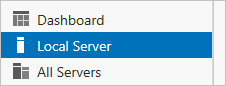
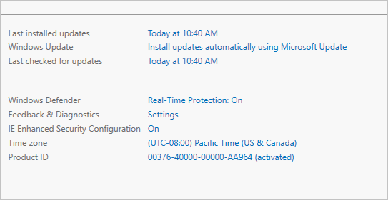
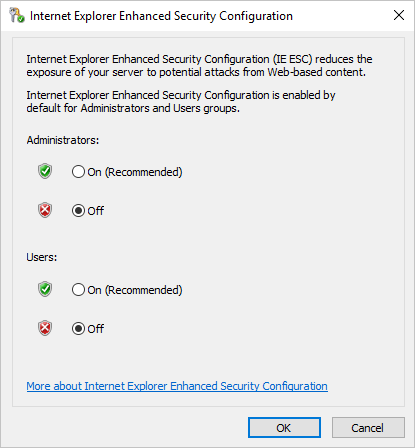
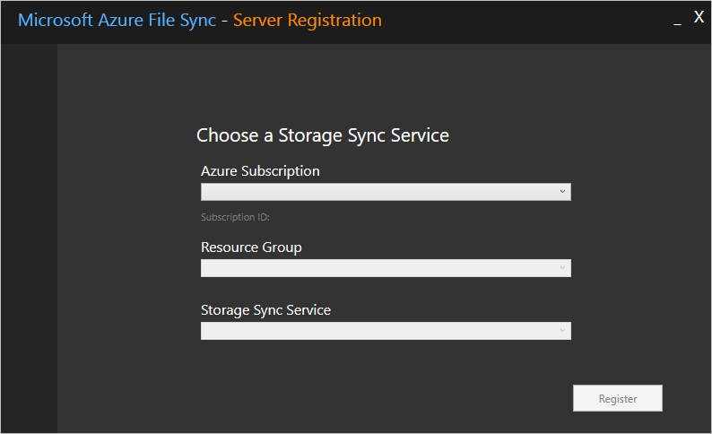
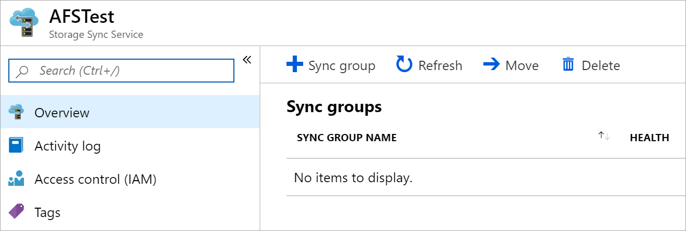
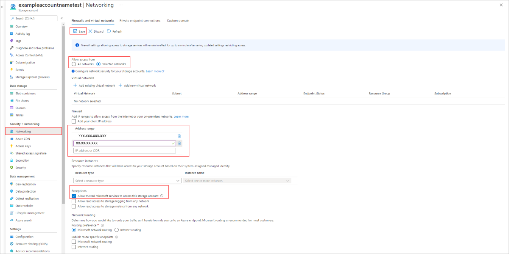

# Deploy Azure File Sync
Use Azure File Sync to centralize your organization's file shares in Azure Files, while keeping the flexibility, performance, and compatibility of an on-premises file server. Azure File Sync transforms Windows Server into a quick cache of your Azure file share. You can use any protocol that's available on Windows Server to access your data locally, including SMB, NFS, and FTPS. You can have as many caches as you need across the world.

We strongly recommend that you read [Planning for an Azure Files deployment](../files/storage-files-planning.md) and [Planning for an Azure File Sync deployment](file-sync-planning.md) before you complete the steps described in this article.

## Prerequisites

# [Portal](#tab/azure-portal)

1. An Azure file share in the same region that you want to deploy Azure File Sync. For more information, see:
    - [Region availability](file-sync-planning.md#azure-file-sync-region-availability) for Azure File Sync.
    - [Create a file share](../files/storage-how-to-create-file-share.md?toc=%2fazure%2fstorage%2ffilesync%2ftoc.json) for a step-by-step description of how to create a file share.
1. At least one supported instance of Windows Server or Windows Server cluster to sync with Azure File Sync. For more information about supported versions of Windows Server and recommended system resources, see [Windows file server considerations](file-sync-planning.md#windows-file-server-considerations).

# [PowerShell](#tab/azure-powershell)

1. An Azure file share in the same region that you want to deploy Azure File Sync. For more information, see:
    - [Region availability](file-sync-planning.md#azure-file-sync-region-availability) for Azure File Sync.
    - [Create a file share](../files/storage-how-to-create-file-share.md?toc=%2fazure%2fstorage%2ffilesync%2ftoc.json) for a step-by-step description of how to create a file share.
1. At least one supported instance of Windows Server or Windows Server cluster to sync with Azure File Sync. For more information about supported versions of Windows Server and recommended system resources, see [Windows file server considerations](file-sync-planning.md#windows-file-server-considerations).

1. The Az PowerShell module may be used with either PowerShell 5.1 or PowerShell 6+. You may use the Az PowerShell module for Azure File Sync on any supported system, including non-Windows systems, however the server registration cmdlet must always be run on the Windows Server instance you are registering (this can be done directly or via PowerShell remoting). On Windows Server 2012 R2, you can verify that you are running at least PowerShell 5.1.\* by looking at the value of the **PSVersion** property of the **$PSVersionTable** object:

    ```powershell
    $PSVersionTable.PSVersion
    ```

    If your **PSVersion** value is less than 5.1.\*, as will be the case with most fresh installations of Windows Server 2012 R2, you can easily upgrade by downloading and installing [Windows Management Framework (WMF) 5.1](https://www.microsoft.com/download/details.aspx?id=54616). The appropriate package to download and install for Windows Server 2012 R2 is **Win8.1AndW2K12R2-KB\*\*\*\*\*\*\*-x64.msu**. 

    PowerShell 6+ can be used with any supported system, and can be downloaded via its [GitHub page](https://github.com/PowerShell/PowerShell#get-powershell). 

    > [!Important]  
    > If you plan to use the Server Registration UI, rather than registering directly from PowerShell, you must use PowerShell 5.1.

1. If you have opted to use PowerShell 5.1, ensure that at least .NET 4.7.2 is installed. Learn more about [.NET Framework versions and dependencies](/dotnet/framework/migration-guide/versions-and-dependencies) on your system.

    > [!Important]  
    > If you are installing .NET 4.7.2+ on Windows Server Core, you must install with the `quiet` and `norestart` flags or the installation will fail. For example, if installing .NET 4.8, the command would look like the following:
    > ```PowerShell
    > Start-Process -FilePath "ndp48-x86-x64-allos-enu.exe" -ArgumentList "/q /norestart" -Wait
    > ```

1. The Az PowerShell module, which can be installed by following the instructions here: [Install and configure Azure PowerShell](/powershell/azure/install-Az-ps).
     
    > [!Note]  
    > The Az.StorageSync module is now installed automatically when you install the Az PowerShell module.

# [Azure CLI](#tab/azure-cli)

1. An Azure file share in the same region that you want to deploy Azure File Sync. For more information, see:
    - [Region availability](file-sync-planning.md#azure-file-sync-region-availability) for Azure File Sync.
    - [Create a file share](../files/storage-how-to-create-file-share.md?toc=%2fazure%2fstorage%2ffilesync%2ftoc.json) for a step-by-step description of how to create a file share.
1. At least one supported instance of Windows Server or Windows Server cluster to sync with Azure File Sync. For more information about supported versions of Windows Server and recommended system resources, see [Windows file server considerations](file-sync-planning.md#windows-file-server-considerations).

1. [Install the Azure CLI](/cli/azure/install-azure-cli)

   If you prefer, you can also use Azure Cloud Shell to complete the steps in this tutorial.  Azure Cloud Shell is an interactive shell environment that you use through your browser.  Start Cloud Shell by using one of these methods:

   - Select **Try It** in the upper-right corner of a code block. **Try It** will open Azure Cloud Shell, but it doesn't automatically copy the code to Cloud Shell.

   - Open Cloud Shell by going to [https://shell.azure.com](https://shell.azure.com)

   - Select the **Cloud Shell** button on the menu bar at the upper right corner in the [Azure portal](https://portal.azure.com)

1. Sign in.

   Sign in using the [az login](/cli/azure/reference-index#az_login) command if you're using a local install of the CLI.

   ```azurecli
   az login
   ```

    Follow the steps displayed in your terminal to complete the authentication process.

1. Install the [az filesync](/cli/azure/ext/storagesync/storagesync) Azure CLI extension.

   ```azurecli
   az extension add --name storagesync
   ```

   After installing the **storagesync** extension reference, you will receive the following warning.

   ```output
   The installed extension 'storagesync' is experimental and not covered by customer support. Please use with discretion.
   ```

---

## Prepare Windows Server to use with Azure File Sync
For each server that you intend to use with Azure File Sync, including each server node in a Failover Cluster, disable **Internet Explorer Enhanced Security Configuration**. This is required only for initial server registration. You can re-enable it after the server has been registered.

# [Portal](#tab/azure-portal)
> [!Note]  
> You can skip this step if you're deploying Azure File Sync on Windows Server Core.

1. Open Server Manager.
2. Click **Local Server**:  
    
3. On the **Properties** subpane, select the link for **IE Enhanced Security Configuration**.  
    
4. In the **Internet Explorer Enhanced Security Configuration** dialog box, select **Off** for **Administrators** and **Users**:  
    

# [PowerShell](#tab/azure-powershell)
To disable the Internet Explorer Enhanced Security Configuration, execute the following from an elevated PowerShell session:

```powershell
$installType = (Get-ItemProperty "HKLM:\SOFTWARE\Microsoft\Windows NT\CurrentVersion\").InstallationType

# This step is not required for Server Core
if ($installType -ne "Server Core") {
    # Disable Internet Explorer Enhanced Security Configuration 
    # for Administrators
    Set-ItemProperty -Path "HKLM:\SOFTWARE\Microsoft\Active Setup\Installed Components\{A509B1A7-37EF-4b3f-8CFC-4F3A74704073}" -Name "IsInstalled" -Value 0 -Force
    
    # Disable Internet Explorer Enhanced Security Configuration 
    # for Users
    Set-ItemProperty -Path "HKLM:\SOFTWARE\Microsoft\Active Setup\Installed Components\{A509B1A8-37EF-4b3f-8CFC-4F3A74704073}" -Name "IsInstalled" -Value 0 -Force
    
    # Force Internet Explorer closed, if open. This is required to fully apply the setting.
    # Save any work you have open in the IE browser. This will not affect other browsers,
    # including Microsoft Edge.
    Stop-Process -Name iexplore -ErrorAction SilentlyContinue
}
``` 

# [Azure CLI](#tab/azure-cli)

Follow the instructions for the Azure portal or PowerShell.

---

## Deploy the Storage Sync Service 
The deployment of Azure File Sync starts with placing a **Storage Sync Service** resource into a resource group of your selected subscription. We recommend provisioning as few of these as needed. You will create a trust relationship between your servers and this resource and a server can only be registered to one Storage Sync Service. As a result, it is recommended to deploy as many storage sync services as you need to separate groups of servers. Keep in mind that servers from different storage sync services cannot sync with each other.

> [!Note]
> The Storage Sync Service inherits access permissions from the subscription and resource group it has been deployed into. We recommend that you carefully check who has access to it. Entities with write access can start syncing new sets of files from servers registered to this storage sync service and cause data to flow to Azure storage that is accessible to them.

# [Portal](#tab/azure-portal)
To deploy a Storage Sync Service, go to the [Azure portal](https://portal.azure.com/), click *Create a resource* and then search for Azure File Sync. In the search results, select **Azure File Sync**, and then select **Create** to open the **Deploy Storage Sync** tab.

On the pane that opens, enter the following information:

- **Name**: A unique name (per region) for the Storage Sync Service.
- **Subscription**: The subscription in which you want to create the Storage Sync Service. Depending on your organization's configuration strategy, you might have access to one or more subscriptions. An Azure subscription is the most basic container for billing for each cloud service (such as Azure Files).
- **Resource group**: A resource group is a logical group of Azure resources, such as a storage account or a Storage Sync Service. You can create a new resource group or use an existing resource group for Azure File Sync. (We recommend using resource groups as containers to isolate resources logically for your organization, such as grouping HR resources or resources for a specific project.)
- **Location**: The region in which you want to deploy Azure File Sync. Only supported regions are available in this list.

When you are finished, select **Create** to deploy the Storage Sync Service.

# [PowerShell](#tab/azure-powershell)
Replace `<Az_Region>`, `<RG_Name>`, and `<my_storage_sync_service>` with your own values, then use the following commands to create and deploy a Storage Sync Service:

```powershell
$hostType = (Get-Host).Name

if ($installType -eq "Server Core" -or $hostType -eq "ServerRemoteHost") {
    Connect-AzAccount -UseDeviceAuthentication
}
else {
    Connect-AzAccount
}

# this variable holds the Azure region you want to deploy 
# Azure File Sync into
$region = '<Az_Region>'

# Check to ensure Azure File Sync is available in the selected Azure
# region.
$regions = @()
Get-AzLocation | ForEach-Object { 
    if ($_.Providers -contains "Microsoft.StorageSync") { 
        $regions += $_.Location 
    } 
}

if ($regions -notcontains $region) {
    throw [System.Exception]::new("Azure File Sync is either not available in the selected Azure Region or the region is mistyped.")
}

# the resource group to deploy the Storage Sync Service into
$resourceGroup = '<RG_Name>'

# Check to ensure resource group exists and create it if doesn't
$resourceGroups = @()
Get-AzResourceGroup | ForEach-Object { 
    $resourceGroups += $_.ResourceGroupName 
}

if ($resourceGroups -notcontains $resourceGroup) {
    New-AzResourceGroup -Name $resourceGroup -Location $region
}

$storageSyncName = "<my_storage_sync_service>"
$storageSync = New-AzStorageSyncService -ResourceGroupName $resourceGroup -Name $storageSyncName -Location $region
```

# [Azure CLI](#tab/azure-cli)

Follow the instructions for the Azure portal or PowerShell.

---

## Install the Azure File Sync agent
The Azure File Sync agent is a downloadable package that enables Windows Server to be synced with an Azure file share. 

# [Portal](#tab/azure-portal)
You can download the agent from the [Microsoft Download Center](https://go.microsoft.com/fwlink/?linkid=858257). When the download is finished, double-click the MSI package to start the Azure File Sync agent installation.

> [!Important]  
> If you intend to use Azure File Sync with a Failover Cluster, the Azure File Sync agent must be installed on every node in the cluster. Each node in the cluster must be registered to work with Azure File Sync.

We recommend that you do the following:
- Leave the default installation path (C:\Program Files\Azure\StorageSyncAgent), to simplify troubleshooting and server maintenance.
- Enable Microsoft Update to keep Azure File Sync up to date. All updates, to the Azure File Sync agent, including feature updates and hotfixes, occur from Microsoft Update. We recommend installing the latest update to Azure File Sync. For more information, see [Azure File Sync update policy](file-sync-planning.md#azure-file-sync-agent-update-policy).

When the Azure File Sync agent installation is finished, the Server Registration UI automatically opens. You must have a Storage Sync Service before registering; see the next section on how to create a Storage Sync Service.

# [PowerShell](#tab/azure-powershell)
Execute the following PowerShell code to download the appropriate version of the Azure File Sync agent for your OS and install it on your system.

> [!Important]  
> If you intend to use Azure File Sync with a Failover Cluster, the Azure File Sync agent must be installed on every node in the cluster. Each node in the cluster must registered to work with Azure File Sync.

```powershell
# Gather the OS version
$osver = [System.Environment]::OSVersion.Version

# Download the appropriate version of the Azure File Sync agent for your OS.
if ($osver.Equals([System.Version]::new(10, 0, 17763, 0))) {
    Invoke-WebRequest `
        -Uri https://aka.ms/afs/agent/Server2019 `
        -OutFile "StorageSyncAgent.msi" 
} elseif ($osver.Equals([System.Version]::new(10, 0, 14393, 0))) {
    Invoke-WebRequest `
        -Uri https://aka.ms/afs/agent/Server2016 `
        -OutFile "StorageSyncAgent.msi" 
} elseif ($osver.Equals([System.Version]::new(6, 3, 9600, 0))) {
    Invoke-WebRequest `
        -Uri https://aka.ms/afs/agent/Server2012R2 `
        -OutFile "StorageSyncAgent.msi" 
} else {
    throw [System.PlatformNotSupportedException]::new("Azure File Sync is only supported on Windows Server 2012 R2, Windows Server 2016, and Windows Server 2019")
}

# Install the MSI. Start-Process is used to PowerShell blocks until the operation is complete.
# Note that the installer currently forces all PowerShell sessions closed - this is a known issue.
Start-Process -FilePath "StorageSyncAgent.msi" -ArgumentList "/quiet" -Wait

# Note that this cmdlet will need to be run in a new session based on the above comment.
# You may remove the temp folder containing the MSI and the EXE installer
Remove-Item -Path ".\StorageSyncAgent.msi" -Recurse -Force
```
# [Azure CLI](#tab/azure-cli)

Follow the instructions for the Azure portal or PowerShell.

---

## Register Windows Server with Storage Sync Service
Registering your Windows Server with a Storage Sync Service establishes a trust relationship between your server (or cluster) and the Storage Sync Service. A server can only be registered to one Storage Sync Service and can sync with other servers and Azure file shares associated with the same Storage Sync Service.

> [!Note]
> Server registration uses your Azure credentials to create a trust relationship between the Storage Sync Service and your Windows Server, however subsequently the server creates and uses its own identity that is valid as long as the server stays registered and the current Shared Access Signature token (Storage SAS) is valid. A new SAS token cannot be issued to the server once the server is unregistered, thus removing the server's ability to access your Azure file shares, stopping any sync.

The administrator registering the server must be a member of the management roles **Owner** or **Contributor** for the given Storage Sync Service. This can be configured under **Access Control (IAM)** in the Azure portal for the Storage Sync Service.

It is also possible to differentiate administrators able to register servers from those allowed to also configure sync in a Storage Sync Service. For that you would need to create a custom role where you list the administrators that are only allowed to register servers and give your custom role the following permissions:

* "Microsoft.StorageSync/storageSyncServices/registeredServers/write"
* "Microsoft.StorageSync/storageSyncServices/read"
* "Microsoft.StorageSync/storageSyncServices/workflows/read"
* "Microsoft.StorageSync/storageSyncServices/workflows/operations/read"

# [Portal](#tab/azure-portal)
The Server Registration UI should open automatically after installation of the Azure File Sync agent. If it doesn't, you can open it manually from its file location: C:\Program Files\Azure\StorageSyncAgent\ServerRegistration.exe. When the Server Registration UI opens, select **Sign-in** to begin.

After you sign in, you are prompted for the following information:



- **Azure Subscription**: The subscription that contains the Storage Sync Service (see [Deploy the Storage Sync Service](#deploy-the-storage-sync-service)). 
- **Resource Group**: The resource group that contains the Storage Sync Service.
- **Storage Sync Service**: The name of the Storage Sync Service with which you want to register.

After you have selected the appropriate information, select **Register** to complete the server registration. As part of the registration process, you are prompted for an additional sign-in.

# [PowerShell](#tab/azure-powershell)
```powershell
$registeredServer = Register-AzStorageSyncServer -ParentObject $storageSync
```
# [Azure CLI](#tab/azure-cli)

Follow the instructions for the Azure portal or PowerShell.

---

## Create a sync group and a cloud endpoint
A sync group defines the sync topology for a set of files. Endpoints within a sync group are kept in sync with each other. A sync group must contain one cloud endpoint, which represents an Azure file share and one or more server endpoints. A server endpoint represents a path on a  registered server. A server can have server endpoints in multiple sync groups. You can create as many sync groups as you need to appropriately describe your desired sync topology.

A cloud endpoint is a pointer to an Azure file share. All server endpoints will sync with a cloud endpoint, making the cloud endpoint the hub. The storage account for the Azure file share must be located in the same region as the Storage Sync Service. The entirety of the Azure file share will be synced, with one exception: A special folder, comparable to the hidden "System Volume Information" folder on an NTFS volume, will be provisioned. This directory is called ".SystemShareInformation". It contains important sync metadata that will not sync to other endpoints. Do not use or delete it!

> [!Important]  
> You can make changes to any cloud endpoint or server endpoint in the sync group and have your files synced to the other endpoints in the sync group. If you make a change to the cloud endpoint (Azure file share) directly, changes first need to be discovered by an Azure File Sync change detection job. A change detection job is initiated for a cloud endpoint only once every 24 hours. For more information, see [Azure Files frequently asked questions](../files/storage-files-faq.md?toc=%2fazure%2fstorage%2ffilesync%2ftoc.json#afs-change-detection).

The administrator creating the cloud endpoint must be a member of the management role **Owner** for the storage account that contains the Azure file share the cloud endpoint is pointing to. This can be configured under **Access Control (IAM)** in the Azure portal for the storage account.

# [Portal](#tab/azure-portal)
To create a sync group, in the [Azure portal](https://portal.azure.com/), go to your Storage Sync Service, and then select **+ Sync group**:



In the pane that opens, enter the following information to create a sync group with a cloud endpoint:

- **Sync group name**: The name of the sync group to be created. This name must be unique within the Storage Sync Service, but can be any name that is logical for you.
- **Subscription**: The subscription where you deployed the Storage Sync Service in [Deploy the Storage Sync Service](#deploy-the-storage-sync-service).
- **Storage account**: If you select **Select storage account**, another pane appears in which you can select the storage account that has the Azure file share that you want to sync with.
- **Azure file share**: The name of the Azure file share with which you want to sync.

# [PowerShell](#tab/azure-powershell)
To create the sync group, execute the following PowerShell. Remember to replace `<my-sync-group>` with the desired name of the sync group.

```powershell
$syncGroupName = "<my-sync-group>"
$syncGroup = New-AzStorageSyncGroup -ParentObject $storageSync -Name $syncGroupName
```

Once the sync group has been successfully created, you can create your cloud endpoint. Be sure to replace `<my-storage-account>` and `<my-file-share>` with the expected values.

```powershell
# Get or create a storage account with desired name
$storageAccountName = "<my-storage-account>"
$storageAccount = Get-AzStorageAccount -ResourceGroupName $resourceGroup | Where-Object {
    $_.StorageAccountName -eq $storageAccountName
}

if ($storageAccount -eq $null) {
    $storageAccount = New-AzStorageAccount `
        -Name $storageAccountName `
        -ResourceGroupName $resourceGroup `
        -Location $region `
        -SkuName Standard_LRS `
        -Kind StorageV2 `
        -EnableHttpsTrafficOnly:$true
}

# Get or create an Azure file share within the desired storage account
$fileShareName = "<my-file-share>"
$fileShare = Get-AzStorageShare -Context $storageAccount.Context | Where-Object {
    $_.Name -eq $fileShareName -and $_.IsSnapshot -eq $false
}

if ($fileShare -eq $null) {
    $fileShare = New-AzStorageShare -Context $storageAccount.Context -Name $fileShareName
}

# Create the cloud endpoint
New-AzStorageSyncCloudEndpoint `
    -Name $fileShare.Name `
    -ParentObject $syncGroup `
    -StorageAccountResourceId $storageAccount.Id `
    -AzureFileShareName $fileShare.Name
```

# [Azure CLI](#tab/azure-cli)

Use the [az storagesync sync-group](/cli/azure/ext/storagesync/storagesync/sync-group#ext-storagesync-az-storagesync-sync-group-create) command to create a new sync group.  To default a resource group for all CLI commands, use [az configure](/cli/azure/reference-index#az_configure).

```azurecli
az storagesync sync-group create --resource-group myResourceGroupName \
                                 --name myNewSyncGroupName \
                                 --storage-sync-service myStorageSyncServiceName \
```

Use the [az storagesync sync-group cloud-endpoint](/cli/azure/ext/storagesync/storagesync/sync-group/cloud-endpoint#ext-storagesync-az-storagesync-sync-group-cloud-endpoint-create) command to create a new cloud endpoint.

```azurecli
az storagesync sync-group cloud-endpoint create --resource-group myResourceGroup \
                                                --storage-sync-service myStorageSyncServiceName \
                                                --sync-group-name mySyncGroupName \
                                                --name myNewCloudEndpointName \
                                                --storage-account mystorageaccountname \
                                                --azure-file-share-name azure-file-share-name
```

---

## Create a server endpoint
A server endpoint represents a specific location on a registered server, such as a folder on a server volume. A server endpoint is subject to the following conditions:

- A server endpoint must be a path on a registered server (rather than a mounted share). Network attached storage (NAS) is not supported.
- Although the server endpoint can be on the system volume, server endpoints on the system volume may not use cloud tiering.
- Changing the path or drive letter after you established a server endpoint on a volume is not supported. Make sure you are using a final path on your registered server.
- A registered server can support multiple server endpoints, however a sync group can only have one server endpoint per registered server at any given time. Other server endpoints within the sync group must be on different registered servers.

# [Portal](#tab/azure-portal)
To add a server endpoint, go to the newly created sync group and then select **Add server endpoint**.


In the **Add server endpoint** pane, enter the following information to create a server endpoint:

- **Registered server**: The name of the server or cluster where you want to create the server endpoint.
- **Path**: The Windows Server path to be synced as part of the sync group.
- **Cloud Tiering**: A switch to enable or disable cloud tiering. With cloud tiering, infrequently used or accessed files can be tiered to Azure Files.
- **Volume Free Space**: The amount of free space to reserve on the volume on which the server endpoint is located. For example, if volume free space is set to 50% on a volume that has a single server endpoint, roughly half the amount of data is tiered to Azure Files. Regardless of whether cloud tiering is enabled, your Azure file share always has a complete copy of the data in the sync group.
- **Initial download mode**: This is an optional selection, starting with agent version 11, that can be helpful when there are files in the Azure file share but not on the server. Such a situation can exist, for instance, if you create a server endpoint to add another branch office server to a sync group or when you disaster-recover a failed server. If cloud tiering is enabled, the default is to only recall the namespace, no file content initially. That is useful if you believe that rather user access requests should decide what file content is recalled to the server. If cloud tiering is disabled, the default is that the namespace will download first and then files will be recalled based on last-modified timestamp until the local capacity has been reached. You can however change the initial download mode to namespace only. A third mode can only be used if cloud tiering is disabled for this server endpoint. This mode avoids recalling the namespace first. Files will only appear on the local server if they had a chance to fully download. This mode is useful if for instance an application requires full files to be present and cannot tolerate tiered files in it's namespace.

To add the server endpoint, select **Create**. Your files are now kept in sync across your Azure file share and Windows Server. 

# [PowerShell](#tab/azure-powershell)
Execute the following PowerShell commands to create the server endpoint, and be sure to replace `<your-server-endpoint-path>`, `<your-volume-free-space>` and with the desired values and check the optional setting for the optional initial download policy.

```powershell
$serverEndpointPath = "<your-server-endpoint-path>"
$cloudTieringDesired = $true
$volumeFreeSpacePercentage = <your-volume-free-space>
# Optional property. Choose from: [NamespaceOnly] default when cloud tiering is enabled. [NamespaceThenModifiedFiles] default when cloud tiering is disabled. [AvoidTieredFiles] only available when cloud tiering is disabled.
$initialDownloadPolicy = NamespaceOnly

if ($cloudTieringDesired) {
    # Ensure endpoint path is not the system volume
    $directoryRoot = [System.IO.Directory]::GetDirectoryRoot($serverEndpointPath)
    $osVolume = "$($env:SystemDrive)\"
    if ($directoryRoot -eq $osVolume) {
        throw [System.Exception]::new("Cloud tiering cannot be enabled on the system volume")
    }

    # Create server endpoint
    New-AzStorageSyncServerEndpoint `
        -Name $registeredServer.FriendlyName `
        -SyncGroup $syncGroup `
        -ServerResourceId $registeredServer.ResourceId `
        -ServerLocalPath $serverEndpointPath `
        -CloudTiering `
        -VolumeFreeSpacePercent $volumeFreeSpacePercentage `
        -InitialDownloadPolicy $initialDownloadPolicy
} else {
    # Create server endpoint
    New-AzStorageSyncServerEndpoint `
        -Name $registeredServer.FriendlyName `
        -SyncGroup $syncGroup `
        -ServerResourceId $registeredServer.ResourceId `
        -ServerLocalPath $serverEndpointPath `
        -InitialDownloadPolicy $initialDownloadPolicy
}
```

# [Azure CLI](#tab/azure-cli)

Use the [az storagesync sync-group server-endpoint](/cli/azure/ext/storagesync/storagesync/sync-group/server-endpoint#ext-storagesync-az-storagesync-sync-group-server-endpoint-create) command to create a new server endpoint.

```azurecli
# Create a new sync group server endpoint 
az storagesync sync-group server-endpoint create --resource-group myResourceGroupName \
                                                 --name myNewServerEndpointName
                                                 --registered-server-id 91beed22-7e9e-4bda-9313-fec96c286e0
                                                 --server-local-path d:\myPath
                                                 --storage-sync-service myStorageSyncServiceNAme
                                                 --sync-group-name mySyncGroupName

# Create a new sync group server endpoint with additional optional parameters
az storagesync sync-group server-endpoint create --resource-group myResourceGroupName \
                                                 --storage-sync-service myStorageSyncServiceName \
                                                 --sync-group-name mySyncGroupName \
                                                 --name myNewServerEndpointName \
                                                 --registered-server-id 91beed22-7e9e-4bda-9313-fec96c286e0 \
                                                 --server-local-path d:\myPath \
                                                 --cloud-tiering on \
                                                 --volume-free-space-percent 85 \
                                                 --tier-files-older-than-days 15 \
                                                 --initial-download-policy NamespaceOnly [OR] NamespaceThenModifiedFiles [OR] AvoidTieredFiles
                                                 --offline-data-transfer on \
                                                 --offline-data-transfer-share-name myfilesharename \

```

---

## Configure firewall and virtual network settings

### Portal
If you'd like to configure your Azure File sync to work with firewall and virtual network settings, do the following:

1. From the Azure portal, navigate to the storage account you want to secure.
1. Select **Networking** on the left menu.
1. Under **Selected networks** under **Allow access from**.
1. Make sure your servers IP or virtual network is listed under the **Address range** section.
1. Make sure **Allow trusted Microsoft services to access this storage account** is checked.
1. Select **Save** to save your settings.

    

## Onboarding with Azure File Sync
The recommended steps to onboard on Azure File Sync for the first time with zero downtime while preserving full file fidelity and access control list (ACL) are as follows:
 
1. Deploy a Storage Sync Service.
1. Create a sync group.
1. Install Azure File Sync agent on the server with the full data set.
1. Register that server and create a server endpoint on the share. 
1. Let sync do the full upload to the Azure file share (cloud endpoint).  
1. After the initial upload is complete, install Azure File Sync agent on each of the remaining servers.
1. Create new file shares on each of the remaining servers.
1. Create server endpoints on new file shares with cloud tiering policy, if desired. (This step requires additional storage to be available for the initial setup.)
1. Let Azure File Sync agent do a rapid restore of the full namespace without the actual data transfer. After the full namespace sync, sync engine will fill the local disk space based on the cloud tiering policy for the server endpoint. 
1. Ensure sync completes and test your topology as desired. 
1. Redirect users and applications to this new share.
1. You can optionally delete any duplicate shares on the servers.
 
If you don't have extra storage for initial onboarding and would like to attach to the existing shares, you can pre-seed the data in the Azure files shares. This approach is suggested, if and only if you can accept downtime and absolutely guarantee no data changes on the server shares during the initial onboarding process. 
 
1. Ensure that data on any of the servers can't change during the onboarding process.
1. Pre-seed Azure file shares with the server data using any data transfer tool over the SMB. Robocopy, for example. You can also use AzCopy over REST. Be sure to use AzCopy with the appropriate switches to preserve ACLs timestamps and attributes.
1. Create Azure File Sync topology with the desired server endpoints pointing to the existing shares.
1. Let sync finish reconciliation process on all endpoints. 
1. Once reconciliation is complete, you can open shares for changes.
 
Currently, pre-seeding approach has a few limitations - 
- Data changes on the server before sync topology is fully up and running can cause conflicts on the server endpoints.  
- After the cloud endpoint is created, Azure File Sync runs a process to detect the files in the cloud before starting the initial sync. The time taken to complete this process varies depending on the various factors like network speed, available bandwidth, and number of files and folders. For the rough estimation in the preview release, detection process runs approximately at 10 files/sec.  Hence, even if pre-seeding runs fast, the overall time to get a fully running system may be significantly longer when data is pre-seeded in the cloud.

## Self-service restore through Previous Versions and VSS (Volume Shadow Copy Service)

> [!IMPORTANT]
> The following information can only be used with version 9 (or above) of the storage sync agent. Versions lower than 9 will not have the StorageSyncSelfService cmdlets.

Previous Versions is a Windows feature that allows you to utilize server-side VSS snapshots of a volume to present restorable versions of a file to an SMB client.
This enables a powerful scenario, commonly referred to as self-service restore, directly for information workers instead of depending on the restore from an IT admin.

VSS snapshots and Previous Versions work independently of Azure File Sync. However, cloud tiering must be set to a compatible mode. Many Azure File Sync server endpoints can exist on the same volume. You have to make the following PowerShell call per volume that has even one server endpoint where you plan to or are using cloud tiering.

```powershell
Import-Module '<SyncAgentInstallPath>\StorageSync.Management.ServerCmdlets.dll'
Enable-StorageSyncSelfServiceRestore [-DriveLetter] <string> [[-Force]] 
```

VSS snapshots are taken of an entire volume. 
By default, up to 64 snapshots can exist for a given volume, granted there is enough space to store the snapshots. VSS handles this automatically. The default snapshot schedule takes two snapshots per day, Monday through Friday. That schedule is configurable via a Windows Scheduled Task. The above PowerShell cmdlet does two things:
1. It configures Azure File Syncs cloud tiering on the specified volume to be compatible with previous versions and guarantees that a file can be restored from a previous version, even if it was tiered to the cloud on the server. 
1. It enables the default VSS schedule. You can then decide to modify it later. 

> [!Note]  
> There are two important things to note:
>- If you use the  -Force parameter, and VSS is currently enabled, then it will overwrite the current VSS snapshot schedule and replace it with the default schedule. Ensure you save your custom configuration before running the cmdlet.
> - If you are using this cmdlet on a cluster node, you must also run it on all the other nodes in the cluster! 

In order to see if self-service restore compatibility is enabled, you can run the following cmdlet.

```powershell
Get-StorageSyncSelfServiceRestore [[-Driveletter] <string>]
```

It will list all volumes on the server as well as the number of cloud tiering compatible days for each. This number is automatically calculated based on the maximum possible snapshots per volume and the default snapshot schedule. So by default, all previous versions presented to an information worker can be used to restore from. The same is true if you change the default schedule to take more snapshots.
However, if you change the schedule in a way that will result in an available snapshot on the volume that is older than the compatible days value, then users will not be able to use this older snapshot (previous version) to restore from.

> [!Note]
> Enabling self-service restore can have an impact on your Azure storage consumption and bill. This impact is limited to files currently tiered on the server. Enabling this feature ensures that there is a file version available in the cloud that can be referenced via a previous versions (VSS snapshot) entry.
>
> If you disable the feature, the Azure storage consumption will slowly decline until the compatible days window has passed. There is no way to speed this up. 

The default maximum number of VSS snapshots per volume (64) as well as the default schedule to take them, result in a maximum of 45 days of previous versions an information worker can restore from, depending on how many VSS snapshots you can store on your volume.

If max. 64 VSS snapshots per volume is not the correct setting for you, you can [change that value via a registry key](/windows/win32/backup/registry-keys-for-backup-and-restore#maxshadowcopies).
For the new limit to take effect, you need to re-run the cmdlet to enable previous version compatibility on every volume it was previously enabled, with the -Force flag to take the new maximum number of VSS snapshots per volume into account. This will result in a newly calculated number of compatible days. Please note that this change will only take effect on newly tiered files and overwrite any customizations on the VSS schedule you might have made.

<a id="proactive-recall"></a>
## Proactively recall new and changed files from an Azure file share

With agent version 11, a new mode becomes available on a server endpoint. This mode allows globally distributed companies to have the server cache in a remote region pre-populated even before local users are accessing any files. When enabled on a server endpoint, this mode will cause this server to recall files that have been created or changed in the Azure file share.

### Scenario

A globally distributed company has branch offices in the US and in India. In the morning (US time) information workers create a new folder and new files for a brand new project and work all day on it. Azure File Sync will sync folder and files to the Azure file share (cloud endpoint). Information workers in India will continue working on the project in their timezone. When they arrive in the morning, the local Azure File Sync enabled server in India needs to have these new files available locally, such that the India team can efficiently work off of a local cache. Enabling this mode prevents the initial file access to be slower because of on-demand recall and enables the server to proactively recall the files as soon as they were changed or created in the Azure file share.

> [!IMPORTANT]
> It is important to realize that tracking changes in the Azure file share that closely on the server can increase your egress traffic and bill from Azure. If files recalled to the server are not actually needed locally, then unnecessary recall to the server can have negative consequences. Use this mode when you know pre-populating the cache on a server with recent changes in the cloud will have a positive effect on users or applications using the files on that server.

### Enable a server endpoint to proactively recall what changed in an Azure file share

# [Portal](#tab/proactive-portal)

1. In the [Azure portal](https://portal.azure.com/), go to your Storage Sync Service, select the correct sync group and then identify the server endpoint for which you want to closely track changes in the Azure file share (cloud endpoint).
1. In the cloud tiering section, find the "Azure file share download" topic. You will see the currently selected mode and can change it to track Azure file share changes more closely and proactively recall them to the server.

:::image type="content" source="media/storage-sync-files-deployment-guide/proactive-download.png" alt-text="An image showing the Azure file share download behavior for a server endpoint currently in effect and a button to open a menu that allows to change it.":::

# [PowerShell](#tab/proactive-powershell)

You can modify server endpoint properties in PowerShell through the [Set-AzStorageSyncServerEndpoint](/powershell/module/az.storagesync/set-azstoragesyncserverendpoint) cmdlet.

```powershell
# Optional parameter. Default: "UpdateLocallyCachedFiles", alternative behavior: "DownloadNewAndModifiedFiles"
$recallBehavior = "DownloadNewAndModifiedFiles"

Set-AzStorageSyncServerEndpoint -InputObject <PSServerEndpoint> -LocalCacheMode $recallBehavior
```

---

## Migrate a DFS Replication (DFS-R) deployment to Azure File Sync
To migrate a DFS-R deployment to Azure File Sync:

1. Create a sync group to represent the DFS-R topology you are replacing.
1. Start on the server that has the full set of data in your DFS-R topology to migrate. Install Azure File Sync on that server.
1. Register that server and create a server endpoint for the first server to be migrated. Do not enable cloud tiering.
1. Let all of the data sync to your Azure file share (cloud endpoint).
1. Install and register the Azure File Sync agent on each of the remaining DFS-R servers.
1. Disable DFS-R. 
1. Create a server endpoint on each of the DFS-R servers. Do not enable cloud tiering.
1. Ensure sync completes and test your topology as desired.
1. Retire DFS-R.
1. Cloud tiering may now be enabled on any server endpoint as desired.

For more information, see [Azure File Sync interop with Distributed File System (DFS)](file-sync-planning.md#distributed-file-system-dfs).

## Next steps
- [Add or remove an Azure File Sync Server Endpoint](file-sync-server-endpoint.md)
- [Register or unregister a server with Azure File Sync](file-sync-server-registration.md)
- [Monitor Azure File Sync](file-sync-monitoring.md)