# Tutorial: Extend Windows file servers with Azure File Sync

The article demonstrates the basic steps for extending the storage capacity of a Windows server by using Azure File Sync. Although the tutorial features Windows Server as an Azure virtual machine (VM), you would typically do this process for your on-premises servers. You can find instructions for deploying Azure File Sync in your own environment in the [Deploy Azure File Sync](file-sync-deployment-guide.md) article.

> [!div class="checklist"]
> * Deploy the Storage Sync Service
> * Prepare Windows Server to use with Azure File Sync
> * Install the Azure File Sync agent
> * Register Windows Server with the Storage Sync Service
> * Create a sync group and a cloud endpoint
> * Create a server endpoint

If you don't have an Azure subscription, create a [free account](https://azure.microsoft.com/free/?WT.mc_id=A261C142F) before you begin.

## Sign in to Azure

Sign in to the [Azure portal](https://portal.azure.com).

## Prepare your environment

For this tutorial, you need to do the following before you can deploy Azure File Sync:

- Create an Azure storage account and file share
- Set up a Windows Server 2016 Datacenter VM
- Prepare the Windows Server VM for Azure File Sync

### Create a folder and .txt file

On your local computer, create a new folder named _FilesToSync_ and add a text file named _mytestdoc.txt_. You'll upload that file to the file share later in this tutorial.

### Create a storage account

[!INCLUDE [storage-create-account-portal-include](../../../includes/storage-create-account-portal-include.md)]

### Create a file share

After you deploy an Azure storage account, you create a file share.

1. In the Azure portal, select **Go to resource**.
1. Select **Files** from the storage account pane.

    

1. Select **+ File Share**.

    

1. Name the new file share _afsfileshare_. Enter "1" for the **Quota**, and then select **Create**. The quota can be a maximum of 5 TiB, but you only need 1 GB for this tutorial.

    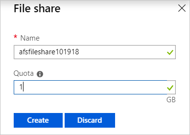

1. Select the new file share. On the file share location, select **Upload**.

    

1. Browse to the _FilesToSync_ folder where you created your .txt file, select _mytestdoc.txt_ and select **Upload**.

    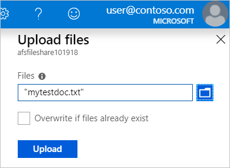

At this point, you've created a storage account and a file share with one file in it. Next, you deploy an Azure VM with Windows Server 2016 Datacenter to represent the on-premises server in this tutorial.

### Deploy a VM and attach a data disk

1. Go to the Azure portal and expand the menu on the left. Choose **Create a resource** in the upper left-hand corner.
1. In the search box above the list of **Azure Marketplace** resources, search for **Windows Server 2016 Datacenter** and select it in the results. Choose **Create**.
1. Go to the **Basics** tab. Under **Project details**, select the resource group you created for this tutorial.

   

1. Under **Instance details**, provide a VM name. For example, use _myVM_.
1. Don't change the default settings for **Region**, **Availability options**, **Image**, and **Size**.
1. Under **Administrator account**, provide a **Username** and **Password** for the VM.
1. Under **Inbound port rules**, choose **Allow selected ports** and then select **RDP (3389)** and **HTTP** from the drop-down menu.

1. Before you create the VM, you need to create a data disk.

   1. Select **Next:Disks**.

      

   1. On the **Disks** tab, under **Disk options**, leave the defaults.
   1. Under **DATA DISKS**, select **Create and attach a new disk**.

   1. Use the default settings except for **Size (GiB)**, which you can change to **1 GB** for this tutorial.

      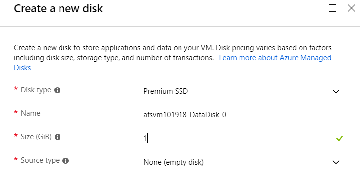

   1. Select **OK**.
1. Select **Review + create**.
1. Select **Create**.

   You can select the **Notifications** icon to watch the **Deployment progress**. Creating a new VM might take a few minutes to complete.

1. After your VM deployment is complete, select **Go to resource**.

   

At this point, you've created a new virtual machine and attached a data disk. Next you connect to the VM.

### Connect to your VM

1. In the Azure portal, select **Connect** on the virtual machine properties page.

   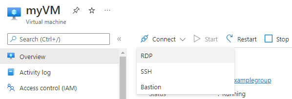

1. On the **Connect to virtual machine** page, keep the default options to connect by **IP address** over port 3389. Select **Download RDP file**.

   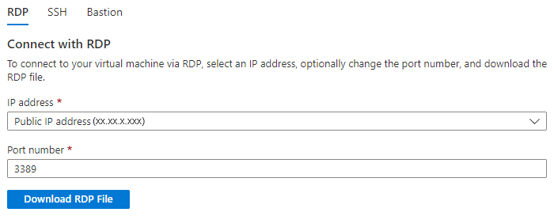

1. Open the downloaded RDP file and select **Connect** when prompted.
1. In the **Windows Security** window, select **More choices** and then **Use a different account**. Type the username as *localhost\username*, enter the password you created for the virtual machine, and then select **OK**.

   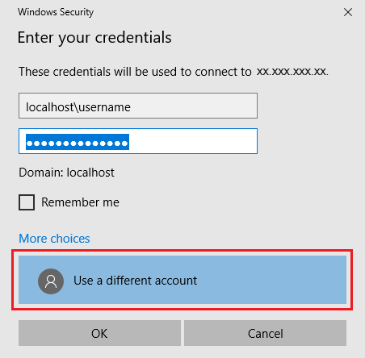

1. You might receive a certificate warning during the sign-in process. Select **Yes** or **Continue** to create the connection.

### Prepare the Windows server

For the Windows Server 2016 Datacenter server, disable Internet Explorer Enhanced Security Configuration. This step is required only for initial server registration. You can re-enable it after the server has been registered.

In the Windows Server 2016 Datacenter VM, Server Manager opens automatically.  If Server Manager doesn't open by default, search for it in Start Menu.

1. In **Server Manager**, select **Local Server**.

   

1. On the **Properties** pane, select the link for **IE Enhanced Security Configuration**.  

    

1. In the **Internet Explorer Enhanced Security Configuration** dialog box, select **Off** for **Administrators** and **Users**.

    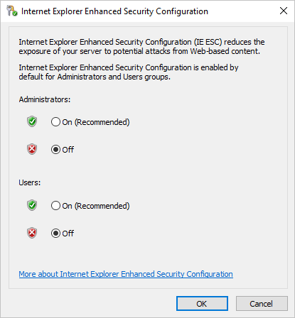

Now you can add the data disk to the VM.

### Add the data disk

1. While still in the **Windows Server 2016 Datacenter** VM, select **Files and storage services** > **Volumes** > **Disks**.

    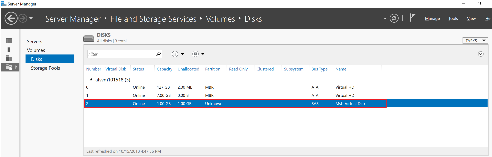

1. Right-click the 1 GB disk named **Msft Virtual Disk** and select **New volume**.
1. Complete the wizard. Use the default settings and make note of the assigned drive letter.
1. Select **Create**.
1. Select **Close**.

   At this point, you've brought the disk online and created a volume. Open File Explorer in the Windows Server VM to confirm the presence of the recently added data disk.

1. In File Explorer in the VM, expand **This PC** and open the new drive. It's the F: drive in this example.
1. Right-click and select **New** > **Folder**. Name the folder _FilesToSync_.
1. Open the **FilesToSync** folder.
1. Right-click and select **New** > **Text Document**. Name the text file _MyTestFile_.

    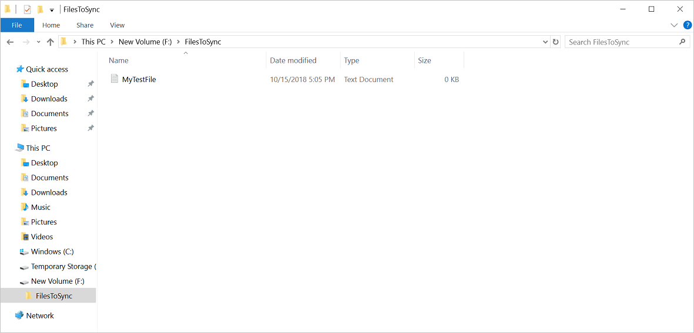

1. Close **File Explorer** and **Server Manager**.

### Download the Azure PowerShell module

Next, in the Windows Server 2016 Datacenter VM, install the Azure PowerShell module on the server.

1. In the VM, open an elevated PowerShell window.
1. Run the following command:

   ```powershell
   Install-Module -Name Az
   ```

   > [!NOTE]
   > If you have a NuGet version that is older than 2.8.5.201, you're prompted to download and install the latest version of NuGet.

   By default, the PowerShell gallery isn't configured as a trusted repository for PowerShellGet. The first time you use the PSGallery, you see the following prompt:

   ```output
   Untrusted repository

   You are installing the modules from an untrusted repository. If you trust this repository, change its InstallationPolicy value by running the Set-PSRepository cmdlet.

   Are you sure you want to install the modules from 'PSGallery'?
   [Y] Yes  [A] Yes to All  [N] No  [L] No to All  [S] Suspend  [?] Help (default is "N"):
   ```

1. Answer **Yes** or **Yes to All** to continue with the installation.

The `Az` module is a rollup module for the Azure PowerShell cmdlets. Installing it downloads all the available Azure Resource Manager modules and makes their cmdlets available for use.

At this point, you've set up your environment for the tutorial. You're ready to deploy the Storage Sync Service.

## Deploy the service

To deploy Azure File Sync, you first place a **Storage Sync Service** resource into a resource group for your selected subscription. The Storage Sync Service inherits access permissions from its subscription and resource group.

1. In the Azure portal, select **Create a resource** and then search for **Azure File Sync**.
1. In the search results, select **Azure File Sync**.
1. Select **Create** to open the **Deploy Storage Sync** tab.

   

   On the pane that opens, enter the following information:

   | Value | Description |
   | ----- | ----- |
   | **Name** | A unique name (per subscription) for the Storage Sync Service.<br><br>Use _afssyncservice02_ for this tutorial. |
   | **Subscription** | The Azure subscription you use for this tutorial. |
   | **Resource group** | The resource group that contains the Storage Sync Service.<br><br>Use _afsresgroup101918_ for this tutorial. |
   | **Location** | East US |

1. When you're finished, select **Create** to deploy the **Storage Sync Service**.
1. Select the **Notifications** tab > **Go to resource**.

## Install the agent

The Azure File Sync agent is a downloadable package that enables Windows Server to be synced with an Azure file share.

1. In the **Windows Server 2016 Datacenter** VM, open **Internet Explorer**.
1. Go to the [Microsoft Download Center](https://go.microsoft.com/fwlink/?linkid=858257). Scroll down to the **Azure File Sync Agent** section and select **Download**.

   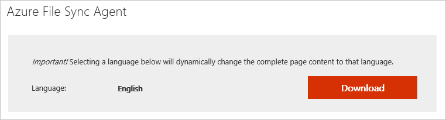

1. Select the check box for **StorageSyncAgent_V3_WS2016.EXE** and select **Next**.

   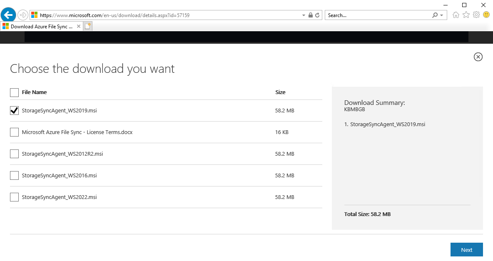

1. Select **Allow once** > **Run** > **Open**.
1. If you haven't already done so, close the PowerShell window.
1. Accept the defaults in the **Storage Sync Agent Setup Wizard**.
1. Select **Install**.
1. Select **Finish**.

You've deployed the Azure Sync Service and installed the agent on the Windows Server 2016 Datacenter VM. Now you need to register the VM with the Storage Sync Service.

## Register Windows Server

Registering your Windows server with a Storage Sync Service establishes a trust relationship between your server (or cluster) and the Storage Sync Service. A server can only be registered to one Storage Sync Service. It can sync with other servers and Azure file shares that are associated with that Storage Sync Service.

The Server Registration UI should open automatically after you install the Azure File Sync agent. If it doesn't, you can open it manually from its file location: `C:\Program Files\Azure\StorageSyncAgent\ServerRegistration.exe.`

1. When the Server Registration UI opens in the VM, select **OK**.
1. Select **Sign-in** to begin.
1. Sign in with your Azure account credentials and select **Sign-in**.
1. Provide the following information:

   

   | Value | Description |
   | ----- | ----- |
   | **Azure Subscription** | The subscription that contains the Storage Sync Service for this tutorial. |
   | **Resource Group** | The resource group that contains the Storage Sync Service. Use _afsresgroup101918_ for this tutorial. |
   | **Storage Sync Service** | The name of the Storage Sync Service. Use _afssyncservice02_ for this tutorial. |

1. Select **Register** to complete the server registration.
1. As part of the registration process, you're prompted for an additional sign-in. Sign in and select **Next**.
1. Select **OK**.

## Create a sync group

A sync group defines the sync topology for a set of files. A sync group must contain one cloud endpoint, which represents an Azure file share. A sync group also must contain one or more server endpoints. A server endpoint represents a path on a registered server. To create a sync group:

1. In the [Azure portal](https://portal.azure.com/), select **+ Sync group** from the Storage Sync Service. Use *afssyncservice02* for this tutorial.

   

1. Enter the following information to create a sync group with a cloud endpoint:

   | Value | Description |
   | ----- | ----- |
   | **Sync group name** | This name must be unique within the Storage Sync Service, but can be any name that is logical for you. Use *afssyncgroup* for this tutorial.|
   | **Subscription** | The subscription where you deployed the Storage Sync Service for this tutorial. |
   | **Storage account** | Choose **Select storage account**. On the pane that appears, select the storage account that has the Azure file share you created. Use *afsstoracct101918* for this tutorial. |
   | **Azure file share** | The name of the Azure file share you created. Use *afsfileshare* for this tutorial. |

1. Select **Create**.

If you select your sync group, you can see that you now have one **cloud endpoint**.

## Add a server endpoint

A server endpoint represents a specific location on a registered server. For example, a folder on a server volume. To add a server endpoint:

1. Select the newly created sync group and then select **Add server endpoint**.

   

1. On the **Add server endpoint** pane, enter the following information to create a server endpoint:

   | Value | Description |
   | ----- | ----- |
   | **Registered server** | The name of the server you created. Use *afsvm101918* for this tutorial. |
   | **Path** | The Windows Server path to the drive you created. Use *f:\filestosync* in this tutorial. |
   | **Cloud Tiering** | Leave disabled for this tutorial. |
   | **Volume Free Space** | Leave blank for this tutorial. |

1. Select **Create**.

Your files are now in sync across your Azure file share and Windows Server.


## Clean up resources

If you'd like to clean up the resources you created in this tutorial, first remove the endpoints from the storage sync service. Then, unregister the server with your storage sync service, remove the sync groups, and delete the sync service.

[!INCLUDE [storage-files-clean-up-portal](../../../includes/storage-files-clean-up-portal.md)]

## Next steps

In this tutorial, you learned the basic steps to extend the storage capacity of a Windows server by using Azure File Sync. For a more thorough look at planning for an Azure File Sync deployment, see:

> [!div class="nextstepaction"]
> [Plan for Azure File Sync deployment](file-sync-planning.md)
