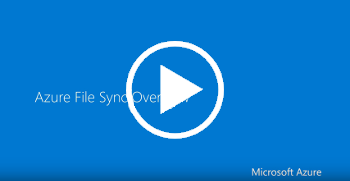

# What is Azure File Sync?
Azure File Sync enables centralizing your organization's file shares in Azure Files, while keeping the flexibility, performance, and compatibility of a Windows file server. While some users may opt to keep a full copy of their data locally, Azure File Sync additionally has the ability to transform Windows Server into a quick cache of your Azure file share. You can use any protocol that's available on Windows Server to access your data locally, including SMB, NFS, and FTPS. You can have as many caches as you need across the world.   

## Videos
| Introducing Azure File Sync | Azure Files with Sync (Ignite 2019)  |
|-|-|
|  |  |

## Benefits of Azure File Sync

### Cloud tiering
With cloud tiering enabled, your most frequently accessed files are cached on your local server and your least frequently accessed files are tiered to the cloud. You can control how much local disk space is used for caching. Tiered files can quickly be recalled on-demand, making the experience seamless while enabling you to cut down on costs as you only need to store a fraction of your data on-premises. For more information about cloud tiering, see [Cloud tiering overview](file-sync-cloud-tiering-overview.md). 

### Multi-site access and sync
Azure File Sync is ideal for distributed access scenarios. For each of your offices, you can provision a local Windows Server as part of your Azure File Sync deployment. Changes made to a server in one office automatically sync to the servers in all other offices.

### Business continuity and disaster recovery
Azure File Sync is backed by Azure Files, which offers several redundancy options for highly available storage. Because Azure contains resilient copies of your data, your local server becomes a disposable caching device, and recovering from a failed server can be done by adding a new server to your Azure File Sync deployment. Rather than restoring from a local backup, you provision another Windows Server, install the Azure File Sync agent on it, and then add it to your Azure File Sync deployment. Azure File Sync downloads your file namespace before downloading data, so that your server can be up and running as soon as possible. For even faster recovery, you can have a warm stand by server as part of your deployment, or you can use Azure File Sync with Windows Clustering.

## Cloud-side backup
Reduce your on-premises backup spending by taking centralized backups in the cloud using Azure Backup. Azure Files SMB shares have native snapshot capabilities, and the process can be automated using Azure Backup to schedule your backups and manage their retention. Azure Backup also integrates with your on-premises servers, so when you restore to the cloud, these changes are automatically downloaded on your Windows Servers.  

## Next Steps
* [Planning for an Azure File Sync deployment](file-sync-planning.md)
* [Cloud tiering overview](file-sync-cloud-tiering-overview.md)
* [Monitor Azure File Sync](file-sync-monitoring.md)