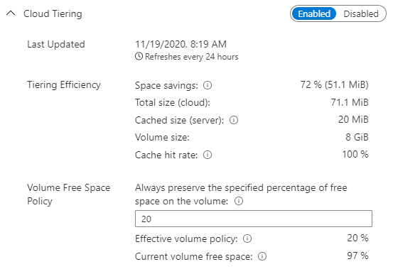

# Monitor cloud tiering
There are two ways you can monitor your cloud tiering policy: the server endpoint properties blade and Azure Monitor.

## Monitoring via server endpoint

Sign in to the [Azure portal](https://portal.azure.com/), then navigate to the **server endpoint properties** blade for the server endpoint you would like to monitor, and scroll down to the cloud tiering section. 

**Space savings** is the amount of space saved by enabling cloud tiering. If your local volume size is large enough to hold all of your data, you will have 0% space savings. If you have 0% or a low percent of space savings, it could indicate that cloud tiering isn't beneficial with your current local cache size. 

**Cache hit rate** is the percentage of files that you open in your local cache. The cache hit rate is calculated by files opened directly from cache/total number of files open. A cache hit rate of 100% means that all the files that you opened in the last hour were already in your local cache. If your goal is to reduce egress, this would indicate that your current policy is working well.

> [!NOTE]
> Workloads with random access patterns typically have lower cache hit rates. 

**Total size (cloud)** is the size of your files that were synced to the cloud. 

**Cached size (server)** is the total size of files on your server, both downloaded and tiered. Sometimes, the cached size may be bigger than the total size of your files in the cloud. Variables such as the cluster size of the volume on the server can cause this. If cached size is larger than you want, consider increasing your volume free space policy. 

**Effective volume policy** is used by Azure File Sync to determine how much free space to leave on the volume your server endpoint is on. When there are multiple server endpoints on the same volume, the highest volume free space policy amongst the server endpoints becomes the effective volume policy for all the server endpoints on that volume. For example, if there are two server endpoints on the same volume, one with 30% volume free space and another with 50% volume free space, the effective volume free space policy for both server endpoints will be 50%.

**Current volume free space** is the volume free space currently available on your on-premises server. If you have high egress but more volume free space available before your volume free space policy kicks in, consider disabling your date policy. Another issue might be that out of the currently tiered files, the most recently accessed file is larger than your volume free space remaining before the policy kicks in. In this case, consider increasing your local volume size. 

## Monitoring via Azure Monitor

Go to the **Storage Sync Service** and select **Metrics** on the side navigation. 

There are three different metrics you can use to monitor your egress specifically from cloud tiering:

- Cloud Tiering Recall Size
    - This is the total size of the data recalled in bytes and can be used to identify how much data is being recalled.
- Cloud Tiering Recall Size By Application
    - This is the total size of data recalled in bytes by an application and can be used to identify what's recalling the data.
- Cloud Tiering Recall Throughput
    - This measures how quickly the data is being recalled in bytes and should be used if you have concerns about performance. 

To be more specific on what you want your graphs to display, consider using **Add Filter** and **Apply Splitting**.
 
For details on the different types of metrics for Azure File Sync and how to use them, see [Monitor Azure File Sync](file-sync-monitoring.md).

For details on how to use metrics, see [Getting started with Azure Metrics Explorer.](../../azure-monitor/essentials/metrics-getting-started.md).

If you would like to change your cloud tiering policy, see [Choose cloud tiering policies](file-sync-choose-cloud-tiering-policies.md).

## Next steps

* [Planning for an Azure File Sync deployment](file-sync-planning.md)