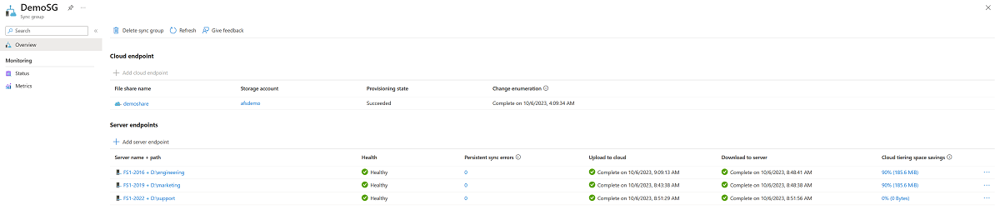

# Monitor Azure File Sync

Use Azure File Sync to centralize your organization's file shares in Azure Files, while keeping the flexibility, performance, and compatibility of an on-premises file server. Azure File Sync transforms Windows Server into a quick cache of your Azure file share. You can use any protocol that's available on Windows Server to access your data locally, including SMB, NFS, and FTPS. You can have as many caches as you need across the world.

This article describes how to monitor your Azure File Sync deployment by using Azure Monitor, Storage Sync Service and Windows Server.

The following scenarios are covered in this guide: 
- View Azure File Sync metrics in Azure Monitor.
- Create alerts in Azure Monitor to proactively notify you of critical conditions.
- View health of your Azure File Sync deployment using the Azure portal.
- How to use the event logs and performance counters on your Windows Servers to monitor the health of your Azure File Sync deployment. 

## Azure Monitor

Use [Azure Monitor](../../azure-monitor/overview.md) to view metrics and to configure alerts for sync, cloud tiering, and server connectivity.  

### Metrics

Metrics for Azure File Sync are enabled by default and are sent to Azure Monitor every 15 minutes.

**How to view Azure File Sync metrics in Azure Monitor**
1. Go to your **Storage Sync Service** in the **Azure portal** and click **Metrics**.
2. Click the **Metric** drop-down and select the metric you want to view.

The following metrics for Azure File Sync are available in Azure Monitor:

| Metric name | Description |
|-|-|
| Bytes synced | Size of data transferred (upload and download).  Unit: Bytes Aggregation Type: Sum Applicable dimensions: Server Endpoint Name, Sync Direction, Sync Group Name |
| Cloud tiering recall | Size of data recalled.  **Note**: This metric will be removed in the future. Use the Cloud tiering recall size metric to monitor size of data recalled.  Unit: Bytes Aggregation Type: Sum Applicable dimension: Server Name |
| Cloud tiering recall size | Size of data recalled.  Unit: Bytes Aggregation Type: Sum Applicable dimensions: Server Name, Sync Group Name |
| Cloud tiering recall size by application | Size of data recalled by application.  Unit: Bytes Aggregation Type: Sum Applicable dimensions: Application Name, Server Name, Sync Group Name |
| Cloud tiering recall throughput | Size of data recall throughput.  Unit: Bytes Aggregation Type: Sum Applicable dimensions: Server Name, Sync Group Name |
| Files not syncing | Count of files that are failing to sync.  Unit: Count Aggregation Types: Average, Sum Applicable dimensions: Server Endpoint Name, Sync Direction, Sync Group Name |
| Files synced | Count of files transferred (upload and download).  Unit: Count Aggregation Type: Sum Applicable dimensions: Server Endpoint Name, Sync Direction, Sync Group Name |
| Server online status | Count of heartbeats received from the server.  Unit: Count Aggregation Type: Maximum Applicable dimension: Server Name |
| Sync session result | Sync session result (1=successful sync session; 0=failed sync session)  Unit: Count Aggregation Types: Maximum Applicable dimensions: Server Endpoint Name, Sync Direction, Sync Group Name |

### Alerts

Alerts proactively notify you when important conditions are found in your monitoring data. To learn more about configuring alerts in Azure Monitor, see [Overview of alerts in Microsoft Azure](../../azure-monitor/alerts/alerts-overview.md).

**How to create alerts for Azure File Sync**

1. Go to your **Storage Sync Service** in the **Azure portal**. 
2. Click **Alerts** in the Monitoring section and then click **+ New alert rule**.
3. Click **Select condition** and provide the following information for the alert: 
    - **Metric**
    - **Dimension name**
    - **Alert logic**
4. Click **Select action group** and add an action group (email, SMS, etc.) to the alert either by selecting an existing action group or creating a new action group.
5. Fill in the **Alert details** like **Alert rule name**, **Description** and **Severity**.
6. Click **Create alert rule** to create the alert.  

The following table lists some example scenarios to monitor and the proper metric to use for the alert:

| Scenario | Metric to use for alert |
|-|-|
| Server endpoint health shows an error in the portal | Sync session result |
| Files are failing to sync to a server or cloud endpoint | Files not syncing |
| Registered server is failing to communicate with the Storage Sync Service | Server online status |
| Cloud tiering recall size has exceeded 500GiB in a day  | Cloud tiering recall size |

For instructions on how to create alerts for these scenarios, see the [Alert Examples](#alert-examples) section.

## Storage Sync Service

To view the health of your Azure File Sync deployment in the **Azure portal**, navigate to the **Storage Sync Service** and the following information is available:

- Registered server health
- Server endpoint health
    - Files not syncing
    - Sync activity
    - Cloud tiering efficiency
    - Files not tiering
    - Recall errors
- Metrics

### Registered server health

To view the **registered server health** in the portal, navigate to the **Registered servers** section of the **Storage Sync Service**.

- If the **Registered server** state is **Online**, the server is successfully communicating with the service.
- If the **Registered server** state is **Appears Offline**, the Storage Sync Monitor process (AzureStorageSyncMonitor.exe) is not running or the server is unable to access the Azure File Sync service. See the [troubleshooting documentation](file-sync-troubleshoot.md?tabs=portal1%252cazure-portal#server-endpoint-noactivity) for guidance.

### Server endpoint health

To view the health of a **server endpoint** in the portal, navigate to the **Sync groups** section of the **Storage Sync Service** and select a **sync group**.

- The **server endpoint health** and **sync activity** in the portal is based on the sync events that are logged in the Telemetry event log on the server (ID 9102 and 9302). If a sync session fails because of a transient error, such as error canceled, the server endpoint will still show as **healthy** in the portal as long as the current sync session is making progress (files are applied). Event ID 9302 is the sync progress event and Event ID 9102 is logged once a sync session completes.  For more information, see [sync health](file-sync-troubleshoot.md?tabs=server%252cazure-portal#broken-sync) and [sync progress](file-sync-troubleshoot.md?tabs=server%252cazure-portal#how-do-i-monitor-the-progress-of-a-current-sync-session). If the server endpoint health shows an **Error** or **No Activity**, see the [troubleshooting documentation](file-sync-troubleshoot.md?tabs=portal1%252cazure-portal#common-sync-errors) for guidance.
- The **files not syncing** count in the portal is based on the Event ID 9121 that is logged in the Telemetry event log on the server. This event is logged for each per-item error once the sync session completes. To resolve per-item errors, see [How do I see if there are specific files or folders that are not syncing?](file-sync-troubleshoot.md?tabs=server%252cazure-portal#how-do-i-see-if-there-are-specific-files-or-folders-that-are-not-syncing).
- To view the **cloud tiering efficiency** in the portal, go to the **Server Endpoint Properties** and navigate to the **Cloud Tiering** section. The data provided for cloud tiering efficiency is based on Event ID 9071 that is logged in the Telemetry event log on the server. To learn more, see [Monitor cloud tiering](file-sync-monitor-cloud-tiering.md).
- To view **files not tiering** and **recall errors** in the portal, go to the **Server Endpoint Properties** and navigate to the **Cloud Tiering** section. **Files not tiering** is based on Event ID 9003 that is logged in the Telemetry event log on the server and **recall errors** is based on Event ID 9006. To investigate files that are failing to tier or recall, see [How to troubleshoot files that fail to tier](file-sync-troubleshoot.md?tabs=portal1%252cazure-portal#how-to-troubleshoot-files-that-fail-to-tier) and [How to troubleshoot files that fail to be recalled](file-sync-troubleshoot.md?tabs=portal1%252cazure-portal#how-to-troubleshoot-files-that-fail-to-be-recalled).

### Metric charts

- The following metric charts are viewable in the Storage Sync Service portal:

  | Metric name | Description | Blade name |
  |-|-|-|
  | Bytes synced | Size of data transferred (upload and download) | Sync group, Server endpoint |
  | Cloud tiering recall | Size of data recalled | Registered servers |
  | Files not syncing | Count of files that are failing to sync | Server endpoint |
  | Files synced | Count of files transferred (upload and download) | Sync group, Server endpoint |
  | Server online status | Count of heartbeats received from the server | Registered servers |

- To learn more, see [Azure Monitor](#azure-monitor).

  > [!Note]  
  > The charts in the Storage Sync Service portal have a time range of 24 hours. To view different time ranges or dimensions, use Azure Monitor.

## Windows Server

On the **Windows Server** that has the Azure File Sync agent installed, you can view the health of the server endpoints on that server using the **event logs** and **performance counters**.

### Event logs

Use the Telemetry event log on the server to monitor registered server, sync, and cloud tiering health. The Telemetry event log is located in Event Viewer under *Applications and Services\Microsoft\FileSync\Agent*.

Sync health

- Event ID 9102 is logged once a sync session completes. Use this event to determine if sync sessions are successful (**HResult = 0**) and if there are per-item sync errors (**PerItemErrorCount**). For more information, see the [sync health](file-sync-troubleshoot.md?tabs=server%252cazure-portal#broken-sync) and  [per-item errors](file-sync-troubleshoot.md?tabs=server%252cazure-portal#how-do-i-see-if-there-are-specific-files-or-folders-that-are-not-syncing) documentation.

  > [!Note]  
  > Sometimes sync sessions fail overall or have a non-zero PerItemErrorCount. However, they still make forward progress, and some files sync successfully. You can see this in the Applied fields such as AppliedFileCount, AppliedDirCount, AppliedTombstoneCount, and AppliedSizeBytes. These fields tell you how much of the session succeeded. If you see multiple sync sessions fail in a row, and they have an increasing Applied count, give sync time to try again before you open a support ticket.

- Event ID 9121 is logged for each per-item error once the sync session completes. Use this event to determine the number of files that are failing to sync with this error (**PersistentCount** and **TransientCount**). Persistent per-item errors should be investigated, see [How do I see if there are specific files or folders that are not syncing?](file-sync-troubleshoot.md?tabs=server%252cazure-portal#how-do-i-see-if-there-are-specific-files-or-folders-that-are-not-syncing).

- Event ID 9302 is logged every 5 to 10 minutes if there’s an active sync session. Use this event to determine how many items are to be synced (**TotalItemCount**), number of items that have synced so far (**AppliedItemCount**) and number of items that have failed to sync due to a per-item error (**PerItemErrorCount**). If sync is not making progress (**AppliedItemCount=0**), the sync session will eventually fail and an Event ID 9102 will be logged with the error. For more information, see the [sync progress documentation](file-sync-troubleshoot.md?tabs=server%252cazure-portal#how-do-i-monitor-the-progress-of-a-current-sync-session).

Registered server health

- Event ID 9301 is logged every 30 seconds when a server queries the service for jobs. If GetNextJob finishes with **status = 0**, the server is able to communicate with the service. If GetNextJob finishes with an error, check the [troubleshooting documentation](file-sync-troubleshoot.md?tabs=portal1%252cazure-portal#server-endpoint-noactivity) for guidance.

Cloud tiering health

- To monitor tiering activity on a server, use Event ID 9003, 9016 and 9029 in the Telemetry event log, which is located in Event Viewer under *Applications and Services\Microsoft\FileSync\Agent*.

  - Event ID 9003 provides error distribution for a server endpoint. For example: Total Error Count and  ErrorCode. One event is logged per error code.
  - Event ID 9016 provides ghosting results for a volume. For example: Free space percent is, Number of files ghosted in session, and Number of files failed to ghost.
  - Event ID 9029 provides ghosting session information for a server endpoint. For example: Number of files attempted in the session, Number of files tiered in the session, and Number of files already tiered.

- To monitor recall activity on a server, use Event ID 9005, 9006, 9009, 9059 and 9071 in the Telemetry event log, which is located in Event Viewer under *Applications and Services\Microsoft\FileSync\Agent*.

  - Event ID 9005 provides recall reliability for a server endpoint. For example: Total unique files accessed, and Total unique files with failed access.
  - Event ID 9006 provides recall error distribution for a server endpoint. For example: Total Failed Requests, and ErrorCode. One event is logged per error code.
  - Event ID 9009 provides recall session information for a server endpoint. For example: DurationSeconds, CountFilesRecallSucceeded, and CountFilesRecallFailed.
  - Event ID 9059 provides application recall distribution for a server endpoint. For example: ShareId, Application Name, and TotalEgressNetworkBytes.
  - Event ID 9071 provides cloud tiering efficiency for a server endpoint. For example: TotalDistinctFileCountCacheHit, TotalDistinctFileCountCacheMiss, TotalCacheHitBytes and TotalCacheMissBytes.

### Performance counters

Use the Azure File Sync performance counters on the server to monitor sync activity.

To view Azure File Sync performance counters on the server, open Performance Monitor (Perfmon.exe). You can find the counters under the **AFS Bytes Transferred** and **AFS Sync Operations** objects.

The following performance counters for Azure File Sync are available in Performance Monitor:

| Performance Object\Counter Name | Description |
|-|-|
| AFS Bytes Transferred\Downloaded Bytes/sec | Number of bytes downloaded per second. |
| AFS Bytes Transferred\Uploaded Bytes/sec | Number of bytes uploaded per second. |
| AFS Bytes Transferred\Total Bytes/sec | Total bytes per second (upload and download). |
| AFS Sync Operations\Downloaded Sync Files/sec | Number of files downloaded per second. |
| AFS Sync Operations\Uploaded Sync Files/sec | Number of files uploaded per second. |
| AFS Sync Operations\Total Sync File Operations/sec | Total number of files synced (upload and download). |

## Alert Examples
This section provides some example alerts for Azure File Sync.

  > [!Note]  
  > If you create an alert and it's too noisy, adjust the threshold value and alert logic.

### How to create an alert if the server endpoint health shows an error in the portal

1. In the **Azure portal**, navigate to respective **Storage Sync Service**. 
2. Go to the **Monitoring** section and click **Alerts**. 
3. Click on **+ New alert rule** to create a new alert rule. 
4. Configure condition by clicking **Select condition**.
5. Within **Configure signal logic** blade, click **Sync session result** under signal name.  
6. Select the following dimension configuration: 
     - Dimension name: **Server Endpoint Name**  
     - Operator: **=** 
     - Dimension values: **All current and future values**  
7. Navigate to **Alert Logic** and complete the following: 
     - Threshold set to **Static** 
     - Operator: **Less than** 
     - Aggregation type: **Maximum**  
     - Threshold value: **1** 
     - Evaluated based on: Aggregation granularity = **24 hours** | Frequency of evaluation = **Every hour** 
     - Click **Done.** 
8. Click **Select action group** to add an action group (email, SMS, etc.) to the alert either by selecting an existing action group or creating a new action group.
9. Fill in the **Alert details** like **Alert rule name**, **Description** and **Severity**.
10. Click **Create alert rule**. 

### How to create an alert if files are failing to sync to a server or cloud endpoint

1. In the **Azure portal**, navigate to respective **Storage Sync Service**. 
2. Go to the **Monitoring** section and click **Alerts**. 
3. Click on **+ New alert rule** to create a new alert rule. 
4. Configure condition by clicking **Select condition**.
5. Within **Configure signal logic** blade, click **Files not syncing** under signal name.  
6. Select the following dimension configuration: 
     - Dimension name: **Server Endpoint Name**  
     - Operator: **=** 
     - Dimension values: **All current and future values**  
7. Navigate to **Alert Logic** and complete the following: 
     - Threshold set to **Static** 
     - Operator: **Greater than** 
     - Aggregation type: **Average**  
     - Threshold value: **100** 
     - Evaluated based on: Aggregation granularity = **5 minutes** | Frequency of evaluation = **Every 5 minutes** 
     - Click **Done.** 
8. Click **Select action group** to add an action group (email, SMS, etc.) to the alert either by selecting an existing action group or creating a new action group.
9. Fill in the **Alert details** like **Alert rule name**, **Description** and **Severity**.
10. Click **Create alert rule**. 

### How to create an alert if a registered server is failing to communicate with the Storage Sync Service

1. In the **Azure portal**, navigate to respective **Storage Sync Service**. 
2. Go to the **Monitoring** section and click **Alerts**. 
3. Click on **+ New alert rule** to create a new alert rule. 
4. Configure condition by clicking **Select condition**.
5. Within **Configure signal logic** blade, click **Server online status** under signal name.  
6. Select the following dimension configuration: 
     - Dimension name: **Server name**  
     - Operator: **=** 
     - Dimension values: **All current and future values**  
7. Navigate to **Alert Logic** and complete the following: 
     - Threshold set to **Static** 
     - Operator: **Less than** 
     - Aggregation type: **Maximum**  
     - Threshold value (in bytes): **1** 
     - Evaluated based on: Aggregation granularity = **1 hour** | Frequency of evaluation = **Every 30 minutes** 
         - Note that the metrics are sent to Azure Monitor every 15 to 20 minutes. Do not set the **Frequency of evaluation** to less than 30 minutes (will generate false alerts).
     - Click **Done.** 
8. Click **Select action group** to add an action group (email, SMS, etc.) to the alert either by selecting an existing action group or creating a new action group.
9. Fill in the **Alert details** like **Alert rule name**, **Description** and **Severity**.
10. Click **Create alert rule**. 

### How to create an alert if the cloud tiering recall size has exceeded 500GiB in a day

1. In the **Azure portal**, navigate to respective **Storage Sync Service**. 
2. Go to the **Monitoring** section and click **Alerts**. 
3. Click on **+ New alert rule** to create a new alert rule. 
4. Configure condition by clicking **Select condition**.
5. Within **Configure signal logic** blade, click **Cloud tiering recall size** under signal name.  
6. Select the following dimension configuration: 
     - Dimension name: **Server name**  
     - Operator: **=** 
     - Dimension values: **All current and future values**  
7. Navigate to **Alert Logic** and complete the following: 
     - Threshold set to **Static** 
     - Operator: **Greater than** 
     - Aggregation type: **Total**  
     - Threshold value (in bytes): **67108864000** 
     - Evaluated based on: Aggregation granularity = **24 hours** | Frequency of evaluation = **Every hour** 
     - Click **Done.** 
8. Click **Select action group** to add an action group (email, SMS, etc.) to the alert either by selecting an existing action group or creating a new action group.
9. Fill in the **Alert details** like **Alert rule name**, **Description** and **Severity**.
10. Click **Create alert rule**. 

## Next steps
- [Planning for an Azure File Sync deployment](file-sync-planning.md)
- [Consider firewall and proxy settings](file-sync-firewall-and-proxy.md)
- [Deploy Azure File Sync](file-sync-deployment-guide.md)
- [Troubleshoot Azure File Sync](file-sync-troubleshoot.md)