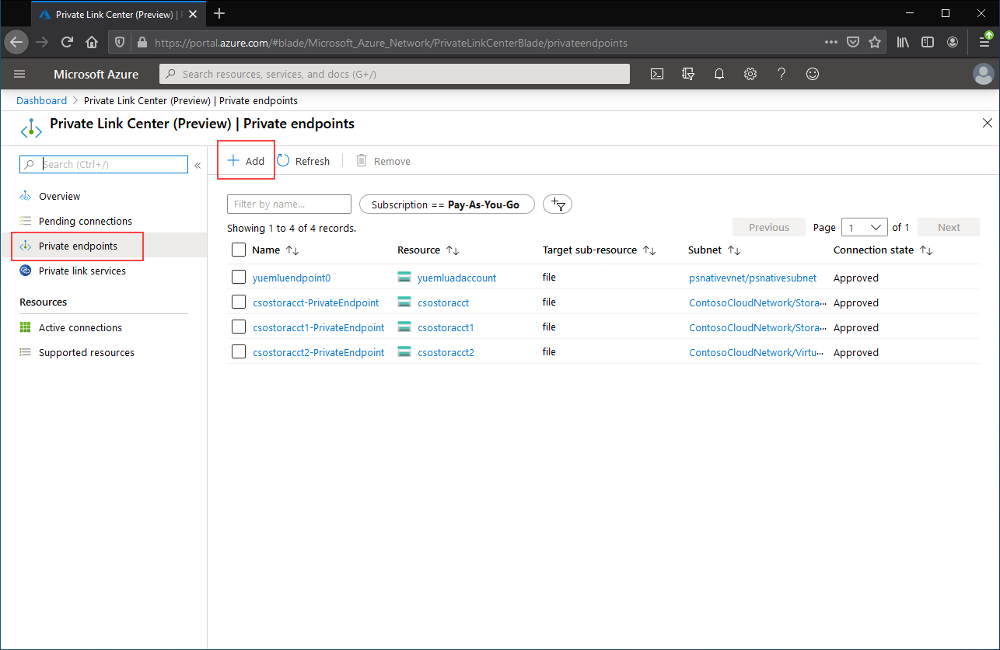

# Configuring Azure File Sync network endpoints
Azure Files and Azure File Sync provide two main types of endpoints for accessing Azure file shares: 
- Public endpoints, which have a public IP address and can be accessed from anywhere in the world.
- Private endpoints, which exist within a virtual network and have a private IP address from within the address space of that virtual network.

For both Azure Files and Azure File Sync, the Azure management objects, the storage account and the Storage Sync Service respectively, control both the public and private endpoints. The storage account is a management construct that represents a shared pool of storage in which you can deploy multiple file shares, as well as other storage resources, such as blob containers or queues. The Storage Sync Service is a management construct that represents registered servers, which are Windows file servers with an established trust relationship with Azure File Sync, and sync groups, which define the topology of the sync relationship. 

This article focuses on how to configure the networking endpoints for both Azure Files and Azure File Sync. To learn more about how to configure networking endpoints for accessing Azure file shares directly, rather than caching on-premises with Azure File Sync, see [Configuring Azure Files network endpoints](../files/storage-files-networking-endpoints.md?toc=%2fazure%2fstorage%2ffilesync%2ftoc.json).

We recommend reading [Azure File Sync networking considerations](file-sync-networking-overview.md) prior to reading this how to guide.

## Prerequisites 
This article assumes that:
- You have an Azure subscription. If you don't already have a subscription, then create a [free account](https://azure.microsoft.com/free/?WT.mc_id=A261C142F) before you begin.
- You have already created an Azure file share in a storage account which you would like to connect to from on-premises. To learn how to create an Azure file share, see [Create an Azure file share](../files/storage-how-to-create-file-share.md?toc=%2fazure%2fstorage%2ffilesync%2ftoc.json).
- You have already created a Storage Sync Service and registered your Windows file server with it. To learn how to deploy Azure File Sync, see [Deploying Azure File Sync](file-sync-deployment-guide.md).

Additionally:
- If you intend to use Azure PowerShell, [install the latest version](/powershell/azure/install-az-ps).
- If you intend to use the Azure CLI, [install the latest version](/cli/azure/install-azure-cli).

## Create the private endpoints
When you creating a private endpoint for an Azure resource, the following resources are deployed:

- **A private endpoint**: An Azure resource representing either the private endpoint for the storage account or the Storage Sync Service. You can think of this as a resource that connects your Azure resource and a network interface.
- **A network interface (NIC)**: The network interface that maintains a private IP address within the specified virtual network/subnet. This is the exact same resource that gets deployed when you deploy a virtual machine, however instead of being assigned to a VM, it's owned by the private endpoint.
- **A private DNS zone**: If you've never deployed a private endpoint for this virtual network before, a new private DNS zone will be deployed for your virtual network. A DNS A record will also be created for Azure resource in this DNS zone. If you've already deployed a private endpoint in this virtual network, a new A record for Azure resource will be added to the existing DNS zone. Deploying a DNS zone is optional, however highly recommended to simplify the DNS management required.

> [!Note]  
> This article uses the DNS suffixes for the Azure Public regions, `core.windows.net` for storage accounts and `afs.azure.net` for Storage Sync Services. This commentary also applies to Azure Sovereign clouds such as the Azure US Government cloud - just substitute the the appropriate suffixes for your environment.

### Create the storage account private endpoint
# [Portal](#tab/azure-portal)
[!INCLUDE [storage-files-networking-endpoints-private-portal](../../../includes/storage-files-networking-endpoints-private-portal.md)]

If you have a virtual machine inside of your virtual network, or you've configured DNS forwarding as described in [Configuring DNS forwarding for Azure Files](../files/storage-files-networking-dns.md?toc=%2fazure%2fstorage%2ffilesync%2ftoc.json), you can test that your private endpoint has been set up correctly by running the following commands from PowerShell, the command line, or the terminal (works for Windows, Linux, or macOS). You must replace `<storage-account-name>` with the appropriate storage account name:

```console
nslookup <storage-account-name>.file.core.windows.net
```

If everything has worked successfully, you should see the following output, where `192.168.0.5` is the private IP address of the private endpoint in your virtual network (output shown for Windows):

```output
Server:  UnKnown
Address:  10.2.4.4

Non-authoritative answer:
Name:    storageaccount.privatelink.file.core.windows.net
Address:  192.168.0.5
Aliases:  storageaccount.file.core.windows.net
```

# [PowerShell](#tab/azure-powershell)
[!INCLUDE [storage-files-networking-endpoints-private-powershell](../../../includes/storage-files-networking-endpoints-private-powershell.md)]

If you have a virtual machine inside of your virtual network, or you've configured DNS forwarding as described in [Configuring DNS forwarding for Azure Files](../files/storage-files-networking-dns.md?toc=%2fazure%2fstorage%2ffilesync%2ftoc.json), you can test that your private endpoint has been set up correctly with the following commands:

```powershell
$storageAccountHostName = [System.Uri]::new($storageAccount.PrimaryEndpoints.file) | `
    Select-Object -ExpandProperty Host

Resolve-DnsName -Name $storageAccountHostName
```

If everything has worked successfully, you should see the following output, where `192.168.0.5` is the private IP address of the private endpoint in your virtual network:

```output
Name                             Type   TTL   Section    NameHost
----                             ----   ---   -------    --------
storageaccount.file.core.windows CNAME  60    Answer     storageaccount.privatelink.file.core.windows.net
.net

Name       : storageaccount.privatelink.file.core.windows.net
QueryType  : A
TTL        : 600
Section    : Answer
IP4Address : 192.168.0.5
```

# [Azure CLI](#tab/azure-cli)
[!INCLUDE [storage-files-networking-endpoints-private-cli](../../../includes/storage-files-networking-endpoints-private-cli.md)]

If you have a virtual machine inside of your virtual network, or you've configured DNS forwarding as described in [Configuring DNS forwarding for Azure Files](../files/storage-files-networking-dns.md?toc=%2fazure%2fstorage%2ffilesync%2ftoc.json), you can test that your private endpoint has been set up correctly with the following commands:

```bash
httpEndpoint=$(az storage account show \
        --resource-group $storageAccountResourceGroupName \
        --name $storageAccountName \
        --query "primaryEndpoints.file" | \
    tr -d '"')

hostName=$(echo $httpEndpoint | cut -c7-$(expr length $httpEndpoint) | tr -d "/")
nslookup $hostName
```

If everything has worked successfully, you should see the following output, where `192.168.0.5` is the private IP address of the private endpoint in your virtual network:

```output
Server:         127.0.0.53
Address:        127.0.0.53#53

Non-authoritative answer:
storageaccount.file.core.windows.net      canonical name = storageaccount.privatelink.file.core.windows.net.
Name:   storageaccount.privatelink.file.core.windows.net
Address: 192.168.0.5
```

---

### Create the Storage Sync Service private endpoint
> [!Important]  
> In order to use private endpoints on the Storage Sync Service resource, you must use Azure File Sync agent version 10.1 or greater. Agent versions prior to 10.1 do not support private endpoints on the Storage Sync Service. All prior agent versions support private endpoints on the storage account resource.

# [Portal](#tab/azure-portal)
Navigate to the **Private Link Center** by typing *Private Link* into the search bar at the top of the Azure portal. In the table of contents for the Private Link Center, select **Private endpoints**, and then **+ Add** to create a new private endpoint.

[](media/storage-sync-files-networking-endpoints/create-storage-sync-private-endpoint-0.png#lightbox)

The resulting wizard has multiple pages to complete.

In the **Basics** blade, select the desired resource group, name, and region for your private endpoint. These can be whatever you want, they don't have to match the Storage Sync Service in any way, although you must create the private endpoint in the same region as the virtual network you wish to create the private endpoint in.


In the **Resource** blade, select the radio button for **Connect to an Azure resource in my directory**. Under the **Resource type**, select **Microsoft.StorageSync/storageSyncServices** for the resource type. 

The **Configuration** blade allows you to select the specific virtual network and subnet you would like to add your private endpoint to. Select the same virtual network as the one you used for the storage account above. The Configuration blade also contains the information for creating/updating the private DNS zone.

Click **Review + create** to create the private endpoint.

You can test that your private endpoint has been setup correctly by running the following commands from PowerShell. 

```powershell
$privateEndpointResourceGroupName = "<your-private-endpoint-resource-group>"
$privateEndpointName = "<your-private-endpoint-name>"

Get-AzPrivateEndpoint `
        -ResourceGroupName $privateEndpointResourceGroupName `
        -Name $privateEndpointName `
        -ErrorAction Stop | `
    Select-Object -ExpandProperty NetworkInterfaces | `
    Select-Object -ExpandProperty Id | `
    ForEach-Object { Get-AzNetworkInterface -ResourceId $_ } | `
    Select-Object -ExpandProperty IpConfigurations | `
    Select-Object -ExpandProperty PrivateLinkConnectionProperties | `
    Select-Object -ExpandProperty Fqdns | `
    ForEach-Object { Resolve-DnsName -Name $_ } | `
    Format-List
```

If everything has worked correctly, you should see the following output where `192.168.1.4`, `192.168.1.5`, `192.168.1.6`, and `192.168.1.7` are the private IP addresses assigned to the private endpoint:

```output
Name     : mysssmanagement.westus2.afs.azure.net
Type     : CNAME
TTL      : 60
Section  : Answer
NameHost : mysssmanagement.westus2.privatelink.afs.azure.net


Name       : mysssmanagement.westus2.privatelink.afs.azure.net
QueryType  : A
TTL        : 60
Section    : Answer
IP4Address : 192.168.1.4

Name     : myssssyncp.westus2.afs.azure.net
Type     : CNAME
TTL      : 60
Section  : Answer
NameHost : myssssyncp.westus2.privatelink.afs.azure.net


Name       : myssssyncp.westus2.privatelink.afs.azure.net
QueryType  : A
TTL        : 60
Section    : Answer
IP4Address : 192.168.1.5

Name     : myssssyncs.westus2.afs.azure.net
Type     : CNAME
TTL      : 60
Section  : Answer
NameHost : myssssyncs.westus2.privatelink.afs.azure.net


Name       : myssssyncs.westus2.privatelink.afs.azure.net
QueryType  : A
TTL        : 60
Section    : Answer
IP4Address : 192.168.1.6

Name     : mysssmonitoring.westus2.afs.azure.net
Type     : CNAME
TTL      : 60
Section  : Answer
NameHost : mysssmonitoring.westus2.privatelink.afs.azure.net


Name       : mysssmonitoring.westus2.privatelink.afs.azure.net
QueryType  : A
TTL        : 60
Section    : Answer
IP4Address : 192.168.1.7

```

# [PowerShell](#tab/azure-powershell)
To create a private endpoint for your Storage Sync Service, first you will need to get a reference to your Storage Sync Service. Remember to replace `<storage-sync-service-resource-group>` and `<storage-sync-service>` with the correct values for your environment. The following PowerShell commands assume that you are using have already populated the virtual network information from above. 

```powershell
$storageSyncServiceResourceGroupName = "<storage-sync-service-resource-group>"
$storageSyncServiceName = "<storage-sync-service>"

$storageSyncService = Get-AzStorageSyncService `
        -ResourceGroupName $storageSyncServiceResourceGroupName `
        -Name $storageSyncServiceName `
        -ErrorAction SilentlyContinue

if ($null -eq $storageSyncService) {
    $errorMessage = "Storage Sync Service $storageSyncServiceName not found "
    $errorMessage += "in resource group $storageSyncServiceResourceGroupName."
    Write-Error -Message $errorMessage -ErrorAction Stop
}
```

To create a private endpoint, you must create a private link service connection to the Storage Sync Service. The private link connection is an input to the creation of the private endpoint.

```powershell 
# Disable private endpoint network policies
$subnet.PrivateEndpointNetworkPolicies = "Disabled"
$virtualNetwork = $virtualNetwork | `
    Set-AzVirtualNetwork -ErrorAction Stop

# Create a private link service connection to the storage account.
$privateEndpointConnection = New-AzPrivateLinkServiceConnection `
        -Name "$storageSyncServiceName-Connection" `
        -PrivateLinkServiceId $storageSyncService.ResourceId `
        -GroupId "Afs" `
        -ErrorAction Stop

# Create a new private endpoint.
$privateEndpoint = New-AzPrivateEndpoint `
        -ResourceGroupName $storageSyncServiceResourceGroupName `
        -Name "$storageSyncServiceName-PrivateEndpoint" `
        -Location $virtualNetwork.Location `
        -Subnet $subnet `
        -PrivateLinkServiceConnection $privateEndpointConnection `
        -ErrorAction Stop
```

Creating an Azure private DNS zone enables the host names for the Storage Sync Service, such as `mysssmanagement.westus2.afs.azure.net`, to resolve to the correct private IPs for the Storage Sync Service inside of the virtual network. Although optional from the perspective of creating a private endpoint, it is explicitly required for the Azure File Sync agent to access the Storage Sync Service. 

```powershell
# Get the desired Storage Sync Service suffix (afs.azure.net for public cloud).
# This is done like this so this script will seamlessly work for non-public Azure.
$azureEnvironment = Get-AzContext | `
    Select-Object -ExpandProperty Environment | `
    Select-Object -ExpandProperty Name

switch($azureEnvironment) {
    "AzureCloud" {
        $storageSyncSuffix = "afs.azure.net"
    }

    "AzureUSGovernment" {
        $storageSyncSuffix = "afs.azure.us"
    }
    
    default {
        Write-Error 
                -Message "The Azure environment $_ is not currently supported by Azure File Sync." `
                -ErrorAction Stop
    }
}

# For public cloud, this will generate the following DNS suffix:
# privatelink.afs.azure.net
$dnsZoneName = "privatelink.$storageSyncSuffix"

# Find a DNS zone matching desired name attached to this virtual network.
$dnsZone = Get-AzPrivateDnsZone | `
    Where-Object { $_.Name -eq $dnsZoneName } | `
    Where-Object {
        $privateDnsLink = Get-AzPrivateDnsVirtualNetworkLink `
                -ResourceGroupName $_.ResourceGroupName `
                -ZoneName $_.Name `
                -ErrorAction SilentlyContinue
        
        $privateDnsLink.VirtualNetworkId -eq $virtualNetwork.Id
    }

if ($null -eq $dnsZone) {
    # No matching DNS zone attached to virtual network, so create new one.
    $dnsZone = New-AzPrivateDnsZone `
            -ResourceGroupName $virtualNetworkResourceGroupName `
            -Name $dnsZoneName `
            -ErrorAction Stop

    $privateDnsLink = New-AzPrivateDnsVirtualNetworkLink `
            -ResourceGroupName $virtualNetworkResourceGroupName `
            -ZoneName $dnsZoneName `
            -Name "$virtualNetworkName-DnsLink" `
            -VirtualNetworkId $virtualNetwork.Id `
            -ErrorAction Stop
}
```
Now that you have a reference to the private DNS zone, you must create an A records for your Storage Sync Service.

```powershell 
$privateEndpointIpFqdnMappings = $privateEndpoint | `
    Select-Object -ExpandProperty NetworkInterfaces | `
    Select-Object -ExpandProperty Id | `
    ForEach-Object { Get-AzNetworkInterface -ResourceId $_ } | `
    Select-Object -ExpandProperty IpConfigurations | `
    ForEach-Object { 
        $privateIpAddress = $_.PrivateIpAddress; 
        $_ | `
            Select-Object -ExpandProperty PrivateLinkConnectionProperties | `
            Select-Object -ExpandProperty Fqdns | `
            Select-Object `
                @{ 
                    Name = "PrivateIpAddress"; 
                    Expression = { $privateIpAddress } 
                }, `
                @{ 
                    Name = "FQDN"; 
                    Expression = { $_ } 
                } 
    }

foreach($ipFqdn in $privateEndpointIpFqdnMappings) {
    $privateDnsRecordConfig = New-AzPrivateDnsRecordConfig `
        -IPv4Address $ipFqdn.PrivateIpAddress
    
    $dnsEntry = $ipFqdn.FQDN.Substring(0, 
        $ipFqdn.FQDN.IndexOf(".", $ipFqdn.FQDN.IndexOf(".") + 1))

    New-AzPrivateDnsRecordSet `
            -ResourceGroupName $virtualNetworkResourceGroupName `
            -Name $dnsEntry `
            -RecordType A `
            -ZoneName $dnsZoneName `
            -Ttl 600 `
            -PrivateDnsRecords $privateDnsRecordConfig `
            -ErrorAction Stop | `
        Out-Null
}
```

# [Azure CLI](#tab/azure-cli)
To create a private endpoint for your Storage Sync Service, first you will need to get a reference to your Storage Sync Service. Remember to replace `<storage-sync-service-resource-group>` and `<storage-sync-service>` with the correct values for your environment. The following CLI commands assume that you are using have already populated the virtual network information from above. 

```bash
storageSyncServiceResourceGroupName="<storage-sync-service-resource-group>"
storageSyncServiceName="<storage-sync-service>"

storageSyncService=$(az resource show \
        --resource-group $storageSyncServiceResourceGroupName \
        --name $storageSyncServiceName \
        --resource-type "Microsoft.StorageSync/storageSyncServices" \
        --query "id" | \
    tr -d '"')

storageSyncServiceRegion=$(az resource show \
        --resource-group $storageSyncServiceResourceGroupName \
        --name $storageSyncServiceName \
        --resource-type "Microsoft.StorageSync/storageSyncServices" \
        --query "location" | \
    tr -d '"')
```

To create a private endpoint, you must first ensure that the subnet's private endpoint network policy is set to disabled. Then you can create a private endpoint with the `az network private-endpoint create` command.

```bash
# Disable private endpoint network policies
az network vnet subnet update \
        --ids $subnet \
        --disable-private-endpoint-network-policies \
        --output none

# Get virtual network location
region=$(az network vnet show \
        --ids $virtualNetwork \
        --query "location" | \
    tr -d '"')

# Create a private endpoint
privateEndpoint=$(az network private-endpoint create \
        --resource-group $storageSyncServiceResourceGroupName \
        --name "$storageSyncServiceName-PrivateEndpoint" \
        --location $region \
        --subnet $subnet \
        --private-connection-resource-id $storageSyncService \
        --group-id "Afs" \
        --connection-name "$storageSyncServiceName-Connection" \
        --query "id" | \
    tr -d '"')
```

Creating an Azure private DNS zone enables the host names for the Storage Sync Service, such as `mysssmanagement.westus2.afs.azure.net`, to resolve to the correct private IPs for the Storage Sync Service inside of the virtual network. Although optional from the perspective of creating a private endpoint, it is explicitly required for the Azure File Sync agent to access the Storage Sync Service. 

```bash
# Get the desired storage account suffix (afs.azure.net for public cloud).
# This is done like this so this script will seamlessly work for non-public Azure.
azureEnvironment=$(az cloud show \
        --query "name" |
    tr -d '"')

storageSyncSuffix=""
if [ $azureEnvironment == "AzureCloud" ]
then
    storageSyncSuffix="afs.azure.net"
elif [ $azureEnvironment == "AzureUSGovernment" ]
then
    storageSyncSuffix="afs.azure.us"
else
    echo "Unsupported Azure environment $azureEnvironment."
fi

# For public cloud, this will generate the following DNS suffix:
# privatelinke.afs.azure.net.
dnsZoneName="privatelink.$storageSyncSuffix"

# Find a DNS zone matching desired name attached to this virtual network.
possibleDnsZones=""
possibleDnsZones=$(az network private-dns zone list \
        --query "[?name == '$dnsZoneName'].id" \
        --output tsv)

dnsZone=""
possibleDnsZone=""
for possibleDnsZone in $possibleDnsZones
do
    possibleResourceGroupName=$(az resource show \
            --ids $possibleDnsZone \
            --query "resourceGroup" | \
        tr -d '"')
    
    link=$(az network private-dns link vnet list \
            --resource-group $possibleResourceGroupName \
            --zone-name $dnsZoneName \
            --query "[?virtualNetwork.id == '$virtualNetwork'].id" \
            --output tsv)
    
    if [ -z $link ]
    then
        echo "1" > /dev/null
    else 
        dnsZoneResourceGroup=$possibleResourceGroupName
        dnsZone=$possibleDnsZone
        break
    fi  
done

if [ -z $dnsZone ]
then
    # No matching DNS zone attached to virtual network, so create a new one
    dnsZone=$(az network private-dns zone create \
            --resource-group $virtualNetworkResourceGroupName \
            --name $dnsZoneName \
            --query "id" | \
        tr -d '"')
    
    az network private-dns link vnet create \
            --resource-group $virtualNetworkResourceGroupName \
            --zone-name $dnsZoneName \
            --name "$virtualNetworkName-DnsLink" \
            --virtual-network $virtualNetwork \
            --registration-enabled false \
            --output none
    
    dnsZoneResourceGroup=$virtualNetworkResourceGroupName
fi
```

Now that you have a reference to the private DNS zone, you must create an A records for your Storage Sync Service.

```bash
privateEndpointNIC=$(az network private-endpoint show \
        --ids $privateEndpoint \
        --query "networkInterfaces[0].id" | \
    tr -d '"')

privateIpAddresses=$(az network nic show \
        --ids $privateEndpointNIC \
        --query "ipConfigurations[].privateIpAddress" \
        --output tsv) 

hostNames=$(az network nic show \
        --ids $privateEndpointNIC \
        --query "ipConfigurations[].privateLinkConnectionProperties.fqdns[]" \
        --output tsv)

i=0
for privateIpAddress in $privateIpAddresses
do
    j=0
    targetHostName=""
    for hostName in $hostNames
    do
        if [ $i == $j ]
        then
            targetHostName=$hostName
            break
        fi

        j=$(expr $j + 1)
    done

    endpointName=$(echo $targetHostName | \
        cut -c1-$(expr $(expr index $targetHostName ".") - 1))

    az network private-dns record-set a create \
        --resource-group $dnsZoneResourceGroup \
        --zone-name $dnsZoneName \
        --name "$endpointName.$storageSyncServiceRegion" \
        --output none
    
    az network private-dns record-set a add-record \
        --resource-group $dnsZoneResourceGroup \
        --zone-name $dnsZoneName \
        --record-set-name "$endpointName.$storageSyncServiceRegion" \
        --ipv4-address $privateIpAddress \
        --output none

    i=$(expr $i + 1)
done
```
---

## Restrict access to the public endpoints
You can restrict access to the public endpoints of both the storage account and the Storage Sync Services. Restrict access to the public endpoint provides additional security by ensuring that network packets are only accepted from approved locations. 

### Restrict access to the storage account public endpoint
Access restriction to the public endpoint is done using the storage account firewall settings. In general, most firewall policies for a storage account will restrict networking access to one or more virtual networks. There are two approaches to restricting access to a storage account to a virtual network:

- [Create one or more private endpoints for the storage account](#create-the-storage-account-private-endpoint) and disable access to the public endpoint. This ensures that only traffic originating from within the desired virtual networks can access the Azure file shares within the storage account.
- Restrict the public endpoint to one or more virtual networks. This works by using a capability of the virtual network called *service endpoints*. When you restrict the traffic to a storage account via a service endpoint, you are still accessing the storage account via the public IP address.

#### Disable access to the storage account public endpoint
When access to the public endpoint is disabled, the storage account can still be accessed through its private endpoints. Otherwise valid requests to the storage account's public endpoint will be rejected. 

# [Portal](#tab/azure-portal)
[!INCLUDE [storage-files-networking-endpoints-public-disable-portal](../../../includes/storage-files-networking-endpoints-public-disable-portal.md)]

# [PowerShell](#tab/azure-powershell)
[!INCLUDE [storage-files-networking-endpoints-public-disable-powershell](../../../includes/storage-files-networking-endpoints-public-disable-powershell.md)]

# [Azure CLI](#tab/azure-cli)
[!INCLUDE [storage-files-networking-endpoints-public-disable-cli](../../../includes/storage-files-networking-endpoints-public-disable-cli.md)]

---

#### Restrict access to the storage account public endpoint to specific virtual networks
When you restrict the storage account to specific virtual networks, you are allowing requests to the public endpoint from within the specified virtual networks. This works by using a capability of the virtual network called *service endpoints*. This can be used with or without private endpoints.

# [Portal](#tab/azure-portal)
[!INCLUDE [storage-files-networking-endpoints-public-restrict-portal](../../../includes/storage-files-networking-endpoints-public-restrict-portal.md)]

# [PowerShell](#tab/azure-powershell)
[!INCLUDE [storage-files-networking-endpoints-public-restrict-powershell](../../../includes/storage-files-networking-endpoints-public-restrict-powershell.md)]

# [Azure CLI](#tab/azure-cli)
[!INCLUDE [storage-files-networking-endpoints-public-restrict-cli](../../../includes/storage-files-networking-endpoints-public-restrict-cli.md)]

---

### Disable access to the Storage Sync Service public endpoint
Azure File Sync enables you to restrict access to specific virtual networks through private endpoints only; Azure File Sync does not support service endpoints for restricting access to the public endpoint to specific virtual networks. This means that the two states for the Storage Sync Service's public endpoint are enabled and disabled.

# [Portal](#tab/azure-portal)
This is not possible through the Azure portal. Please select the Azure PowerShell tab to get instructions on how to disable the Storage Sync Service public endpoint. 

# [PowerShell](#tab/azure-powershell)
To disable access to the Storage Sync Service's public endpoint, we will set the `incomingTrafficPolicy` property on the Storage Sync Service to `AllowVirtualNetworksOnly`. If you would like to enable access to the Storage Sync Service's public endpoint, set `incomingTrafficPolicy` to `AllowAllTraffic` instead. Remember to replace `<storage-sync-service-resource-group>` and `<storage-sync-service>`.

```powershell
$storageSyncServiceResourceGroupName = "<storage-sync-service-resource-group>"
$storageSyncServiceName = "<storage-sync-service>"

Set-AzStorageSyncService `
    -ResourceGroupName $storageSyncServiceResourceGroupName `
    -Name $storageSyncServiceName `
    -IncomingTrafficPolicy AllowVirtualNetworksOnly
```

# [Azure CLI](#tab/azure-cli)
Azure CLI does not support setting the `incomingTrafficPolicy` property on the Storage Sync Service. Please select the Azure PowerShell tab to get instructions on how to disable the Storage Sync Service public endpoint.

---

## Azure Policy
Azure Policy helps enforce organization standards and assess compliance against those standards at scale. Azure Files and Azure File Sync expose several useful audit and remediation network policies that help you monitor and automate your deployment.

Policies audit your environment and alert you if your storage accounts or Storage Sync Services diverge from the defined behavior. For example, if a public endpoint is enabled when your policy was set to have the public endpoints disabled. Modify/deploy policies take things a step further and proactively modify a resource (such as the Storage Sync Service) or deploy resources (such as private endpoints), to align with the policies.

The following pre-defined policies are available for Azure Files and Azure File Sync:

| Action | Service | Condition | Policy name |
|-|-|-|-|
| Audit | Azure Files | The storage account's public endpoint is enabled. See [Disable access to the storage account public endpoint](#disable-access-to-the-storage-account-public-endpoint) for more information. | Storage accounts should restrict network access |
| Audit | Azure File Sync | The Storage Sync Service's public endpoint is enabled. See [Disable access to the Storage Sync Service public endpoint](#disable-access-to-the-storage-sync-service-public-endpoint) for more information. | Public network access should be disabled for Azure File Sync |
| Audit | Azure Files | The storage account needs at least one private endpoint. See [Create the storage account private endpoint](#create-the-storage-account-private-endpoint) for more information. | Storage account should use a private link connection |
| Audit | Azure File Sync | The Storage Sync Service needs at least one private endpoint. See [Create the Storage Sync Service private endpoint](#create-the-storage-sync-service-private-endpoint) for more information. | Azure File Sync should use private link |
| Modify | Azure File Sync | Disable the Storage Sync Service's public endpoint. | Modify - Configure Azure File Sync to disable public network access |
| Deploy | Azure File Sync | Deploy a private endpoint for the Storage Sync Service. | Configure Azure File Sync with private endpoints |
| Deploy | Azure File Sync | Deploy an A record to privatelink.afs.azure.net DNS zone. | Configure Azure File Sync to use private DNS zones |

### Set up a private endpoint deployment policy
To set up a private endpoint deployment policy, go to the [Azure portal](https://portal.azure.com/), and search for **Policy**. The Azure Policy center should be a top result. Navigate to **Authoring** > **Definitions** in the Policy center's table of contents. The resulting **Definitions** pane contains the pre-defined policies across all Azure services. To find the specific policy, select the **Storage** category in the category filter, or search for **Configure Azure File Sync with private endpoints**. Select **...** and **Assign** to create a new policy from the definition.

The **Basics** blade of the **Assign policy** wizard enables you to set a scope, resource or resource group exclusion list, and to give your policy a friendly name to help you distinguish it. You don't need to modify these for the policy to work, but you can if you want to make modifications. Select **Next** to advance to the **Parameters** page. 

On the **Parameters** blade, select the **...** next to the **privateEndpointSubnetId** drop down list to select the virtual network and subnet where the private endpoints for your Storage Sync Service resources should be deployed. The resulting wizard may take several seconds to load the available virtual networks in your subscription. Select the appropriate virtual network/subnet for your environment and click **Select**. Select **Next** to advance to the **Remediation** blade.

In order for the private endpoint to be deployed when a Storage Sync Service without a private endpoint is identified, you must select the **Create a remediation task** on the **Remediation** page. Finally, select **Review + create** to review the policy assignment and **Create** to create it.

The resulting policy assignment will be executed on a periodic basis and may not run immediately after being created.

## See also
- [Planning for an Azure File Sync deployment](file-sync-planning.md)
- [Deploy Azure File Sync](file-sync-deployment-guide.md)
