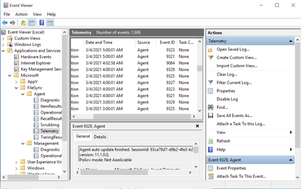

# Deprovision or delete your Azure File Sync server endpoint

Removing a server endpoint means stopping sync to and from that server location with the cloud endpoint (Azure file share) in the same sync group. Before you deprovision your server endpoint, there are a few steps you should take to maintain data integrity and availability. This article covers several methods of deprovisioning and the appropriate guidance, ordered by scenario. Follow the steps for the use case that best applies to you.

If it is ok to permanently lose the data that you are currently syncing, you can skip to directly deprovisioning your server endpoint.

> [!Warning]
> Don't try to resolve sync issues by deprovisioning a server endpoint. For troubleshooting help, see [Troubleshooting Azure File Sync](/troubleshoot/azure/azure-storage/file-sync-troubleshoot?toc=/azure/storage/file-sync/toc.json). Permanent data loss may occur if you delete your server endpoint without getting either the server or the cloud side fully in sync with the other. Removing a server endpoint is a destructive operation, and tiered files within the server endpoint will not be "reconnected" to their locations on the Azure file share after the server endpoint is recreated, which will result in sync errors. Also, tiered files that exist outside of the server endpoint namespace may be permanently lost. Tiered files may exist within your server endpoint even if cloud tiering was never enabled.

## Scenario 1: You intend to delete your server endpoint and stop using your local server / VM

The goal here is to ensure that your data is up to date in your cloud endpoint. To have your complete set of files up to date in your server endpoints instead, see [Scenario 2: You intend to delete your server endpoint and stop using this specific Azure file share](#scenario-2-you-intend-to-delete-your-server-endpoint-and-stop-using-this-specific-azure-file-share).

Some use cases that fall in this category include:
-	Migrate to an Azure file share
-	Going serverless
-	Discontinue use of a specific server endpoint path while keeping the rest of the sync group intact

For this scenario, there are three steps to take before deleting your server endpoint: remove user access, initiate a special VSS upload session, and wait for a final sync session to complete.

### Remove user access to your server endpoint

Before you deprovision your server endpoint, you need to ensure that all changes from the server can sync to the cloud. The first step in allowing the cloud to catch up is to remove the opportunity for more changes to files and folders on the server endpoint. 

Removing access means downtime. To reduce downtime, you can also consider redirecting user access to your cloud endpoint. 

Record the date and time you removed user access for your own records and then move onto the next section.

### Initiate a special Volume Snapshot Service (VSS) upload session

Each day, Azure File Sync creates a temporary VSS snapshot on the server to sync files with open handles. To ensure that your final sync session uploads the latest data and to reduce per-item errors, initiate a special session for VSS upload. This will also trigger a special sync upload session that begins once the snapshot is taken.  

To do so, open **Task Scheduler** on your local server, navigate to **Microsoft\StorageSync**, right-click the `VssSyncScheduledTask` task and select **Run**.

> [!Important]
> Write down the date and time you complete this step. You will need it in the next section.


### Wait for a final sync upload session to complete

To ensure that the latest data is in the cloud, you need to wait for the final sync upload session to complete. 

To check the status of the sync session, open the **Event Viewer** on your local server. Navigate to the telemetry event log **(Applications and Services\Microsoft\FileSync\Agent)**. Ensure that you see a 9102 event with 'sync direction' = upload, 'HResult' = 0 and 'PerItemErrorCount' = 0 that occurred after you manually initiated a VSS upload session.



If 'PerItemErrorCount' is greater than 0, then files are failing to sync. Use the **FileSyncErrorsReport.ps1** to see the files that are failing to sync. This PowerShell script is typically located at this path on a server with an Azure File Sync agent installed: **C:\Program Files\Azure\StorageSyncAgent\FileSyncErrorsReport.ps1**

If these files aren't important, then you can delete your server endpoint. If these files are important, fix their errors and wait for another 9102 event with 'sync direction' = upload, 'HResult' = 0 and 'PerItemErrorCount' = 0 to occur before deleting your server endpoint.

## Scenario 2: You intend to delete your server endpoint and stop using this specific Azure file share

The goal here is to ensure your data is up to date in your local server/VM. To have your complete set of files up to date in your cloud endpoint instead, see [Scenario 1: You intend to delete your server endpoint and stop using your local server/VM](#scenario-1-you-intend-to-delete-your-server-endpoint-and-stop-using-your-local-server--vm).

For this scenario, there are four steps to take before deleting your server endpoint: disable cloud tiering, recall tiered files, initiate cloud change detection, and wait for a final sync session to complete.

### Disable cloud tiering
Navigate to the cloud tiering section in **Server Endpoint Properties** for the server endpoint you would like to deprovision and disable cloud tiering.

### Recall all tiered files
Even if cloud tiering is disabled, you need to recall all tiered files, to be sure that every file is stored locally.

Before you recall any files, make sure that you have enough free space locally to store all your files. Your free space needs to be approximately the size of your Azure file share in the cloud minus the cached size on your server.

Use the **Invoke-StorageSyncFileRecall** PowerShell cmdlet and specify the **SyncGroupName** parameter to recall all files. 
```powershell
Invoke-StorageSyncFileRecall -SyncGroupName "samplesyncgroupname" -ThreadCount 4
```
Once this cmdlet has finished running, you can move onto the next section.

### Initiate cloud change detection
Initiating change detection in the cloud ensures that your latest changes have been synced.

You can initiate change detection with the Invoke-AzStorageSyncChangeDetection cmdlet: 

```powershell
Invoke-AzStorageSyncChangeDetection -ResourceGroupName "myResourceGroup" -StorageSyncServiceName "myStorageSyncServiceName" -SyncGroupName "mySyncGroupName" -CloudEndpointName "myCloudEndpointGUID"
```

This step may take a while to complete. 

> [!Important]
> Once this initiated cloud change detection scan has completed, note down the date and time it completed at. You will need it in the following section.

### Wait for a final sync session to complete
To ensure that your data is up to date on your local server, you need to wait for a final sync upload session to complete. 

To check this, go to **Event Viewer** on your local server. Navigate to the telemetry event log **(Applications and Services\Microsoft\FileSync\Agent)**. Ensure that you see a 9102 event with 'sync direction' = download, 'HResult' = 0 and 'PerItemErrorCount' = 0 that occurred after the date/time cloud change detection finished.


If 'PerItemErrorCount' is greater than 0, then files are failing to sync. Use the **FileSyncErrorsReport.ps1** to see the files that are failing to sync. This PowerShell script is typically located at this path on a server with an Azure File Sync agent installed: **C:\Program Files\Azure\StorageSyncAgent\FileSyncErrorsReport.ps1**

If these files aren't important, then you can delete your server endpoint. If these files are important, fix their errors and wait for another 9102 event with 'sync direction' = download, 'HResult' = 0 and 'PerItemErrorCount' = 0 to occur before deleting your server endpoint.

## Next Steps
* [Modify Azure File Sync topology](./file-sync-modify-sync-topology.md)
