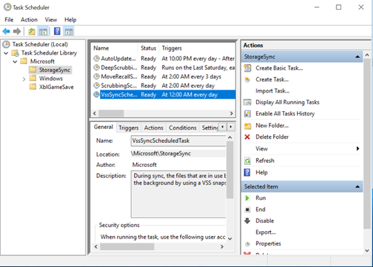
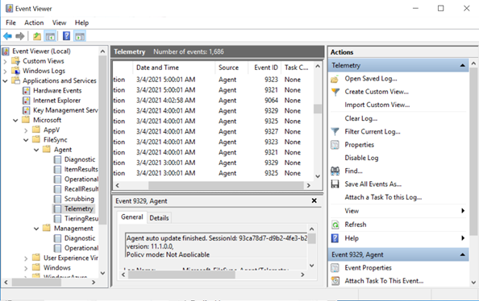

# Deprovision or delete your Azure File Sync server endpoint

Removing a server endpoint stops sync between that server location and the associated Azure file share (the cloud endpoint) in the same sync group. Before you deprovision your server endpoint, there are a few steps you should take to maintain data integrity and availability. This article covers several methods of deprovisioning and provides the appropriate guidance by scenario. Follow the steps for the use case that best applies to you.

If it's ok to permanently lose the data that you're currently syncing, you can skip to directly deprovisioning your server endpoint.

> [!WARNING]
> Don't try to resolve sync issues by deprovisioning a server endpoint. For troubleshooting help, see [Troubleshoot Azure File Sync](/troubleshoot/azure/azure-storage/file-sync-troubleshoot?toc=/azure/storage/file-sync/toc.json). Permanent data loss might occur if you delete your server endpoint without getting either the server or the cloud side fully in sync with the other. Removing a server endpoint is a destructive operation, and tiered files within the server endpoint won't be "reconnected" to their locations on the Azure file share after the server endpoint is recreated. This will cause sync errors. Also, tiered files that exist outside of the server endpoint namespace might be permanently lost. Tiered files might exist within your server endpoint even if you never enabled cloud tiering.

## Scenario 1: I want to delete a server endpoint, and I don't need Azure File Sync server local data

The goal is to make sure your data is up to date in your cloud endpoint. To have your complete set of files up to date in your server endpoints instead, see [Scenario 2](#scenario-2-i-want-to-delete-server-endpoint-and-i-need-the-azure-file-sync-server-to-have-the-entire-dataset).

Some use cases that fall in this category include:

- Migrate to an Azure file share
- Going serverless
- Discontinue use of a specific server endpoint path while keeping the rest of the sync group intact

For this scenario, there are three steps to take before deleting your server endpoint:

1. Remove user access.
1. Initiate a special VSS upload session.
1. Wait for a final sync session to complete.

### Remove user access to your server endpoint

Before deprovisioning, stop user access to the server endpoint so no new file changes occur while the final sync runs. This step gives the cloud a chance to catch up with the current state of your data.

Removing access means downtime. To reduce downtime, consider redirecting user access to your cloud endpoint.

Record the date and time you removed user access, and then move on to the next section.

### Initiate a special Volume Snapshot Service (VSS) upload session

Every day, Azure File Sync creates a temporary VSS snapshot on the server to sync files that are currently open or locked by applications (files with open handles). To make sure your final sync session uploads the latest data and to reduce per-item errors, initiate a special session for VSS upload. This step also triggers a special sync upload session that begins after the snapshot is taken.  

To do so, open **Task Scheduler** on your local server, go to **Microsoft\StorageSync**, right-click the `VssSyncScheduledTask` task, and select **Run**.

> [!IMPORTANT]
> Write down the date and time you complete this step. You'll need it in the next section.



### Wait for a final sync upload session to complete

To make sure the latest data is in the cloud, wait for the final sync upload session to complete.

To check the status of the sync session, open the **Event Viewer** on your local server. Go to the telemetry event log **(Applications and Services\Microsoft\FileSync\Agent)**. Make sure you see a 9102 event with 'sync direction' = upload, 'HResult' = 0 (no errors), and 'PerItemErrorCount' = 0 (all files synced successfully) that occurred after you manually initiated a VSS upload session.



If 'PerItemErrorCount' is greater than 0, then files are failing to sync. Use the **FileSyncErrorsReport.ps1** to see the files that are failing to sync. This PowerShell script is typically located at this path on a server with an Azure File Sync agent installed: **C:\Program Files\Azure\StorageSyncAgent\FileSyncErrorsReport.ps1**

If these files aren't important, then you can delete your server endpoint. If these files are important, fix the errors and wait for another 9102 event with 'sync direction' = upload, 'HResult' = 0 and 'PerItemErrorCount' = 0 to occur before deleting your server endpoint.

## Scenario 2: I want to delete server endpoint, and I need the Azure File Sync server to have the entire dataset

The goal in this scenario is to make sure your data is up to date on your local server or VM. To have your complete set of files up to date in your cloud endpoint instead, see [Scenario 1](#scenario-1-i-want-to-delete-a-server-endpoint-and-i-dont-need-azure-file-sync-server-local-data).

For this scenario, there are four steps to take before deleting your server endpoint:

1. Disable cloud tiering.
1. Recall tiered files.
1. Initiate cloud change detection.
1. Wait for a final sync session to complete.

### Disable Azure File Sync cloud tiering

Go to the cloud tiering section in **Server Endpoint Properties** for the server endpoint you want to deprovision, and disable cloud tiering.

### Recall all tiered files to the local server

Even if cloud tiering is disabled, you must recall all tiered files to be sure that every file is stored locally.

Before you recall any files, make sure that you have enough free space locally to store all your files. Your free space needs to be approximately the size of your Azure file share in the cloud minus the cached size on your server.

Use the `Invoke-StorageSyncFileRecall` PowerShell cmdlet and specify the **SyncGroupName** parameter to recall all files. 

```powershell
Invoke-StorageSyncFileRecall -SyncGroupName "samplesyncgroupname" -ThreadCount 4
```

After this cmdlet finishes running, move on to the next section.

### Initiate cloud change detection

Initiating change detection in the cloud ensures that your latest changes have been synced.

You can initiate change detection with the `Invoke-AzStorageSyncChangeDetection` cmdlet:

```powershell
Invoke-AzStorageSyncChangeDetection -ResourceGroupName "myResourceGroup" -StorageSyncServiceName "myStorageSyncServiceName" -SyncGroupName "mySyncGroupName" -CloudEndpointName "myCloudEndpointGUID"
```

This step might take a while to complete.

> [!IMPORTANT]
> After this initiated cloud change detection scan completes, note the date and time when it completed. You'll need it in the following section.

### Wait for a final sync session to complete

To make sure your data is up to date on your local server, wait for the final sync upload session to complete. 

To check this status, go to **Event Viewer** on your local server. Go to the telemetry event log **(Applications and Services\Microsoft\FileSync\Agent)**. Make sure you see a 9102 event with `sync direction` = download, `HResult` = 0 (no errors), and `PerItemErrorCount` = 0 (all files synced successfully) that occurred after the date and time cloud change detection finished.


If 'PerItemErrorCount' is greater than 0, then files are failing to sync. Use the **FileSyncErrorsReport.ps1** to see the files that are failing to sync. This PowerShell script is typically located at this path on a server with an Azure File Sync agent installed: **C:\Program Files\Azure\StorageSyncAgent\FileSyncErrorsReport.ps1**

If these files aren't important, then you can delete your server endpoint. If these files are important, fix the errors and wait for another 9102 event with 'sync direction' = download, 'HResult' = 0 and 'PerItemErrorCount' = 0 to occur before deleting your server endpoint.

## Next step

- [Modify Azure File Sync topology](./file-sync-modify-sync-topology.md)
