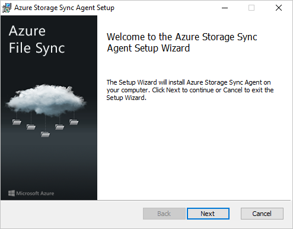
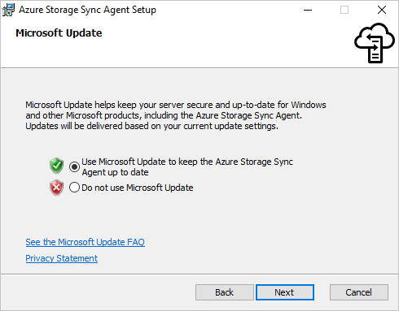
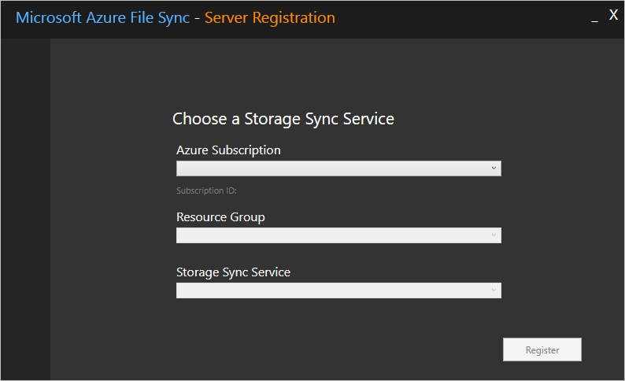

# Manage registered servers with Azure File Sync
Azure File Sync allows you to centralize your organization's file shares in Azure Files without giving up the flexibility, performance, and compatibility of an on-premises file server. It does this by transforming your Windows Servers into a quick cache of your Azure file share. You can use any protocol available on Windows Server to access your data locally (including SMB, NFS, and FTPS) and you can have as many caches as you need across the world.

The following article illustrates how to register and manage a server with a Storage Sync Service. See [How to deploy Azure File Sync](file-sync-deployment-guide.md) for information on how to deploy Azure File Sync end-to-end.

## Register/unregister a server with Storage Sync Service
Registering a server with Azure File Sync establishes a trust relationship between Windows Server and Azure. This relationship can then be used to create *server endpoints* on the server, which represent specific folders that should be synced with an Azure file share (also known as a *cloud endpoint*). 

### Prerequisites
To register a server with a Storage Sync Service, you must first prepare your server with the necessary prerequisites:

* Your server must be running a supported version of Windows Server. For more information, see [Azure File Sync system requirements and interoperability](file-sync-planning.md#windows-file-server-considerations).
* Ensure that a Storage Sync Service has been deployed. For more information on how to deploy a Storage Sync Service, see [How to deploy Azure File Sync](file-sync-deployment-guide.md).
* Ensure that the server is connected to the internet and that Azure is accessible.
* Disable the IE Enhanced Security Configuration for administrators with the Server Manager UI.
    
    

* Ensure that the Azure PowerShell module is installed on your server. If your server is a member of a Failover Cluster, every node in the cluster will require the Az module. More details on how to install the Az module can be found on the [Install and configure Azure PowerShell](/powershell/azure/install-Az-ps).

    > [!Note]  
    > We recommend using the newest version of the Az PowerShell module to register/unregister a server. If the Az package has been previously installed on this server (and the PowerShell version on this server is 5.* or greater), you can use the `Update-Module` cmdlet to update this package. 
* If you utilize a network proxy server in your environment, configure proxy settings on your server for the sync agent to utilize.
    1. Determine your proxy IP address and port number
    2. Edit these two files:
        * C:\Windows\Microsoft.NET\Framework64\v4.0.30319\Config\machine.config
        * C:\Windows\Microsoft.NET\Framework\v4.0.30319\Config\machine.config
    3. Add the lines in figure 1 (beneath this section) under /System.ServiceModel in the above two files changing 127.0.0.1:8888 to the correct IP address (replace 127.0.0.1) and correct port number (replace 8888):
    4. Set the WinHTTP proxy settings via command line:
        * Show the proxy:   netsh winhttp show proxy
        * Set the proxy:    netsh winhttp set proxy 127.0.0.1:8888
        * Reset the proxy:  netsh winhttp reset proxy
        * if this is setup after the agent is installed, then restart our sync agent:
            net stop filesyncsvc
    
```XML
    Figure 1:
    <system.net>
        <defaultProxy enabled="true" useDefaultCredentials="true">
            <proxy autoDetect="false" bypassonlocal="false" proxyaddress="http://127.0.0.1:8888" usesystemdefault="false" />
        </defaultProxy>
    </system.net>
```    

### Register a server with Storage Sync Service
Before a server can be used as a *server endpoint* in an Azure File Sync *sync group*, it must be registered with a *Storage Sync Service*. A server can only be registered with one Storage Sync Service at a time.

#### Install the Azure File Sync agent
1. [Download the Azure File Sync agent](https://go.microsoft.com/fwlink/?linkid=858257).
2. Start the Azure File Sync agent installer.
    
    

3. Be sure to enable updates to the Azure File Sync agent using Microsoft Update. It is important because critical security fixes and feature enhancements to the server package are shipped via Microsoft Update.

    

4. If the server has not been previously registered, the server registration UI will pop up immediately after completing the installation.

> [!Important]  
> If the server is a member of a Failover Cluster, the Azure File Sync agent needs to be installed on every node in the cluster.

#### Register the server using the server registration UI
1. If the server registration UI did not start immediately after completing the installation of the Azure File Sync agent, it can be started manually by executing `C:\Program Files\Azure\StorageSyncAgent\ServerRegistration.exe`.
2. Click *Sign-in* to access your Azure subscription. 

    

3. Pick the correct subscription, resource group, and Storage Sync Service from the dialog.

    

4. In preview, one more sign-in is required to complete the process. 

    

> [!Important]  
> If the server is a member of a Failover Cluster, each server needs to run the Server Registration. When you view the registered servers in the Azure Portal, Azure File Sync automatically recognizes each node as a member of the same Failover Cluster, and groups them together appropriately.

#### Register the server with PowerShell
You can also perform server registration via PowerShell. 

```powershell
Register-AzStorageSyncServer -ResourceGroupName "<your-resource-group-name>" -StorageSyncServiceName "<your-storage-sync-service-name>"
```

### Unregister the server with Storage Sync Service
There are several steps that are required to unregister a server with a Storage Sync Service. Let's take a look at how to properly unregister a server.

> [!Warning]  
> Do not attempt to troubleshoot issues with sync, cloud tiering, or any other aspect of Azure File Sync by unregistering and registering a server, or removing and recreating the server endpoints unless explicitly instructed to by a Microsoft engineer. Unregistering a server and removing server endpoints is a destructive operation, and tiered files on the volumes with server endpoints will not be "reconnected" to their locations on the Azure file share after the registered server and server endpoints are recreated, which will result in sync errors. Also note, tiered files that exist outside of a server endpoint namespace may be permanently lost. Tiered files may exist within server endpoints even if cloud tiering was never enabled.

#### (Optional) Recall all tiered data
If you would like files that are currently tiered to be available after removing Azure File Sync (i.e. this is a production, not a test, environment), recall all files on each volume containing server endpoints. Disable cloud tiering for all server endpoints, and then run the following PowerShell cmdlet:

```powershell
Import-Module "C:\Program Files\Azure\StorageSyncAgent\StorageSync.Management.ServerCmdlets.dll"
Invoke-StorageSyncFileRecall -Path <a-volume-with-server-endpoints-on-it>
```

> [!Warning]  
> If the local volume hosting the server endpoint does not have enough free space to recall all the tiered data, the `Invoke-StorageSyncFileRecall` cmdlet will fail.  

#### Remove the server from all sync groups
Before unregistering the server on the Storage Sync Service, all server endpoints on that server must be removed. This can be done via the Azure portal:

1. Navigate to the Storage Sync Service where your server is registered.
2. Remove all server endpoints for this server in each sync group in the Storage Sync Service. This can be accomplished by right-clicking the relevant server endpoint in the sync group pane.

    

This can also be accomplished with a simple PowerShell script:

```powershell
Connect-AzAccount

$storageSyncServiceName = "<your-storage-sync-service>"
$resourceGroup = "<your-resource-group>"

Get-AzStorageSyncGroup -ResourceGroupName $resourceGroup -StorageSyncServiceName $storageSyncServiceName | ForEach-Object { 
    $syncGroup = $_; 
    Get-AzStorageSyncServerEndpoint -ParentObject $syncGroup | Where-Object { $_.ServerEndpointName -eq $env:ComputerName } | ForEach-Object { 
        Remove-AzStorageSyncServerEndpoint -InputObject $_ 
    } 
}
```

#### Unregister the server
Now that all data has been recalled and the server has been removed from all sync groups, the server can be unregistered. 

1. In the Azure portal, navigate to the *Registered servers* section of the Storage Sync Service.
2. Right-click on the server you want to unregister and click "Unregister Server".

    

## Ensuring Azure File Sync is a good neighbor in your datacenter 
Since Azure File Sync will rarely be the only service running in your datacenter, you may want to limit the network and storage usage of Azure File Sync.

> [!Important]  
> Setting limits too low will impact the performance of Azure File Sync synchronization and recall.

### Set Azure File Sync network limits
You can throttle the network utilization of Azure File Sync by using the `StorageSyncNetworkLimit` cmdlets.

> [!Note]  
> Network limits do not apply when a tiered file is accessed.

For example, you can create a new throttle limit to ensure that Azure File Sync does not use more than 10 Mbps between 9 am and 5 pm (17:00h) during the work week: 

```powershell
Import-Module "C:\Program Files\Azure\StorageSyncAgent\StorageSync.Management.ServerCmdlets.dll"
New-StorageSyncNetworkLimit -Day Monday, Tuesday, Wednesday, Thursday, Friday -StartHour 9 -EndHour 17 -LimitKbps 10000
```

You can see your limit by using the following cmdlet:

```powershell
Get-StorageSyncNetworkLimit # assumes StorageSync.Management.ServerCmdlets.dll is imported
```

To remove network limits, use `Remove-StorageSyncNetworkLimit`. For example, the following command removes all network limits:

```powershell
Get-StorageSyncNetworkLimit | ForEach-Object { Remove-StorageSyncNetworkLimit -Id $_.Id } # assumes StorageSync.Management.ServerCmdlets.dll is imported
```

### Use Windows Server storage QoS 
When Azure File Sync is hosted in a virtual machine running on a Windows Server virtualization host, you can use Storage QoS (storage quality of service) to regulate storage IO consumption. The Storage QoS policy can be set either as a maximum (or limit, like how StorageSyncNetwork limit is enforced above) or as a minimum (or reservation). Setting a minimum instead of a maximum allows Azure File Sync to burst to use available storage bandwidth if other workloads are not using it. For more information, see [Storage Quality of Service](/windows-server/storage/storage-qos/storage-qos-overview).

## See also
- [Planning for an Azure File Sync deployment](file-sync-planning.md)
- [Deploy Azure File Sync](file-sync-deployment-guide.md)
- [Monitor Azure File Sync](file-sync-monitoring.md)
- [Troubleshoot Azure File Sync](file-sync-troubleshoot.md)