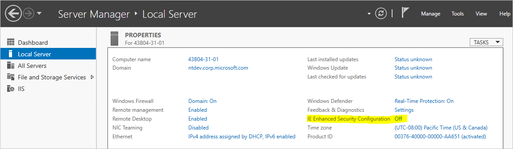
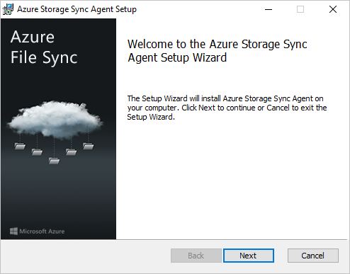
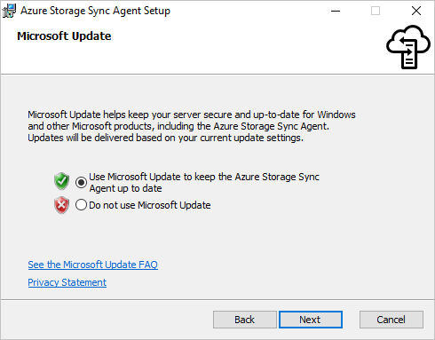
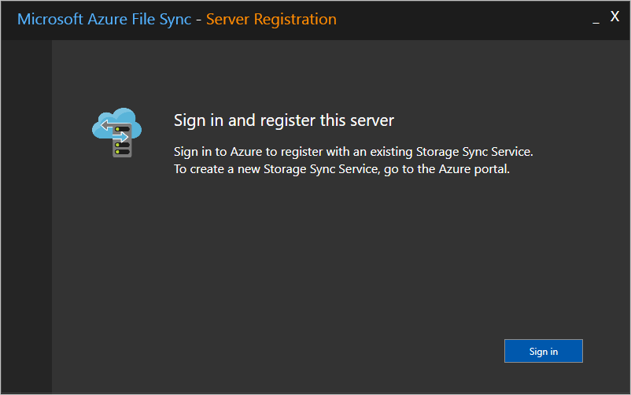
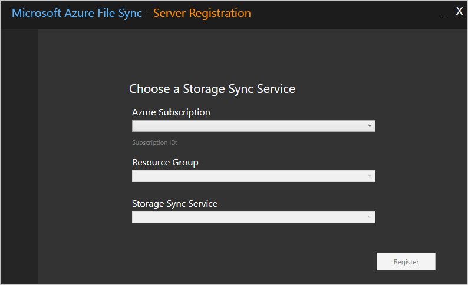

# Register or unregister servers with Azure File Sync

Azure File Sync helps you centralize your organization's file shares in Azure Files without giving up the flexibility, performance, and compatibility of an on-premises file server. It achieves this goal by transforming your Windows Servers into a fast cache of your Azure file share.

This article explains how to register and unregister a server with a Storage Sync Service. When you register a server with Azure File Sync, you create a trust relationship between your Windows Server and Azure. Use this trust relationship to create *server endpoints*, which represent specific folders on your Windows server that you want to sync with an Azure file share. The Azure file share you sync the server endpoint to is called a *cloud endpoint*.

For information about how to deploy Azure File Sync, see [How to deploy Azure File Sync](file-sync-deployment-guide.md).

## Prerequisites

To register a server with a Storage Sync Service, you must first prepare your server with the necessary prerequisites:

* Your server must run a supported version of Windows Server. For more information, see [Azure File Sync system requirements and interoperability](file-sync-planning.md#windows-file-server-considerations).
* Deploy a Storage Sync Service. See [How to deploy Azure File Sync](file-sync-deployment-guide.md).
* Ensure that the server is connected to the internet and that Azure is accessible.
* Disable the IE Enhanced Security Configuration for administrators by using the Server Manager UI.
    
    

* Ensure that the Azure PowerShell module is installed on your server. If your server is a member of a Failover Cluster, every node in the cluster requires the Az module. For details on how to install the Az module, see [Install and configure Azure PowerShell](/powershell/azure/install-azure-powershell). Use the newest version of the Az PowerShell module to register or unregister a server. If the Az package is already installed on this server and the PowerShell version on this server is 5.x or greater, you can use the `Update-Module` cmdlet to update this package.

* If you use a network proxy server in your environment, configure proxy settings on your server for the sync agent to use.
    1. Determine your proxy IP address and port number.
    1. Edit these two files:
        * C:\Windows\Microsoft.NET\Framework64\v4.0.30319\Config\machine.config
        * C:\Windows\Microsoft.NET\Framework\v4.0.30319\Config\machine.config
    1. Add the lines in Figure 1 under `/System.ServiceModel` in the two machine.config files. Change `127.0.0.1:8888` to the correct IP address and port number.

       ```xml
           Figure 1:
           <system.net>
               <defaultProxy enabled="true" useDefaultCredentials="true">
                   <proxy autoDetect="false" bypassonlocal="false" proxyaddress="http://127.0.0.1:8888" usesystemdefault="false" />
               </defaultProxy>
           </system.net>
       ```   

    1. Set the WinHTTP proxy settings by using the command line:
        * Show the proxy:   `netsh winhttp show proxy`
        * Set the proxy:    `netsh winhttp set proxy 127.0.0.1:8888`
        * Reset the proxy:  `netsh winhttp reset proxy`
        * If you set up this proxy after the agent is installed, restart the sync agent: `net stop filesyncsvc`
    
## Register a server with Storage Sync Service

Before you can use a server as a server endpoint in an Azure File Sync *sync group*, register the server with a Storage Sync Service. You can register a server with only one Storage Sync Service at a time.

### Install the Azure File Sync agent

1. [Download the Azure File Sync agent](https://go.microsoft.com/fwlink/?linkid=858257).

1. Start the Azure File Sync agent installer.
    
    

1. Enable updates to the Azure File Sync agent through Microsoft Update. This step is important because critical security fixes and feature enhancements to the server package are delivered through Microsoft Update.

    

1. If you didn't previously register the server, the server registration UI appears immediately after completing the installation.

> [!IMPORTANT]  
> If the server is a member of a Failover Cluster, the Azure File Sync agent must be installed on every node in the cluster.

### Register the server

Register the server by using the server registration UI or Azure PowerShell.

# [Server registration UI](#tab/azure-portal)

Follow these steps to register the server by using the server registration UI.

If the server is a member of a Failover Cluster, each server in the cluster must run the server registration. When you view the registered servers in the Azure portal, Azure File Sync automatically recognizes each node as a member of the same Failover Cluster, and groups them together appropriately.

1. If the server registration UI didn't start immediately after completing the installation of the Azure File Sync agent, start it manually by running `C:\Program Files\Azure\StorageSyncAgent\ServerRegistration.exe`.

1. Select **Sign-in** to access your Azure subscription.

    

1. Select the correct subscription, resource group, and Storage Sync Service from the dialog.

    

   If `ServerRegistration.exe` fails or times out during registration, set the `ARM_CLOUD_METADATA_URL` environment variable and try registering again. Replace `<domain>` with the value for your cloud:

   | **Cloud** | **Domain** |
   |-------|--------|
   | Public | azure.com |
   | Mooncake | chinacloudapi.cn |
   | Fairfax | usgovcloudapi.net |

   ```powershell
   [System.Environment]::SetEnvironmentVariable('ARM_CLOUD_METADATA_URL', 'https://management.<domain>/metadata/endpoints?api-version=2019-05-01', 'machine')

1. You might be prompted to sign into Azure again to complete the registration process.

# [PowerShell](#tab/azure-powershell)

Run the following Azure PowerShell cmdlet. Replace the placeholders with the correct values for your environment.

```powershell
Register-AzStorageSyncServer -ResourceGroupName "<your-resource-group-name>" -StorageSyncServiceName "<your-storage-sync-service-name>"
```

---

## Unregister a server with Storage Sync Service

To unregister a server with a Storage Sync Service, complete the following steps.

> [!WARNING]  
> Don't try to troubleshoot problems with sync, cloud tiering, or any other aspect of Azure File Sync by unregistering and registering a server, or removing and recreating the server endpoints unless a Microsoft engineer explicitly instructs you to do so. Unregistering a server and removing server endpoints is a destructive operation. Tiered files on the volumes with server endpoints aren't "reconnected" to their locations on the Azure file share after the registered server and server endpoints are recreated. This situation results in sync errors. Tiered files that exist outside a server endpoint namespace might be permanently lost. Tiered files might exist within server endpoints even if you never enabled cloud tiering.

### Recall all tiered data (optional)

If you want files that are currently tiered to be available after removing Azure File Sync (for example, this is a production environment, not a test environment), recall all files on each volume containing server endpoints. Disable cloud tiering for all server endpoints, and then run the following PowerShell cmdlets:

```powershell
Import-Module "C:\Program Files\Azure\StorageSyncAgent\StorageSync.Management.ServerCmdlets.dll"
Invoke-StorageSyncFileRecall -Path <a-volume-with-server-endpoints-on-it>
```

> [!WARNING]  
> If the local volume hosting the server endpoint doesn't have enough free space to recall all the tiered data, the `Invoke-StorageSyncFileRecall` cmdlet fails.  

### Remove the server from all sync groups

Before unregistering the server on the Storage Sync Service, remove all server endpoints on that server.

# [Portal](#tab/azure-portal)

1. Go to the Storage Sync Service where your server is registered.
1. Remove all server endpoints for this server in each sync group in the Storage Sync Service. To remove server endpoints, right-click the relevant server endpoint in the sync group pane.

   :::image type="content" source="media/storage-sync-files-server-registration/sync-group-server-endpoint-remove.png" alt-text="Screenshot showing how to remove a server endpoint from a sync group.":::

# [PowerShell](#tab/azure-powershell)

```powershell
Connect-AzAccount

$storageSyncServiceName = "<your-storage-sync-service>"
$resourceGroup = "<your-resource-group>"

Get-AzStorageSyncGroup -ResourceGroupName $resourceGroup -StorageSyncServiceName $storageSyncServiceName | ForEach-Object { 
    $syncGroup = $_; 
    Get-AzStorageSyncServerEndpoint -ParentObject $syncGroup | Where-Object { $_.ServerEndpointName -eq $env:ComputerName } | ForEach-Object { 
        Remove-AzStorageSyncServerEndpoint -InputObject $_ 
    } 
}
```

---

### Unregister the server

After recalling all data and removing the server from all sync groups, unregister the server.

# [Portal](#tab/azure-portal)

1. In the Azure portal, go to the Storage Sync Service and select **Sync** > **Registered servers**.
1. Right-click the server you want to unregister and select **Unregister Server**.

   :::image type="content" source="media/storage-sync-files-server-registration/unregister-server.png" alt-text="Screenshot showing how to unregister a server.":::

# [PowerShell](#tab/azure-powershell)

> [!WARNING]  
> Unregistering a server results in cascading deletes of all server endpoints on the server. Only run this cmdlet if you're certain that no path on the server is to be synced anymore.

```powershell
$RegisteredServer = Get-AzStorageSyncServer -ResourceGroupName "<your-resource-group-name>" -StorageSyncServiceName "<your-storage-sync-service-name>"
Unregister-AzStorageSyncServer -Force -ResourceGroupName "<your-resource-group-name>" -StorageSyncServiceName "<your-storage-sync-service-name>" -ServerId $RegisteredServer.ServerId
```

---

## Manage Azure File Sync network and storage usage

Because Azure File Sync is rarely the only service running in your data center, you might want to limit the network and storage usage of Azure File Sync.

> [!IMPORTANT]  
> Setting limits too low will impact the performance of Azure File Sync synchronization and recall.

### Set Azure File Sync network limits

You can throttle the network utilization of Azure File Sync by using the `StorageSyncNetworkLimit` cmdlets.

> [!NOTE]  
> Network limits don't apply to the following scenarios:
> - Accessing a tiered file
> - Sync metadata exchanged between the registered server and Storage Sync Service
>  
> Because this network traffic isn't throttled, Azure File Sync might exceed the network limit you configured. Monitor the network traffic and adjust the limit to account for the network traffic that isn't throttled.

For example, you can create a new throttle limit to ensure that Azure File Sync doesn't use more than 10 Mbps between 9 am and 5 pm (17:00h) during the work week:

```powershell
Import-Module "C:\Program Files\Azure\StorageSyncAgent\StorageSync.Management.ServerCmdlets.dll"
New-StorageSyncNetworkLimit -Day Monday, Tuesday, Wednesday, Thursday, Friday -StartHour 9 -EndHour 17 -LimitKbps 10000
```

> [!NOTE]  
> To apply the network limit for 24 hours, use 0 for the `-StartHour` and `-EndHour` parameters.

You can see your limit by running the following cmdlet:

```powershell
Get-StorageSyncNetworkLimit # assumes StorageSync.Management.ServerCmdlets.dll is imported
```

To remove network limits, run the `Remove-StorageSyncNetworkLimit` cmdlet. For example, the following command removes all network limits:

```powershell
Get-StorageSyncNetworkLimit | ForEach-Object { Remove-StorageSyncNetworkLimit -Id $_.Id } # assumes StorageSync.Management.ServerCmdlets.dll is imported
```

### Use Windows Server storage QoS

When Azure File Sync is hosted in a virtual machine running on a Windows Server virtualization host, you can use Storage QoS (storage quality of service) to regulate storage IO consumption. You can set the Storage QoS policy either as a maximum (or limit, such as how `StorageSyncNetworkLimit` is enforced in the previous example) or as a minimum (or reservation). Setting a minimum instead of a maximum allows Azure File Sync to burst to use available storage bandwidth if other workloads aren't using it. For more information, see [Storage Quality of Service](/windows-server/storage/storage-qos/storage-qos-overview).

## See also

- [Plan for an Azure File Sync deployment](file-sync-planning.md)
- [Deploy Azure File Sync](file-sync-deployment-guide.md)
- [Monitor Azure File Sync](file-sync-monitoring.md)
- [Troubleshoot Azure File Sync](/troubleshoot/azure/azure-storage/file-sync-troubleshoot?toc=/azure/storage/file-sync/toc.json)
