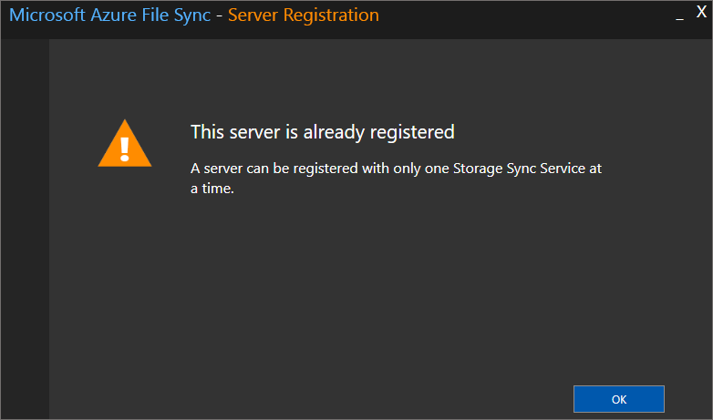

# Troubleshoot Azure File Sync agent installation and server registration

After deploying the Storage Sync Service, the next steps in deploying Azure File Sync are installing the Azure File Sync agent and registering Windows Server with the Storage Sync Service. This article is designed to help you troubleshoot and resolve issues that you might encounter during these steps.

## Agent installation
<a id="agent-installation-failures"></a>**Troubleshoot agent installation failures**  
If the Azure File Sync agent installation fails, at an elevated command prompt, run the following command to turn on logging during agent installation:

```
StorageSyncAgent.msi /l*v AFSInstaller.log
```

Review installer.log to determine the cause of the installation failure.

<a id="agent-installation-gpo"></a>**Agent installation fails with error: Storage Sync Agent Setup Wizard ended prematurely because of an error**

In the agent installation log, the following error is logged:

```
CAQuietExec64:  + CategoryInfo          : SecurityError: (:) , PSSecurityException
CAQuietExec64:  + FullyQualifiedErrorId : UnauthorizedAccess
CAQuietExec64:  Error 0x80070001: Command line returned an error.
```

This issue occurs if the [PowerShell execution policy](/powershell/module/microsoft.powershell.core/about/about_execution_policies#use-group-policy-to-manage-execution-policy) is configured using group policy and the policy setting is "Allow only signed scripts." All scripts included with the Azure File Sync agent are signed. The Azure File Sync agent installation fails because the installer is performing the script execution using the Bypass execution policy setting.

To resolve this issue, temporarily disable the [Turn on Script Execution](/powershell/module/microsoft.powershell.core/about/about_execution_policies#use-group-policy-to-manage-execution-policy) group policy setting on the server. Once the agent installation completes, the group policy setting can be re-enabled.

<a id="agent-installation-on-DC"></a>**Agent installation fails on Active Directory Domain Controller**  
If you try to install the sync agent on an Active Directory domain controller where the PDC role owner is on a Windows Server 2008 R2 or below OS version, you may hit the issue where the sync agent will fail to install.

To resolve, transfer the PDC role to another domain controller running Windows Server 2012 R2 or more recent, then install sync.

<a id="parameter-is-incorrect"></a>**Accessing a volume on Windows Server 2012 R2 fails with error: The parameter is incorrect**  
After creating a server endpoint on Windows Server 2012 R2, the following error occurs when accessing the volume:

drive letter:\ is not accessible.  
The parameter is incorrect.

To resolve this issue, install [KB2919355](https://support.microsoft.com/help/2919355/windows-rt-8-1-windows-8-1-windows-server-2012-r2-update-april-2014) and restart the server. If this update will not install because a later update is already installed, go to Windows Update, install the latest updates for Windows Server 2012 R2 and restart the server.

## Server registration

<a id="server-registration-missing-subscriptions"></a>**Server Registration does not list all Azure Subscriptions**  
When registering a server using ServerRegistration.exe, subscriptions are missing when you click the Azure Subscription drop-down.

This issue occurs because ServerRegistration.exe will only retrieve subscriptions from the first five Azure AD tenants. 

To increase the Server Registration tenant limit on the server, create a DWORD value called ServerRegistrationTenantLimit under HKEY_LOCAL_MACHINE\SOFTWARE\Microsoft\Azure\StorageSync with a value greater than 5.

You can also work around this issue by using the following PowerShell commands to register the server:

```powershell
Connect-AzAccount -Subscription "<guid>" -Tenant "<guid>"
Register-AzStorageSyncServer -ResourceGroupName "<your-resource-group-name>" -StorageSyncServiceName "<your-storage-sync-service-name>"
```

<a id="server-registration-prerequisites"></a>**Server Registration displays the following message: "Pre-requisites are missing"**  
This message appears if Az or AzureRM PowerShell module is not installed on PowerShell 5.1. 

> [!Note]  
> ServerRegistration.exe does not support PowerShell 6.x. You can use the Register-AzStorageSyncServer cmdlet on PowerShell 6.x to register the server.

To install the Az or AzureRM module on PowerShell 5.1, perform the following steps:

1. Type **powershell** from an elevated command prompt and hit enter.
2. Install the latest Az or AzureRM module by following the documentation:
    - [Az module (requires .NET 4.7.2)](/powershell/azure/install-az-ps)
    - [AzureRM module](https://go.microsoft.com/fwlink/?linkid=856959)
3. Run ServerRegistration.exe, and complete the wizard to register the server with a Storage Sync Service.

<a id="server-already-registered"></a>**Server Registration displays the following message: "This server is already registered"** 



This message appears if the server was previously registered with a Storage Sync Service. To unregister the server from the current Storage Sync Service and then register with a new Storage Sync Service, complete the steps that are described in [Unregister a server with Azure File Sync](file-sync-server-registration.md#unregister-the-server-with-storage-sync-service).

If the server is not listed under **Registered servers** in the Storage Sync Service, on the server that you want to unregister, run the following PowerShell commands:

```powershell
Import-Module "C:\Program Files\Azure\StorageSyncAgent\StorageSync.Management.ServerCmdlets.dll"
Reset-StorageSyncServer
```

> [!Note]  
> If the server is part of a cluster, use the Reset-StorageSyncServer -CleanClusterRegistration parameter to remove the server from the Azure File Sync cluster registration detail.

<a id="web-site-not-trusted"></a>**When I register a server, I see numerous "web site not trusted" responses. Why?**  
This issue occurs when the **Enhanced Internet Explorer Security** policy is enabled during server registration. For more information about how to correctly disable the **Enhanced Internet Explorer Security** policy, see [Prepare Windows Server to use with Azure File Sync](file-sync-deployment-guide.md#prepare-windows-server-to-use-with-azure-file-sync) and [How to deploy Azure File Sync](file-sync-deployment-guide.md).

<a id="server-registration-missing"></a>**Server is not listed under registered servers in the Azure portal**  
If a server is not listed under **Registered servers** for a Storage Sync Service:
1. Sign in to the server that you want to register.
2. Open File Explorer, and then go to the Storage Sync Agent installation directory (the default location is C:\Program Files\Azure\StorageSyncAgent). 
3. Run ServerRegistration.exe, and complete the wizard to register the server with a Storage Sync Service.

## See also
- [Troubleshoot Azure File Sync sync group management](file-sync-troubleshoot-sync-group-management.md)
- [Troubleshoot Azure File Sync sync errors](file-sync-troubleshoot-sync-errors.md)
- [Troubleshoot Azure File Sync cloud tiering](file-sync-troubleshoot-cloud-tiering.md)
- [Monitor Azure File Sync](file-sync-monitoring.md)
- [Troubleshoot Azure Files problems in Windows](../files/storage-troubleshoot-windows-file-connection-problems.md)
- [Troubleshoot Azure Files problems in Linux](../files/storage-troubleshoot-linux-file-connection-problems.md)
