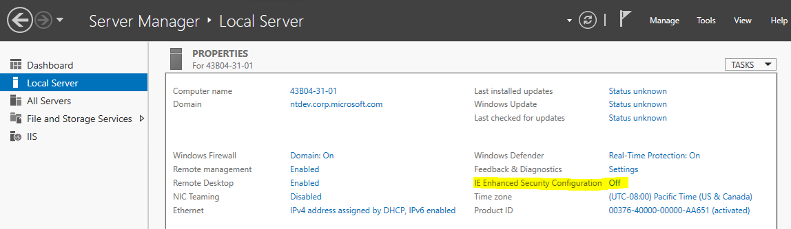
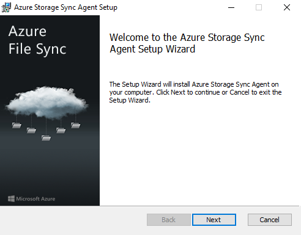
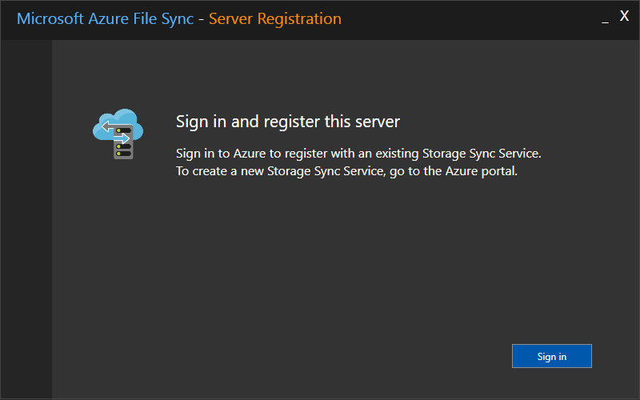
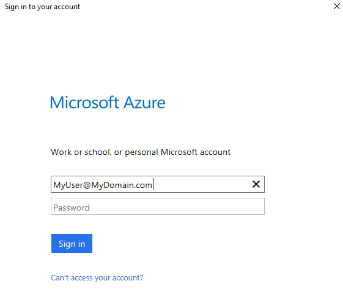
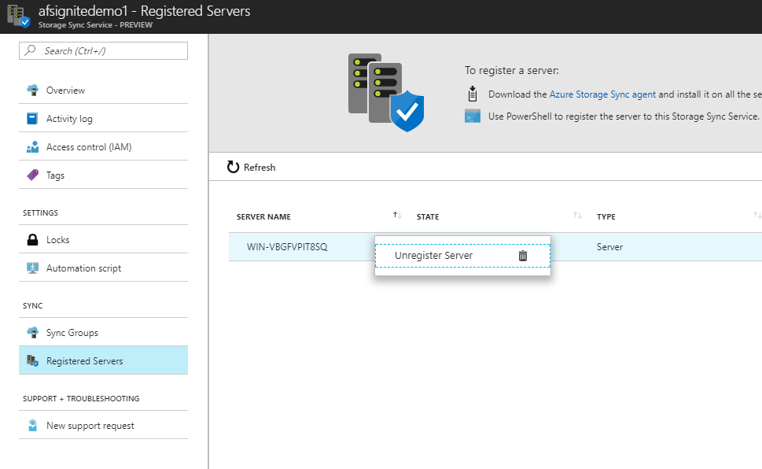

# Register/unregister a server with Azure File Sync (preview)
With Azure File Sync (preview), shares can be replicated to Windows Servers on-premises or in Azure. You and your users would then access the file share through the Windows Server, such as through a SMB or NFS share. This is particularly useful for scenarios in which data will be accessed and modified far away from an Azure datacenter, such as in a branch office scenario. Data may be replicated between multiple Windows Server endpoints, such as between multiple branch offices. 

Before a Windows Server can be used as a *Server Endpoint* in an Azure File Sync *Sync Group*, it must be registered with a *Storage Sync Service*. Note that a server can only be registered with one *Storage Sync Service* at a time.

## Prerequisites
To register a Windows Server with a Storage Sync Service, you must first prepare a Windows Server with the necessary prerequisites:

* Ensure that the server is connected to the internet and that Azure is accessible.
* Disable the IE Enhanced Security Configuration for administrators with the Server Manager UI.
    
    

* Ensure that the AzureRM PowerShell module is installed on your server. If your server is a member of a Failover Cluster, every node in the cluster will require the AzureRM module. More details on how to install the AzureRM module can be found on the [Install and configure Azure PowerShell](https://docs.microsoft.com/powershell/azure/install-azurerm-ps).

    > [!Note]  
    > We recommend using the newest version of the AzureRM PowerShell module to register/unregister a server. If the AzureRM pacakage has been previously installed on this server (and the PowerShell version on this server is 5.* or greater), you can use the `Update-Module` cmdlet to update this package. 

## Register a server with Storage Sync Service
### Install the Azure File Sync agent
1. [Download the Azure File Sync agent](https://go.microsoft.com/fwlink/?linkid=858257).
2. Start the Azure File Sync agent installer.
    
    

3. Be sure to enable updates to the Azure File Sync agent via Microsoft Update. This is important because critical security fixes and feature enhancements to the server package are shipped via Microsoft Update.

    

4. If the server has not been previously registered, the server registration UI will pop-up immediately after completing the installation.

> [!Important]  
> If the server is a member of a Failover Cluster, the Azure File Sync agent will need to be installed on every node in the cluster.

### Register the Server using the Server Registration UI
1. If the Server Registration UI did not start immediately after completing the installation of the Azure File Sync agent, it can be started manually by executing `C:\Program Files\Azure\StorageSyncAgent\ServerRegistration.exe`.
2. Click *Sign in* to access your Azure subscription. 

    

3. Pick the correct subscription, resource group, and Storage Sync Service from the dialog.

    

4. In preview, one more sign in is required to complete the process. 

    

> [!Important]  
> If the server is a member of a Failover Cluster, each server will need to run the Server Registration. Azure File Sync will automatically recognize each node as a member of the same Failover Cluster, and will group them together.

## Unregister the server with Storage Sync Service
### (Optional) Recall all tiered data
When enabled for a Server Endpoint, cloud tiering will *tier* files to your Azure File shares. This enables on-premises file shares to act as a cache, rather than a complete copy of the dataset, to make efficient use of the space on the file server. However, if a Server Endpoint is removed with tiered files still locally on the server, those files will become unaccessible. Therefore, if continued file access is desired, you must recall all tiered files from Azure Files before continuing with deregistration. 

This can be done with the simple PowerShell cmdlet as shown below:

```PowerShell
Import-Module "C:\Program Files\Azure\StorageSyncAgent\StorageSync.Management.ServerCmdlets.dll"
Invoke-StorageSyncFileRecall -Path <path-to-to-your-server-endpoint>
```

> [!Warning]  
> If the local volume hosting the Server, does not have enough free space to recall all the tiered data, the `Invoke-StorageSyncFileRecall` cmdlet will fail.  

### Remove the server from all Sync Groups
Before unregistering the server on the Storage Sync Service, all Server Endpoints for that server must be removed. This can be done via the Portal:

1. Navigate to the Storage Sync Service where your server is registered.
2. Remove all Server Endpoints for this server in each Sync Group in the Storage Sync Service. This can be accomplished by right-clicking the relevant Server Endpoint in the Sync Group pane.

    

This can also be accomplished with a simple PowerShell script:

```PowerShell
Import-Module "C:\Program Files\Azure\StorageSyncAgent\StorageSync.Management.PowerShell.Cmdlets.dll"

$accountInfo = Login-AzureRmAccount
Login-AzureRmStorageSync -SubscriptionId $accountInfo.Context.Subscription.Id -TenantId $accountInfo.Context.Tenant.Id -ResourceGroupName "<your-resource-group>"

$StorageSyncService = "<your-storage-sync-service>"

Get-AzureRmStorageSyncGroup -StorageSyncServiceName $StorageSyncService | ForEach-Object { 
    $SyncGroup = $_; 
    Get-AzureRmStorageSyncServerEndpoint -StorageSyncServiceName $StorageSyncService -SyncGroupName $SyncGroup.Name | Where-Object { $_.DisplayName -eq $env:ComputerName } | ForEach-Object { 
        Remove-AzureRmStorageSyncServerEndpoint -StorageSyncServiceName $StorageSyncService -SyncGroupName $SyncGroup.Name -ServerEndpointName $_.Name 
    } 
}
```

### Unregister the server
Now that all data has been recalled and the server has been removed from all Sync Groups, the server can be unregistered. 

1. In the Azure Portal, navigate the "Registered Servers" section of the Storage Sync Service.
2. Right-click on the server you want to unregister and click "Unregister Server".

    

### See also
* [Add/remove an Azure File Sync Server Endpoint](azure-file-sync-server-endpoint.md)
* [Monitor Azure File Sync health](azure-file-sync-health-monitoring.md)