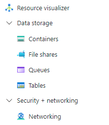

# Create an Azure classic file share

Before you create an Azure classic file share, you need to answer two questions about how you want to use it:

- **What are the performance requirements for your file share?**  
   Azure classic file shares offer two different media tiers of storage, SSD (premium) and HDD (standard), which enable you to tailor your file shares to the performance and price requirements of your scenario. SSD file shares provide consistent high performance and low latency, within single-digit milliseconds for most IO operations. HDD file shares provide cost-effective storage for general purpose use.

- **What are the redundancy requirements for your Azure file share?**  
   Azure Files offers Local (LRS), Zone (ZRS), Geo (GRS), and GeoZone (GZRS) redundancy options for standard SMB file shares. SSD file shares are only available for the LRS and ZRS redundancy types. See [Azure Files redundancy](./files-redundancy.md) for more information.

For more information on these choices, see [Planning for an Azure Files deployment](storage-files-planning.md).

## Applies to

| Management model     | Billing model  | Media tier     | Redundancy     |               SMB                   |                 NFS                 |
|----------------------|----------------|----------------|----------------|:-----------------------------------:|:-----------------------------------:|
| Microsoft.FileShares | Provisioned v2 | SSD (premium)  | Local (LRS)    |    |  |
| Microsoft.FileShares | Provisioned v2 | SSD (premium)  | Zone (ZRS)     |    |  |
| Microsoft.Storage    | Provisioned v2 | SSD (premium)  | Local (LRS)    |  |  |
| Microsoft.Storage    | Provisioned v2 | SSD (premium)  | Zone (ZRS)     |  |  |
| Microsoft.Storage    | Provisioned v2 | HDD (standard) | Local (LRS)    |  |    |
| Microsoft.Storage    | Provisioned v2 | HDD (standard) | Zone (ZRS)     |  |    |
| Microsoft.Storage    | Provisioned v2 | HDD (standard) | Geo (GRS)      |  |    |
| Microsoft.Storage    | Provisioned v2 | HDD (standard) | GeoZone (GZRS) |  |    |
| Microsoft.Storage    | Provisioned v1 | SSD (premium)  | Local (LRS)    |  |  |
| Microsoft.Storage    | Provisioned v1 | SSD (premium)  | Zone (ZRS)     |  |  |
| Microsoft.Storage    | Pay-as-you-go  | HDD (standard) | Local (LRS)    |  |    |
| Microsoft.Storage    | Pay-as-you-go  | HDD (standard) | Zone (ZRS)     |  |    |
| Microsoft.Storage    | Pay-as-you-go  | HDD (standard) | Geo (GRS)      |  |    |
| Microsoft.Storage    | Pay-as-you-go  | HDD (standard) | GeoZone (GZRS) |  |    |

## Prerequisites

- This article assumes that you have an Azure subscription. If you don't have an Azure subscription, then create a [free account](https://azure.microsoft.com/pricing/purchase-options/azure-account?cid=msft_learn) before you begin.
- If you intend to use Azure PowerShell, [install the latest version](/powershell/azure/install-azure-powershell).
- If you intend to use Azure CLI, [install the latest version](/cli/azure/install-azure-cli).

## Create a storage account

Azure classic file shares are deployed into _storage accounts_, which are top-level objects that represent a shared pool of storage. This pool of storage can be used to deploy multiple file shares.

Storage accounts have two properties, kind and SKU, which dictate the billing model, media tier, and redundancy of the file shares deployed in the storage account. For Azure Files, there are three main combinations of kind and SKU to consider:

| Media tier  | Billing model                                                     | Storage account kind | Storage account SKUs                                                                                                                               |
| ----------- | ----------------------------------------------------------------- | -------------------- | -------------------------------------------------------------------------------------------------------------------------------------------------- |
| SSD and HDD | [Provisioned v2](./understanding-billing.md#provisioned-v2-model) | FileStorage          | <ul><li>PremiumV2_LRS</li><li>PremiumV2_ZRS</li><li>StandardV2_LRS</li><li>StandardV2_ZRS</li><li>StandardV2_GRS</li><li>StandardV2_GZRS</li></ul> |
| SSD         | [Provisioned v1](./understanding-billing.md#provisioned-v1-model) | FileStorage          | <ul><li>Premium_LRS</li><li>Premium_ZRS</li></ul>                                                                                                  |
| HDD         | [Pay-as-you-go](./understanding-billing.md#pay-as-you-go-model)   | StorageV2            | <ul><li>Standard_LRS</li><li>Standard_ZRS</li><li>Standard_GRS</li><li>Standard_GZRS</li></ul>                                                     |

We recommended the provisioned v2 billing model for all new file share deployments. The provisioned v1 and pay-as-you-go billing models remain fully supported for new and existing deployments. Provisioned v2 file shares are currently available in most regions. See [provisioned v2 availability](./understanding-billing.md#provisioned-v2-availability) for more information.

# [Portal](#tab/azure-portal)

To create a storage account via the Azure portal, use the search box at the top of the Azure portal to search for **storage accounts** and select the matching result.


This shows a list of all existing storage accounts available in your visible subscriptions. Select **+ Create** to create a new storage account.

### Basics

The first tab to complete creating a storage account is labeled **Basics**, which contains the required fields to create a storage account.


| Field name                                                               | Input type         | Values                                                                                                                                                               | Applicable to Azure Files            | Meaning                                                                                                                                                                                                                                                                                                                                                                                         |
| ------------------------------------------------------------------------ | ------------------ | -------------------------------------------------------------------------------------------------------------------------------------------------------------------- | ------------------------------------ | ----------------------------------------------------------------------------------------------------------------------------------------------------------------------------------------------------------------------------------------------------------------------------------------------------------------------------------------------------------------------------------------------- |
| Subscription                                                             | Drop-down list     | _Available Azure subscriptions_                                                                                                                                      | Yes                                  | The selected subscription in which to deploy the storage account. The number of storage accounts per subscription is limited, so to deploy a new storage account into a selected subscription, if it has fewer storage accounts deployed than the subscription limit. See [storage account scale targets](./storage-files-scale-targets.md#storage-account-data-plane-limits) for more information. |
| Resource group                                                           | Drop-down list     | _Available resource groups in selected subscription_                                                                                                                 | Yes                                  | The resource group in which to deploy the storage account. A resource group is a logical container for organizing for Azure resources, including storage accounts.                                                                                                                                                                                                                              |
| Storage account name                                                     | Text box           | --                                                                                                                                                                   | Yes                                  | The name of the storage account resource to be created. This name must be globally unique. The storage account name is used as the server name when you mount an Azure file share via SMB. Storage account names must be between 3 and 24 characters in length. They may contain numbers and lowercase letters only.                                                                            |
| Region                                                                   | Drop-down list     | _Available Azure regions_                                                                                                                                            | Yes                                  | The region for the storage account to be deployed into. This can be the region associated with the resource group, or any other available region.                                                                                                                                                                                                                                               |
| Primary service                                                          | Drop-down list     | <ul><li>Azure Blob Storage or Azure Data Lake Storage Gen 2</li><li>**Azure Files**</li><li>Other (tables and queues)</li></ul>                                      | Only unpopulated and **Azure Files** | The service for which you're creating the storage account, in this case **Azure Files**. This field is optional, however, you can't select the provisioned v2 billing model unless you select **Azure Files** from the list.                                                                                                                                                                    |
| Performance                                                              | Radio button group | <ul><li>Standard</li><li>Premium</li></ul>                                                                                                                           | Yes                                  | The media tier of the storage account. Select **Standard** for an HDD storage account and **Premium** for an SSD storage account.                                                                                                                                                                                                                                                               |
| File share billing                                                       | Radio button group | <ul><li>Standard<ul><li>Pay-as-you-go</li><li>Provisioned v2</li></ul></li><li>Premium<ul><li>Provisioned v1</li></ul></li></ul>                                     | Yes                                  | The billing model desired for your scenario. We recommend provisioned v2 for all new deployments, although the provisioned v1 and pay-as-you-go billing models are still supported.                                                                                                                                                                                                             |
| Redundancy                                                               | Drop-down list     | <ul><li>Locally redundant storage (LRS)</li><li>Geo-redundant storage (GRS)</li><li>Zone-redundant storage (ZRS)</li><li>Geo-zone-redundant storage (GZRS)</li></ul> | Yes                                  | The redundancy choice for the storage account. See [Azure Files redundancy](./files-redundancy.md) for more information.                                                                                                                                                                                                                                                                        |
| Make read access to data available in the event of region unavailability | Checkbox           | Checked/unchecked                                                                                                                                                    | No                                   | This setting only appears if you select the pay-as-you-go billing model with the Geo or GeoZone redundancy types. Azure Files doesn't support read access to data in the secondary region without a failover regardless of the status of this setting.                                                                                                                                          |

### Advanced

The **Advanced** tab is optional, but provides more granular settings for the storage account. The first section relates to **Security** settings.


| Field name                                                   | Input type     | Values                       | Applicable to Azure Files | Meaning                                                                                                                                                                                                                                                                                                                                                                            |
| ------------------------------------------------------------ | -------------- | ---------------------------- | ------------------------- | ---------------------------------------------------------------------------------------------------------------------------------------------------------------------------------------------------------------------------------------------------------------------------------------------------------------------------------------------------------------------------------- |
| Require secure transfer for REST API operations              | Checkbox       | Checked/unchecked            | Yes                       | This setting indicates that this applies to REST API operations, but it applies to SMB and NFS for Azure Files as well. If you plan to deploy NFS file shares in your storage account, or you have clients that need access to unencrypted SMB (such as SMB 2.1), uncheck this checkbox.                                                                                           |
| Allow enabling anonymous access on individual containers     | Checkbox       | Checked/unchecked            | No                        | This setting controls whether Azure Blob storage containers are allowed to be accessed with anonymous access. This setting doesn't apply to Azure Files. This setting is available for FileStorage storage accounts containing provisioned v1 or provisioned v2 file shares even though it isn't possible to create Azure Blob storage containers in FileStorage storage accounts. |
| Enable storage account key access                            | Checkbox       | Checked/unchecked            | Yes                       | This setting controls whether the storage account keys (also referred to as shared keys) are enabled. When enabled, storage account keys can be used to mount the file share using SMB or to access the share using the FileREST API.                                                                                                                                              |
| Default to Microsoft Entra authorization in the Azure portal | Checkbox       | Checked/unchecked            | Yes                       | This setting controls whether the user's Microsoft Entra (formerly Azure AD) identity is used when browsing the file share in the Azure portal.                                                                                                                                                                                                                                    |
| Minimum TLS version                                          | Drop-down list | _Supported TLS versions_     | Yes                       | This setting controls the minimum allowed TLS version that's used for protocols which use TLS. For Azure Files, only the FileREST protocol uses TLS (as part of HTTPS).                                                                                                                                                                                                            |
| Permitted scope for copy operations                          | Drop-down list | _Scopes for copy operations_ | Yes                       | This setting controls the scope of storage account to storage account copy operations using the FileREST API, usually facilitated through tools like AzCopy.                                                                                                                                                                                                                       |

The **Hierarchical Namespace** section applies only to Azure Blob storage use, even in FileStorage storage accounts using the provisioned v1 or provisioned v2 billing models which can only contain Azure Files. Azure file shares support a hierarchical namespace regardless of the value of these settings.

| Field name                    | Input type | Values            | Applicable to Azure Files | Meaning                                                                                                                                                                                                                          |
| ----------------------------- | ---------- | ----------------- | ------------------------- | -------------------------------------------------------------------------------------------------------------------------------------------------------------------------------------------------------------------------------- |
| Enable hierarchical namespace | Checkbox   | Checked/unchecked | No                        | This is an Azure Blob storage only setting. This setting is disabled for FileStorage storage accounts, but is active for storage accounts using the pay-as-you-go model, even if Azure Files is selected as the primary service. |

The **Access protocols** section applies only to Azure Blob storage use, even in FileStorage storage accounts using the provisioned v1 or provisioned v2 billing models which can only contain Azure Files.

| Field name                    | Input type | Values            | Applicable to Azure Files | Meaning                                                                                                                                                                                                                                                                                                                                                                |
| ----------------------------- | ---------- | ----------------- | ------------------------- | ---------------------------------------------------------------------------------------------------------------------------------------------------------------------------------------------------------------------------------------------------------------------------------------------------------------------------------------------------------------------- |
| Enable SFTP                   | Checkbox   | Checked/unchecked | No                        | This is an Azure Blob storage only setting. This setting is disabled for FileStorage storage accounts, but is active for storage accounts using the pay-as-you-go model, even if Azure Files is selected as the primary service.                                                                                                                                       |
| Enable network file system v3 | Checkbox   | Checked/unchecked | No                        | This is an Azure Blob storage only setting. This setting is disabled for FileStorage storage accounts, but is active for storage accounts using the pay-as-you-go model. SSD storage accounts can create NFS v4.1 file shares even though this setting is unchecked; in Azure Files, the file share's protocol is selected on the file share, not the storage account. |

The **Blob storage** section applies only to Azure Blob storage use, even in FileStorage storage accounts using the provisioned v1 or provisioned v2 models which can only contain Azure Files.

| Field name                     | Input type         | Values                      | Applicable to Azure Files | Meaning                                                                                                                                                                                                          |
| ------------------------------ | ------------------ | --------------------------- | ------------------------- | ---------------------------------------------------------------------------------------------------------------------------------------------------------------------------------------------------------------- |
| Allow cross-tenant replication | Checkbox           | Checked/unchecked           | No                        | This is an Azure Blob storage only setting. This setting is always available, even for FileStorage storage accounts which can't contain Azure Blob storage. Checking this checkbox has no impact on Azure Files. |
| Access tier                    | Radio button group | _Blob storage access tiers_ | No                        | This is an Azure Blob storage only setting. This setting is always available, even for FileStorage storage accounts which can't contain Azure Blob storage. Selecting an option has no impact on Azure Files.    |

### Networking

The networking section allows you to configure networking options. These settings are optional for the creation of the storage account and can be configured later if desired. For more information on these options, see [Azure Files networking considerations](storage-files-networking-overview.md).

### Data protection

The **Data protection** tab contains ability to enable or disable soft-delete. The soft-delete option for Azure Files is under the **Recovery** section.


| Field name                                  | Input type | Values            | Applicable to Azure Files | Meaning                                                                                                                                                                                                                                                                                                                                                                                                                                     |
| ------------------------------------------- | ---------- | ----------------- | ------------------------- | ------------------------------------------------------------------------------------------------------------------------------------------------------------------------------------------------------------------------------------------------------------------------------------------------------------------------------------------------------------------------------------------------------------------------------------------- |
| Enable point-in-time restore for containers | Checkbox   | Checked/unchecked | No                        | This is an Azure Blob storage only setting. This setting is always available, even for FileStorage storage accounts which can't contain Azure Blob storage, although checking this box for FileStorage storage accounts does result in a validation error message. For pay-as-you-go storage accounts, the selection for this setting doesn't apply to Azure Files.                                                                         |
| Maximum restore point (days ago)            | Textbox    | _Days (number)_   | No                        | When _Enable point-in-time restore for containers_ is selected, this textbox is available. The value chosen doesn't apply to Azure Files.                                                                                                                                                                                                                                                                                                   |
| Enable soft delete for blobs                | Checkbox   | Checked/unchecked | No                        | This is an Azure Blob storage only setting. This setting is always available, even for FileStorage storage accounts which can't contain Azure Blob storage, although checking this box for FileStorage storage accounts does result in a validation error message. For pay-as-you-go storage accounts, the selection for this setting doesn't apply to Azure Files.                                                                         |
| Days to retain deleted blobs                | Textbox    | _Days (number)_   | No                        | When _Enable soft delete for blobs_ is selected, this textbox is available. The value chosen doesn't apply to Azure Files.                                                                                                                                                                                                                                                                                                                  |
| Enable soft delete for containers           | Checkbox   | Checked/unchecked | No                        | This is an Azure Blob storage only setting. This setting is always available, even for FileStorage storage accounts which can't contain Azure Blob storage, although checking this box for FileStorage storage account does result in a validation error message. For pay-as-you-go storage accounts, the selection for this setting doesn't apply to Azure Files.                                                                          |
| Days to retain deleted containers           | Textbox    | _Days (number)_   | No                        | When _Enable soft delete for containers_ is selected, this textbox is available. The value chose doesn't apply to Azure Files.                                                                                                                                                                                                                                                                                                              |
| Enable soft delete for file shares          | Checkbox   | Checked/unchecked | Yes                       | Enable the [soft delete](./storage-files-enable-soft-delete.md) feature to protect against the accidental deletion of file shares. Soft delete is enabled by default, but you may choose to disable this setting if shares are frequently created and deleted as part of a business workflow. Soft deleted file shares are billed for their used capacity, even in provisioned models.                                                      |
| Days to retain deleted file shares          | Textbox    | _Days (number)_   | Yes                       | When _Enable soft delete for file shares_ is selected, this textbox is available. By default, file shares are retained for 7 days before being purged, however you may choose to increase or decrease this number depending on your requirements. Soft deleted file shares are billed for their used capacity, even in provisioned file shares, so retaining for a longer period of time can result in greater expenses due to soft-delete. |

The **Tracking** section applies only to Azure Blob storage use, even in FileStorage storage accounts using the provisioned v1 or provisioned v2 billing models which can only contain Azure Files.

| Field name                  | Input type | Values            | Applicable to Azure Files | Meaning                                                                                                                                                                                                                                                                                                                                                             |
| --------------------------- | ---------- | ----------------- | ------------------------- | ------------------------------------------------------------------------------------------------------------------------------------------------------------------------------------------------------------------------------------------------------------------------------------------------------------------------------------------------------------------- |
| Enable versioning for blobs | Checkbox   | Checked/unchecked | No                        | This is an Azure Blob storage only setting. This setting is always available, even for FileStorage storage accounts which can't contain Azure Blob storage, although checking this box for FileStorage storage accounts does result in a validation error message. For pay-as-you-go storage accounts, the selection for this setting doesn't apply to Azure Files. |
| Enable blob change feed     | Checkbox   | Checked/unchecked | No                        | This is an Azure Blob storage only setting. This setting is always available, even for FileStorage storage accounts which can't contain Azure Blob storage, although checking this box for FileStorage storage accounts does result in a validation error message. For pay-as-you-go storage accounts, the selection for this setting doesn't apply to Azure Files. |

The **Access control** section applies only to Azure Blob storage use, even in FileStorage storage accounts using the provisioned v1 or provisioned v2 billing models which can only contain Azure Files.

| Field name                                | Input type | Values            | Applicable to Azure Files | Meaning                                                                                                                                                                                                                                                                                                                                                             |
| ----------------------------------------- | ---------- | ----------------- | ------------------------- | ------------------------------------------------------------------------------------------------------------------------------------------------------------------------------------------------------------------------------------------------------------------------------------------------------------------------------------------------------------------- |
| Enable version-level immutability support | Checkbox   | Checked/unchecked | No                        | This is an Azure Blob storage only setting. This setting is always available, even for FileStorage storage accounts which can't contain Azure Blob storage, although checking this box for FileStorage storage accounts does result in a validation error message. For pay-as-you-go storage accounts, the selection for this setting doesn't apply to Azure Files. |

### Encryption

The **Encryption** tab controls settings related to encryption at rest.


| Field name                               | Input type         | Values                                                                                              | Applicable to Azure Files | Meaning                                                                                                                                                                                                                                                                                                     |
| ---------------------------------------- | ------------------ | --------------------------------------------------------------------------------------------------- | ------------------------- | ----------------------------------------------------------------------------------------------------------------------------------------------------------------------------------------------------------------------------------------------------------------------------------------------------------- |
| Encryption type                          | Radio button group | <ul><li>Microsoft-managed keys</li><li>Customer-managed keys</li></ul>                              | Yes                       | This setting controls who holds the encryption key for the data placed in this storage account. See [Encryption for data at rest](../common/storage-service-encryption.md?toc=%2Fazure%2Fstorage%2Ffiles%2Ftoc.json) for more information.                                                                  |
| Enable support for customer-managed keys | Radio button group | <ul><li>Blobs and files only</li><li>All service types (blobs, files, tables, and queues)</li></ul> | No                        | All kind/SKU combinations Azure file shares can exist in can support customer-managed keys regardless of this setting.                                                                                                                                                                                      |
| Enable infrastructure encryption         | Checkbox           | Checked/unchecked                                                                                   | Yes                       | Storage accounts can optionally use a secondary layer of encryption for data stored in the system to guard against one of the keys being compromised. See [Enable infrastructure encryption](../common/infrastructure-encryption-enable.md?toc=%2Fazure%2Fstorage%2Ffiles%2Ftoc.json) for more information. |

### Tags

Tags are name/value pairs that enable you to categorize resources and view consolidated billing by applying the same tag to multiple resources and resource groups. These are optional and can be applied after storage account creation.

### Review + create

The final step to create the storage account is to select the **Create** button on the **Review + create** tab. This button isn't available until all the required fields for a storage account are completed.

# [PowerShell](#tab/azure-powershell)

### Create a provisioned v2 storage account (PowerShell)

To create a provisioned v2 storage account using PowerShell, use the `New-AzStorageAccount` cmdlet in the Az.Storage PowerShell module. This cmdlet has many options; only the required options are shown. To learn more about advanced options, see the [`New-AzStorageAccount` cmdlet documentation](/powershell/module/az.storage/new-azstorageaccount).

To create a storage account for provisioned v2 file shares, use the following command. Remember to replace the values for the variables `$resourceGroupName`, `$storageAccountName`, `$region`, and `$storageAccountSku` with the desired values for your storage account deployment.

```PowerShell
$resourceGroupName = "<my-resource-group>"
$storageAccountName = "<my-storage-account-name>"
$region = "<my-region>"
$storageAccountKind = "FileStorage"
# Valid SKUs for provisioned v2 file shares are 'PremiumV2_LRS' (SSD Local),
# 'PremiumV2_ZRS' (SSD Zone), 'StandardV2_LRS' (HDD Local),
# 'StandardV2_GRS' (HDD Geo), 'StandardV2_ZRS' (HDD Zone),
# 'StandardV2_GZRS' (HDD GeoZone).
$storageAccountSku = "StandardV2_LRS"

New-AzStorageAccount -ResourceGroupName $resourceGroupName -AccountName $storageAccountName -SkuName $storageAccountSku -Kind $storageAccountKind -Location $region
```

To view the settings and service usage for the Provisioned V2 storage account, use the following command.

```powershell
Get-AzStorageFileServiceUsage -ResourceGroupName $resourceGroupName -StorageAccountName $storageAccountName
```

### Create a provisioned v1 or pay-as-you-go storage account (PowerShell)

To create a provisioned v1 or pay-as-you-go storage account using PowerShell, use the `New-AzStorageAccount` cmdlet in the Az.Storage PowerShell module. This cmdlet has many options; only the required options are shown. To learn more about advanced options, see the [`New-AzStorageAccount` cmdlet documentation](/powershell/module/az.storage/new-azstorageaccount).

To create a storage account for provisioned v1 or pay-as-you-go file shares, use the following command. Remember to replace the values for the variables `$resourceGroupName`, `$storageAccountName`, `$region`, `$storageAccountKind`, and `$storageAccountSku` with the desired values for your storage account deployment.

```powershell
$resourceGroupName = "<my-resource-group>"
$storageAccountName = "<my-storage-account-name>"
$region = "<my-region>"

# Valid storage account kinds are FileStorage (SSD provisioned v1) and StorageV2
# (HDD pay-as-you-go).
$storageAccountKind = "FileStorage"

# Valid SKUs for FileStorage are Premium_LRS (SSD Local provisioned v1) and
# Premium_ZRS (SSD Zone provisioned v1).
#
# Valid SKUs for StorageV2 are Standard_LRS (HDD Local pay-as-you-go),
# Standard_ZRS (HDD Zone pay-as-you-go), Standard_GRS (HDD Geo pay-as-you-go),
# and Standard_GZRS (HDD GeoZone pay-as-you-go).
$storageAccountSku = "Premium_LRS"

$storageAccount = New-AzStorageAccount `
        -ResourceGroupName $resourceGroupName `
        -Name $storageAccountName `
        -Location $region `
        -Kind $storageAccountKind `
        -SkuName $storageAccountSku
```

# [Azure CLI](#tab/azure-cli)

### Create a provisioned v2 storage account (Azure CLI)

To create a provisioned v2 storage account using Azure CLI, use the `az storage account create` command. This command has many options; only the required options are shown. To learn more about the advanced options, see the [`az storage account create` command documentation](/cli/azure/storage/account).

To create a storage account for provisioned v2 file shares, use the following command. Remember to replace the values for the variables `resourceGroupName`, `storageAccountName`, `region`, `storageAccountKind`, and `storageAccountSku` with the desired values for your storage account deployment.

```bash
resourceGroupName="<my-resource-group>"
storageAccountName="<my-storage-account-name>"
region="<my-region>"
storageAccountKind="FileStorage"

# Valid SKUs for provisioned v2 file shares are 'PremiumV2_LRS' (SSD Local),
# 'PremiumV2_ZRS' (SSD Zone), 'StandardV2_LRS' (HDD Local),
# 'StandardV2_GRS' (HDD Geo), 'StandardV2_ZRS' (HDD Zone),
# 'StandardV2_GZRS' (HDD GeoZone).
storageAccountSku="StandardV2_LRS"

az storage account create --resource-group $resourceGroupName --name $storageAccountName --location $region --kind $storageAccountKind --sku $storageAccountSku --output none
```

To view the settings and service usage for the Provisioned V2 storage account, use the following command.

```bash
az storage account file-service-usage --account-name $storageAccountName -g $resourceGroupName
```

### Create a provisioned v1 or pay-as-you-go storage account (Azure CLI)

To create a provisioned v1 or pay-as-you-go storage account using Azure CLI, use the `az storage account create` command. This command has many options; only the required options are shown. To learn more about the advanced options, see the [`az storage account create` command documentation](/cli/azure/storage/account).

To create a storage account for provisioned v1 or pay-as-you-go file shares, use the following command. Remember to replace the values for the variables `resourceGroupName`, `storageAccountName`, `region`, `storageAccountKind`, and `storageAccountSku` with the desired values for your storage account deployment.

```bash
resourceGroupName="<my-resource-group>"
storageAccountName="<my-storage-account-name>"
region="<my-region>"

# Valid storage account kinds are FileStorage (SSD provisioned v1) and StorageV2
# (HDD pay-as-you-go).
storageAccountKind="FileStorage"

# Valid SKUs for FileStorage are Premium_LRS (SSD Local provisioned v1) and
# Premium_ZRS (SSD Zone provisioned v1).
#
# Valid SKUs for StorageV2 are Standard_LRS (HDD Local pay-as-you-go),
# Standard_ZRS (HDD Zone pay-as-you-go), Standard_GRS (HDD Geo pay-as-you-go),
# and Standard_GZRS (HDD GeoZone pay-as-you-go).
storageAccountSku="Premium_LRS"

az storage account create \
    --resource-group $resourceGroupName \
    --name $storageAccountName \
    --location $region \
    --kind $storageAccountKind \
    --sku $storageAccountSku \
    --output none
```

---

## Create a classic file share

After you create a storage account, you can create a classic file share. This process is different depending on whether you created a provisioned v2, provisioned v1, or pay-as-you-go storage account.

> [!NOTE]
> The name of your file share must be all lower-case letters, numbers, and single hyphens, and must begin and end with a lower-case letter or number. The name can't contain two consecutive hyphens. For details about naming file shares and files, see [Naming and referencing shares, directories, files, and metadata](/rest/api/storageservices/Naming-and-Referencing-Shares--Directories--Files--and-Metadata).

### Create a provisioned v2 classic file share

When you create a classic file share using the provisioned v2 billing model, you specify how much storage, IOPS, and throughput your file share needs. The amount of each quantity that you provision determines your total bill. By default, when you create a new file share using the provisioned v2 model, we provide a recommendation for how many IOPS and how much throughput you need based on the amount of provisioned storage you specify. Depending on your individual file share requirements, you might find that you require more or less IOPS or throughput than our recommendations, and can optionally override these recommendations with your own values as desired. To learn more, see [Understanding the provisioned v2 billing model](./understanding-billing.md#provisioned-v2-model).

> [!NOTE]
> Before you create a provisioned v2 classic file share, make sure the storage account you intend to use is of the *FileStorage* storage account kind. Go to the Overview tab essentials section of the storage account to check its account kind.  

# [Portal](#tab/azure-portal)

Follow these instructions to create a new Azure file share using the Azure portal.

1. Go to your newly created storage account. From the service menu, under **Data storage**, select **File shares**.

   

2. In the file share listing, you should see any previously created file shares in this storage account or an empty table if no file shares exist. Select **+ File share** to create a new file share.

3. Complete the field in the **Basics** tab of the new file share blade:

   

   - **Name**: The name of the file share to be created.

   - **Provisioned storage (GiB)**: The amount of storage to provision on the share. The actual provisioned storage capacity is the amount that you're billed for regardless of actual usage.

   - **Provisioned IOPS and throughput**: A radio button group that lets you select between _Recommended provisioning_ and _Manually specify IOPS and throughput_. The IOPS and throughput recommendations are based on typical customer usage for that amount of provisioned storage for that media tier, so if you don't know specifically what your IOPS and throughput requirements are, we recommend you stick with the recommendations and adjust later as needed.

     - **IOPS**: If you select _Manually specify IOPS and throughput_, this textbox enables you to enter the amount of IOPS you want to provision on this file share.

     - **Throughput (MiB/sec)**: If you select _Manually specify IOPS and throughput_, this textbox enables you to enter the amount of throughput you want to provision on this file share.

4. Select the **Backup** tab. By default, [backup is enabled](../../backup/backup-azure-files.md) when you create an Azure file share using the Azure portal. If you want to disable backup for the file share, uncheck the **Enable backup** checkbox. If you want backup enabled, you can either leave the defaults or create a new Recovery Services Vault in the same region and subscription as the storage account. To create a new backup policy, select **Create a new policy**.

5. Select **Review + create** and then **Create** to create the Azure file share.

# [PowerShell](#tab/azure-powershell)

You can create a provisioned v2 Azure file share with the `New-AzRmStorageShare` cmdlet. The following PowerShell commands assume you set the variables `$resourceGroupName` and `$storageAccountName` as defined in the "Create Storage Account" section.

To create a provisioned v2 file share, use the following command. Remember to replace the values for the variables `$shareName` and `$provisionedStorageGib` with the desired selections for your file share deployment.

```powershell
$shareName = "<name-of-the-file-share>"

# The provisioned storage size of the share in GiB. Valid range is 32 to 262,144.
$provisionedStorageGib = 1024

# If you do not specify on the ProvisionedBandwidthMibps and ProvisionedIops, the deployment will use the recommended provisioning.
$provisionedIops = 3000
$provisionedThroughputMibPerSec = 130

New-AzRmStorageShare -ResourceGroupName $resourceGroupName -AccountName $storageAccountName -ShareName $shareName -QuotaGiB $provisionedStorageGib;
# -ProvisionedBandwidthMibps $provisionedThroughputMibPerSec -ProvisionedIops $provisionedIops
$f = Get-AzRmStorageShare -ResourceGroupName $resourceGroupName -AccountName $storageAccountName -ShareName $shareName;
$f | fl
```

# [Azure CLI](#tab/azure-cli)

You can create a Provisioned v2 Azure file share with [`az storage share-rm create`](/cli/azure/storage/share-rm#az-storage-share-rm-create) command. The following PowerShell commands assume you set the variables `resourceGroupName` and `storageAccountName` as defined in the creating a storage account with Azure CLI section.

To create a provisioned v2 file share, use the following command. Remember to replace the values for the variables `shareName`, `provisionedStorageGib` with the desired selections for your file share deployment.

```bash
shareName="<file-share>"

# The provisioned storage size of the share in GiB. Valid range is 32 to
# 262,144.
provisionedStorageGib=1024

# If you do not specify on the ProvisionedBandwidthMibps and ProvisionedIops, the deployment will use the recommended provisioning.
provisionedIops=3000
provisionedThroughputMibPerSec=130

az storage share-rm create --resource-group $resourceGroupName --name $shareName --storage-account $storageAccountName --quota $provisionedStorageGib
# --provisioned-iops $provisionedIops --provisioned-bandwidth-mibps $provisionedThroughputMibPerSec
```

---

### Create an SSD provisioned v1 classic file share

When you create a classic file share using the provisioned v1 billing model, you specify how much storage your share needs, and IOPS and throughput capacity are computed for you based on how much storage provisioned. Depending on your individual file share requirements, you might find that you require more IOPS or throughput than our recommendations. In this case, you need to provision more storage to get the required IOPS or throughput. To learn more, see [Understanding the provisioned v1 billing model](./understanding-billing.md#provisioned-v1-model).

> [!NOTE]
> Before you start create a provisioned v1 classic file share, please make sure the storage account you intend to use is "FileStorage" storage account kind. Go to overview tab essentials section of the storage account to check its account kind.  

# [Portal](#tab/azure-portal)

Follow these instructions to create a new Azure classic file share using the Azure portal.

1. Go to your newly created storage account. From the service menu, under **Data storage**, select **File shares**.

   

2. In the file share listing, you should see any previously created file shares in this storage account or an empty table if no file shares exist. Select **+ File share** to create a new file share.

3. Complete the fields in the **Basics** tab of new file share blade:

   

   - **Name**: The name of the file share to be created.

   - **Provisioned storage (GiB)**: The amount of storage to provision on the share. The provisioned storage capacity is the amount that you're billed for regardless of actual usage.

   - **Protocol**: The file sharing protocol to use on the share. By default, new shares use the SMB protocol. Select the NFS protocol to create an NFS v4.1 share.

4. Select the **Backup** tab. By default, [backup is enabled](../../backup/backup-azure-files.md) when you create an Azure file share using the Azure portal. If you want to disable backup for the file share, uncheck the **Enable backup** checkbox. If you want backup enabled, you can either leave the defaults or create a new Recovery Services Vault in the same region and subscription as the storage account. To create a new backup policy, select **Create a new policy**. NFS shares don't support Azure Backup.

5. Select **Review + create** and then **Create** to create the Azure file share.

# [PowerShell](#tab/azure-powershell)

You can create an Azure classic file share with the [`New-AzRmStorageShare`](/powershell/module/az.storage/New-AzRmStorageShare) cmdlet. The following PowerShell commands assume you set the variables `$resourceGroupName` and `$storageAccountName` as defined in the creating a storage account in the Azure PowerShell section.

To create a provisioned v1 file share, use the following command. Remember to replace the values for the variables `$shareName`, `$provisionedStorageGib`, and `$protocol` with the desired selections for your file share deployment.

```powershell
$shareName = "<file-share>"

# The provisioned storage size of the share in GiB. Valid range is 100 to
# 102,400.
$provisionedStorageGib = 1024

# The protocol chosen for the file share. Valid set contains "SMB" and "NFS".
$protocol = "SMB"

New-AzRmStorageShare `
        -ResourceGroupName $resourceGroupName `
        -StorageAccountName $storageAccountName `
        -Name $shareName `
        -QuotaGiB $provisionedStorageGib `
        -EnabledProtocol $protocol | `
    Out-Null
```

# [Azure CLI](#tab/azure-cli)

You can create an Azure classic file share with [`az storage share-rm create`](/cli/azure/storage/share-rm#az-storage-share-rm-create) command. The following PowerShell commands assume you set the variables `resourceGroupName` and `storageAccountName` as defined in the creating a storage account with Azure CLI section.

To create a provisioned v1 file share, use the following command. Remember to replace the values for the variables `shareName`, `provisionedStorageGib`, and `protocol` with the desired selections for your file share deployment.

```bash
shareName="<file-share>"

# The provisioned storage size of the share in GiB. Valid range is 100 to
# 102,400.
provisionedStorageGib=1024

# The protocol chosen for the file share. Valid set contains "SMB" and "NFS".
protocol="SMB"

az storage share-rm create \
    --resource-group $resourceGroupName \
    --storage-account $storageAccountName \
    --name $shareName \
    --quota $provisionedStorageGib \
    --enabled-protocols $protocol \
    --output none
```

---

### Create an HDD pay-as-you-go classic file share

HDD pay-as-you-go file shares have a property called access tier. All three access tiers are stored on the exact same storage hardware. The main difference for these three access tiers is their data at-rest storage prices, which are lower in cooler tiers, and the transaction prices, which are higher in the cooler tiers. To learn more about the differences between tiers, see [differences in access tiers](./understanding-billing.md#differences-in-access-tiers).

> [!NOTE]
> Before you start create a pay-as-you-go classic file share, please make sure the storage account you intend to use is "StorageV2 (general purpose v2)" storage account kind. Go to overview tab essentials section of the storage account to check its account kind.  

# [Portal](#tab/azure-portal)

Follow these instructions to create a new Azure classic file share using the Azure portal.

1. Go to your newly created storage account. From the service menu, under **Data storage**, select **File shares**.

   

1. In the file share listing, you should see any previously created file shares in this storage account or an empty table if no file shares exist. Select **+ File share** to create a new file share.

1. Complete the fields in the **Basics** tab of new file share blade:

   

   - **Name**: The name of the file share to be created.

   - **Access tier**: The selected access tier for a pay-as-you-go file share. We recommend picking the _transaction optimized_ access tier during a migration to minimize transaction expenses, and then switching to a lower tier if desired after the migration is complete.

1. Select the **Backup** tab. By default, [backup is enabled](../../backup/backup-azure-files.md) when you create an Azure file share using the Azure portal. If you want to disable backup for the file share, uncheck the **Enable backup** checkbox. If you want backup enabled, you can either leave the defaults or create a new Recovery Services Vault in the same region and subscription as the storage account. To create a new backup policy, select **Create a new policy**.

1. Select **Review + create** and then **Create** to create the Azure file share.

# [PowerShell](#tab/azure-powershell)

You can create an Azure classic file share with the [`New-AzRmStorageShare`](/powershell/module/az.storage/New-AzRmStorageShare) cmdlet. The following PowerShell commands assume you set the variables `$resourceGroupName` and `$storageAccountName` as defined in the creating a storage account with Azure PowerShell section.

To create a pay-as-you-go file share, use the following command. Remember to replace the values for the variables `$shareName` and `$accessTier` with the desired selections for your file share deployment.

```powershell
$shareName = "<file-share>"

# The access tier of the file share. Valid set contains "TransactionOptimized",
# "Hot", "Cool"
$accessTier = "Hot"

New-AzRmStorageShare `
        -ResourceGroupName $resourceGroupName `
        -StorageAccountName $storageAccountName `
        -Name $shareName `
        -AccessTier $accessTier | `
    Out-Null
```

# [Azure CLI](#tab/azure-cli)

You can create an Azure classic file share with the [`az storage share-rm create`](/cli/azure/storage/share-rm#az-storage-share-rm-create) command. The following Azure CLI commands assume you set the variables `$resourceGroupName` and `$storageAccountName` as defined in the creating a storage account with Azure CLI section.

To create a pay-as-you-go file share, use the following command. Remember to replace the values for the variables `shareName` and `accessTier` with the desired selections for your file share deployment.

```bash
shareName="<file-share>"

# The access tier of the file share. Valid set contains "TransactionOptimized",
# "Hot", and "Cool".
accessTier="Hot"

az storage share-rm create \
    --resource-group $resourceGroupName \
    --storage-account $storageAccountName \
    --name $shareName \
    --access-tier $accessTier \
    --output none
```

---

## Set up networking

If you're using an SMB file share, networking configuration isn't required. However, we still recommend you take it into consideration. If you're using an NFS file share, networking configuration is required.

> [!IMPORTANT]
> The NFSv4.1 protocol runs on port 2049. If you're connecting from an on-premises network, make sure that your client allows outgoing communication through port 2049. If you grant access to specific VNets, make sure that any network security groups associated with those VNets don't contain security rules that block incoming communication through port 2049.

### Set up a private endpoint or service endpoint

NFS file shares require network-level security configurations. Currently there are two options for establishing networking-level security configurations: Private endpoint and service endpoint. Private endpoint gives your file share a private, static IP address within your virtual network, preventing connectivity interruptions from dynamic IP address changes. Traffic to your file share stays within peered virtual networks, including those in other regions and on premises. Standard [data processing rates](https://azure.microsoft.com/pricing/details/private-link/) for private endpoints apply. See [What is a private endpoint](../../private-link/private-endpoint-overview.md) to learn more. 

If you don't require a static IP address, you can enable a service endpoint for Azure Files within the virtual network. A service endpoint configures file share to allow access only from specific subnets. The allowed subnets can belong to a virtual network in the same subscription or a different subscription, including those that belong to a different Microsoft Entra tenant. There's no extra charge for using service endpoints. See [Azure virtual network service endpoints](../../virtual-network/virtual-network-service-endpoints-overview.md) to learn more.

1. Select the NFS file share you created. You should see a dialog that says _Connect to this NFS share from Linux_. Under **Network configuration**, select **Review options**

   :::image type="content" source="media/storage-files-quick-create-use-linux/connect-from-linux.png" alt-text="Screenshot showing how to configure network settings to connect to the N F S share from Linux." lightbox="media/storage-files-quick-create-use-linux/connect-from-linux.png" border="true":::

1. Next, select **Setup a private endpoint**.

   :::image type="content" source="media/storage-files-quick-create-use-linux/configure-network-security.png" alt-text="Screenshot showing network-level security configurations." lightbox="media/storage-files-quick-create-use-linux/configure-network-security.png" border="true":::

1. Select **+ Private endpoint**.

   :::image type="content" source="media/storage-files-quick-create-use-linux/create-private-endpoint.png" alt-text="Screenshot showing how to select + private endpoint to create a new private endpoint.":::

   > [!NOTE]
   > Steps 1 to 3 show an NFS file share scenario. You can also modify the networking setting at the storage account level for SMB file shares. Go to storage account, choose **Security + networking**, and configure the required endpoints. 

1. Leave **Subscription** and **Resource group** the same. Under **Instance**, provide a name and select a region for the new private endpoint. Your private endpoint must be in the same region as your virtual network, so use the same region as you specified when creating the VM. When all the fields are complete, select **Next: Resource**.

   :::image type="content" source="media/storage-files-quick-create-use-linux/private-endpoint-basics.png" alt-text="Screenshot showing how to provide the project and instance details for a new private endpoint." lightbox="media/storage-files-quick-create-use-linux/private-endpoint-basics.png" border="true":::

1. Confirm that the **Subscription**, **Resource type** and **Resource** are correct, and select **File** from the **Target sub-resource** drop-down. Then select **Next: Virtual Network**.

   :::image type="content" source="media/storage-files-quick-create-use-linux/private-endpoint-resource.png" alt-text="Screenshot showing how to select the resources that a new private endpoint should connect to." lightbox="media/storage-files-quick-create-use-linux/private-endpoint-resource.png" border="true":::

1. Under **Networking**, select the virtual network associated with your VM and leave the default subnet. Under **Private IP configuration**, leave **Dynamically allocate IP address** selected. Select **Next: DNS**.

   :::image type="content" source="media/storage-files-quick-create-use-linux/private-endpoint-virtual-network.png" alt-text="Screenshot showing how to add virtual networking and private IP configuration to a new private endpoint." lightbox="media/storage-files-quick-create-use-linux/private-endpoint-virtual-network.png" border="true":::

1. Select **Yes** for **Integrate with private DNS zone**. Make sure the correct subscription and resource group are selected, and then select **Next: Tags**.

   :::image type="content" source="media/storage-files-quick-create-use-linux/private-endpoint-dns.png" alt-text="Screenshot showing how to integrate your private endpoint with a private DNS zone." lightbox="media/storage-files-quick-create-use-linux/private-endpoint-dns.png" border="true":::

1. You can optionally apply tags to categorize your resources, such as applying the name **Environment** and the value **Test** to all testing resources. Enter name/value pairs if desired, and then select **Next: Review + create**.

   :::image type="content" source="media/storage-files-quick-create-use-linux/private-endpoint-tags.png" alt-text="Screenshot showing how to add tags to resources in order to categorize them." lightbox="media/storage-files-quick-create-use-linux/private-endpoint-tags.png" border="true":::

1. Azure will attempt to validate the private endpoint. When validation is complete, select **Create**. You'll see a notification that deployment is in progress. After a few minutes, you should see a notification that deployment is complete.

### Enable hybrid access through VPN or ExpressRoute (optional)

To enable hybrid access to an NFS Azure file share, use one of the following networking solutions:

- [Configure a Point-to-Site (P2S) VPN](storage-files-configure-p2s-vpn-linux.md).
- [Configure a Site-to-Site (S2S) VPN](storage-files-configure-s2s-vpn.md).
- Configure [ExpressRoute](../../expressroute/expressroute-introduction.md).

## Next steps

- Learn how to create a [Windows](/azure/virtual-machines/windows/quick-create-portal) virtual machine, or [Linux](/azure/virtual-machines/linux/quick-create-portal?tabs=ubuntu) virtual machine. 
- Mount an SMB file share on [Windows](storage-how-to-use-files-windows.md), [macOS](storage-how-to-use-files-mac.md), or [Linux](storage-how-to-use-files-linux.md).
- Mount an NFS file share on [Linux](storage-files-how-to-mount-nfs-shares.md)
- Learn how to [change size, performance and delete on a file share](modify-file-share.md).
