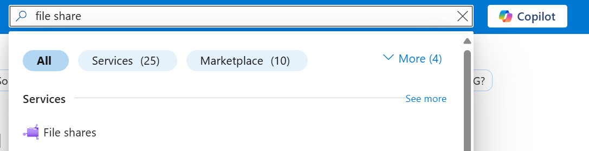

# Create an Azure file share with Microsoft.FileShares (preview)

Before you create an Azure file share with Microsoft.FileShares, you need to answer two questions about how you want to use it:

- **Is file share (Microsoft.FileShares) the right fit for me?**  
  **File share (Microsoft.FileShares) is currently in preview.** The new management model is current only available for NFS file share (Microsoft.FileShares), which require SSD (premium) storage. SSD file share (Microsoft.FileShares) provide consistent high performance and low latency, within single-digit milliseconds for most IO operations. The Microsoft.FileShares preview doesn't require you to create an Azure storage account in order to deploy a file share. It currently only supports the provisioned v2 billing model, which allows you to specify how much storage, IOPS, and throughput your file share (Microsoft.FileShares) needs. The amount of each quantity that you provision determines your total bill. By default, when you create a new file share (Microsoft.FileShares) using the provisioned v2 model, we provide a recommendation for how many IOPS and how much throughput you need based on the amount of provisioned storage you specify. Depending on your requirements, you might find that you require more or less IOPS or throughput than our recommendations, and can optionally override these recommendations with your own values as desired. To learn more, see [Understanding the provisioned v2 billing model](./understanding-billing.md#provisioned-v2-model). If you need all the features that Azure Files offers, or you need to use the SMB protocol, or want HDD (standard) performance, use a [classic file share (Microsoft.FileShares)](create-classic-file-share.md) instead.

- **What are the redundancy requirements for file share (Microsoft.FileShares)?**  
   File share (Microsoft.FileShares) is only available for local and zone redundancy types. See [Azure Files redundancy](./files-redundancy.md) for more information.

For more information on file share (Microsoft.FileShares) options, see [Planning for an Azure Files deployment](storage-files-planning.md#management-concepts).

## Applies to

| Management model     | Object                   | Applies to                           |
| -------------------- | ------------------------ | ----------------------------------- |
| Microsoft.FileShares | File share (Microsoft.Fileshares)         |  |
| Microsoft.Storage    | Classic file share |    |

## Prerequisites

This article assumes that you have an Azure subscription. If you don't have an Azure subscription, then create a [free account](https://azure.microsoft.com/free/?WT.mc_id=A261C142F) before you begin.

## Create an file share (Microsoft.FileShares)

To create an File share (Microsoft.FileShares) via the Azure portal, use the search box at the top of the Azure portal to search for **file share** and select the matching result.

Click **+ Create** to create a new file share (Microsoft.FileShares).

### Basics

The first tab to complete creating an file share (Microsoft.FileShares) is labeled **Basics**, which contains the required fields to create an file share (Microsoft.FileShares).

| **Field name**                  | **Input type**         | **Values**                                                                                                                                                                                                                   | **Meaning**                                                                                                                                                                                                                                                                       |
|--------------------------------|------------------------|-------------------------------------------------------------------------------------------------------------------------------------------------------------------------------------------------------------------------------|-----------------------------------------------------------------------------------------------------------------------------------------------------------------------------------------------------------------------------------------------------------------------------------|
| Subscription                   | Drop-down list         | *Available Azure subscriptions*                                                                                                                                                                                              | The selected subscription in which to deploy the storage account.                                                                                                                                                                                                                 |
| Resource group                 | Drop-down list         | *Available resource groups in selected subscription*                                                                                                                                                                         | The resource group in which to deploy the file share (Microsoft.FileShares). A resource group is a logical container for organizing Azure resources, including file share (Microsoft.FileShares)s.                                                                                                                  |
| file share (Microsoft.FileShares) name          | Text box               | --                                                                                                                                                                                                                            | The name of the file share (Microsoft.FileShares) must be unique across all existing file share (Microsoft.FileShares) names in Microsoft Azure. It must be 3 to 63 characters long and can contain only lowercase letters, numbers, and hyphens. The name must start and end with a letter or number.              |
| Tier                           | N/A                    | --                                                                                                                                                                                                                            | Premium file share (Microsoft.FileShares)s are backed by solid-state drives (SSD) for better performance. Currently, the Microsoft.FileShares preview only supports SSD.                                                                                                                           |
| Protocol                       | N/A                    | --                                                                                                                                                                                                                            | file share (Microsoft.FileShares)s support a multitude of access protocols. If you need the SMB protocol, deploy your file share (Microsoft.FileShares) within a storage account. Currently, the Microsoft.FileShares preview only supports NFS protocol.                                                          |
| Region                         | Drop-down list         | *Available Azure regions*                                                                                                                                                                                                    | The region for the file share (Microsoft.FileShares) to be deployed into. This can be the region associated with the resource group, or any other available region.                                                                                                                               |
| Provisioned capacity (GiB)     | Drop-down list         | Integer                                                                                                                                                                                                                       | Provisioned capacity for the file share (Microsoft.FileShares), ranging from 32 GiB to 262144 GiB.                                                                                                                                                                                                 |
| Redundancy                     | Drop-down list         | - Locally redundant storage (LRS)    - Geo-redundant storage (GRS)                                                                                                                                                         | The redundancy choice for the file share (Microsoft.FileShares). See [Azure Files redundancy](./ore information.                                                                                                                                                         |
| Provisioned IOPS and throughput| Radio button group     | - Recommended provisioning    - Manually specify IOPS and throughput:    &nbsp;&nbsp;&nbsp;&nbsp;- Provisioned IOPS    &nbsp;&nbsp;&nbsp;&nbsp;- Provisioned throughput (MiB/sec)                                   | file share (Microsoft.FileShares) only uses the provisioned v2 SSD billing model. See [Understanding billing](./undermore information.                                                                                                                                   |

### Advanced

The **Advanced** tab is optional, but provides more granular settings for the file share (Microsoft.FileShares). Currently you can choose to set up root squash options or specify a mount name for the file share (Microsoft.FileShares). See [nfs root squash options](./nfs-root-squash.md) to learn more. Mount name allows you to choose a different name to use to mount the file share (Microsoft.FileShares). By default, it's the same as the file share (Microsoft.FileShares) name. Customize it if you want a unique mount name. The same rules still apply to the naming policy. See [Naming rules and restrictions for Azure resources](../../azure-resource-manager/management/resource-name-rules.md) to learn more.

### Networking

Using the NFS protocol for an file share (Microsoft.FileShares) requires network-level security configurations. Currently there are two options for establishing networking-level security configurations: Private endpoint and service endpoint. Private endpoint gives your file share (Microsoft.FileShares) a private, static IP address within your virtual network, preventing connectivity interruptions from dynamic IP address changes. Traffic to your file share (Microsoft.FileShares) stays within peered virtual networks, including those in other regions and on premises. See [What is a private endpoint](../../private-link/private-endpoint-overview.md) to learn more.

If you don't require a static IP address, you can enable a service endpoint for Azure Files within the virtual network. A service endpoint configures file share (Microsoft.FileShares) to allow access only from specific subnets. The allowed subnets can belong to a virtual network in the same subscription or a different subscription, including those that belong to a different Microsoft Entra tenant. There's no extra charge for using service endpoints. See [Azure virtual network service endpoints](../../virtual-network/virtual-network-service-endpoints-overview.md) to learn more.

The **Networking** tab is optional, and allows you to set up both service and private endpoint. A virtual network is required if you intend to set up networking while creating the file share (Microsoft.FileShares). You may also set up networking configurations after the file share (Microsoft.FileShares) is created. With public endpoints access enabled, you can create or choose an existing virtual network for the service endpoint connection to this file share (Microsoft.FileShares). If you decide to disable public endpoint access, service endpoint will be disabled for this specific file share (Microsoft.FileShares).

For private endpoint configurations, each file share (Microsoft.FileShares) will have its own private endpoint. To get started, follow these steps.

1. Select **+ Create private endpoint**. Leave **Subscription** and **Resource group** the same. Choose the same location as the virtual network and desired name for the private endpoint. Choose FileShare for storage sub-resource.

1. Under configure virtual network section, choose the desired virtual network and subnet setting. Select **Yes** for **Enable Private DNS zone**.

1. Select **Add**.

### Tags

Tags are name/value pairs that enable you to categorize resources and view consolidated billing by applying the same tag to multiple resources and resource groups. These are optional, and you can apply them after you create the file share.

### Review + create

The final step to create the file share (Microsoft.FileShares) is to select the **Create** button on the **Review + create** tab. This button isn't available until you complete all the required fields.