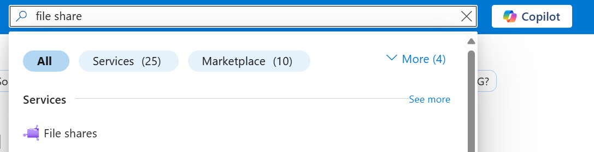
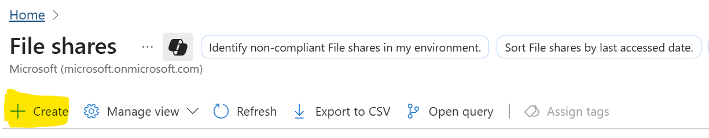
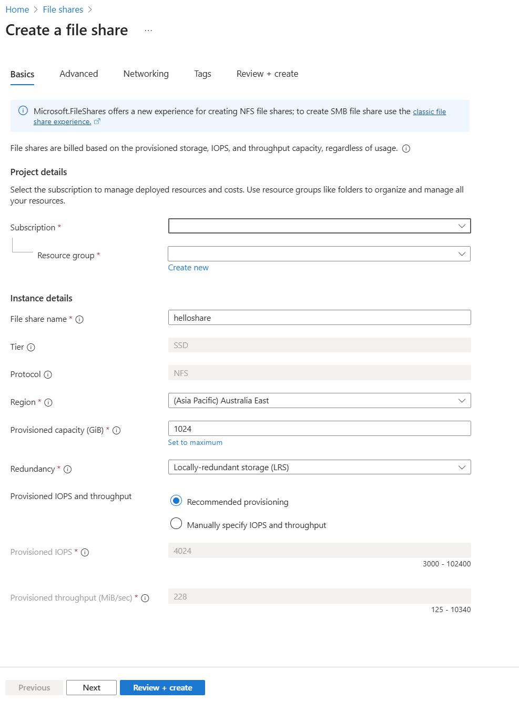
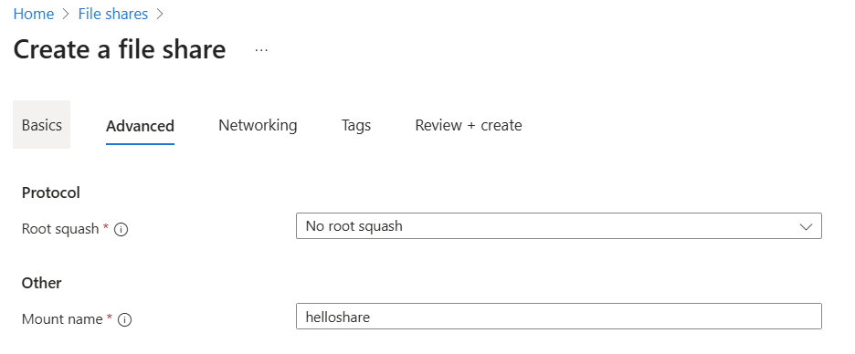
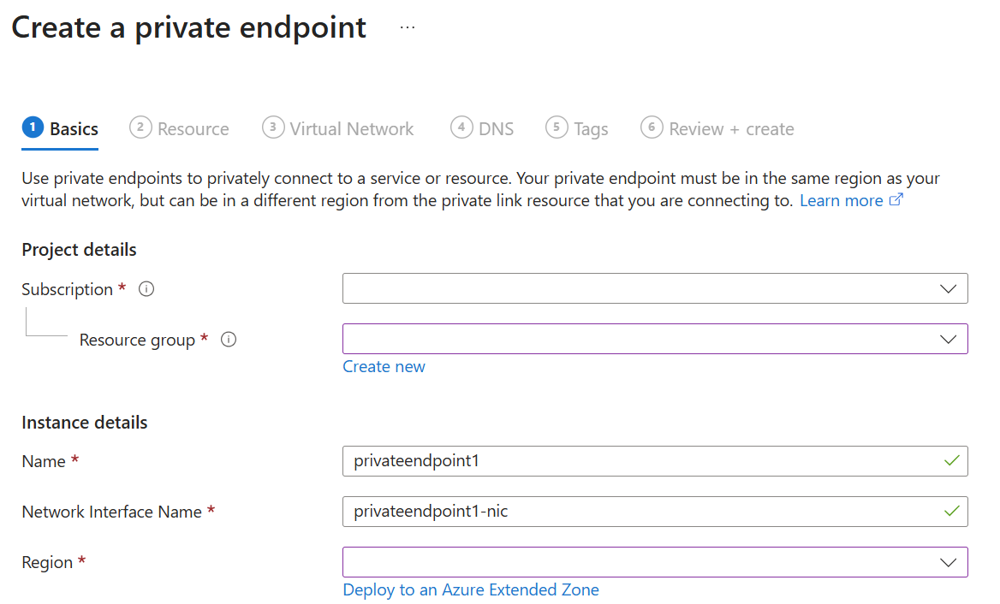
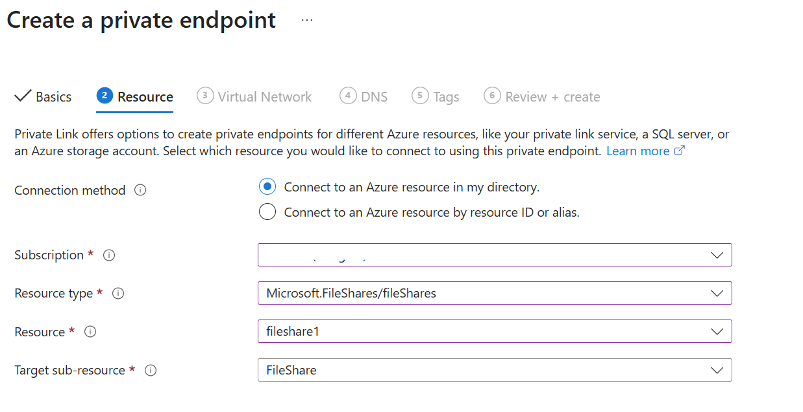

# Create an Azure file share with Microsoft.FileShares (preview)

Before you create an Azure file share with the new Microsoft.FileShares resource provider, you need to answer two questions about how you want to use it:

- **Is file share (Microsoft.FileShares) the right fit for me?**
  **Microsoft.FileShares is currently in preview.** The new resource provider and management model is current only available for NFS file shares, which require SSD (premium) storage. SSD media provides consistent high performance and low latency, within single-digit milliseconds for most IO operations. Using the Microsoft.FileShares resource provider allows you to deploy file shares without creating an Azure storage account. The preview only supports the provisioned v2 billing model, which allows you to specify how much storage, IOPS, and throughput your file share needs. The amount that you provision determines your total bill. When you create a new file share using the provisioned v2 model, we provide a recommendation for how many IOPS and how much throughput you need based on the amount of provisioned storage you specify. Depending on your requirements, you might find that you require more or less IOPS or throughput, and you can optionally override these recommendations with your own values. To learn more, see [Understanding the provisioned v2 billing model](understanding-billing.md#provisioned-v2-model). If you need all the features that Azure Files offers, or you need to use the SMB protocol, or want HDD (standard) performance, use a [classic file share](create-classic-file-share.md) instead.

- **What are the redundancy requirements for file share (Microsoft.FileShares)?**  
   The Microsoft.FileShares preview only supports locally-redundant storage (LRS) and zone-redundant storage (ZRS). See [Azure Files redundancy](./files-redundancy.md) for more information.

For more information on Azure Files management concepts, see [Planning for an Azure Files deployment](storage-files-planning.md#management-concepts).

## Applies to

| Management model | Billing model | Media tier | Redundancy | SMB | NFS |
|-|-|-|-|:-:|:-:|
| Microsoft.FileShares | Provisioned v2 | SSD (premium) | Local (LRS) |  |  |
| Microsoft.FileShares | Provisioned v2 | SSD (premium) | Zone (ZRS) |  |  |
| Microsoft.Storage | Provisioned v2 | HDD (standard) | Local (LRS) |  |  |
| Microsoft.Storage | Provisioned v2 | HDD (standard) | Zone (ZRS) |  |  |
| Microsoft.Storage | Provisioned v2 | HDD (standard) | Geo (GRS) |  |  |
| Microsoft.Storage | Provisioned v2 | HDD (standard) | GeoZone (GZRS) |  |  |
| Microsoft.Storage | Provisioned v1 | SSD (premium) | Local (LRS) |  |  |
| Microsoft.Storage | Provisioned v1 | SSD (premium) | Zone (ZRS) |  |  |
| Microsoft.Storage | Pay-as-you-go | HDD (standard) | Local (LRS) |  |  |
| Microsoft.Storage | Pay-as-you-go | HDD (standard) | Zone (ZRS) |  |  |
| Microsoft.Storage | Pay-as-you-go | HDD (standard) | Geo (GRS) |  |  |
| Microsoft.Storage | Pay-as-you-go | HDD (standard) | GeoZone (GZRS) |  |  |

## Prerequisites

This article assumes that you have an Azure subscription. If you don't have an Azure subscription, then create a [free account](https://azure.microsoft.com/free/?WT.mc_id=A261C142F) before you begin.

## Create a file share (Microsoft.FileShares)

> [!NOTE]
> File share with Microsoft.FileShares is currently in preview. You may use the Azure portal, or you can use generic PowerShell or Azure CLI commands to work with file shares. If you want to try the CLI private package for Microsoft.FileShares resource provider, fill out this [survey](https://forms.microsoft.com/r/nEGcB0ccaD).

# [Portal](#tab/azure-portal)

To create a file share via the Azure portal, use the search box at the top of the Azure portal to search for **file share** and select the matching result.



Select **+ Create** to create a new file share.



### Basics

The first tab to complete creating a file share is labeled **Basics**, which contains the required fields to create a file share.




| **Field name**                  | **Input type**         | **Values**                                                                                                                                                                                                                   | **Meaning**                                                                                                                                                                                                                                                                       |
|--------------------------------|------------------------|-------------------------------------------------------------------------------------------------------------------------------------------------------------------------------------------------------------------------------|-----------------------------------------------------------------------------------------------------------------------------------------------------------------------------------------------------------------------------------------------------------------------------------|
| Subscription                   | Drop-down list         | *Available Azure subscriptions*                                                                                                                                                                                              | The selected subscription in which to deploy the storage account.                                                                                                                                                                                                                 |
| Resource group                 | Drop-down list         | *Available resource groups in selected subscription*                                                                                                                                                                         | The resource group in which to deploy the file share. A resource group is a logical container for organizing Azure resources, including file shares.                                                                                                                  |
| file share name          | Text box               | --                                                                                                                                                                                                                            | The name of the file share must be unique across all existing file share names in Microsoft Azure. It must be 3 to 63 characters long and can contain only lowercase letters, numbers, and hyphens. The name must start and end with a letter or number.              |
| Tier                           | N/A                    | --                                                                                                                                                                                                                            | Premium file shares are backed by solid-state drives (SSD) for better performance. Currently, the Microsoft.FileShares preview only supports SSD.                                                                                                                           |
| Protocol                       | N/A                    | --                                                                                                                                                                                                                            | file shares support a multitude of access protocols. If you need the SMB protocol, deploy your file share within a storage account. Currently, the Microsoft.FileShares preview only supports NFS protocol.                                                          |
| Region                         | Drop-down list         | *Available Azure regions*                                                                                                                                                                                                    | The region for the file share to be deployed into. This can be the region associated with the resource group, or any other available region.                                                                                                                               |
| Provisioned capacity (GiB)     | Text box         | Integer                                                                                                                                                                                                                       | Provisioned capacity for the file share, ranging from 32 GiB to 262144 GiB.                                                                                                                                                                                                 |
| Redundancy                     | Drop-down list         | - Locally redundant storage (LRS)  <br> - Geo-redundant storage (GRS)                                                                                                                                                         | The redundancy choice for the file share. See [Azure Files redundancy](files-redundancy.md) for more information.                                                                                                                                                         |
| Provisioned IOPS and throughput| Radio button group     | - Recommended provisioning  <br> - Manually specify IOPS and throughput:  <br> &nbsp;&nbsp;&nbsp;&nbsp;- Provisioned IOPS  <br> &nbsp;&nbsp;&nbsp;&nbsp;- Provisioned throughput (MiB/sec)                                   | The Microsoft.FileShares preview only uses the provisioned v2 SSD billing model. See [Understanding billing](understanding-billing.md#provisioned-v2-model).                                                                                                                                   |


### Advanced

The **Advanced** tab is optional, but provides more granular settings for the file share. Currently you can choose to set up root squash options or specify a mount name for the file share. See [nfs root squash options](./nfs-root-squash.md) to learn more. Mount name allows you to choose a different name to use to mount the file share. By default, it's the same as the file share name. Customize it if you want a unique mount name. The same rules still apply to the naming policy. See [Naming rules and restrictions for Azure resources](../../azure-resource-manager/management/resource-name-rules.md) to learn more.



### Networking

Using the NFS protocol for a file share requires network-level security configurations. Currently there are two options for establishing networking-level security configurations: Private endpoint and service endpoint. Private endpoint gives your file share a private, static IP address within your virtual network, preventing connectivity interruptions from dynamic IP address changes. Traffic to your file share stays within peered virtual networks, including those in other regions and on premises. See [What is a private endpoint](../../private-link/private-endpoint-overview.md) to learn more. Currently, you can set up a private endpoint after you create the file share, for region support on private endpoint, see [Plan to deploy Azure Files](./storage-files-planning.md#file-shares-microsoftfileshares). 

If you don't require a static IP address, you can enable a service endpoint for Azure Files within the virtual network. A service endpoint configures file share to allow access only from specific subnets. The allowed subnets can belong to a virtual network in the same subscription or a different subscription, including those that belong to a different Microsoft Entra tenant. There's no extra charge for using service endpoints. See [Azure virtual network service endpoints](../../virtual-network/virtual-network-service-endpoints-overview.md) to learn more. You can create or choose an existing virtual network for service endpoint purpose in the networking tab during the create flow. 

### Tags

Tags are name/value pairs that enable you to categorize resources and view consolidated billing by applying the same tag to multiple resources and resource groups. These are optional, and you can apply them after you create the file share.

### Review + create

The final step to create the file share is to select the **Create** button on the **Review + create** tab. This button isn't available until you complete all the required fields.

### Set up a private endpoint 

1. After the file share is created, search private endpoint in the search bar, and then click on create button. 
1. Leave **Subscription** and **Resource group** the same. Under **Instance**, provide a name and select a region for the new private endpoint. Your private endpoint must be in the same region as your virtual network, so use the same region as you specified when creating the VM. When all the fields are complete, select **Next: Resource**.

   

1. Confirm that the **Subscription**, and **Resource** are correct. Choose Microsoft.FileShares/fileShares as the **Resource type**, and select **FileShare** from the **Target sub-resource** drop-down. Then select **Next: Virtual Network**.
   
   
1. Under **Networking**, select the virtual network associated with your VM and leave the default subnet. Under **Private IP configuration**, leave **Dynamically allocate IP address** selected. Select **Next: DNS**.
   :::image type="content" source="media/storage-files-quick-create-use-linux/private-endpoint-virtual-network.png" alt-text="Screenshot showing how to add virtual networking and private IP configuration to a new private endpoint." lightbox="media/storage-files-quick-create-use-linux/private-endpoint-virtual-network.png" border="true":::
1. Select **Yes** for **Integrate with private DNS zone**. Make sure the correct subscription and resource group are selected, and then select **Next: Tags**.
   :::image type="content" source="media/storage-files-quick-create-use-linux/private-endpoint-dns.png" alt-text="Screenshot showing how to integrate your private endpoint with a private DNS zone." lightbox="media/storage-files-quick-create-use-linux/private-endpoint-dns.png" border="true":::
1. You can optionally apply tags to categorize your resources, such as applying the name **Environment** and the value **Test** to all testing resources. Enter name/value pairs if desired, and then select **Next: Review + create**.
   :::image type="content" source="media/storage-files-quick-create-use-linux/private-endpoint-tags.png" alt-text="Screenshot showing how to add tags to resources in order to categorize them." lightbox="media/storage-files-quick-create-use-linux/private-endpoint-tags.png" border="true":::
1. Azure will attempt to validate the private endpoint. When validation is complete, select **Create**. You'll see a notification that deployment is in progress. After a few minutes, you should see a notification that deployment is complete.

# [PowerShell](#tab/powershell)

To create a file share via PowerShell, run this command.

```azure-powershell
New-AzResource -ResourceType "Microsoft.FileShares/fileShares" `
               -ResourceName "<your-file-share-name>" `
               -Location "<intended-region-for-deployment>" `
               -ResourceGroupName "<your-resource-group-name>" `
               -Properties @{
                   # redundancy support "Local" and "Zone"
                   redundancy = "Local"
                   protocol = "NFS"
                   provisionedStorageGiB = <intended capacity>
                   ProvisionedIoPerSec = <intended IOPS> 
                   ProvisionedThroughputMiBPerSec = <intended throughput>
                   mediaTier = "SSD"
                   # optional: mountName = "<mount-name-for-file-share>"
                   nfsProtocolProperties = @{
                       rootSquash = "RootSquash"
                   }
               } `
               -Force
```

# [Azure CLI](#tab/azure-cli)

To create a file share via Azure CLI, run this command.

```bash
az resource create \
  --resource-type "Microsoft.FileShares/fileShares" \
  --name <your-file-share-name> \
  --location <intended-region-for-deployment> \
  --resource-group <your-resource-group-name> \
  --properties '{
    # redundancy support "Local" and "Zone"
    "redundancy": "Local",
    "protocol": "NFS",
    "provisionedStorageGiB": <intended capacity>,
    "ProvisionedIoPerSec": <intended IOPS>,
    "ProvisionedThroughputMiBPerSec": <intended throughput,
    "mediaTier": "SSD",
    "nfsProtocolProperties": {
      "rootSquash": "RootSquash"
    }
}'

```

---

## Next steps

- Learn how to [create a Linux virtual machine](/azure/virtual-machines/linux/quick-create-portal?tabs=ubuntu)
- Learn how to [mount an NFS file share on Linux](storage-files-how-to-mount-nfs-shares.md)
- Learn how to [modify a file share](modify-file-share.md)
